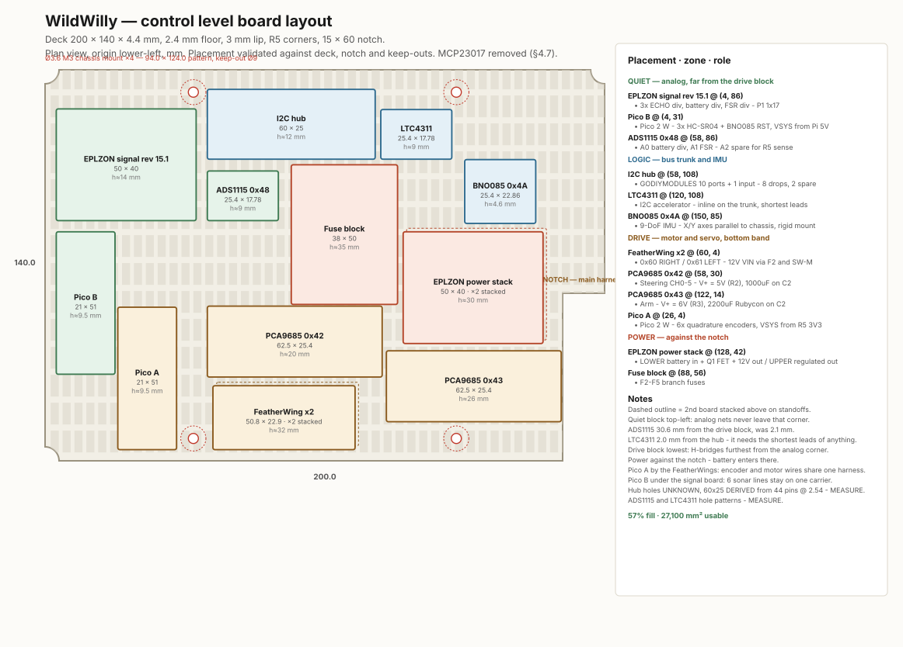
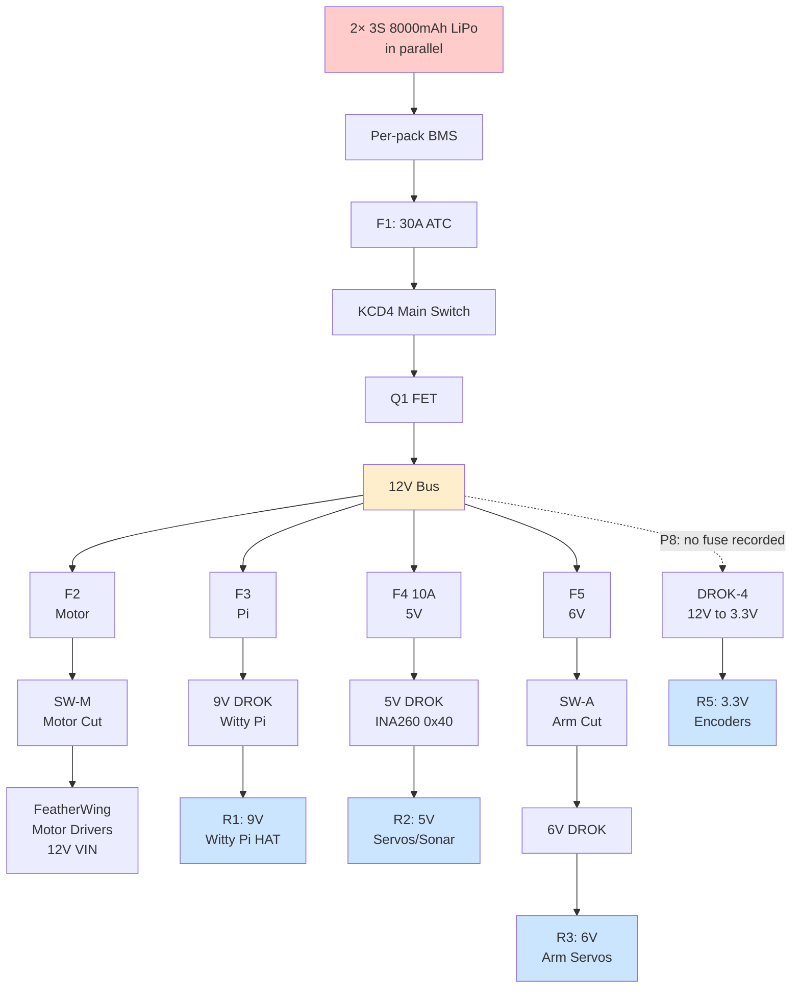
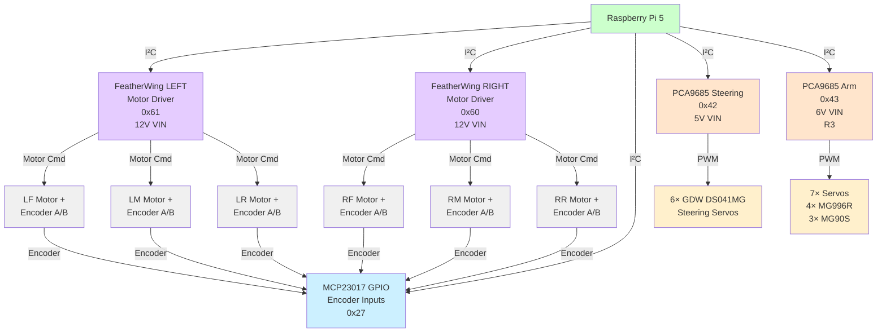
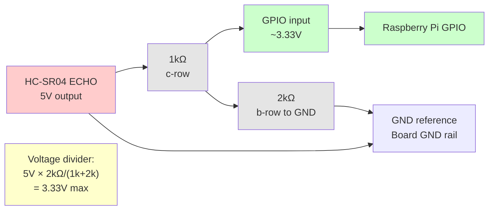

# WildWilly Autonomous Rover

## Master Hardware Design — As-Built

**Revision 2.3 · Current Configuration · 2026-09-24**

---

## Document Control

| Field | Value |
|-------|-------|
| Project | WildWilly Autonomous Rover |
| Document | Master Hardware Design — as-built, current configuration only |
| Revision | 2.3 |
| Date | 2026-09-24 |
| Owner | Howard Himmel |
| Status | Build complete; AI accelerator bonded; live verification in progress. **Filename retains `v2.0` deliberately** — renaming would break every cross-reference in Software Design, the FRD and `CLAUDE.md`. The revision field above is authoritative. |
| Companions | Functional Requirements rev 3.3; Software Design rev 1.2 |
| Historical record | Master Engineering Package rev 6.2.0 retains all incident history, superseded designs, and revision lineage. Retain it. |

**Scope of this document.** This describes the rover as it is currently built.
It contains no incident narrative, no superseded design options, and no
revision archaeology. Where a past failure produced a standing rule, the rule
appears in §12 as a constraint — without the story behind it.

**Scope baseline.** Drive, see, talk/listen, arm pick-and-place on flat ground,
and basic flat-terrain autonomy. Stair-climbing is a stretch goal, not a
baseline requirement.

---

## 0. AS-BUILT — READ THIS FIRST

**Bus topology captured 2026-09-08; signal conditioning board 2026-09-16.**
Where any later section disagrees with this one, this one is authoritative.

### Current topology

```
Pi 40-pin header (GP2/GP3)
  ├─ Witty Pi 5 HAT+                      0x51
  └─ GODIY I²C hub ── GODIY I²C hub      (passive, daisy-chained)
        ├─ MCP23017 0x27   (Waveshare board)
        ├─ INA260   0x40 0x44 0x45
        ├─ PCA9685  0x42 0x43              (+0x70 All-Call)
        ├─ ADS1115  0x48
        ├─ BNO085   0x4A
        ├─ FeatherWing 0x60 0x61
        └─ LTC4311 accelerator             (no address, transparent)
```

Both hubs are **passive fan-outs**, so this is **one electrical segment**. There
is no segmentation and no containment: any device holding SDA or SCL low takes
the entire bus down. That happened repeatedly on 2026-09-07/08.

**The 4.7kΩ rail pull-ups are NOT fitted** (owner-confirmed).

The bus runs on the **Pi's own 1.8kΩ pull-ups on GP2/GP3**, plus whatever
the device breakouts carry. That is adequate — see §3.2's recomputation — and the 20
consecutive clean scans confirm it.

A TCA9548A multiplexer (strapped
`0x74`) was bought, wired and proven working during the 2026-09-07/08 debugging,
then removed in favour of this simpler topology — see
`docs/superpowers/specs/2026-09-07-i2c-mux-design.md`, which describes a design
that was **not** built.

### Power rails — four DROK converters

| Rail | Volts | Source | Feeds | Monitor |
|------|-------|--------|-------|---------|
| R1 | **9V** | DROK-Pi | Witty Pi 5 VIN → Pi | **Witty Pi HAT** (no INA260) |
| R2 | 5V | DROK-5V | Steering servos, sonar VCC, Pi screen | INA260 `0x40` |
| R3 | 6V | DROK-6V | Arm servo distribution | — |
| R5 | **3.3V** | DROK-4 | **Motor Hall encoders ONLY** | — |
| — | +12V | Battery via F1/KCD4/Q1 | Both FeatherWing VIN, all DROK inputs | INA260 `0x45` |

⚠ **I²C device logic is fed from the PI'S OWN 3.3V, not R5** (owner-stated). R5
feeds **the encoders only**. Two consequences, both material:

1. **Pi header pin 1 (3V3) is loaded, and always has been.** It powers the whole
   device bus. The breakout HAT therefore **does** need a 3V3 line — it was dropped
   from its list on 2026-09-11 in the belief that nothing loaded that pin.
2. **R5 can now be changed without touching the I²C bus.** Since the encoders are its
   only consumer, raising R5 to 5V no longer risks the MCP23017, PCA9685s or anything
   else. That makes the standing encoder-supply hypothesis a *clean* experiment —
   see the warning below §2.2's rails table. The twelve encoder **signal** lines still
   land on a 3.3V MCP23017 whose inputs are not 5V tolerant, so level shifting is
   still required; only the supply question is now separable.

**R5 = 3.3V settles the "3V or 5V — voltage TBD" question open in §2.2 since
2026-08-28.**

**The single point of failure for device logic is Pi header pin 1**, and that is the
budget worth writing down: eleven devices' logic plus the bus pull-ups plus the
SEN0628's <80mA, against a pin the Pi 5 rates for a few hundred mA. Comfortable, but
it is a real rail with a real load — not, as several sections claimed until
2026-09-14, an unused pin.

**R5's own budget is just the six Hall encoders**, which is what makes it safely
changeable (see the note above §2.2's rails table).

### Verified 2026-09-08

Eleven devices plus the `0x70` All-Call broadcast, **20 consecutive scans, zero
bus errors**, stable across power cycles. See §0.1 for the roll-call, which
matches §3.3's table.

### Open hardware items as of 2026-09-08

1. **Battery divider has no +12V feed.** ADS1115 `0x48` is healthy — all four
   channels convert correctly — but A0 reads **0.0146V** against the required
   2.76–3.06V. `brain.py` maps that to ~0.06V, below `BAT_SHUTDOWN_V=10.2`, and
   will perform a controlled shutdown believing the pack is flat.
   `sensors.py`'s guard only catches *failed* reads; a successful read of a real
   zero passes straight through. **Do not enable `willy-rover.service` until A0
   is in band.** The divider was added 2026-09-02.

   ⚠ **CLOSED 2026-09-14 (owner): the divider is fed, its voltages are in spec, and the
   ADS1115 reports real pack voltage.** The 0.0146V reading recorded here was valid when
   taken — the feed had not yet been connected — and the hardware has since been
   completed. The shutdown-on-boot risk described below no longer applies, and the
   service is safe to enable on this account.
   
   Two things remain, neither blocking:
   - ⛔ **`BATTERY_DIVIDER_SCALE=0.3237` does not describe the fitted divider.** The
     rev 15.1 board (§4) is 10k/3.2k, nominal **0.242**. **Re-meter — see §6.2 and §14.**
   - **The software gap stands regardless** — `sensors.py` still cannot tell a real zero
     from a broken sensor, so a *future* divider fault would repeat this silently. See
     Software Design §12 item 7.

2. **Encoders unverified.** MCP23017 `0x27` is confirmed healthy (registers
   read/write, internal pull-ups engage, both ports read cleanly). Whether the
   Hall channels actually count is untested — all 16 bits read high at rest,
   which is the pull-ups holding idle lines with nothing driving them. Use
   `~/enctest 20` on the rover and turn each wheel.
3. §14 item 7 — Hall output drive type (push-pull vs open-collector) still
   unknown, and it decides whether 5V encoders would need level shifting at all.
4. ✅ **Bus node board redesign — CLOSED 2026-09-16.** Replaced by the passive
   **signal conditioning board, EPLZON Mini 17 rev 15.1** (§4): built and
   resistance-verified, battery divider carried forward and fed. I²C distribution
   is no longer on a board at all — the two GODIY hubs are the whole fan-out.
   **The divider it carries is NOT the one that was calibrated**, so
   `BATTERY_DIVIDER_SCALE` is wrong until re-metered — see §6.2 and §14.
---

## 1. System Overview

Six-wheel rocker-bogie rover. Independent drive and steering on all six
corners, a 5-DOF arm with gripper, and a Raspberry Pi 5 host with an NPU
accelerator for vision and speech.

| Subsystem | Configuration |
|-----------|---------------|
| Compute | Raspberry Pi 5, AI HAT+ 2 (Hailo-10H, 8GB) |
| Drive | 6 × JGA25-370B gearmotors with quadrature encoders |
| Steering | 6 × GDW DS041MG servos |
| Arm | 7 servos — 4 × MG996R, 3 × MG90S |
| Ranging | 3 × HC-SR04 sonar (front, left, right) |
| Orientation | BNO085 9-DoF IMU with on-chip fusion |
| Vision | Front CSI camera, rear USB camera |
| Power | 2 × 3S 8000mAh LiPo in parallel |
| Bus | **Single non-isolated I²C segment, 11 devices** (see §0). One rail domain, one ground |

**Physical layout.** Pi 5, SI board and audio HAT in the head assembly. The body
is two decks: the **control level** (§1.1) carries the logic, motor drivers, servo
drivers and signal conditioning; the **power level** below it carries the four DROK
converters, all three INA260s, and the main distribution and ground block.

---

### 1.1 Control level board layout



Plan view, dimensions in mm, **origin lower-left**. Every coordinate below is
that board's lower-left corner. Source:
`docs/drawings/WildWilly_Control_Level_Layout.svg`.

*If the drawing above does not appear, your viewer is not rendering SVG — open
the file directly. There is no PNG fallback in the repository.*

The drawing is generated, not hand-drawn:
`docs/drawings/gen_control_level_layout.py` holds the placement as data and
validates it against the deck outline, the harness notch and the four M3
keep-outs before it writes anything. **Edit the script and re-run it** — a bad
placement fails loudly instead of producing a drawing that looks fine and cannot
be built.

⚠ **This layout is drawn for the §4.7 configuration** — both Pico 2 W boards
placed, no MCP23017. The expander has no position on this deck.

| Deck | Value |
|---|---|
| Size | **200 × 140 × 4.4 mm** |
| Floor | 2.4 mm, rising to 4.4 mm at a 3 mm lip |
| Corners | R5 |
| Harness notch | **15 × 60 mm** — the single main harness exit |
| Chassis mounts | 4 × Ø3.6 M3 on a **94.0 × 124.0** pattern, **Ø9 keep-out** |
| Lattice | 2.9 × 7.8 mm slots, 1.5 mm ribs on 4.25 mm X pitch, 2.25 mm cross-ribs every ~10 mm in Y. **M2.5 standoffs** |
| Occupancy | **61% fill**, 25,141 mm² usable, room for 2 more stacks |

**Not on this level — the board below carries them:** the four DROK converters,
all three INA260s, and the main distribution and ground block. The EPLZON power
stack on *this* deck is the tap and fan-out between the two levels, not the
conversion itself.

#### Zones

The notch is the **single harness exit**, on the right edge at y 0–60. Four
zones, arranged so that the two things that must not meet — millivolt analog and
switched motor current — sit at opposite ends of the deck.

| Zone | Where | Holds |
|---|---|---|
| **QUIET** | top-left | Signal board, ADS1115, Pico B |
| **LOGIC** | top-centre and right | I²C hub, LTC4311, BNO085 |
| **DRIVE** | bottom band | FeatherWings, both PCA9685s, Pico A |
| **POWER** | right, against the notch | EPLZON power stack, fuse block |

#### Placement

| Board | Position | Footprint | Height | Mounting holes |
|---|---|---|---|---|
| **EPLZON signal board rev 15.1** — 3 × ECHO ÷, battery ÷, FSR ÷, P1 1×17 | (4, 86) | 50 × 40 | ≈14 | same as power boards |
| **Pico B** — 3 × HC-SR04 + BNO085 RST, VSYS from Pi 5V | (4, 31) | 21 × 51 | ≈9.5 | 47.0 × 11.4, Ø2.1 |
| **ADS1115 `0x48`** — A0 battery ÷, A1 FSR, A2 spare for R5 sense | (58, 86) | 25.4 × 17.78 | ≈9 | **MEASURE** |
| **I²C hub** — GODIYMODULES, 10 ports + 1 input | (58, 108) | 60 × 25 | ≈12 | **UNKNOWN — MEASURE** |
| **LTC4311** — inline on the trunk | (120, 108) | 25.4 × 17.78 | ≈9 | **MEASURE** |
| **BNO085 `0x4A`** — X/Y axes parallel to chassis | (150, 85) | 25.4 × 22.86 | ≈4.6 | 20.32 × 17.78 |
| **FeatherWing ×2** — `0x60` RIGHT, `0x61` LEFT | (60, 4) | 50.8 × 22.9, **×2 stacked** | ≈32 | 45.72 × 17.78, Ø2.5 |
| **PCA9685 `0x42`** — steering CH0–5, V+ = 5V (R2), 1000µF on C2 | (58, 30) | 62.5 × 25.4 | ≈20 | 55.9 × 19.0, Ø2.5 |
| **PCA9685 `0x43`** — arm, V+ = 6V (R3), 2200µF Rubycon on C2 | (122, 14) | 62.5 × 25.4 | ≈26 | 55.9 × 19.0, Ø2.5 |
| **Pico A** — 6 × quadrature encoders, VSYS from R5 3V3 | (26, 4) | 21 × 51 | ≈9.5 | 47.0 × 11.4, Ø2.1 |
| **EPLZON power stack** — **×2 stacked** | (128, 42) | 50 × 40 | ≈30 | same board, same holes |
| **Fuse block** — F2–F5 branch fuses | (88, 56) | 38 × 50 | ≈35 | own mounts |

57% fill against 27,100 mm² of usable deck.

#### Why each board is where it is

- **The analog corner is the thing being protected.** The ADS1115 reads the
  battery divider and the FSR — the two quietest nets on the rover, and the ones
  the shutdown ladder depends on. It sits **30.6 mm** from the nearest drive
  board, with the signal board beside it at 4 mm so the A0/A1 runs never leave
  the corner.
- **H-bridges lowest.** The FeatherWings switch 12V at motor current and are the
  loudest things on the deck, so they occupy the bottom edge, furthest from the
  analog corner. The PCA9685s sit above them — they are PWM drivers whose
  current leaves immediately down the servo harness.
- **LTC4311 is 2.0 mm from the hub.** §16.4 requires the shortest leads of any
  device on the bus; on a drop cable it adds capacitance at the wrong point and
  mis-triggers.
- **Pico A beside the FeatherWings.** Each motor's six wires are one harness —
  red/white to the motor terminals, yellow/green to the encoder reader — so the
  bundle terminates in one place.
- **Pico B beneath the signal board**, 4 mm away, so all six sonar lines stay
  within the quiet corner.
- **Power against the notch.** The battery enters there, so the EPLZON power
  stack — which carries the entry and Q1 — has the shortest possible run to it.
- **BNO085 is 41.8 mm from the drive block**, the largest separation any board
  gets. It is the one device whose signal degrades with both electrical noise and
  vibration, and it must be rigidly mounted.

> **On hub placement.** An earlier version of this reasoning put the hub as close
> to the notch as possible, to shorten the I²C trunk to the Pi. That is wrong at
> this scale: loose wiring runs roughly 50–100 pF/m, so 80 mm versus 150 mm of
> trunk is a few pF against a budget of 300–400 pF (§3.2). **Drop count and
> routing away from the drive block dominate; trunk length on a 200 mm deck does
> not.** The hub therefore sits high and clear of the motor drivers, not near the
> notch.

#### The EPLZON power stack

Two identical 50 × 40 boards on standoffs, sharing a hole pattern:

- **LOWER — battery entry and protection.** Battery in, **Q1** (the FQP27P06
  reverse-polarity FET, §2.3), and +12V out. This is where raw pack voltage
  lands on the control level, so it is the one board on this deck that is live
  whenever the pack is connected and the main switch is closed.
- **UPPER — regulated output side.** 9V / 5V / 6V / 3.3V back up from the
  converters on the power level, out to loads.

⚠ **The upper board's contents are from the drawing and still want confirming.**
The lower board is owner-confirmed.

#### Stacking

Only hole-matched boards are stacked. A dashed outline on the drawing is a
second board above on standoffs.

| Stacked | Left flat | Why |
|---|---|---|
| FeatherWing ×2 | PCA9685 ×2 | Different rails (5V vs 6V), and `0x43` carries the 2200µF can |
| EPLZON power ×2 | ADS1115, LTC4311 | Different outlines — they don't share a pattern |
| | Pico A, Pico B | Patterns match, but they sit in different zones: Pico A with the motor harness, Pico B in the quiet corner. Stacking them would route the encoder and sonar bundles together |

#### One hub, not two

The drawing assumes a **single** GODIYMODULES hub: 10 ports plus 1 input covers
all 8 drops with 2 spare. §0 and §3.1 describe two daisy-chained hubs — that
was the earlier arrangement, and the single-hub form is better for the bus,
since every drop then radiates from one point instead of two.

#### Measure before you build

Four dimensions on the drawing are derived or assumed rather than read from a
datasheet:

| Item | Status |
|---|---|
| I²C hub 60 × 25 | **Derived** — the minimum that fits 44 pins at 2.54 mm pitch. No published data |
| I²C hub hole pattern | **Unknown** |
| ADS1115 holes | **Measure** — the fitted part may differ from the Adafruit #1085 outline used |
| LTC4311 holes | **Measure** — DONGKER module, no published dimensions; Adafruit #4756 outline used as a placeholder |

#### Notes on specific placements

- **LTC4311 sits inline on the trunk**, which is what §16.4 requires — shortest
  leads of any device, never on a drop cable.
- **BNO085 is 29 mm from the FeatherWings.** That is the closest any quiet device
  sits to a motor driver on this deck; if IMU noise ever becomes suspect, this
  distance is the first thing to question.
- **ADS1115 is nearest the signal board**, keeping the A0 and A1 analog runs
  short.
- **Pico A sits beside the encoder harness, Pico B beside the sonar side**, so
  the two bundles never share a route.

---

## 2. Power Architecture

> ⚠ **Rail voltages R1 and R5 changed on 2026-09-08 — see §0**, which is
> authoritative where this section and it disagree.

### 2.1 Distribution tree

| ID | Path | Volts in → out | Rail | Gauge | Protection |
|----|------|---|---|-------|------------|
| P1 | 2 × 3S 8000mAh → hard parallel, per-pack BMS | — → **12.6V** max, 11.1V nominal | — | 12–14 AWG | BMS per pack |
| P2 | Battery+ → F1 → KCD4 switch → Q1 FET → +12V bus | 12.6V → **+12V bus** | — | 12 AWG | F1 30A ATC |
| P3 | +12V bus → F2 → **SW-M** → INA260 0x45 → both FeatherWing VIN | 12V → **12V** (no conversion) | — | 16 AWG | F2 |
| P4 | +12V bus → F3 → Switch 2 → **DROK-Pi** → Witty Pi VIN | 12V → **9V** | R1 | 16 AWG | F3 |
| P5 | +12V bus → F4 → **DROK-5V** input | 12V → **5.0V** | R2 | 16 AWG | F4 10A |
| P6 | +12V bus → F5 → **SW-A** → **DROK-6V** input | 12V → **6.0V** | R3 | 16 AWG | F5 |
| P7 | Charge Y-cable (main + balance) → battery side of KCD4 | **12.6V** charge in | — | 14 AWG | — |
| **P8** | +12V bus → **DROK-4** input | 12V → **3.3V** | **R5** | *unrecorded* | ⚠ **NO FUSE RECORDED** |

**Two things about P8 are unknown and need confirming at the hardware:**

- ⚠ **Whether it is fused at all.** Every other +12V branch takes a numbered
  fuse (F2–F5). P8 appears to tap the bus directly. **Confirm physically and
  fit a branch fuse if there is none** — an unfused converter input on a pack
  that can deliver 30A through F1 is the one that welds rather than blows.
- **Its wire gauge**, unrecorded. The load is six Hall encoders (and, under
  §4.7, Pico A as well), so this is a low-current branch and 20–22 AWG is
  plausible — but measure rather than assume, because the gauge is what decides
  whether a fault current opens a fuse or heats a harness.

Note that P8 has **no INA260**, so nothing observes this rail in software. The
2026-08-25 encoder deaths happened on an unmonitored 3.3V supply; this one is
also unmonitored. §4.7 proposes bringing R5 into a Pico A ADC for exactly this
reason.

**Distribution tree diagram:**



### 2.2 Regulated rails

| ID | Rail | Source | Feeds | Monitor |
|----|------|--------|-------|---------|
| R1 | **9V** | **DROK-Pi** buck | Witty Pi 5 VIN (KF350-2P) → Witty Pi → Pi 5 | **Witty Pi HAT monitors its own VIN — no INA260** |
| R2 | 5V | **DROK-5V** buck | Steering servo distribution, sonar VCC, Pi screen | INA260 **0x40** |
| R3 | 6V | **DROK-6V** buck | Arm servo distribution | INA260 **0x44** |
| R5 | **3.3V** | **DROK-4** buck | **Motor Hall encoders (JGA25-370B) ONLY**; I²C device logic runs from the Pi's own 3.3V | — |
| **R4** | **3V3** | **Pi header pin 1** | **All I²C device logic** (owner-stated 2026-09-14), plus the SEN0628. A live rail with a real load and a real budget — the Pi 5's 3V3 pin is good for a few hundred mA, which eleven devices' logic plus pull-ups sits inside, but it *is* a budget | — |
| — | +12V bus | Battery via F1/KCD4/Q1 | Both FeatherWing VIN (motors) | INA260 **0x45** (P3 monitoring) |
| — | +12V main | Battery via F1/KCD4/Q1 | All four DROK inputs | — |

**R1 = 9V**, owner-confirmed, and `config.py:212` records "VERIFIED 9.068V".

⚠ **DROK inventory status — updated 2026-09-11.** Four DROK adjustable units, **all
four now fitted and live** (§0): DROK-Pi (**9V**, R1), DROK-5V (R2), DROK-6V (R3),
DROK-4 (**3.3V**, R5). The rail voltages are settled; the note below is retained only
because one question inside it is still genuinely open.

**Still open: what the encoders themselves want.** R5 is set to 3.3V and also feeds
the encoders **and nothing else**, which makes this question
**cleanly testable**: R5 can be changed without risk to any I²C device. Whether these Hall
encoders need 3.3V or 5V is — the vendor part number was never captured, and the
2.83V that killed them is uncomfortably close to 3.3V's lower tolerance. If they turn
out to want 5V, note the MCP23017 runs at 3.3V and its inputs are NOT 5V tolerant, so
moving them is not a rail change but a level-shifting job on twelve signal lines.

⚠ **THE ENCODER SUPPLY HAS KILLED ALL SIX ENCODERS ONCE.** On 2026-08-25 the
3.3V rail feeding them degraded to **2.83V** and every Hall sensor went
powered-but-inoperative. That rail no longer exists — the encoders are on R5
(DROK-4) and the I²C devices on the Pi's own 3.3V (R4) — but the failure
signature is the reason R5 gets metered before the encoders are connected.


⚠ **Converter consolidation (2026-08-28).** The FEICHAO 8A UBEC and DZS buck are
retired, replaced by **four DROK adjustable bucks**: DROK-Pi (9V), DROK-5V, DROK-6V,
and DROK-4 (pending specification). Owner's stated reason: reliable, matched components,
one converter per rail. Rail voltages, roles, fuses, and downstream wiring are unchanged.
**DROK-4's set-point and load remain unspecified** — confirm before power-up.

⚠ **ENCODER RAIL VOLTAGE — VERIFY BEFORE POWERING THE ENCODERS.** R5 is recorded
as **3V**. That is *below* the 3.3V minimum this document already gives for these
Hall encoders (see the 2026-08-25 root cause above), and only **170mV above the
2.83V that killed all six of them**. If "3" means 3.3V, fine. If it is literally
3.0V — **note R5 is now set to 3.3V and settled (§0, and the table above), so this
paragraph describes a risk that has been addressed, not a live setting** — this
reproduces the original failure exactly: the encoders would sit
powered-but-inoperative while every I²C device on the bus tests healthy, which is
the signature that cost days to diagnose. **Meter the rail before connecting the
encoders, and settle the still-open question of whether these encoders want 3.3V
or 5V** — the vendor part number was never recorded. If they want 4.5V+, R5 is
the wrong rail regardless of how it measures.


**Encoders and their reader share a rail, and therefore a reference** — both on
**R5, the DROK-4 3.3V supply** (§0). That property is deliberate; §4.7 preserves
it when the expander is replaced.

**Why a sagging rail killed the encoders and nothing else.** Every I²C device
has enough headroom to keep working at 2.83V — MCP23017 down to 1.8V, PCA9685 to
2.3V, INA260 to 2.7V. Hall encoders typically need 3.3V minimum and often 4.5V.
So the bus, the expander and the current monitors all test perfectly healthy
while all six Hall sensors sit powered-but-inoperative, holding a static output
they have not the supply to switch. That is exactly the measured signature, and
it is the only hypothesis tried that explains all six failing identically.

One item still to settle:
establish whether these encoders want 3.3V or 5V — the vendor part number was
never recorded, and JGA25-370 spans variants with both. If they need 5V the
module must be set for 5V AND the twelve signal lines need level shifting, since
the MCP23017 runs at 3.3V and its inputs are NOT 5V tolerant (abs max ~VDD+0.6V).
That decision is far cheaper before installation than after.

---

**Why an encoder test must be taken under power.** Established by measurement on
2026-08-25: the MCP23017 is alive and correctly configured (IODIR
0xFF, GPPU 0xFF, sensible mixed resting levels per wheel), the I²C bus is
healthy, and all six motors physically turn (0.068–0.099 A each). Yet driving
any wheel produces no edges on any encoder pin, where ~340 would be expected
over a 2.5s drive at 0.6 duty. Hand-turning a wheel produces nothing at all —
the encoder is on the motor shaft behind the 17.1:1 gearbox and does not
back-drive, so any encoder test on this rover must be taken under power.

The next measurement is at the motor, not in software: probe a yellow/green
signal wire at the motor's own connector while that motor is driven. Toggling
there means the sensor works and the signal is lost between connector and
expander; static there means the sensors are not producing output despite
having power.

**R1 changed 2026-08-23/24.** It was "5.0–5.1V, Pi buck → Pi header pins 2/4,
monitored by INA260 0x44." The Pi is no longer fed that way: the DROK buck now
supplies 9V into Witty Pi's VIN terminal, and Witty Pi supplies the Pi.
**R1 has no INA260 at all** — the Witty Pi HAT monitors its own VIN.
0x45 was relocated onto the +12V bus (reads 11.174V) and 0x44 onto the 6V arm rail
(reads 6.043V).

Set each DROK off-load before connecting anything downstream: **9V** rail to the
Witty Pi's input spec, **5V** to 5.0–5.1V, **6V** to 6.0V, **3V** per the warning
above. These are adjustable trimpot modules — re-verify after any knock, and note
that the 5V setting directly sets the sonar ECHO divider outputs (§16.12).

**Witty Pi 5 power feed — reworked 2026-08-23.** Witty Pi 5 (real-time
clock + power management HAT, sits between the +12V/battery side and the Pi's
own 5V input; see §15.6 for physical placement) was originally fed via its
USB-C VUSB input at ~5V. That path measured a real, consistent ~0.3V loss
between Witty Pi's own output and the Pi's PMIC input (`vcgencmd
pmic_read_adc EXT5V_V`), enough to trip under-voltage during a voice-command
current spike. **Re-fed via Witty Pi's VIN screw terminal (KF350-2P,
documented 6–30V input, 5A output) from a DROK adjustable buck set to ~9V**
instead — a separate unit from the Pi-rail buck in item 6 of §14's Open
Items list; do not conflate the two without physically confirming they're
the same part. Higher input voltage means proportionally lower input
current for the same power draw, which reduces the same-resistance voltage
loss. Witty Pi's low-voltage cutoff (`wp5` menu option 7) was moved from
4.5V to **8.0V** to match — the old value was set against a ~5V input and
was effectively inert against a 9V one. Live-measured after the change:
V-IN ~9.0–9.2V, V-OUT ~5.4V (up from the USB-fed path's mid-4V range at the
Pi's own input). Effectiveness of this change in isolation is not yet fully
confirmed independent of the I²C fault below, which was found and partially
addressed around the same time.

### 2.3 Protection

- **F1** 30A ATC main fuse, off-board. **F2–F5** branch fuses.
- ⚠ **P8 (DROK-4 / R5) has no recorded branch fuse** — it is the only +12V
  branch without one (§2.1). Confirm physically; fit one if absent.
- **Q1** FQP27P06 P-channel MOSFET for reverse polarity, with a 220nF
  gate-source cap limiting turn-on inrush. **Located on the lower board of the
  control level's EPLZON power stack** (§1.1), with battery in and +12V out.
- **D1** P6KE15A TVS for transients.
- Dual 3S BMS, one per pack.
- Latching mushroom E-stop cuts motors and arm.
- **SW-M and SW-A — added 2026-08-23, closing FRD v3.1 G-1.** Two dedicated
  physical switches, placed directly in the distribution tree (§2.1): **SW-M**
  in P3, between F2 and both FeatherWing motor drivers; **SW-A**
  in P6, between F5 and the **6V DROK** input (arm servo supply, R3). Relationship
  to the existing latching mushroom E-stop above — **replaces it, is driven by
  it, or is fully independent — not yet confirmed, owner to specify.**
  SW-M's placement was chosen so the motor side of G-1 would be observable in
  software. ✅ **It is**, via **0x45** on the +12V bus downstream of SW-M;
  `brain.py::_check_motor_rail()` reads it.
  ⚠ **SW-A's side also has a monitor — opportunity, not yet taken (2026-09-15).**
  **INA260 0x44 sits on R3**, the 6V arm servo rail. SW-A cuts the 6V DROK's *input*, so
  throwing it collapses R3 and 0x44 would read the drop. That makes the **arm** side of G-1
  observable in software for the first time, by the same mechanism `_check_motor_rail()`
  already uses for motors — no new hardware required. Not implemented: it needs its own
  threshold (R3 idles at 6.043V, so the motor rail's 6.0V figure is unusable here) and an
  owner decision on whether an arm-power cut should log, warn, or do nothing.
- **Switch 2** in the Pi buck input line — de-powers the Pi and the 3V3 bus
  after a software shutdown.

> ✅ **RESOLVED 2026-09-15 by a live bus-voltage read** — a live bus-voltage read at all three
> addresses instead of a quoted figure: **0x40 = 4.986V (R2 5V), 0x44 = 6.043V (R3 6V arm),
> 0x45 = 11.174V (+12V bus)**, owner-confirmed, pack metered at 11.36V.
>
> Note which source turned out to be right. **The owner's rail-based description named a 6V
> monitor, and there is one.** It was overruled by a `config.py` measurement that was accurate
> when taken and had since been invalidated by a physical relocation. A stored measurement is a
> historical claim, not a live one.


### 2.4 Capacitors — complete list

| Qty | Value | Location |
|-----|-------|----------|
| 1 | 220nF | Q1 gate-source soft-start |
| 1 | 1000µF 16V + 1 × 0.1µF ceramic | Pi 5V rail, at header pins 2+4 |
| 1 | 1000µF 16V | PCA9685 0x42 V+, C2 pad |
| 1 | 2200µF 16V Rubycon low-ESR | PCA9685 0x43 V+, C2 pad |

The signal conditioning board (§4) carries **no capacitors at all** — it is
entirely passive. The four entries above are the complete list.

The Pi-rail pair sits at the **header end** of the
feed, not at the buck — GPIO power bypasses the Pi's onboard input
protection, so that feed carries its own local decoupling and its own fuse.

### 2.5 Voltage limits

| Rail | Nominal | Floor |
|------|---------|-------|
| Pi 5V | 5.0–5.1V | 4.85V |
| Pack | 12.6V full, 11.1V nominal | 10.2V cutoff |

Charge to 12.6V (4.20V/cell). Storage charge 11.4V (3.8V/cell). Packs must be
within 0.05V per cell of each other before paralleling — connect the main Y
first, the balance Y a minute later.

---

## 3. I²C Bus


### 3.1 Topology

One non-isolated I²C segment on the Pi's own `/dev/i2c-1`, fanned out through
two daisy-chained passive GODIY hubs. Device logic runs from the **Pi's own
3.3V** (header pin 1, rail R4). §0 carries the device tree; §3.3 the roll-call.

Because both hubs are passive fan-outs, **any device holding SDA or SCL low
takes the whole bus down.** There is no segmentation and no containment. That
happened repeatedly on 2026-09-07/08, and it is the reason a single missing
address is diagnosed as a connector before it is diagnosed as a dead part
(§13).

> **Cross-domain measurements are still meaningless**, isolation or not.
> Reference every reading to the ground of the side being measured — the sonar
> dividers (§16.10) reference board ground while the sensors reference star
> ground, and that difference is real (§10).

### 3.2 Pull-ups

⚠ **The 4.7kΩ rail pull-ups (R1/R2) have been REMOVED from the board.**
Recorded 2026-09-07, on the owner's report that a previous Claude session
directed their removal. The date and the stated reason were not written down at
the time, and nothing in this repository recorded the change until now.

**There is one segment, and the Pi's own pull-ups are on all of it.** The Pi 5
carries physical **1.8kΩ** pull-ups on GP2/GP3, and with the hubs hanging straight
off the header they pull up the entire bus.

| Source | Value | Present? |
|--------|-------|----------|
| **Pi internal, GP2/GP3** | **1.8kΩ** | **Yes — on the board, always** |
| 4.7kΩ rail pair (R1/R2) | 4.7kΩ | **NOT FITTED** — owner-confirmed 2026-09-14 |
| Device breakouts | typically 10kΩ each | Uncatalogued; in parallel they only strengthen the total |

**At 1.8kΩ alone the bus is comfortably fine**, which is the point the old text could
not reach:

| Pull-up | RC at 400pF | ~3τ to threshold | vs the 10µs bit |
|---|---|---|---|
| **1.8kΩ (Pi alone, as-built)** | **0.72µs** | **~2.2µs** | **fine** |
| 10kΩ | 4µs | ~12µs | exceeds the bit — bus dead |

**And it is empirically confirmed.** §0 records eleven devices across 20 consecutive
scans with zero bus errors on 2026-09-08, stable across power cycles. A bus with
inadequate pull-ups does not do that.

**The 4.7kΩ question is CLOSED (owner-confirmed 2026-09-14): they are not fitted.**
The bus runs on the Pi's 1.8kΩ plus uncatalogued breakout pull-ups — comfortably
adequate, and confirmed by 20 consecutive clean scans. Sink current from the Pi's pair
alone is ~1.8mA against the ~3mA a device is specced for, so there is headroom but not
a lot: **do not add pull-ups anywhere without measuring the combined value first.**

**The constraint applies to the whole bus**, and the Pi's 1.8kΩ is already most of
the budget. **Do not add pull-ups anywhere without measuring first.**

The LTC4311 still earns its place at this cabling capacitance, and confirming it is
fitted and enabled (§16.2) is still worth doing — but the bus is not depending on it
to survive.

### 3.3 Device roll-call

`i2cdetect -y 1` returns **eleven devices plus one broadcast address** — the
ten below plus the Witty Pi 5 HAT+ at `0x51`, which sits on the Pi header
rather than this bus. Verified 2026-09-08 across 20 consecutive scans with
zero bus errors. Expect eleven, not twelve: `0x70` is All-Call, not a device.

> ⚠ **This becomes ten under §4.7.** `0x27` leaves the bus when encoder decode
> moves to Pico A over UART. Nothing else on this list changes.

| Address | Device | Function |
|---------|--------|----------|
| 0x27 | MCP23017 | Encoder GPIO expander, 6 channels |
| 0x40 | INA260 | 5V servo/steering rail current |
| 0x42 | PCA9685 | Steering servos, CH0–CH5 |
| 0x43 | PCA9685 | Arm servos, CH0–CH6 (CH7 unused, remapped 2026-09-06) |
| 0x44 | INA260 | **R3, 6V arm servo rail** |
| 0x45 | INA260 | **+12V bus → both FeatherWing VIN**. **Board rebuilt with new parts 2026-09-17** after it stopped ACKing entirely (20/20 direct reads failed while every other address answered); reads 11.364V @ 0.019A since, and identifies correctly as TI/INA260 (`MfgID 0x5449`, `DieID 0x2270`) |
| 0x48 | ADS1115 | Battery voltage ADC |
| 0x4A | BNO085 | 9-DoF IMU |
| 0x60 | FeatherWing | Motor driver, **RIGHT**; read LEFT here from the original build until then |
| 0x61 | FeatherWing | Motor driver, **LEFT** |

**0x70 is the PCA9685 All-Call broadcast address, not a device.** It answers
whenever either PCA9685 is alive. The LTC4311 bus accelerator has no address
at all — it is a transparent pass-through and never appears in a scan.

⚠ **A blank scan on USB-C power is a FAULT, not expected behaviour.** Device logic
runs from the Pi's own 3.3V, so a USB-C-powered Pi powers the whole device bus.
**Expect a full eleven-device roll-call on USB-C alone.** A blank scan means a real
bus fault.

What *does* still go dark with the base unpowered is anything drawing from the 12V
rails — the FeatherWing motor supply, the servo rails, the encoders on R5 — so
devices answer while their loads are dead.

What *does* still change with the base unpowered is anything drawing from the 12V
rails — the FeatherWings' motor supply, the servo rails, the encoders on R5 — so
devices will answer while their loads are dead.

---

## 4. Signal Conditioning Board

**EPLZON Mini 17, rev 15.1 — BUILT and resistance-verified 2026-09-16.**

Entirely passive: **ten resistors and one connector.** No ICs, no capacitors,
no regulators, no power conversion. It sits between the Pi 5, the three
HC-SR04 sonars, the ADS1115, the 12V pack and the gripper's FSR402.

**I²C distribution is not on a board.** The two daisy-chained passive GODIY hubs
are the entire fan-out (§0, §3.1), and a device's drop is identified by its hub
port.

### 4.1 What software needs to know

| Fact | Value |
|---|---|
| Sonar ECHO pins (BCM) | FRONT **GP26**, LEFT **GP14**, RIGHT **GP21** |
| Sonar TRIG pins (BCM) | FRONT **GP5**, LEFT **GP13**, RIGHT **GP4** |
| ECHO divider ratio | 2/3 — the sonar's 5V arrives at the Pi as **3.33V** |
| Battery sense | ADS1115 **A0**, address **0x48** |
| Battery divider ratio | ≈0.242 nominal — **calibrate, do not hard-code** (§6.2) |
| Force sense | ADS1115 **A1**, address **0x48** |
| FSR pull-down | 10k, so `Vout = Vexc × 10k / (R_fsr + 10k)` |

Sonar pins match `config.py:84-86`. The third sonar is **RIGHT**, bearing +90°
(`config.py:262`) — there is no rear sonar (§6.1). Any code or config naming
`rear` is stale.

> ⚠ **The six sonar pins move to Pico B under the pending redesign (§4.7).**
> The table above is as-built today. When Pico B lands, TRIG is driven by the
> Pico and the divider outputs are read by it; the board itself does not change.

### 4.2 P1 pinout

One continuous **1×17 male header in row a**, columns 1–17. Every pin is a real
external connection.

| Pin | Signal | Dir | Other end | Level |
|---:|---|---|---|---|
| 1 | TRIG-F | in | Pi GP5, phys 29 | 3.3V |
| 2 | TRIG-F | out | FRONT sonar TRIG | 3.3V |
| 3 | ECHO-F | in | FRONT sonar ECHO | 5V |
| 4 | GP26 | out | Pi phys 37 | 3.33V |
| 5 | TRIG-L | in | Pi GP13, phys 33 | 3.3V |
| 6 | TRIG-L | out | LEFT sonar TRIG | 3.3V |
| 7 | ECHO-L | in | LEFT sonar ECHO | 5V |
| 8 | GP14 | out | Pi phys 8 | 3.33V |
| 9 | TRIG-R | in | Pi GP4, phys 7 | 3.3V |
| 10 | TRIG-R | out | RIGHT sonar TRIG | 3.3V |
| 11 | ECHO-R | in | RIGHT sonar ECHO | 5V |
| 12 | GP21 | out | Pi phys 40 | 3.33V |
| 13 | +12V | in | +12V bus, **via inline fuse** | 12.6V max |
| 14 | A0 | out | ADS1115 (0x48) A0 | ≈2.90V |
| 15 | FSR-B | in | FSR402 lead B | 0–3.3V |
| 16 | A1 | out | ADS1115 (0x48) A1 | 0–3.3V |
| 17 | GND | — | Pi GND + ADS1115 GND | 0V |

**Pass-through pairs** (0 Ω to each other, by design): 1–2, 5–6, 9–10 are the
TRIG lines; 15–16 is the FSR divider tap.

**Not on this board:**

| Wire | Goes to |
|---|---|
| Sonar VCC ×3 | 5V servo rail (R2) |
| Sonar GND ×3 | 5V servo rail ground — **must be common with Pi ground** |
| FSR402 lead A | The 3.3V rail that feeds the ADS1115's VDD |

### 4.3 Circuits

**Sonar ECHO dividers (×3)**

```
ECHO (5V) --[ 1k ]--+--[ 2k ]-- GND
                    +-- Pi GPIO   (5 x 2/3 = 3.33V)
```

TRIG needs no conditioning — it runs Pi → sonar, so nothing at 5V comes back on
it. The board only passes it through. The 1kΩ series element is also the
overvoltage protection; see §16.10 before shrinking it.

> **HC-SR04 trigger margin.** TRIG threshold is nominally 0.7 × VCC = 3.5V on a
> 5V part, and the Pi drives 3.3V. Most modules fire anyway. If one sonar gives
> intermittent or missing echoes while the other two are solid, **suspect a
> marginal trigger before suspecting the divider.** Moving to Pico B (§4.7) does
> not change this — the Pico also drives 3.3V.

**Battery sense**

```
+12V --[ 10k ]--+--[ 4.7k || 10k = 3.2k ]-- GND
                +-- ADS1115 A0
```

Nominal ratio 3.2/13.2 = **0.242**, so 12.0V → 2.90V. **Calibrate rather than
trusting the nominal** — §6.2 carries the standing calibration item and why it
is a safety matter, not a tidiness one.

**FSR402 force sense**

```
3V3 --[ FSR402 ]--+--[ 10k ]-- GND
                  +-- ADS1115 A1
```

The FSR is a variable resistor, >10 MΩ untouched down to ~250 Ω under full
load, with **no polarity**. Response is logarithmic — use a lookup table or
curve fit, not a linear scale. See §6.6.

The ADS1115 measures in absolute volts against an internal reference; it is
**not** ratiometric to its supply. Excitation therefore comes from the same
3.3V rail that feeds the ADS1115's VDD, so A1 can never exceed VDD and the two
cannot drift apart.

### 4.4 Build detail

Rows `a`–`e` and `f`–`j` are independent 5-hole tie-strips split by the centre
gap. **17 columns, no power rails.**

Horizontal resistors, top section, 0.1" spans:

| Ref | Value | Position |
|---|---|---|
| R1 | 1k | c3c–c4c |
| R3 | 1k | c7c–c8c |
| R5 | 1k | c11c–c12c |
| R7 | 10k | c13c–c14c |

Vertical resistors, **standing across the centre gap**:

| Ref | Value | Position |
|---|---|---|
| R2 | 2k | c4e–c4f |
| R4 | 2k | c8e–c8f |
| R6 | 2k | c12e–c12f |
| R8 | 4.7k | c14e–c14f |
| R9 | 10k | c14d–c14g |
| R10 | 10k | c16e–c16f |

The vertical placement is what compresses the design to 17 pins: each divider's
ground leg drops out of its junction column into the bottom section rather than
consuming a neighbouring column.

**Ground bus** — bottom section, no rails on this board:

```
c4g-c8g   c8h-c12h   c12i-c14i   c14h-c16h   c16g-c17g   then c17f-c17e up to pin 17
```

**Jumpers — 10 total:**

- TRIG pass-through: `c1b–c2b`, `c5b–c6b`, `c9b–c10b`
- FSR node tie: `c15b–c16b`
- Ground bus: the five links above
- Return to pin 17: `c17f–c17e`

### 4.5 Verification

**Resistance, board unpowered, nothing connected — PASSED 2026-09-16.**

| Probe | Expect |
|---|---|
| 1↔2, 5↔6, 9↔10, 15↔16 | 0 Ω |
| Any TRIG pin ↔ anything else | OPEN |
| 3↔4, 7↔8, 11↔12 | 1.0k |
| 13↔14 | 10.0k |
| 3, 7, 11 ↔ 17 | 3.0k |
| 4, 8, 12 ↔ 17 | 2.0k |
| 13 ↔ 17 | 13.2k |
| 14 ↔ 17 | **3.2k** |
| 15, 16 ↔ 17 | 10.0k |

Roughly half the matrix reads OPEN and that is correct — six of seventeen pins
are TRIG, which this board only passes through.

> **3.2k is the value to watch.** That is R8 ∥ R9. If it reads 4.7k or 10k only
> one is connected, and battery voltage will read about a third high. Both are
> vertical parts seated across the gap, so check each is fully home on both
> sides. **This is exactly the fault the old board had** — see §6.2.

**Powered divider check — NOT YET PERFORMED.** Bench supply, ground to pin 17,
before connecting the Pi:

| Inject | Measure | Expect |
|---|---|---|
| 5V → pin 3 | pin 4 | 3.33V |
| 5V → pin 7 | pin 8 | 3.33V |
| 5V → pin 11 | pin 12 | 3.33V |
| 12V → pin 13 | pin 14 | ≈2.90V |

**Record the exact 12V-in / pin-14-out pair. That ratio is the battery
calibration constant** (§6.2, §14).

### 4.6 Failure modes worth recognising in software

| Symptom | Likely cause |
|---|---|
| One sonar always times out, other two fine | Marginal 3.3V trigger, or that ECHO wire on the wrong pin |
| All three sonars nonsense, board passes every resistance check | 5V servo rail ground not common with Pi ground — the dividers have no valid reference. **The board cannot reveal this fault** |
| Battery reads ~⅓ high | R8 or R9 not connected (the 3.2k reading is actually 4.7k or 10k) |
| Battery reads plausible but consistently off | Nominal 0.242 used instead of a measured ratio |
| A1 pinned at 0 regardless of grip | FSR not making contact, or its node shorted to ground |
| A1 noisy/jittery | Ripple on the excitation rail, or FSR mounted on a compliant surface |
| GP14 sonar erratic only after a reboot | Serial console re-enabled (§9) |

### 4.7 Pending redesign — sonar and encoders move to two Pico 2 W

⚠ **DESIGN, NOT AS-BUILT. Nothing is fitted.** Recorded 2026-09-20; pin-level
assignment added 2026-09-24, the day the boards arrived. Both boards are in hand
and unflashed. Nothing below has been metered on the rover.

The MCP23017 encoder expander is to be replaced by **two Pico 2 W
microcontrollers, both UART devices to the Pi.** The signal conditioning board
itself does not change — the dividers stay, because a Pico's GPIO is 3.3V and
not 5V tolerant, so the 5V ECHO still needs conditioning. What changes is which
device sits on the other end of P1's TRIG and ECHO pins.

| | Pico A | Pico B |
|---|---|---|
| Role | 6 × quadrature encoders (12 lines) | 3 × HC-SR04 (6 lines) + BNO085 RST |
| Power | **VSYS from R5** (DROK-4 3.3V) | **VSYS from Pi 5V header, fused** |
| Link | **`uart4-pi5` — Pi GP12/GP13** | **`uart2-pi5` — Pi GP4/GP5** |
| Ground | R5 return for supply; header GND as signal reference | Pi ground, in the same harness |
| Radio | **unused — do not initialise** (§12) | **unused — do not initialise** (§12) |

**Why Pico A sits on R5.** Encoders and their reader share a rail and therefore
a reference, which is the property §2.2 requires. The Pico's
buck-boost holds 3.3V down to 1.8V in, so when R5 sags the encoders go static
while the Pico stays alive to report it. The 2026-08-25 failure becomes a
reported fault instead of a multi-day mystery.

**Why Pico B sits on Pi 5V.** Shared ground removes common-mode offset from the
UART and lets one 4-wire harness carry power and link on a single connector.
More importantly the sonars stay on R2, which dies with the base 12V — so with
the base off, Pico B is still alive and can say *my sensor rail is down* rather
than going silent. That distinction is what makes the reflex layer diagnosable.

**Why both links are on the 40-pin header.** An earlier version of this section
put Pico A on the Pi 5 **service port** (the 3-pin JST-SH). That is withdrawn.
Removing the six sonar lines from the header frees GP13, GP14, GP21 and GP26, and
GP12 is one of the twelve ex-motor-direction pins — so two spare UARTs exist on
the header and neither Pico needs the service port. Three reasons the header wins:

1. **The service port is the only console you have when the Pi will not boot.**
   Spending it on a rover subsystem spends the debug channel, and it is the one
   channel whose value is highest exactly when everything else is unavailable.
2. **The breakout gets simpler, not busier.** Six sonar lines leave and only one
   new terminal (GP12) arrives, taking §5.3 from thirteen lines to **eleven**
   (twelve with the optional ToF TX) — on a board chosen because the head
   assembly is tight enough to reject a full-size HAT.
3. **One mechanism, not two.** Both links become ordinary `/dev/ttyAMA*` devices
   configured by the same `config.txt` pattern already proven on the SEN0628, so
   there is no JST-SH crimp and no second class of serial device to reason about.

**Why uart2 and uart4, and not UART0.** GP4/GP5 are freed by the sonars leaving
the header, and GP12/GP13 are free for the same reason. Using them leaves
**nothing on GP14** — which permanently retires the UART0/serial-console hazard
in §9 and §4.6. Putting either Pico on `uart0` would resurrect precisely the
hazard this redesign exists to kill, and GP15 is the BNO085 INT in any case.

⚠ **The overlays carry the `-pi5` suffix: `uart2-pi5` and `uart4-pi5`, NOT
`uart2`/`uart4`.** §6.5 records this the hard way: on a Pi 5 `dtoverlay -h uart3`
reports *"GPIOs 4-7, BCM2711 only"* while `uart3-pi5` reports *"GPIOs 8-9, Pi 5
only"*, and the wrong one **does not error** — it boots clean and puts the UART on
pins nothing is wired to, so the device reads as dead hardware. That cost a full
session on the SEN0628. Confirm both mappings on the running image before wiring.
GP8/GP9 (`uart3-pi5`) are already the SEN0628's.

**The SEN0628 ToF stays on the Pi** (§6.5). It is a packetized smart sensor with
no microsecond timing to offload and no level shifting to do, so routing it
through Pico B would add a hop, a second serialization and a new failure mode
for nothing. Revisit only as part of a deliberate decision to make Pico B the
reflex controller — owning sonar, ToF *and* the stop — which is a larger change
than this one.

#### Pico A pinout — encoders

Pin numbers are **Pico 2 W physical**; the Pi column is **Pi physical**.

| Pico GP | Phys | Signal | Other end |
|---|---:|---|---|
| GP0 | 1 | RF Phase A | RF motor **yellow** |
| GP1 | 2 | RF Phase B | RF motor **green** |
| GP2 | 4 | RM Phase A | RM yellow |
| GP3 | 5 | RM Phase B | RM green |
| GP4 | 6 | LF Phase A | LF yellow |
| GP5 | 7 | LF Phase B | LF green |
| GP6 | 9 | LM Phase A | LM yellow |
| GP7 | 10 | LM Phase B | LM green |
| GP8 | 11 | RR Phase A | RR yellow |
| GP9 | 12 | RR Phase B | RR green |
| GP10 | 14 | LR Phase A | LR yellow |
| GP11 | 15 | LR Phase B | LR green |
| GP12 | 16 | UART0 TX | **Pi GP13, phys 33** — `uart4-pi5` RXD |
| GP13 | 17 | UART0 RX | **Pi GP12, phys 32** — `uart4-pi5` TXD |
| GP14 | 19 | Status LED | LED + 330Ω → GND |
| GP28 | 34 | ADC2 — R5 sense | 10k/10k divider off R5 |
| 3V3_EN | 37 | — | leave open |
| VSYS | 39 | **R5 3.3V** | DROK-4, via 500mA fuse **and series Schottky** |
| VBUS | 40 | — | **leave unconnected** |
| GND | 38 | supply return | R5 return → star |
| GND | 3 or 13 | signal reference | breakout GND |

**The pair order is deliberately identical to MCP23017 GPA0→GPB3**
(`config.py:235`: `rf` A0/A1, `rm` A2/A3, `lf` A4/A5, `lm` A6/A7, `rr` B0/B1,
`lr` B2/B3). The existing twelve-way harness therefore lands 1:1 in the same
sequence — no re-crimp, and no opportunity to introduce a third left/right
transposition after the two found on 2026-09-18. Yellow to the even GP, green to
the odd, the same convention §16.6 uses.

**Enable the internal pull-up on all twelve encoder lines.** §14 item 7 — Hall
push-pull versus open-collector — is still open, and the pull-up is free if they
turn out to be push-pull.

**R5 sense on ADC2 closes the unmonitored-rail gap** left by P8 having no INA260
(§2.1). The 10k/10k divider is not strictly needed at 3.3V, but it keeps the
input in range if R5 is ever raised to 5V (§14), and ADC_VREF is derived from the
Pico's own regulated 3V3 rather than from R5, so the measurement stays valid as
R5 sags. ADS1115 A2 is the alternative route (§1.1) and is not needed if this one
is built.

#### Pico B pinout — sonar and IMU reset

| Pico GP | Phys | Signal | Other end |
|---|---:|---|---|
| GP0 | 1 | UART0 TX | **Pi GP5, phys 29** — `uart2-pi5` RXD |
| GP1 | 2 | UART0 RX | **Pi GP4, phys 7** — `uart2-pi5` TXD |
| GP2 | 4 | TRIG-F out | **P1-1** → P1-2 → FRONT sonar TRIG |
| GP3 | 5 | ECHO-F in | **P1-4** — divider output, 3.33V |
| GP6 | 9 | TRIG-L out | **P1-5** → P1-6 → LEFT sonar TRIG |
| GP7 | 10 | ECHO-L in | **P1-8** |
| GP8 | 11 | TRIG-R out | **P1-9** → P1-10 → RIGHT sonar TRIG |
| GP9 | 12 | ECHO-R in | **P1-12** |
| GP10 | 14 | BNO085 RST | BNO085 RST, **open-drain**, 10k pull-up to Pi 3V3 |
| GP14 | 19 | Status LED | LED + 330Ω → GND |
| VSYS | 39 | **Pi 5V, phys 2 or 4** | via 500mA fuse **and series Schottky** |
| VBUS | 40 | — | **leave unconnected** |
| GND | 38 | — | Pi GND, phys 6 or 9, same harness |

**GP4 and GP5 are left unused on Pico B on purpose.** In this build "GP4/GP5"
should mean the Pi-side link and nothing else; a Pico pin with the same number in
the same harness is the kind of ambiguity that produced the `uart3`/`uart3-pi5`
session and the two left/right transpositions.

**RST is open-drain, not push-pull.** A push-pull output sitting at 0V while
Pico B is unpowered and the Pi runs on Witty Pi would hold an active-low reset on
a live IMU. Hi-Z idle against a pull-up cannot do that, which is what makes
consequence 1 below satisfiable rather than merely careful.

#### Pi-side net change

| | Before | After |
|---|---|---|
| GP4, GP5 | sonar RIGHT TRIG, FRONT TRIG | **`uart2-pi5` to Pico B** |
| GP12, GP13 | free / sonar LEFT TRIG | **`uart4-pi5` to Pico A** |
| GP14, GP21, GP26 | sonar LEFT ECHO, RIGHT ECHO, FRONT ECHO | **unused** — GP14 stays unused permanently |
| GP2, GP3, GP8, GP9, GP15, pin 1 | I²C, ToF UART, BNO085 INT, 3V3 | unchanged |
| Service port | *(was: Pico A)* | **left free for the console** |
| I²C devices | eleven | **ten** — 0x27 retires |

`config.txt` gains `dtoverlay=uart2-pi5` and `dtoverlay=uart4-pi5` alongside the
existing `uart3-pi5`, and the serial console must remain disabled (§9).

#### Verify before you crimp

1. **`dtoverlay -h uart2-pi5` reports GPIOs 4–5, and `uart4-pi5` reports GPIOs
   12–13.** If either reports a different pair or names BCM2711, stop: the wrong
   overlay boots clean and the Pico reads as dead hardware. If `uart4-pi5` is not
   GP12/GP13, the next candidate is `uart5-pi5` on GP16/GP17, also free.
2. **Meter all six green wires before landing them.** Phase B reads dead on all
   six today (`config.py:222`) — one wiring pattern, not six faults — and the
   2026-09-18 reverse-polarity event may have taken those output stages. Settle
   that on the bench, not through a new UART.
3. **ECHO junctions at 3.2–3.4V under servo load, not idle** (§16.10). Mandatory
   now, not advisory — see consequence 3.
4. **Pico VSYS fuse and Schottky fitted on both boards** before either is powered
   from the rover — see consequences 7 and 8.

**Consequences to carry:**

1. **The BNO085 reset moves to Pico B** (§6.3). It cannot go to Pico A: R5 is
   dead whenever the base 12V is off while the Pi runs on Witty Pi, which would
   leave an active-low reset held on a live device. Requires a pull-up on RST,
   the pin driven high *before* it is configured as an output, and reset exposed
   as an explicit, acknowledged command in the UART protocol.
2. **The 999cm sentinel must go.** `sensors.py:43,46` return `999.0` on timeout
   and `safety.py:22,38` default to it — "clear path" as the failure value.
   Behind a UART that becomes a stale-frame fail-open. The link needs a sequence
   number and a staleness deadline, and stale must mean *stop*.
3. **ECHO now crosses power domains**, sonar-rail reference to Pi reference. The
   §16.10 bond-wire check — junctions at 3.2–3.4V *under servo load, not idle* —
   becomes mandatory rather than advisory.
4. **Level shifting survives.** If R5 is ever raised to 5V to settle the encoder
   supply question (§14), Pico A's VSYS is fine but its GPIOs are not. The
   twelve-line shifting job moves, it does not disappear.
5. **The bus drops to ten devices**, retiring 0x27 from §0, §3.3, §13 and the
   §11.2 startup self-test count.
6. **Status LED on a free GPIO, both boards.** With the radio unused there is no
   onboard LED on a Pico 2 W — the LED is on the CYW43439, not GP25.
7. **Fuse the Pico B 5V feed.** Pi 5 header 5V is unfused and sits directly
   across Witty Pi's output; a short there takes the whole Pi down.
8. **USB back-feed.** Reflashing a rover-powered Pico over USB pushes 5V onto
   the Pi rail through the VBUS→VSYS Schottky — two sources on one rail, §12.
   Series Schottky in the feed, or unplug the rover feed first.
9. **§5.3's line count drops to eleven** (twelve with the optional ToF TX) and
   three of its terminals change function. Relabel them — §5.3's own warning
   about SPI-named terminals carrying a UART now applies to GP12/GP13 as well.

---

## 5. Compute and Interfaces

### 5.1 Raspberry Pi 5

Powered through the GPIO header from the Pi buck, not USB-C. The GPIO path
bypasses the Pi's onboard input protection, so brownout protection is
**not implemented in software at all.** Earlier revisions of this document
claimed it was "firmware-only, via the INA260 at 0x44"; no such code exists
(`safety.py` has no INA260 logic; `config.py:177` — monitors are log-only
with no trip thresholds). There is no hardware supervisor either.

### 5.2 AI HAT+ 2

Hailo-10H with 8GB dedicated on-board RAM. Attaches by PCIe FFC, not the
40-pin header and not USB-C. Header pins 27/28 (ID_SD/ID_SC) are reserved for
its EEPROM and must not be used.

**Status: PCIe-bonded and enumerating as of 2026-08-16.** The device presents
as `/dev/hailo0`; `hailortcli fw-control identify` reports firmware 5.1.1,
architecture HAILO10H.

**Driver package line — this is the part that matters.** The Hailo-10H does
*not* work with the `hailo-all` package line, which is Hailo-8 only. That
driver loads without error but its PCI ID table does not contain the
Hailo-10H's ID `1e60:45c4`, so it silently never binds the device — no error,
no `/dev/hailo0`, nothing to diagnose against. The correct line is
`hailo-h10-all`, which supplies `h10-hailort`,
`h10-hailort-pcie-driver` and `python3-h10-hailort`.

Setup sequence: enable PCIe Gen 3 (`raspi-config` → Advanced Options → PCIe
Speed — Gen 2 is the default and halves bandwidth), install the
`hailo-h10-all` line, then verify with `hailortcli fw-control identify`.
Post-processing assets install to `/usr/share/rpi-camera-assets/`.

Capability: object detection, semantic and instance segmentation, pose
estimation, plus on-device Whisper speech-to-text and vision-language models.
The 8GB of dedicated on-board RAM is what allows LLM/VLM and Whisper workloads
to run without consuming Pi system memory.

**Not yet consumed by software.** `vision.py`'s `ObjectDetector` remains
CPU-only YOLOv8 with `ENABLE_OBJECT_RETRIEVAL=False`. Bonding the accelerator
and using it are separate milestones; only the first is done. The
architectural constraint on how it may be used is §12 rule 15.

### 5.3 GPIO breakout

**There is no Seengreat breakout in this build** (§1).

**Replacement: GeeekPi Micro GPIO Terminal Block Breakout Board — INSTALLED
2026-09-14** (owner-confirmed). The Xikentec HDO040 photographed on 2026-09-09 was
tried and **rejected: physically too large for the head assembly.** Note that
constraint for any future replacement — the space is tight enough that a full-size
40-pin HAT with terminal blocks does not fit, which is also why the "Micro" variant
was chosen.
**Thirteen** lines have to land on it, fourteen with the optional ToF return:

| # | Line | Pi pin | Notes |
|---|------|--------|-------|
| 1–2 | Sonar front TRIG / ECHO | GP5 / GP26 | ECHO via divider — see below |
| 3–4 | Sonar left TRIG / ECHO | GP13 / GP14 | ECHO via divider |
| 5–6 | Sonar right TRIG / ECHO | GP4 / GP21 | ECHO via divider |
| 7–8 | I²C SDA / SCL | GP2 / GP3 | to the GODIY hubs (§3.1) |
| 9 | **BNO085 INT** | **GP15**, header pin 10 | §6.3. Wired but **unused by the driver** — the library polls over I²C (§16 open-items table) |
| 10 | 5V | pins 2/4 | HC-SR04 VCC |
| 11 | GND | pins 6/9 | |
| **12** | **3V3** | **header pin 1** | **I²C device logic + SEN0628.** Removed from this list 2026-09-11 in error; restored 2026-09-14 |
| **13** | **SEN0628 ToF — sensor TX → Pi RX** | **GP9** — terminal silkscreened **`MISO`** (physical pin 21) | §6.5. **Required.** Confirm the Pi 5 UART overlay mapping first |
| *14* | *SEN0628 ToF — Pi TX → sensor RX* | *GP8* — terminal silkscreened **`CE0`** (physical pin 24) | *Optional* — only to send the sensor configuration |

**So it is 13 lines, or 14 with the optional ToF return.** The count has moved three
times: eleven as first written on 2026-09-09, twelve when the ToF UART was added on
2026-09-13, thirteen when 3V3 was restored on 2026-09-14. **Count from this table, not
from any prose figure elsewhere in the repo.**

> ⚠ **Under §4.7 this list gets shorter, not longer — 11 lines, 12 with the
> optional ToF TX.** Six sonar lines leave the header entirely. GP4, GP5 and GP13
> are already terminals and change function rather than count; the only new
> terminal is **GP12**. GP14, GP21 and GP26 come off and stay off.
>
> | # | Line | Pi pin |
> |---|------|--------|
> | 1–2 | I²C SDA / SCL | GP2 / GP3 |
> | 3–4 | **Pico B link — `uart2-pi5`** | GP4 TX / GP5 RX |
> | 5–6 | **Pico A link — `uart4-pi5`** | GP12 TX / GP13 RX |
> | 7 | BNO085 INT | GP15 |
> | 8 | SEN0628 ToF RX | GP9 (`MISO`) |
> | 9 | 5V — **Pico B VSYS**, fused | pins 2/4 |
> | 10 | GND | pins 6/9 |
> | 11 | 3V3 — device logic, ToF, BNO085 RST pull-up | pin 1 |
> | *12* | *SEN0628 ToF TX, optional* | *GP8 (`CE0`)* |
>
> **Relabel the terminals that change function.** The warning below about SPI-named
> terminals carrying a UART now applies to GP12/GP13 too, and GP4/GP5/GP13 will
> still be labelled as sonar TRIG lines from this build.

⚠ **A 3V3 line IS required here.** The I²C device logic is fed from the Pi's own
3.3V (owner-stated); R5/DROK-4 feeds the **motor encoders only**. That line carries
the entire device bus plus the SEN0628 — a real load on a pin the Pi 5 rates for a
few hundred mA.

**The BNO085's other GPIO line does not land here either.** RST runs to
MCP23017 **GPB4**, not to the Pi header (§6.3), which is why the expander must
be initialised before the IMU can be reset.

**Added 2026-09-13: the SEN0628 UART makes this 12–13 lines, not 11.** Block 1 is no
longer unused. `GP8`/`GP9` — silkscreened `CE0` and `MISO`, their SPI names — carry the
ToF sensor's UART (§6.5). Only RX is strictly needed, so it may be one line or two, and
the sensor's 3V3 supply comes off header pin 1, which the note above records as having
no consumer. It has one now. **Label those terminals for what they carry**, or the next
person wires SPI to an SPI-named terminal that is running a UART.

**The ECHO dividers stay on the sensor side of the terminals.** HC-SR04 ECHO
idles at 5V and the Pi's GPIO is not 5V tolerant, so the divider must never end
up downstream of the breakout — §16.12 check 6 is the bench test for this
(3.2–3.4V at each junction).

**Two things to confirm on this specific board.** First, **whether it carries per-pin
LEDs.** GeeekPi's "Micro" terminal blocks are generally passive; their HAT variant has
status LEDs. If there are none, this board adds no load anywhere and the ECHO-divider
and SDA/SCL loading concerns raised for the HDO040 candidate do not apply. Second, the
listing names Pi 4B/3B+/3B/2B/Zero and **does not mention the Pi 5** — for a passive
1:1 passthrough that is almost certainly a marketing omission rather than an
incompatibility, since the header pinout is unchanged, but confirm nothing on the board
assumes a pre-Pi-5 pin function.

Passivity remains a requirement, not a convenience: whatever the replacement is,
anything it adds to GP2/GP3 counts against the bus budget (§3.2), and that budget
is already mostly spent by the Pi's own 1.8kΩ pull-ups.

### 5.4 Vision and display

| Device | Interface |
|--------|-----------|
| Front camera | CSI FFC — **mounted 15° downward** (owner-stated 2026-09-11) |
| Rear camera | USB — **mounted 15° downward** |
| Display | DSI ribbon + separate 3-pin GPIO power |
| AI HAT+ 2 | PCIe FFC |

---

**The 15° down-angle is load-bearing for
FR-1200-005: it is what puts the ground plane in frame, which is what makes
camera-based stair-edge detection possible at all. Mount height is still
unrecorded — **measure it**, because a ground-plane model needs both numbers and
anyone building floor detection will otherwise guess.

`vision.py::localize()` does **not** model this tilt. It computes bearing from
horizontal pixel offset and range from bounding-box width, with no ground plane
anywhere in it. That is adequate for what it does today and wrong for floor
geometry — do not extend it for stair detection without adding the tilt and the
height explicitly.

> **The camera is not the drop detector — §6.5's ToF is.** Added 2026-09-15, because this
> section discussed floor and stair geometry at length without once pointing at the sensor that
> actually measures it, and a reader could reasonably leave here thinking the camera solves it.
>
> | | Job | Layer |
> |---|---|---|
> | **Camera** (this section) | *Proposes* stair candidates during a mapping run; discontinuities at range | Deliberative |
> | **Multi-zone ToF, §6.5** | *The actual drop detector.* Per-zone floor profile; a zone returning meaningfully shorter than its stored baseline is an obstacle, a zone returning nothing where floor is expected is a drop | **Reflex** |
>
> They are not redundant and they are not interchangeable: a camera estimate must never gate a
> stop (§12 rule 15), and a reflex detector must never wait on a deliberative one. The two also
> fail in opposite directions — ToF looks straight through **glass** that the camera and sonar
> both see, which is the same argument §6.5 makes for keeping sonar alongside ToF.
>
> Cross-references: Software Design §6.5 (front obstacle fusion) and §6.6 (stair standoff);
> `tof.py`; and `vision.py`'s header.

### 5.5 Audio I/O

Two USB audio devices, split by role since the mic swap of 2026-09-09. They are
distinguishable in `arecord -l` only by one word — *Audio* vs *Sound* — so read
carefully before changing anything.

| Role | Device | USB ID | Capability |
|------|--------|--------|------------|
| **Speaker** (output) | USB PnP **Audio** Device (the puck) | `0c76:1203` | capture + playback |
| **Microphone** (input) | USB PnP **Sound** Device | `08bb:2902` | capture only |

The puck's own microphone is **deliberately unused** (owner decision 2026-09-09):
its speaker is kept, its mic is not. It remains the only non-HDMI playback device
on the rover, so disabling the puck outright would leave Willie mute.

**The capture mic cannot do 16 kHz.** Its hardware offers 48000 and 44100 only
(`cat /proc/asound/card*/stream0`), while openwakeword requires 16 kHz, and
PortAudio exposes the raw `hw:` devices with no plug/default/PipeWire route — so
ALSA cannot convert. `voice.py` captures at 48 kHz and decimates 3:1 in software.
See Software Design §6.4.

Card *indices* follow USB enumeration order and can change across reboots, so
nothing may be pinned to `hw:2,0` / `hw:3,0`. Capture is selected by device name;
playback follows PipeWire's default sink.

## 6. Sensors

### 6.1 Sonar

3 × HC-SR04 — front (centre), left, right. There is no rear sonar; the only
rear-facing device is the rear USB camera.

| Position | TRIG | ECHO |
|----------|------|------|
| Front | GP5 (pin 29) | GP26 (pin 37) |
| Left | GP13 (pin 33) | GP14 (pin 8) |
| Right | GP4 (pin 7) | GP21 (pin 40) |

ECHO lines pass through 1k/2k dividers on the EPLZON perfboard — the HC-SR04
echoes at 5V. TRIG is driven directly and needs no divider. Sonar VCC is 5V.

Harness colours: **blue GND, purple ECHO, grey TRIG, white VCC.**

### 6.2 Battery voltage sense

10kΩ from the +12V bus to the divider midpoint, and 4.7kΩ ∥ 10kΩ (≈3.2kΩ) from
midpoint to GND, on the signal conditioning board (§4.3). Midpoint goes to
**ADS1115 A0**. Nominal ratio **0.242**, so ~2.76V at an 11.4V pack, ~3.05V at
12.6V.

⛔ **`BATTERY_DIVIDER_SCALE` IS WRONG FOR THIS BOARD AND UNDER-REPORTS THE PACK.**
The stored **0.3237** was measured 2026-09-17 against the *old* bus node board,
whose fitted low-side turned out to be ~4.7k rather than the 3.2k it was drawn
as. Rev 15.1 is built to the drawn value, so the scale is now nominally 0.242 —
about a quarter lower. Until it is re-metered, calibrated volts read low, and
`config.py` records the battery-tier ladder (11.4 warn / 10.8 RTH / 10.5 safe /
10.2 shutdown) as the primary safety mechanism. **Do not enable
`willy-rover.service` on the stored constant.** §4.5's powered check produces
the replacement; §14 item 12 tracks it.

**Calibrate rather than trusting the nominal**, even after the powered check.
Resistor tolerance alone shifts this by ~5%, which is 600mV at the pack —
larger than the gap between adjacent tiers in the ladder. Verify at two points
across the range.

**Headroom, and why the new board is better here.** At PGA ±4.096V the ADS1115
saturates at 4.096V. The old 0.3237 scale could only represent a pack up to
**12.65V**, ~50mV above a rested 3S LiPo, so full-charge and on-charger
readings clipped and silently under-reported. At 0.242 a 12.6V pack reads
3.05V, comfortably inside range. **That clipping problem goes away with this
board** — provided the constant is corrected, not carried over.

### 6.3 IMU

BNO085, 0x4A. On-chip SH-2 fusion gives drift-free heading without a
magnetometer — useful with six motors nearby.

| Pin | Connection |
|-----|------------|
| VIN | VCC rail row 9 |
| GND | GND rail row 9 |
| SDA / SCL | SDA / SCL rail row 9 |
| INT | GP15, physical header pin 10 |
| RST | MCP23017 GPB4 |
| DI, P0, P1, BT, 3Vo | unconnected |

The reset line runs through the MCP23017, so the expander must be initialised
before the IMU can be reset — an ordering dependency in software
(`sensors.py:118-121` builds the expander first for exactly this reason).

> ⚠ **The MCP23017 is being removed (§4.7), and it is the IMU's only reset
> driver.** Under the pending redesign RST moves to **Pico B**, which cannot be
> Pico A: R5 is dead whenever the base 12V is off while the Pi runs on Witty Pi,
> which would leave an active-low reset held on a live device. Three conditions
> come with the move — a pull-up on RST so nothing holds the IMU in reset while
> the driver is high-Z, the pin driven high *before* it is configured as an
> output, and reset exposed as an explicit acknowledged command in the UART
> protocol. Otherwise the ordering dependency above does not go away, it just
> becomes harder to see.

The BNO085 uses I²C clock stretching, which the Pi handles poorly at default
speed. If initialisation succeeds but reads fail intermittently, adjust
`dtparam=i2c_arm_baudrate` — for this part, raising it above the 100kHz
default is usually more effective than lowering it.

### 6.4 Current monitoring

3 × INA260, each inline in its rail rather than a parallel tap. Integrated
2mΩ shunt, factory calibrated — no calibration register to set.

---

### 6.5 Multi-zone ToF — DFRobot SEN0628 (WORKING 2026-09-15 — 200/200 clean frames)

> **Software status.** `tof.py`, the `sensors.py` fusion and
> `scripts/calibrate_tof_floor.py` are written and tested (24 tests). Only the UART frame
> parser is missing, because the wire format has never been observed — it raises
> `NotImplementedError` saying so. When the sensor arrives: bench it on USB-C, watch the
> serial output, implement `read_frame()` against the real stream, capture a floor profile
> on clear floor, then set `ENABLE_TOF=True`.

**Part changed 2026-09-13.** A bare MusRock VL53L7CX breakout was ordered 2026-09-10
and did not arrive. Replaced with **DFRobot SEN0628** ($22) — same VL53L7CX sensor,
but with an **RP2040 in front of it**, which changes three things this section had
designed around. **Added alongside the front sonar, not replacing it** — owner
decision 2026-09-10, unchanged.

| | |
|---|---|
| Part | DFRobot SEN0628 — VL53L7CX + onboard RP2040 |
| Zones | 64. **60° H × 60° V, 90° diagonal** — ~7.5°/zone, ~13cm at 1m |
| Range | 20mm – 3500mm. Thresholds are `DIST_STOP=20` / `DIST_SLOW=40` / `DIST_CLEAR=60`cm, so range is not a constraint |
| Rate | 15–60Hz — deterministic, so it may sit in the REFLEX layer (unlike vision) |
| Interface | **UART or I²C, set by an on-board DIP switch.** UART 115200 fixed. I²C 0x30/0x31/0x32/0x33, all free on this bus |
| Supply | 3.3–5V, <80mA |
| In the box | Sensor, PH2.0-4P cable, aluminium bracket + support, M3 screws and standoffs |
| Docs | SKU SEN0628 — DFRobot wiki, `DFRobot_MatrixLidar` GitHub library, UF2 firmware over USB-C |

⚠ **FOV is 60° H × 60° V — the 90° figure in some listings is the *diagonal*.**
ST's real figure, which DFRobot states correctly, is 60×60. That matters: a 60°
vertical puts the floor intersection at roughly **1.7× the mounting height**, not
1×, so materially fewer zones see carpet than a 90° assumption predicts.

**What the RP2040 changes:**

- **No firmware upload on the Pi's bus.** A bare VL53L7CX needs ~84KB pushed at every
  init; the RP2040 does that locally. **No TCA9548A multiplexer is required.**
- **UART is available**, so the sensor can stay off the I²C bus completely.
- **A firmware layer now sits between us and the sensor.** It does expose the raw 8×8
  matrix (confirmed in a purchaser's account of the serial output — rows y0–y7, eight
  columns each), which is what the floor profile needs. But firmware v1.3 is required,
  and one of six reviewers reports the board reset-looping every few seconds on both
  I²C and USB even after flashing it. **Prove a stable multi-minute stream before
  wiring it into the reflex path**, and return it inside 30 days if it will not hold
  one.

**UART protocol — ESTABLISHED 2026-09-15**, read verbatim out of `DFRobot_MatrixLidar.cpp`
rather than guessed, and partially confirmed against live bytes. `scripts/tof_probe.py`
implements it; `tof.py::read_frame()` is still to be written against it.

```
request   [0x55][argsNumH][argsNumL][cmd][args...]     argsNum = len(args) + 1
reply     [status][cmd][lenL][lenH][payload...]         lenL BEFORE lenH
          0x53 = STATUS_SUCCESS, 0x63 = STATUS_FAILED, 0xFF = skippable filler
getAllData             55 00 01 02
setRangingMode 8x8     55 00 05 01 00 00 00 08   + 5s settle
payload   little-endian uint16 mm, 64 zones = 128 bytes, 4000 = invalid
```

⚠ **The sensor does NOT stream — it is strictly request/response.** Proven two ways: the
vendor library polls (`getAllData()` writes a frame, then blocks in `recvPacket()`), and
**30 seconds of passive listening on a powered, correctly-wired sensor returned zero bytes.**
Consequences that cost a full session on 2026-09-15:

- **Both UART wires are required** — `sensor TX → GP9 (pin 21)` *and* `sensor RX → GP8
  (pin 24)`. Earlier guidance that "only RX is strictly needed" assumed streaming and is
  struck. With one wire, commands never arrive and the sensor is silent for ever.
- **Silence is the normal idle state**, not a fault signature. Do not diagnose from it.
- **`argsNum` is `len+1`.** The un-incremented value returns `STATUS_FAILED`, which reads
  like a hardware fault and is not.
- **`0x53` is a status byte, not a header.** Parsing it as one yields absurd lengths.

**The Pi 5 overlay is `uart3-pi5`, not `uart3`** — VERIFIED on Willie 2026-09-15 and now in
`config.txt`. `dtoverlay -h uart3` reports *"GPIOs 4-7, BCM2711 only"* (Pi 4); `uart3-pi5`
reports *"GPIOs 8-9, Pi 5 only."* The wrong one does not error — it boots clean and puts the
UART on pins nothing is wired to, so the sensor reads as dead hardware. Same silent-failure
shape as the `Type=simple` watchdog and the `__MEASURE__` placeholders.

**Windows sees the sensor** as `USB Serial Device (COMx)` / `VID_2E8A&PID_000A` when running,
and as removable drive `RPI-RP2` / `VID_2E8A&PID_0003` in BOOTSEL (hold **BOOT** while
plugging USB-C). Flashing is drag-and-drop of the `.uf2`; the drive ejects itself on success.
**USB-C is for firmware only** — the CDC interface does not answer the command protocol with
the DIP set to UART, so USB silence is not evidence of a fault. v1.3 fixes *"the bug where
invalid values remained unchanged — all invalid values will be uniformly set to 4000"*, so
**seeing 4000s is evidence of v1.3, not of a defect.**

✅ **THE SENSOR WAS NEVER FAULTY — IT WAS ON A DEAD POWER RAIL.** It was briefly
written up as a suspect unit and a replacement ordered; both were wrong.
Its 3.3V was taken from a supply rail that had been dormant since the 2026-09-08 bus
rebuild. Owner moved it to the **Pi's own 3V3 / I²C rail (R4)** and it worked immediately:

> **200/200 clean frames**, 128-byte payloads, 62–63 of 64 zones live, **0.13s per frame**,
> zero dropouts. `SETMODE_8x8` succeeds (3.6s — it is slow, this is normal), then `getAllData`
> returns in 130ms. Measured with `scripts/tof_probe.py -n 200`, 2026-09-15.

**WHY THIS FOOLED EVERY "IS IT POWERED?" CHECK, which is the part worth remembering.** A
marginal supply is not an absent one. The LED lit, the RP2040 booted far enough to hold its TX
line idle-high against a forced pull-down, and it answered a few commands after each power
cycle before going quiet. Every one of those reads as "powered and alive". It enumerated over
USB-C too — but USB supplies its own power, so that proved nothing about the rover rail.
**The diagnosis that was missed: prove which RAIL a device is on, not merely that it has some
voltage.** The correct rail was written in CLAUDE.md the whole time — *"under 80mA off Pi header
pin 1, which already carries the whole I²C device bus."*

⚠ **Consequence for the R4 budget, and nothing monitors it.** The SEN0628 draws up to **80mA**
and is now the single largest consumer on the Pi's 3V3 pin, alongside eleven devices' logic and
the bus pull-ups. §2.2's R4 row already flags that this is *"a budget that exists"*. There is no
INA260 on R4, so if it goes tight the symptom will be I²C flakiness rather than anything
labelled a power fault — and it would start appearing only once `ENABLE_TOF` goes True. Watch
for that correlation specifically.

**Firmware v1.3 was flashed 2026-09-15** (board `E66554A14B3CA123`) during the mis-diagnosis.
Harmless, and §6.5 requires v1.3 anyway. **The replacement ordered that day is now a spare**,
not a swap.

**Why both, and not a swap.** The two sensors fail in opposite directions.
Sonar is blind to chair legs, soft furnishings and angled surfaces. ToF is blind
to **glass** — it looks straight through a glass table or patio door, which sonar
reflects off perfectly well. Neither covers the other's blind spot, so both stay.
The same reasoning applies to a lidar later: it shares the ToF's glass problem.

**The TCA9548A is no longer required.** The mux was mandated because of the
84KB-per-init upload; the RP2040 removes it, so the containment argument falls away.

**Set the DIP switch before wiring anything.** Three positions, selecting interface
(UART or I²C) and address. Wrong setting = a silent device that looks like a wiring
fault.

**Power it from 3.3V, not 5V.** It accepts 3.3–5V, but on UART the logic level
follows the supply and the Pi's RX is not 5V tolerant. At <80mA it can come off Pi
header **pin 1 (3V3)** — which already carries all I²C device logic (§2.2), so this is
an *additional* <80mA load on an existing rail, not its first consumer. The R5 DROK 3.3V rail is the alternative.

**Bench bring-up over USB-C first**, before wiring it to Willie at all: a serial
monitor shows the 8×8 grid directly, which proves the board and the firmware without
involving the rover. Note also that the sensor ships with a small protective film over
the optics that the documentation does not mention.

**UART is the chosen interface** (owner decision 2026-09-13 — the rover's four USB
ports are all occupied, and UART keeps the sensor off a bus that took the whole rover
down twice).

**Only RX is strictly required.** The sensor transmits; the Pi listens. Minimum wiring
is three conductors:

| Sensor | To | Note |
|---|---|---|
| VCC | Pi header **pin 1 (3V3)** | <80mA, *added to* the I²C device-logic load that pin already carries (§2.2) |
| GND | Pi header pin 6 or 9 | |
| **TX** | **Pi RX of the chosen UART** | the data |
| RX | Pi TX *(optional)* | only needed to send the sensor configuration |

**Which UART is an open question with a one-command answer.** `GP14`/`GP15` are UART0
and both are taken (sonar left ECHO, BNO085 INT — §9). `GP8`/`GP9` are the obvious
candidates: they are free, and **SPI0 is already disabled** (`dtparam=spi=off`, found
and fixed 2026-08-20 — see §12 and CLAUDE.md), so the kernel is not holding them. On a
Pi 5 the alternate-UART pin mapping is an RP1 matter and the BCM2711 mapping quoted
for the Pi 4 does **not** carry over unchanged, so confirm on the unit before wiring:

```
ls /boot/firmware/overlays/ | grep uart
dtoverlay -h uart3
sudo cat /sys/kernel/debug/gpio | grep spi0     # must be empty
```

The first two give the overlay-to-pin mapping for this kernel; the third confirms SPI0
really has released GP7–GP11. Then add the overlay to `/boot/firmware/config.txt`,
reboot, and read `/dev/ttyAMA*` at 115200.

⚠ **The GeeekPi breakout labels its terminals with SPI names** (owner-confirmed
2026-09-14), so the ToF UART lands on terminals marked **`MISO`** (GP9, physical pin
21) and **`CE0`** (GP8, physical pin 24). **Re-label them for the UART they actually
carry.** An SPI-named terminal running a UART is how the next person wires SPI to it —
and SPI0 must stay disabled (§12), so that mistake would break the sensor and the pin
reservation at once.

**I²C remains a viable fallback** if the alternate-UART question stalls the build —
four wires onto the existing GODIY hubs at address 0x30. Without the firmware upload
it is just 64 values per frame, not the hazard it was. The DIP switch makes swapping
between the two a two-minute change, not a rebuild.

**The floor is always in view, and must be subtracted — not masked.** With a wide
vertical FoV aimed forward, the lower rows of the 8×8 grid see carpet ahead and
return a constant reading. Fed straight into the fusion below, that is a permanent
obstacle and the rover never moves.

The obvious fix — drop the bottom rows — is the wrong one, and §6.5 said so until
2026-09-11. Blanket-masking a row throws away real obstacles in it: mounted around
20cm the floor first appears about 32cm out, inside `DIST_SLOW`, so the masked rows
are exactly where a shoe or a cable at close range would show up.

**Use a per-zone floor profile instead.** Park the rover on clear, level floor,
record what each of the 64 zones returns, and store that as the expected floor
distance for that zone. At runtime a zone counts as an obstacle only when it
returns **meaningfully shorter** than its stored value. Low obstacles stay visible
in the very zones a mask would have discarded, and mount height stops being
critical — the calibration absorbs the geometry instead of the code encoding it.

Consequences worth knowing:

- **The mount must still be rigid, for a different reason.** The profile is tied to
  the sensor's exact pose. A bracket that droops invalidates it — which now shows
  up as phantom obstacles rather than silent blindness, so it fails loudly. Better,
  but it still means re-running the calibration after any mechanical change.
- **The profile is floor-dependent.** A thick rug returns shorter than bare boards.
  Calibrate on the surface he actually roams, and use a margin generous enough to
  cover the range of floors in the house rather than one room's.
- **Aim horizontal, never angled down.** A down-angle brings the floor closer in
  every zone and compresses the margin between "floor" and "obstacle".
- **No window in front of the sensor.** ToF parts are very sensitive to cover-glass
  crosstalk; a printed bezel or clear plastic over the aperture will corrupt both
  the calibration and the live readings. Mount the face flush or slightly proud.

**Do NOT use it as the cliff sensor.** The wide vertical FoV does see the floor,
and a drop does read as the floor suddenly being further away, so the temptation
is real. But cliff detection is the one failure with unrecoverable consequences,
and it must not depend on an I²C device on this bus. Dedicated GPIO cliff sensors
stay on the list; treat this as a cross-check only.

**Fusion — one line, at `sensors.py::SonarArray.distances()`.** `'front'` becomes
the **minimum** of the sonar reading and the nearest valid unmasked zone. Whichever
sensor sees something closer wins: fail-safe by construction, no arbitration, no new
state. Everything downstream — `DIST_STOP`/`DIST_SLOW`/`DIST_CLEAR`, `_roam()`,
`_slow()`, `_avoid()` — is untouched. If the sensor is unavailable (dropped UART, or
the sensor's own RP2040 resetting), fall back to sonar alone and log it:
**adding a sensor must never make the rover less available than it is today.**

A note for whoever fits a lidar later: that same `min()` is where it fuses in too.

---

### 6.6 Gripper force sense — FSR402

**Fitted, uncalibrated** (2026-09-20). Interlink FSR402 force-sensing resistor
on the gripper, read as **ADS1115 A1** through the divider on §4.3.

| | |
|---|---|
| Excitation | The same 3.3V rail that feeds the ADS1115's VDD |
| Pull-down | 10kΩ (R10, §4.4) |
| Transfer | `Vout = Vexc × 10k / (R_fsr + 10k)` |
| Range | >10 MΩ untouched, down to ~250 Ω under full load |
| Polarity | **None** — it is a resistor |

**Excitation must come from the ADS1115's own VDD rail.** The ADS1115 measures
absolute volts against an internal reference; it is *not* ratiometric to its
supply. Sharing the rail is what guarantees A1 can never exceed VDD and that
the two cannot drift apart.

**Response is logarithmic.** A linear scale will produce plausible numbers that
are wrong. Use a lookup table or curve fit, calibrated with whatever actually
contacts the pad in service — not with a fingertip on the bench.

**This closes a standing gap, once calibrated.** FRD v3.1 and
`retrieval_task.py:18` both record that hand-off confirmation is time-based
because there is no tactile sensor on the gripper. The sensor now exists; the
software still does not read it, so the FRD's statement remains true of the
*behaviour* until that changes. §14 item 13.

---

## 7. Drive and Steering

### 7.1 Motors

6 × JGA25-370B micro metal gearmotors. **12V nominal, 620 RPM** (owner-corrected
2026-08-25), quadrature encoders at 11 PPR on the motor shaft. One 6-pin JST-PH
per motor.

⚠ **These are being replaced by 170 RPM variants** — on order as of 2026-09-24, not
fitted. Everything in this section describes the 620 RPM motors in the rover today;
see **Motor change pending** below for what moves when they land.

These are **12V motors on a 12V rail, running at their rated voltage** — they are
not being over-driven by the 11.4V bus. The 100–200 RPM variants of this family are
a different gearbox; do not reason about torque or counts from their figures — which
now cuts both ways, since **the 170 RPM motors on order are one of those variants.**
Nothing in this section's arithmetic transfers to them.

**620 RPM is a low-reduction, speed-optimised gearbox, and that is the reason
drive torque is low.** Torque scales with gear reduction, so the 100–200 RPM
variants of this same motor produce roughly 3–5× the torque. Two independent
factors compound here:

1. **Gearing.** 620 RPM trades reduction for speed.
2. **Wheel radius.** Tractive force at the ground is motor torque × reduction ÷
   wheel *radius*. The 101.6mm wheels (measured 2026-08-25) have a 1.56× larger
   radius than the 65mm the config originally assumed, which is ~35% less force
   at the ground for identical motor torque.

Theoretical top speed is 620/60 × π × 0.1016 ≈ **3.3 m/s (11.9 km/h)** — far
beyond anything an indoor home-assistant rover needs, and that unused speed is
bought entirely with torque. It also explains the ~0.5 duty breakaway measured
2026-08-24: with this little reduction it takes about half the rail voltage just
to overcome static friction and chassis weight. Raising SPEED_SLOW 0.35→0.55
that day spent headroom rather than creating torque; full duty is still full
duty, and no software change can recover what the gearbox gives away.

**If more torque is wanted, it is a motor change, not a tuning change.** A 12V
~130 RPM JGA25-370 shares the body, mount and 6-pin encoder, gives roughly 4.8×
the torque and still tops out near 0.7 m/s.

#### Motor change pending — lower-RPM variants on order

⚠ **Owner-stated 2026-09-24: the replacement motors are the 12V — 170 RPM —
variants of this family. Not yet fitted.** The gearbox **ratio is not owner-stated
and must not be inferred** — capture the vendor part number on arrival (§7.1 already
asks for this, because JGA25-370 covers many ratios and wire colours differ between
batches).

**What 170 RPM output implies, and how much of it is derived.** Against the same
~10,600 RPM bare motor that 620 RPM at 17.1:1 implies, 170 RPM output needs roughly
**62:1**, giving `ENCODER_COUNTS_PER_REV` ≈ 11 × 4 × 62 = **~2,730**. ⚠ **Treat that
as an order-of-magnitude placeholder, not a value to configure.** It is derived from
an assumed bare speed, which is precisely how 3292 got into the config in the first
place — a ratio inferred from another inferred figure. The real number comes from the
part number, or from measurement.

**Encoder calibration stays OPEN until they land.** Calibrating counts-per-rev
against the 17.1:1 motors now would measure hardware that is about to be removed.
E-1's counts-per-rev step should wait; its channel-attribution step will have to be
re-run regardless — see the connector warning below.

An earlier line here said "the only downstream change is ENCODER_COUNTS_PER_REV".
**That is wrong.** What actually moves:

| Quantity | How it changes at 170 RPM |
|---|---|
| `ENCODER_COUNTS_PER_REV` | **11 PPR × 4 × real ratio.** ~2,730 if the ratio is ~62:1 — placeholder only, **measure it** |
| Top speed | 170/60 × π × 0.1016 = **0.90 m/s**, against 3.3 m/s today. **3.6× slower** |
| Torque at the wheel | up by the same ~3.6× the reduction rises. This is the point of the swap |
| Breakaway duty | **should fall well below the ~0.5 measured 2026-08-24.** That figure was a torque shortfall and more reduction is exactly what fixes it. `SPEED_SLOW` was raised 0.35→0.55 that day to spend headroom; **re-measure breakaway and consider putting it back** |
| `SPEED_*`, `SPEED_RAMP_PER_S` | the same duty now buys ~1/3.6 of the ground speed. Re-tune against the measured top speed; do not scale the old values |
| `STALL_GRACE_S` | counts-per-second at a given duty scale with the ratio; re-check the window still clears `SPEED_RAMP_PER_S`'s worst-case ramp |
| Odometry | inherits `ENCODER_COUNTS_PER_REV` directly (`odometry.py`) |
| **FRD G-2 under-sampling** | **does NOT improve** — see below |
| Stair stretch goal | 0.90 m/s with 3.6× tractive force is a strictly better starting point than 3.3 m/s with none |

**3292 gets closer but stays wrong — do not let it back in.** This document records
3292 ("823.1 PPR ×4") as wrong, and it *was*: it implies 74.8:1, which at a ~10,600
RPM bare motor is ~142 RPM output, not 170. So after the swap 3292 is wrong by
roughly 1.2× instead of 4.4× — **which makes it more dangerous, not less.** A 20%
odometry error does not announce itself the way a 4× error does; it looks like wheel
slip. Neither 752 nor 3292 is the value for these motors.

⚠ **G-2's polling shortfall is not fixed by slower motors.** The 11 PPR encoder is
on the **motor shaft**, ahead of the gearbox, so the edge rate is `bare RPM / 60 × 44`
and **the gearbox cancels out of it entirely** — a higher ratio raises counts-per-rev
by exactly the factor it lowers output RPM. At ~10,600 RPM bare that is ~7.8 kHz per
channel whether the output is 620 RPM or 170 RPM, against `sensors.py`'s ~1 kHz
ceiling. **A slower rover is not a slower encoder.** Only §4.7's move to PIO decode on
Pico A solves this.

⚠ **The swap re-opens M-1 and E-1's channel attribution, not just calibration.**
Both left/right transpositions found on 2026-09-18 — `MOTOR_PORT` and `ENCODER_PINS`
— happened because the motors and their encoders were landed in the same pass. A
six-motor swap is that same pass again. **Re-run `scripts/encoder_map_check.py` and
the M-1 per-wheel drive check after the swap, before trusting any per-wheel claim**,
and meter every crimp: wire colours differ between batches of this family (§7.2).

**Reduction ratio is 17.1:1**, owner-supplied 2026-08-25 and consistent with
620 RPM from a ~10,600 RPM bare motor. The vendor part number is still NOT
recorded — capture it before ordering replacements, since JGA25-370 is a family
covering many ratios and wire colours differ between batches (§7.2).

That ratio sets `config.ENCODER_COUNTS_PER_REV` = 11 PPR × 4 × 17.1 = **752**.
A figure of 3292 ("823.1 PPR ×4") implies a 74.8:1 gearbox, which belongs to the
100–200 RPM variants, not these motors — it is 4.375× too high. Since
`odometry.py` divides by it, that error reports distances at ~23% of actual from the
encoder side alone; combined with the wheel-diameter error fixed the same day
(0.065m assumed against 0.1016m real), dead reckoning under-reported by roughly
**6.8×** before 2026-08-25.

The 11 PPR figure comes from the same vendor section, so **752 is derived, not
measured.** Any measurement must be taken **under power**: hand-turning produces no
counts at all (§2.2 — the encoder is behind the 17.1:1 gearbox and does not
back-drive). `scripts/encoder_map_check.py` is the tool that drives one wheel at a
time, and it settles the unverified A/B channel column in §7.2 in the same pass.
⚠ **`scripts/encoder_calibration.py` is built on hand-turning and is invalid on this
hardware** — its own docstring says "by hand-turning a wheel". An earlier revision of
this paragraph described it as driving under power. It does not. Corrected 2026-09-24.

| Wire | Function | Lands on |
|------|----------|----------|
| Red | Motor + | FeatherWing motor terminal |
| White | Motor − | FeatherWing motor terminal |
| Blue | Encoder VCC | 3V3 encoder distribution |
| Black | Encoder GND | Encoder GND distribution → star |
| Yellow | Encoder Phase A | MCP23017, even pin of pair |
| Green | Encoder Phase B | MCP23017, odd pin of pair |

Meter each crimp before trusting wire colour — batch variation is documented.

### 7.2 Motor driver assignment

Each FeatherWing drives one side.

✅ **BENCH-VERIFIED 2026-09-18 (M-1).** Rover on boxes, wheels clear, service stopped,
each port driven alone by raw address and port number — never by wheel name, since
`config.MOTOR_PORT` was the thing under test — with the owner naming the wheel that
actually turned. All six confirmed, and all six turn in the commanded direction.

**As-built port order is M1 = REAR, M2 = MIDDLE, M3 = FRONT** — not the
front/middle/rear order the port numbers suggest. **0x61 is the LEFT side and 0x60 is
the RIGHT side.**

| Motor | Position | Driver | Encoder A/B |
|-------|----------|--------|-------------|
| LF | Left front | **0x61 M3** | **GPA4 / GPA5** |
| LM | Left middle | **0x61 M2** | **GPA6 / GPA7** |
| LR | Left rear | **0x61 M1** | **GPB2 / GPB3** |
| RF | Right front | **0x60 M3** | **GPA0 / GPA1** |
| RM | Right middle | **0x60 M2** | **GPA2 / GPA3** |
| RR | Right rear | **0x60 M1** | **GPB0 / GPB1** |

✅ **Encoder column MEASURED 2026-09-18 (E-1) — left and right were transposed here too**,
the identical swap found on the motor boards the same day. The encoders were landed at the
same time as the motors, so the same confusion propagated into both columns. This section
predicted it: the assignment "may follow the physical wheels, or the port permutation, or
neither."

⚠ **PHASE B (the odd pin of each pair, green wire) IS DEAD and the column above is
therefore only half-verified.** Only the even pin of each pair produces transitions; every
odd pin is silent but for a flicker on GPA7. Six wheels failing on exactly the odd pin is one
wiring pattern, not six faults — trace the green wires before trusting any direction-aware
decode. Until then the decode can count distance but cannot resolve direction.

**Left and right are from Willie's own point of view, facing forward** — the vehicle
convention, as if sitting in a car. Standing in front of him mirrors it. Convention
agreed with the owner 2026-09-18, because the ambiguity is exactly what makes a side
swap easy to record wrongly.

**What M-1 actually found, 2026-09-18 — two findings, and the unexpected one mattered
more.**

1. **The port order was right.** M1 = REAR, M2 = MIDDLE, M3 = FRONT is what commit
   `484fbdc` asserted on 2026-09-04 for "physical layout symmetry" — an ordering
   argument, not a measurement, and flagged as untrustworthy here and in `config.py`
   ever since. The argument happened to be correct.

2. **The board addresses were swapped, and nobody had ever suspected it.** Every
   revision of this document and of `config.py` read 0x60 = left, 0x61 = right. The
   left wheels are on **0x61**. The hardware was rebuilt after the 2026-08-24 test, so
   that earlier result described different wiring and could not have caught this; it is
   superseded and must not be restored.

**A side swap is invisible to every gross motion the rover makes.** `DriveBase._set()`
commands all three wheels of a side to the same value, so forward, reverse and skid
turns behave identically whether or not the sides are transposed. It surfaces only
under per-wheel work — odometry attribution, crab or differential steering, stall
tracing — where a fault reported on `lf` names a wheel on the wrong side of the robot.
That is why this sat undetected through every revision of this document.

**How the right side was found dead, and why that was a wiring fault and not a mapping
one.** The first M-1 sweep showed all three ports on 0x60 drawing +0.001 A while all
three on 0x61 drew ~0.070 A. Three motors do not fail together; one board losing motor
power does. The trap is that **0x60 still answered on I²C** — a FeatherWing's logic
runs from the 3.3V bus while its motors run from a separate VIN terminal, so the board
chats normally with no motor supply at all. The +12V bus measured 11.350 V at INA260
`0x45`, upstream of both VIN terminals, which placed the fault in the branch to 0x60.
Owner reconnected it; the re-run showed all six ports at 0.067–0.070 A.

**How E-1 was finally measured, 2026-09-18, and why every earlier attempt failed.**

Do **not** sample these pins in a tight loop looking for edges. At 0.6 duty the edge rate is
~7.7 kHz while I²C polling tops out near 1.2 kHz, and the aliasing produces a **constant
reading**. Three separate attempts — `encoder_map_check.py` and two hand-written probes —
each concluded "no encoder produces any output on any wheel", and all three were wrong.

What works instead: drive one wheel ~1s, read the MCP23017 resting state before and after,
and count over several trials how often each pin changes. A pin on that wheel's encoder
changes on most trials, because the shaft stops wherever it stops; a pin picking up PWM
crosstalk changes rarely and inconsistently. Two independent runs agreed.

⚠ **The encoder supply was found REVERSED on 2026-09-18** and corrected. LF's Phase A went
from 2/6 to 6/6 immediately afterwards. Phase B did not recover, so those output stages were
probably destroyed by the reverse polarity — **the same failure that destroyed two sonars the
previous day, on connectors reassembled during the same rebuild.** Note that with the supply
reversed, blue-to-black reads −3.3 V; a meter showing +3.3 V means the probes were swapped
too, which is how it passed an earlier check. §16's warning applies: meter polarity at every
connector before first power-up, and do not trust wire colour on these batches.

The old caution follows, for the reasoning. Settle it — **but not by hand.** §2.2 records that hand-turning produces nothing: the
encoder sits on the motor shaft behind the 17.1:1 gearbox and does not back-drive.
**Any encoder test must be under power**, driving one wheel at a time and reading which
channel toggles. `scripts/encoder_calibration.py` is built on hand-turning and is
therefore invalid on this hardware.

**A motor reading zero current was a disconnected connector, not a failed
motor** (2026-08-25, on `0x60 M1` — **right rear** under the measured side
mapping; the note was written when the sides were believed transposed).
Reconnected, and the wheel turned under command.

The diagnostic reasoning generalises to the other five legs. The
symptom was zero current draw at 0.35/0.60/0.80/0.90 duty in both directions,
against ~0.11 A for every healthy motor free-running. Twelve consecutive
pulses gave identical near-zero readings — that repeatability is what pointed
at wiring rather than a commutator dead spot, which varies between attempts at
the same duty. One slight tick early on showed contact had existed
momentarily. Note also that a **stall reads HIGHER than healthy, not lower**:
a motor humming without turning is still drawing. A near-zero reading only
ever means the circuit is open, so connector, crimp and screw terminal come
before any suspicion of the motor or the driver channel.

`scripts/wheel_current_test.py` reproduces this measurement per wheel.

Adafruit FeatherWing #2927, used standalone with no Feather host board.
Direction and PWM are handled internally over I²C — there are no direction
GPIOs and no STBY pin.

### 7.3 Steering

6 × GDW DS041MG, one per corner, on PCA9685 0x42 channels CH0–CH5 in the
order LF, RF, LM, RM, LR, RR.

Each servo plugs into a 3-pin channel header — signal, V+ and GND all pass
through the board. The board takes its own V+ from the 5V rail (R2, DROK).

1500µs centre, 500–2500µs for 180°. Confirm per unit; some stock ships in
900–2100µs / 120° mode.

---

## 8. Arm

5-DOF plus gripper, 7 servos on PCA9685 0x43. The board takes its V+ from the
6V rail (R3, DROK — was the DZS); servos plug into 3-pin channel headers.

**Motor and arm control topology diagram:**



**Channel order is not joint order.** The mapping below was **measured on hardware
on 2026-09-17** — each channel driven alone with the owner watching which joint
moved. Trust it over any paper mapping.

| Joint | Servo | Channel | `config.py` name | Verified |
|-------|-------|---------|------------------|----------|
| J4 wrist pitch | MG90S | **CH0** | `ARM_WRIST_PITCH` | 2026-09-17 |
| J2 elbow | MG996R | **CH1** | `ARM_ELBOW` | 2026-09-17 |
| J1 shoulder | MG996R | **CH2** | `ARM_SHOULDER` | 2026-09-17, lift axis |
| J1b second shoulder axis | MG996R | **CH3** | `ARM_SHOULDER_B` | moves the shoulder; function not yet identified |
| J3 wrist rotate | MG90S | CH4 | `ARM_WRIST_ROT` | 2026-09-17 |
| J5 gripper | MG90S | CH5 | `ARM_GRIPPER` | 2026-09-17 |
| J0 base yaw | MG996R | CH6 | `ARM_BASE` | 2026-09-17 |
| — | unused | CH7 | — | nothing connected (probed) |

Every free channel on both PCA9685s was probed to be sure nothing was hiding
elsewhere: 0x43 CH7 and 0x42 CH6–15 are all electrically empty.

> **A paper remap is not a rewiring.** Writing a channel reassignment down does not
> move the plugs. **Drive one channel at a time and watch the joint** before trusting
> any arm mapping, including this one.

⚠ **The mirrored-pair model is WRONG and has been removed from `arm.py`.** J1a/J1b
were documented as one physical axis with `J1b = 2 × 1500µs − J1a`. Hardware
disagrees: commanding CH2/CH3 mirrored and commanding them identically drew
statistically the same current (0.197A vs 0.176A settled, two amplitudes), where a
genuine shared axis driven the wrong way would fight hard and draw heavily. Keeping
the derivation was actively dangerous — with the shoulder at its verified 750µs
waving position it would have commanded CH3 to 2250µs.

**The ⚠ note that used to sit here — "confirm a servo is actually seated on CH0
before commanding the arm" — was correct in substance and is why this was found.**

**Verified directions and costs (2026-09-17):**

| Joint | Direction | Notes |
|-------|-----------|-------|
| Shoulder CH2 | **decreasing µs raises**, increasing lowers | peaks 2.1–2.6A raising, holds 0.17–0.35A |
| Elbow CH1 | — | 1400→2500µs traversed with no binding (~200°); settles under 0.43A throughout |
| Gripper CH5 | **increasing µs closes**, decreasing opens | jaw contact from ~1700µs |
| Wrist CH0 | increasing lowers | free below ~2300µs; 2400µs+ holds a sustained 0.9A |

**Holding a pose is nearly free; moving costs amps.** The full waving pose holds at
~0.33A. Releasing a channel (`off=0`) makes the arm go limp and fold, so hold poses
rather than releasing them.

**Order matters: open the elbow before moving the shoulder**, or the arm strikes the
top of Willy (owner-stated, §11.4).

⚠ **Never apply `ARM_SERVO_CENTER_US` (1500µs) to the elbow.** The servo fitted
before 2026-09-17 held ~8A there indefinitely and was destroyed by it over the
course of one bench session. `arm.py`'s `center_all()` now skips the elbow
deliberately. The replacement servo settles at 0.388A at 1500µs, which proves the
8A was a damaged servo rather than a mechanical stop — but the exclusion stays until
§20.6 calibration establishes a real safe centre.

⚠ **Any arm motion must watch INA260 `0x44` current from INSIDE the movement loop**
and release a channel that stays above ~2.5A for 0.4s (`ARM_CURRENT_LIMIT_A` /
`ARM_CURRENT_LIMIT_S`). A threshold checked only after a move completes is useless —
that is precisely how the first elbow servo was destroyed. With the guard in place,
no subsequent test on any joint tripped it.

The arm connects through a bulkhead connector so it detaches without
desoldering.

---

## 9. Pin Assignments — Pi 40-pin Header

| Pin | BCM | Connects to |
|-----|-----|-------------|
| 1 | 3V3 | **Feeds ALL I²C device logic** (owner-stated), plus the SEN0628 ToF (<80mA, §6.5). A live rail with a real budget, not a spare pin |
| 2, 4 | 5V | Pi buck output |
| 3 | GP2 | I²C SDA → GODIY hubs → all devices (§0) |
| 5 | GP3 | I²C SCL → GODIY hubs → all devices (§0) |
| 6, 9 | GND | Pi return → star |
| 7 | GP4 | Sonar RIGHT TRIG |
| 8 | GP14 | Sonar LEFT ECHO (÷) |
| 10 | GP15 | BNO085 INT |
| 27, 28 | GP0/GP1 | RESERVED — AI HAT EEPROM |
| 29 | GP5 | Sonar FRONT TRIG |
| 33 | GP13 | Sonar LEFT TRIG |
| 37 | GP26 | Sonar FRONT ECHO (÷) |
| 40 | GP21 | Sonar RIGHT ECHO (÷) |
Free and unused: **GP7, GP10, GP11** — and **GP8/GP9 are now claimed for the SEN0628
ToF UART** (§5.3, §6.5), so they are no longer available. Also free: the twelve pins formerly used for motor
direction. (GP7 was briefly earmarked for MCP23017 INTA/interrupt-driven
quadrature decode, decided 2026-08-18 — **retracted 2026-08-23**: that wire
would not actually have reduced I²C transaction count. See FRD v3.1
G-2 and Software Design v1.0 S-2 for the full reasoning. GP7 is free again.)

**Under §4.7 — the header after both Picos land.** ⚠ **DESIGN, NOT AS-BUILT.**
The table above is what is wired today. This block is deliberately *not* numbered
§9.1 — see §17.3.

| Pin | BCM | Connects to |
|-----|-----|-------------|
| 7 | GP4 | **`uart2-pi5` TXD → Pico B RX** (was sonar RIGHT TRIG) |
| 29 | GP5 | **`uart2-pi5` RXD ← Pico B TX** (was sonar FRONT TRIG) |
| 32 | GP12 | **`uart4-pi5` TXD → Pico A RX** (was free — ex-motor-direction) |
| 33 | GP13 | **`uart4-pi5` RXD ← Pico A TX** (was sonar LEFT TRIG) |
| 2 or 4 | 5V | **Pico B VSYS, via 500mA fuse and series Schottky** |
| 8 | GP14 | **unused, permanently** — see the hazard note below |
| 37 | GP26 | **unused** (was sonar FRONT ECHO) |
| 40 | GP21 | **unused** (was sonar RIGHT ECHO) |

Everything else is unchanged: GP2/GP3 I²C, GP8/GP9 the SEN0628 ToF, GP15 the
BNO085 INT, pin 1 3V3 feeding all device logic. **Pico A takes no power from the
header** — its VSYS is R5, which is the whole point of §4.7's split; only its
signal ground references the header.

Still free afterwards: **GP7, GP10, GP11**, GP14/GP21/GP26 once the sonars leave,
and the rest of the twelve ex-motor-direction pins less GP12/GP13. `uart5-pi5` on
GP16/GP17 is the fallback if `uart4-pi5` does not map to GP12/GP13 — confirm
before wiring (§4.7). ⚠ **Which header pins the display's 3-pin power tap occupies
is not recorded anywhere in this document** (§16.15) — check the tap physically
before claiming any pin near it is free.

**GP14 and GP15 are UART0 TXD/RXD.** The serial console must remain disabled
or the kernel claims both pins — and drives GP14 as an output onto the left
sonar's divider node. Disable via `raspi-config` → Interface Options → Serial
Port, answering **no** to both prompts. Verify with
`gpioinfo | grep -E 'line *1[45]'`; both must show unused.

---

## 10. Ground

Single-point star. Every converter negative, board ground and sensor return
lands on it.

There is one ground. Measurements should still stay within one rail's return
path — a reading taken across two, with a servo rail's IR drop between them, is
not the number you think it is. This matters most at the sonar ECHO dividers
(§16.10), whose bottoms reference board ground while the sensors reference the
5V servo rail.

---

## 11. Software

Python, modular, running from `willy-rover.service`. Modules include
`brain`, `safety`, `motors`, `arm`, `navigation`, `odometry`, `sensors`,
`vision`, `voice`, `world_model`, `mapping`, `diagnostics`, `config`, and a
`hw_sim` mock layer selected by `WILLY_SIMULATE` for off-hardware testing.

### 11.1 Control layering

**Reflex layer** — sonar, encoders, current monitors. Deterministic, drives
the emergency stop, never waits on vision.

**Deliberative layer** — the NPU. Frame-rate at best, variable latency,
seconds-scale for language models. Feeds `world_model` for planning and
classification only.

An obstacle stop must never depend on a detection frame arriving.

### 11.2 Startup self-test

Enumerate all eleven I²C devices (ten plus the Witty Pi 5 at 0x51 — see §0's
roll-call), confirm the BNO085 interrupt is live on GP15,
and confirm **all six encoder channels are reporting** — `Encoders.is_healthy`, the
check `brain.py:_self_test()` actually performs.
Motion stays inhibited unless every check passes.

**Channel-to-wheel attribution is a bench test, not a boot test** — FR-500-001, run
under power with `scripts/encoder_map_check.py`, one wheel at a time, rover on blocks.

> ⚠ **The count becomes ten under §4.7** — nine plus the Witty Pi — when `0x27`
> leaves the bus, and the encoder check stops being an I²C read at all: it becomes
> a query to Pico A over `uart4-pi5`, which can also report R5 from its own ADC.

⚠ **Corrected 2026-09-24.** This step previously read "confirm all six encoder
channels change count under manual rotation", which was unachievable twice over.
**First**, the encoder sits behind the 17.1:1 gearbox and does not back-drive (§2.2,
§7.1): 30s of hand-turning produced one distinct pin state on 2026-08-25 while 3s of
driving produced seven. **Second, and more fundamental, a boot self-test cannot drive
the wheels** — it is the gate that authorises motion, so requiring motion to pass it
is circular. Channel attribution therefore belongs on the bench (FR-500-001,
`scripts/encoder_map_check.py`), and the boot gate checks only that the encoders are
reporting. Independent of §4.7, which changes the transport and not this reasoning.

⚠ **This distinction no longer works as written (2026-09-14).** It said the self-test
must tell "base unpowered" from "bus fault" because a blank scan on USB-C-only power
was expected. Since device logic moved to the Pi's own 3.3V, a USB-C-powered Pi powers
the entire device bus and **a blank scan is a genuine fault in either case**. The
self-test needs no such distinction for *enumeration*; what it cannot infer from a
clean roll-call is whether the 12V rails are up, since every device answers regardless.
`_check_motor_rail()` (INA260 0x44) is the signal for that, not the scan.

### 11.3 Shutdown

`shutdown -h now` completes with the rail still powered; Switch 2 then
de-powers the Pi and the 3V3 bus. Low-battery shutdown triggers proactively
from calibrated pack voltage, ahead of the 10.2V cutoff.

Bulk capacitance cannot hold a Pi 5 up through a hard power cut — that would
require farads, not microfarads. A cut at the main switch or E-stop with the
OS running risks filesystem corruption.

---

## 12. Design Constraints

Standing rules. Each exists because violating it has consequences that are
not obvious from the schematic.

**Wiring**

1. Motor− (white) lands on a FeatherWing motor terminal. Never on an
   MCP23017 GPIO or any logic pin.
2. Meter every pin of an unlabelled module against its datasheet before
   applying power. Never identify a pin by swapping a live connection.

**Before power-up**

3. **Bus pull-ups metered, not assumed.** With power off, meter **SDA↔VCC and
   SCL↔VCC** on the single segment. Expect ~1.8kΩ (the Pi's own GP2/GP3 pull-ups,
   which serve the whole bus) or lower if breakout pull-ups are populated. **Below
   ~1.3kΩ, check the sink budget** — the concern is too strong, not too weak. The
   4.7kΩ rail pair is NOT fitted and must not be re-fitted on the strength of an
   old checklist (§3.2). Confirm the LTC4311 is fitted and enabled (§16.4).
4. **Star-ground bond present**, and the board ground bus reads continuous to the
   system star point (§10).
5. ADS1115 A0 metered in the 2.76–3.06V window. A reading near 12V means the
   divider is open and the ADC will be destroyed on power-up.
6. Address straps verified individually on both PCA9685s and all three
   INA260s.
7. Serial console disabled.

**Diagnostic principles**

8. A degrading failure is thermal. A wiring fault gives the same wrong
    answer every time; a part in thermal foldback gives a progressively
    worse one.
9. Cross-domain measurements are meaningless. Reference every reading to the
    ground of the side being measured.
10. 0x70 in a scan proves a PCA9685 is alive and nothing else. Never count it
    toward the device total.

**Power**

11. Never run USB-C and the Pi buck simultaneously — two sources on one rail.
12. Do not erode the Pi rail margin. Floor is 4.85V; measured 5.144V.
13. The 5V rail worst case is already near 9A. **Rate it against DROK-5V, not the FEICHAO 8A UBEC** — the UBEC was replaced 2026-08-28 (§2.2). The DROK's rating is not recorded here; record it before treating any headroom figure as real.
    Budget any new load on this rail before fitting it.
14. Packs within 0.05V per cell before paralleling. Main Y first, balance Y
    a minute later.

15. The AI accelerator stays out of the safety path. Sonars, encoders and the
    current monitors are the reflex layer — deterministic, and what drives the
    stop. The Hailo is the deliberative layer: frame-rate at best, variable
    latency, seconds-scale for LLM and VLM work. An obstacle stop must never
    wait on a detection frame arriving. Vision informs navigation; it does not
    gate the stop.
16. Bonding the accelerator is not integrating it. `/dev/hailo0` enumerating
    says nothing about whether any inference path has been validated.

---

**Microcontrollers** — applies to the two Pico 2 W boards in §4.7 once fitted.

17. **The radios are deliberately unused. Do not initialise them.** Both Picos
    sit on the reflex layer; bringing WiFi up adds a second control path into
    obstacle sensing and encoder counting for no benefit the design asks for.
    If a bench-only telemetry mode is ever wanted, gate it behind a physical
    GPIO strap so the flight configuration carries no radio at all.
18. **Feed a Pico at VSYS (pin 39), never at the 3V3 pin.** 5V into 3V3
    destroys the part. Rule 2 applies in full — meter every pin against the
    datasheet before applying power.
19. **Never plug USB into a Pico while the rover is powering it.** The
    VBUS→VSYS Schottky pushes USB 5V onto the rail feeding it, which is two
    sources on one rail (rule 11). Unplug the rover feed first, or fit a
    series Schottky.

## 13. Verification Status

Status as of **2026-09-11**.

| Item | Status | Evidence |
|------|--------|----------|
| Full **eleven**-device roll-call, **no isolator** | PASS 2026-09-08, **re-confirmed 2026-09-15** | `i2cdetect -y 1` returns 0x27, 0x40, 0x42, 0x43, 0x44, 0x45, 0x48, 0x4A, **0x51**, 0x60, 0x61, plus 0x70 All-Call. 20 consecutive scans, zero bus errors, stable across power cycles. 0x51 (Witty Pi) was never counted in the old ten. **Both devices that dropped on 2026-09-15 are back — see the incident below** |

> **TWO CONNECTOR FAULTS IN ONE DAY, 2026-09-15 — both recovered by handling the wiring,
> neither a failed part.** This is now the fourth and fifth instance of this rover's
> signature failure, and the pattern is worth trusting over any instinct to replace a chip.
>
> **`0x61` (FeatherWing — LEFT side; recorded as RIGHT before M-1 measured the
> sides).** Found at 09:12 as a `willy-rover.service` crash loop —
> 46 restarts, one every ~13s. `motors.py:15` builds both MotorKits in one comprehension,
> `brain.py:112` retries 8× over ~6s, then the `ValueError` propagates out of
> `RoverBrain.__init__` and main exits 1. Bus was otherwise perfect: ten devices, no kernel
> errors, and the address constant unchanged since `fe0b019` (2026-08-02).
> **Diagnostic value: 0x60 answered and 0x61 did not, on the same SDA/SCL
> pair** — that rules out the bus in one step and localises the fault to one board's drop.
> Recovered after the wiring was handled. The stack had been opened the previous day for the
> breakout HAT (`ffe6c5e`), which is the likeliest disturbance.
>
> **`0x45` (INA260, **+12V bus monitor**, §4.1 row 7 → column 7).** Dropped off a few hours later,
> after the stack was opened again for the ToF wiring. Five consecutive scans absent,
> direct read `Error: Read failed`. Recovered after handling. **`config.py:224` predicted
> exactly this for `0x40` on 2026-08-24** — *"this device can stop ACKing on I²C while still
> passing power perfectly… points at a marginal logic-side connection, not a dead chip."*
> Same part family, same symptom, same resolution. Note the implication: an inline INA260
> can be off the bus while the rail it monitors works perfectly, so its absence blinds
> monitoring without causing a power fault.
>
> **Standing lesson:** a single device absent from an otherwise-perfect bus is a connector,
> not a chip. Check the drop at its §4.1 column before considering the part. And §3.1's
> *"permanent fix (hot glue) still pending"* note is now overdue on more than one connection.
| Pi boots from battery, not USB-C | PASS | Rail 5.144V against a 4.85V floor; `vcgencmd get_throttled` = 0x0, clearing the sticky since-boot bit as well as the live one |
| Serial console disabled, GP14/GP15 free | PASS | `gpioinfo` shows both unused on the header gpiochip |
| Signal conditioning board built | **PASS 2026-09-16** | Rev 15.1, full resistance matrix (§4.5). **Powered divider check still outstanding**, and it is what yields the battery calibration constant |
| Breakout connections verified | **PARTIAL — a GROUND FAULT was found and fixed 2026-09-17** | The GeeekPi board as installed had a ground defect (owner-found and corrected). It is the leading explanation for the two destroyed sonars: with its GND return open, a sensor's return current flows through the TRIG/ECHO lines and the Pi's protection diodes, which floats the sensor's reference, holds ECHO high, and cooks the part — matching every symptom seen. Front channel verified working since. Original note follows: GeeekPi Micro GPIO Terminal Block fitted; connections not re-verified. Re-run the §16.12 checks, in particular check 6 — the three ECHO divider junctions at 3.2–3.4V. **If this board has no per-pin LEDs** (the "Micro" line generally does not, unlike GeeekPi's LED variant) then it is electrically passive and adds no load, which removes the LED concerns that applied to the HDO040 candidate. **Confirm that before skipping the re-meter** |
| AI accelerator PCIe bond | PASS | `/dev/hailo0`; firmware 5.1.1, HAILO10H |
| Pi-rail INA260 address | **PASS — 0x45** | `config.py:212` `INA260_PI_ADDR=0x45` ("VERIFIED 9.068V"); `config.py:210` `INA260_MOTOR_ADDR=0x44` is the +12V bus. |
| Sonars connected | ✅ **ALL THREE RANGE-TESTED AND WORKING, 2026-09-17** — first time since the build | Front 49.7cm, left 91.1cm, right 30.9cm, each stable to ±0.4cm over 8 samples and each reading its own direction (three distinct distances, so no cross-talk). **All three ECHO lines idle LOW and go low against a pull-down** — the healthy signature on every channel. Rail 4.990V @ **0.026A**, against 0.101A with one sensor and the 0.348A that flagged a short earlier the same day: no sensor is drawing fault current. Getting here took finding a reversed crimp pin that had not clicked home, a ground fault on the GeeekPi breakout (§5.3), and replacing two sensors destroyed by reverse polarity (§16.12) |
| Encoder counts on all six channels | Not tested | ⚠ **Blocked twice over.** Counts-per-rev waits for the 170 RPM motors (§7.1, §14 item 17); the MCP23017 path is then replaced by Pico A (§4.7) and the bus drops to ten devices when 0x27 leaves. Channel attribution must be re-run **after** the motor swap either way |
| BNO085 interrupt and fusion output | Not tested | INT on GP15 is unused by the driver; library polls over I²C |
| Battery divider calibration | **RE-TRIMMED 2026-09-17** | `BATTERY_DIVIDER_SCALE` 0.2386 → **0.3237**, from AIN0 = 3.7229V (raw 29783) against a bench supply metered at 11.5V. The old value belonged to the pre-2026-09-02 divider and was reporting **15.60V from an 11.5V input** — impossible for a 3S pack, and it passed every guard because the guards only catch readings that are too LOW. **Two open items:** the implied ratio (~10k/4.7k) does not match the 10k/3.197k described in §16, so meter the fitted parts; and at PGA ±4.096V this scale saturates at **12.65V**, ~50mV above a rested 3S pack, so full-charge readings are untrustworthy without moving to PGA ±6.144V |
| Steering servo sweep | Not tested | — |
| Arm servo range and per-joint limits | **MEASURED 2026-09-17** — channel map corrected; formal per-joint limits still undefined | Every channel identified on hardware (§11.1). Elbow traversed 1400→2500µs with no binding (~200°); shoulder 750→2010µs; wrist 1500→2500µs, free below ~2300µs and holding a sustained 0.9A above it; gripper direction and grip-by-current established. One elbow servo was destroyed during this work (§11.1). §20.6 calibration remains the route to formal limits; `arm_jog.py` is the tool |
| Motor direction and mapping | Not tested | — |
| Motor crimps | 1 of 6 verified | — |

**What remains is verification, not construction.** Still outstanding:

- **Encoder signal path** — no edges on any of six channels since 2026-08-25. Must be
  tested under power; hand-turning produces nothing (§16.9).
- **Motor mapping** — `MOTOR_PORT` unverified since 2026-09-04, bench test needed.
- **`arm_jog.py`** — per-joint limits still "Not tested"; now unblocked by the
  connector repair.
- **`BATTERY_DIVIDER_SCALE`** — wrong for the fitted board; re-meter (§14 item 12).
- **Breakout connections** — installed 2026-09-14, not re-verified (§16.12 check 6).
- **SEN0628** — not yet fitted.

Do not read this section as a clean bill of health, but the blocker list is now
measurement work rather than wiring.

---

## 14. Open Items

> **Bench procedures prepared 2026-09-14.** The hardware-blocked items in this section now have
> written procedures with blank result fields in `docs/WildWilly_Bench_Test_Procedures.md`,
> including the interpretation rules decided *in advance* so a reading cannot be rationalised
> after the fact. **No result in that document has been observed.** Suggested order is M-1 motor
> mapping first, because every per-wheel claim — odometry, stall attribution, crab steering —
> depends on knowing which wheel is which.

1. **Motor crimps** — five of six unverified against the colour scheme in
   §7.1. Meter before first motion.
2. **Battery sense cross-check — the software mitigation, and what it does not
   cover.** `brain.py::_check_battery_crosscheck()` compares the ADS1115 divider
   against INA260 `0x45` on the +12V bus and raises `⚠BATTERY SENSE SUSPECT` on
   the face when they disagree (`tests/test_battery_crosscheck.py`).

   **It does not catch an implausible reading** — `sensors.py`'s floor already
   rejects those. What it catches is the more dangerous case that clears the
   floor: a divider reading 7.5V from an 11.2V pack is plausible, gets adopted,
   and walks the tier ladder to a shutdown nobody ordered.

   `0x45` is a usable proxy for pack voltage whenever the divider is suspect,
   allowing ~0.19V for the fuse-and-switch drop.

   **The calibration constant itself is item 12** — it belongs to a board that is
   no longer in the rover.

3. **PCA9685 V+ current path** — servo current now flows through each board's
   V+ terminal, PCB trace and channel headers rather than signal current
   only. Worst-case steering draw is near 9A. Confirm against the board's
   ratings before running all six servos under load simultaneously.
4. **AI HAT+ 2 power budget** — draws from the 5V rail, which is already the
   tightest in the design.
5. **Runtime measurement** — log the three INA260s through a representative
   run and integrate, rather than relying on estimates.
6. **Pi-rail buck identity** — DROK 12A LCD versus Elecbee 5V/5A across older
   documents. Electrically settled: the rail measures correctly and its
   monitor is confirmed at **0x45** (`config.py:212`). This is a labelling question only. Identify
   the physical part and fix §15.6.
7. **JGA25-370B Hall output drive type** — push-pull or open-collector is
   unknown, and no official datasheet exists for this motor family. This
   decides whether external pull-ups are needed at all. Meter one output
   against VCC and GND with the shaft held.
8. **Hailo NPU intent-parsing LLM — root cause found and fixed 2026-09-14, and it
    WAS a config issue.** `qwen2:1.5b` had scored 0% on a 32-case reliability
    batch. The model is ChatML-trained and the
    prompt was being sent with no role framing, so it continued the prompt
    template instead of answering it. 16% → 78% of utterances now produce an
    action the rover can carry out; the CPU path rose 72% → 97% from the same
    work. Still open, for different reasons now: see FRD v3.1 G-6 and Software
    Design v1.0 §7.
9. ⚠ **RETARGET OR CLOSE.** This item names **§3.1's** I²C
   3.3V connector — but that bus was rebuilt on 2026-09-08 and §3.1's topology no
   longer exists. The loose connector it describes belonged to the isolated bus. If a
   mechanically marginal connection remains on the *current* flat topology, retarget
   this item at that connector by name; if not, close it. Do not carry it forward
   pointing at a section that describes removed hardware.

   The original item pointed at an I²C 3.3V connector that worked loose on
   2026-08-23, taking the bus down, on a topology that no longer exists.

   **RETARGET, don't close (2026-09-15).** Two more connectors dropped devices this day
   (`0x61`, then `0x45` — see §16's roll-call note). That is five instances of the same
   fault on this rover. Whatever the original item pointed at, the underlying issue is live
   and the securing work is overdue on the FeatherWing and column-7 drops specifically.

10. **The system clock jumps forward at boot (found 2026-09-15).** `journalctl` shows the
    earliest `willy-rover` entries of a boot that began **2026-09-14 18:03** stamped
    **Tue 2026-09-22** — a week in the future — and `/var/lib/apt` carries the same future
    date. NTP corrects it afterwards (`timedatectl` reads correctly once up, RTC agrees),
    so the damage is confined to whatever is written before sync: log timestamps, apt state,
    and anything else dated at boot. Future-dated files make `apt` and systemd timers behave
    badly, and they make log correlation actively misleading — the first evidence in a fault
    investigation can appear to come from next week.

    **Prime suspect is the Witty Pi 5's RTC (`0x51`)**, since setting system time at power-on
    is precisely its job. Not yet investigated. Low urgency, but it will re-inject a wrong
    date at every boot until corrected, and it silently corrupts the timeline of every
    future diagnosis.

11. ✅ **INA260 rail identities settled 2026-09-15 — owner supplied them and every
    reading fits.** Three readings had disagreed with `config.py`'s recorded
    "VERIFIED" values. `0x45` is on the **+12V bus** (not the 9V Pi feed), `0x44` is on the
    **R3 6V arm rail** (not the +12V bus), and **R1's 9V is monitored by the Witty Pi HAT**,
    not by any INA260. Measured 4.986V / 6.043V / 11.174V against an owner-metered pack of
    11.36V — each value matches its rail, with the ~0.19V bus-vs-pack delta being the fuse and
    switch drop.

> **A hardware change with no software half is worse than no change.** The monitors
> were physically relocated (the unmerged `docs/eplzon-rev3.2-ina260-relocation`
> branch) and neither `config.py` nor the docs followed. Recorded as a standing
> caution, not as history: **verify a monitor by reading its rail, never by reading
> a constant.**

    **It was not cosmetic.** `brain.py::_check_motor_rail()` — the only software observability
    for a motor-power cut — read the rail named `'motor'`, which had become the 6V arm monitor.
    A real cut left it at 6.043V against a 6.0V threshold and went undetected, while 43mV of
    arm-servo droop would have raised a false alarm. Repointed at the 12V bus, constants renamed
    for voltage rather than consumer, pinned by `tests/test_motor_rail_identity.py`.

    **M-1 is not blocked by rail voltage** — the +12V bus reads 11.174V and is healthy.

---

12. **Battery divider calibration, AGAIN — the constant belongs to a board that
    does not describe the fitted divider.** `BATTERY_DIVIDER_SCALE` is **0.3237**;
    the rev 15.1 signal board (§4) is 10k/3.2k by design, nominal **0.242**. The
    stored value therefore under-reports the pack by roughly a quarter, and
    `config.py` records the battery-tier ladder as the primary safety mechanism.
    **Run §4.5's powered divider check, record the 12V-in / pin-14-out pair, and
    set the constant from it before `willy-rover.service` is enabled.**
13. **FSR402 uncalibrated** (§6.6). Fitted, no curve fit, no contact-force
    mapping. Response is logarithmic — a linear scale will read plausibly and be
    wrong. Calibrate with whatever actually contacts the pad in service.
14. **Signal board powered check outstanding** (§4.5). Resistance matrix passed
    2026-09-16; the three ECHO junctions and the battery divider have not been
    verified under injection. This is the same check that yields item 14's
    constant, so they close together.
15. **Pico 2 W redesign not built** (§4.7). Boards in hand 2026-09-24, unflashed;
    pin-level assignment now recorded, nothing fitted or metered. The blocking
    unknowns are (a) that `dtoverlay -h uart2-pi5` and `uart4-pi5` really report
    GPIOs 4–5 and 12–13 on the running image — the `-pi5` suffix trap of §6.5,
    where the wrong overlay boots clean and the device reads as dead hardware;
    (b) whether the six encoder Phase B (green) lines are intact at all, still
    dead as of `config.py:222`; and (c) the UART framing contract that has to
    replace the 999cm sentinel before sonar can sit behind a serial link.
16. ⚠ **P8 has no recorded fuse and no recorded gauge** (§2.1). Every other +12V
    branch takes a numbered fuse, F2–F5. **Confirm whether a fuse exists, fit one
    if not, and record the gauge.** Nothing monitors R5 either — no INA260 — and
    the encoders have already been lost once to an unmonitored 3.3V rail.

17. ⚠ **Motor swap to 170 RPM variants — on order, not fitted** (owner-stated
    2026-09-24; §7.1, *Motor change pending*). **The gearbox ratio is not recorded**
    — capture the vendor part number on arrival; it is what sets
    `ENCODER_COUNTS_PER_REV` = 11 × 4 × ratio, and this document has already been
    wrong once about that constant by inferring a ratio from another inference.
    **Encoder counts-per-rev calibration is blocked until they land** — calibrating
    the 17.1:1 motors measures hardware that is being removed. `WHEEL_DIAMETER_M`
    and `TRACK_WIDTH_M` are independent and can be settled now. After the swap,
    re-run **both** the M-1 per-wheel drive check and
    `scripts/encoder_map_check.py`: the two left/right transpositions found on
    2026-09-18 came from landing motors and encoders in one pass, and six new
    motors is that pass again. Re-measure breakaway duty before keeping
    `SPEED_SLOW=0.55`, which was raised to spend headroom the old gearbox did not
    have.

---

## 15. Bill of Materials

Current components only.

### 15.1 Compute and interface

| Component | Role | Qty | Status |
|-----------|------|-----|--------|
| Raspberry Pi 5 (8GB) | Host controller | 1 | Installed |
| AI HAT+ 2 (Hailo-10H, 8GB) | NPU — vision, speech, VLM | 1 | **Installed** — PCIe-bonded and enumerating since 2026-08-16 (§5.2) |
| 5" DSI touch display, 800×480 | Face / UI | 1 | Installed |
| Arducam IMX708 (CSI) | Front camera | 1 | Installed |
| OV9782 (USB) | Rear camera | 1 | Installed |
| USB PnP **Audio** Device puck (`0c76:1203`) | Voice OUTPUT — speaker. Its mic is unused (§5.5) | 1 | Installed |
| USB PnP **Sound** Device (`08bb:2902`) | Voice INPUT — microphone, capture-only, 48kHz native | 1 | Installed |
| **GeeekPi Micro GPIO Terminal Block** breakout | 40-pin passive breakout, **13 lines** — 14 with the optional ToF UART return. Count from §5.3's table, not from prose. Replaces the removed Seengreat | 1 | **Installed 2026-09-14** |
| **DFRobot SEN0628** — VL53L7CX + RP2040, 8×8 ToF | Front obstacle sensing ALONGSIDE sonar, not replacing it (§6.5). UART or I²C | 1 | **Ordered 2026-09-13.** Replaces the MusRock breakout ordered 2026-09-10, which did not arrive |
| Raspberry Pi Active Cooler | Pi 5 blower + heatsink | 1 | Installed |
| 5V case fan, 30–40mm | Head assembly exhaust | 1 | Installed |
| SanDisk Extreme PRO SSD **1TB** | Boot drive | 1 | **Installed** — owner-confirmed 2026-09-14. This row said 500GB; Software Design §1's 1TB was right |

### 15.2 Drive and steering

| Component | Role | Qty | Status |
|-----------|------|-----|--------|
| JGA25-370B gearmotor + encoder, **620 RPM** | Drive wheels | 6 | Installed — **being replaced** |
| JGA25-370 gearmotor + encoder, **170 RPM** | Drive wheels — torque over speed (§7.1) | 6 | **On order 2026-09-24.** Ratio not recorded — capture the part number on arrival |
| Adafruit FeatherWing #2927 | I²C motor driver — **0x61 left, 0x60 right** (§7.2) | 2 | Installed |
| GDW DS041MG servo | Corner steering — PCA9685 0x42 | 6 | Installed |

### 15.3 Arm

| Component | Role | Qty | Status |
|-----------|------|-----|--------|
| MG996R metal-gear servo | J0 base, J1a/J1b shoulder, J2 elbow | 4 | Installed |
| MG90S micro servo | J3 wrist rotate, J4 wrist pitch, J5 gripper | 3 | Installed |
| 608 bearing | Arm joint | 1 | Verify |
| 6203 bearing | Arm joint | 2 | Verify |
| M8 60mm bolt + anti-loosening nut | Arm pivot | 2 | Verify |
| Servo bulkhead connector | 7-lead detachable arm harness | 1 | Built |
| Braided split sleeve | Arm harness protection | 1 | Ordered |

### 15.4 I²C bus

| Component | Role | Qty | Status |
|-----------|------|-----|--------|
| Adafruit LTC4311 | I²C accelerator — no address | 1 | Installed |
| MCP23017 | Encoder GPIO expander, 0x27 | 1 | Installed |
| ADS1115 | Battery voltage ADC, 0x48 | 1 | Installed |
| INA260 current sensor | **0x40 = R2 5V, 0x44 = R3 6V arm, 0x45 = +12V bus** | 3 | Installed |
| Adafruit PCA9685 | 0x42 steering, 0x43 arm | 2 | Installed |
| 1000µF 16V electrolytic | PCA9685 0x42 V+, C2 pad | 1 | Installed |
| Rubycon 2200µF 16V low-ESR | PCA9685 0x43 V+, C2 pad | 1 | Installed |

### 15.5 Sensing

| Component | Role | Qty | Status |
|-----------|------|-----|--------|
| BNO085 9-DoF IMU | Orientation, 0x4A | 1 | Installed |
| HC-SR04 sonar | Front, left, right | 3 | Installed |
| FSR402 force sensor | Gripper contact force, ADS1115 A1 (§6.6) | 1 | **Fitted, uncalibrated** |
| 1kΩ resistor | Sonar ECHO dividers, high side — R1/R3/R5 (§4.4) | 3 | Installed |
| 2kΩ resistor | Sonar ECHO dividers, low side — R2/R4/R6 (§4.4) | 3 | Installed |
| 10kΩ resistor | Battery divider high side (R7) + low-side parallel leg (R9) + FSR pull-down (R10) | 3 | Installed |
| 4.7kΩ resistor | Battery divider low side, parallel with R9 → ≈3.2kΩ (R8) | 1 | Installed |
| 1×17 male header, 0.1" | P1, the board's only connector (§4.2) | 1 | Installed |
| EPLZON Mini 17 solderable breadboard | **Signal conditioning board (§4)** — 3 sonar ECHO dividers, battery divider, FSR divider. Passive; no I²C, no regulators, no capacitors | 1 | **Rev 15.1, built 2026-09-16** |

### 15.6 Power

| Component | Role | Qty | Status |
|-----------|------|-----|--------|
| 3S LiPo 8000mAh | Two packs, hard-paralleled | 2 | Installed |
| 3S BMS 40–60A with balance | One per pack | 2 | Installed |
| **DROK-Pi** adjustable buck | 12V → **9V** for Witty Pi VIN (R1) | 1 | **Installed** — live rail (§0) |
| **DROK-5V** adjustable buck | 12V → 5.0V for steering servos, sonar VCC, screen (R2, INA260 0x40) | 1 | **Installed** — live rail (§0) |
| **DROK-6V** adjustable buck | 12V → 6.0V for arm servos (R3) | 1 | **Installed** — live rail (§0) |
| **DROK-4** adjustable buck | R5 — **3.3V**, **Hall encoders only**. I²C device logic is on the Pi's own 3.3V | 1 | **Installed** — live rail |
| — | — | — | — |
| Rubycon ZL 1000µF 16V low-ESR | Pi 5V rail bulk, at header (from Witty Pi) | 1 | Installed |
| 0.1µF ceramic | Pi 5V rail HF bypass | 1 | Installed |
| FQP27P06 P-FET (Q1) | Reverse-polarity protection | 1 | Built |
| 220nF capacitor | Q1 gate-source soft-start | 1 | Installed |
| P6KE15A TVS diode (D1) | Transient suppression | 1 | Installed |
| 30A ATC fuse + holder (F1) | Main fuse, off-board | 1 | Built |
| Branch fuses F2–F5 | 10A / 5A / 10A / 10A | 4 | Built |
| KCD4 rocker switch | Main power | 1 | Installed |
| Latching mushroom E-stop | Cuts motors and arm | 1 | Installed |
| Switch 2 | Pi-rail cutoff, in buck input line | 1 | Built |
| 7-port distribution / ground block | Single-point star | 1 | Installed |
| Shrouded EC5 bulkhead + JST-XH balance extension | Charge-in-place access | 1 | Installed |
| Charge Y-cable — main and balance | Parallel charging both packs | 1 | In use |
| iMAX B6 80W balance charger | 6A maximum | 1 | On hand |

### 15.7 Consumables and hardware

PETG filament; M2.5 and M3 fasteners; 12–14 AWG, 16 AWG, 20 AWG and 22 AWG
wire; JST-PH 6-pin motor connectors; Dupont connectors; threadlocker.

---

## 16. Complete Pin-to-Pin Connection Schedule

Every conductor in the design, by connector or harness. §9 gives the Pi header
view; this gives the device view.

> **Rail naming.** There is exactly ONE of each rail — **VCC, GND, SDA, SCL**.
> Any `2`-suffixed rail name (`VCC2`, `GND2`, `SDA2`, `SCL2`) anywhere in this
> repository is a leftover from a two-domain design that no longer exists — fix it
> where you find it.

### 16.1 Device I/O index

Every device, every labelled line, and what is on the other end. Each row reads
**this device's pin → that device's pin**. `Dir` is from the named device's point
of view: **in** = it receives, **out** = it drives, **bidir** = both (I²C data,
UART pairs are listed as two rows), **pwr** = supply, **ref** = ground.

The per-device subsections that follow carry the detail — straps, colours,
connector styles, and the reasoning. This table is the index.

**Bus shorthand.** `I²C` = the single segment via the two GODIY hubs; every I²C
device's SDA/SCL reach the Pi's GP2/GP3 through those hubs, and the hub port is
the drop, not a column number. `P1-n` = the signal conditioning board's only
connector (§4.2).

| Device | Pin / label | Dir | Signal | Destination device | Destination pin / label |
|---|---|---|---|---|---|
| **Raspberry Pi 5** | pin 1 `3V3` | pwr out | 3.3V (R4) | All I²C device logic + SEN0628 | `VIN` / `VDD` |
| | pin 2, 4 `5V` | pwr in | 5V from Witty Pi | Witty Pi 5 | 5V out |
| | pin 3 `GP2` | bidir | I²C SDA | GODIY hub 1 | SDA |
| | pin 5 `GP3` | bidir | I²C SCL | GODIY hub 1 | SCL |
| | pin 6, 9 `GND` | ref | star ground | Distribution / ground block | star point |
| | pin 7 `GP4` | out | sonar RIGHT TRIG | Signal board | `P1-9` |
| | pin 8 `GP14` | in | sonar LEFT ECHO ÷ | Signal board | `P1-8` |
| | pin 10 `GP15` | in | IMU interrupt | BNO085 | `INT` |
| | pin 21 `GP9` | in | ToF sensor TX → Pi RX | SEN0628 | `TX` |
| | pin 24 `GP8` | out | Pi TX → ToF sensor RX | SEN0628 | `RX` |
| | pin 27, 28 `GP0/GP1` | — | **RESERVED** | AI HAT+ 2 | EEPROM |
| | pin 29 `GP5` | out | sonar FRONT TRIG | Signal board | `P1-1` |
| | pin 33 `GP13` | out | sonar LEFT TRIG | Signal board | `P1-5` |
| | pin 37 `GP26` | in | sonar FRONT ECHO ÷ | Signal board | `P1-4` |
| | pin 40 `GP21` | in | sonar RIGHT ECHO ÷ | Signal board | `P1-12` |
| | CSI | in | camera serial | Front camera | FFC |
| | DSI | out | display + 3-pin power tap | Display | ribbon + GPIO |
| | PCIe | bidir | accelerator | AI HAT+ 2 | FFC |
| | USB | in | rear camera | Rear camera | USB |
| | *service port* | *bidir* | *3-pin JST-SH debug UART* | *unused — **reserved for the console**, deliberately not spent on a rover subsystem (§4.7)* | — |
| **Witty Pi 5** | `VIN` (KF350-2P) | pwr in | 9V (R1) | DROK-Pi | output |
| | 5V out | pwr out | ~5.4V | Raspberry Pi 5 | header 5V |
| | I²C | bidir | `0x51` | GODIY hub | SDA/SCL |
| **Signal board P1** | `P1-1` | in | TRIG-F from Pi | Raspberry Pi 5 | `GP5` pin 29 |
| | `P1-2` | out | TRIG-F pass-through | FRONT sonar | `TRIG` |
| | `P1-3` | in | ECHO-F 5V | FRONT sonar | `ECHO` |
| | `P1-4` | out | ECHO-F ÷ 3.33V | Raspberry Pi 5 | `GP26` pin 37 |
| | `P1-5` | in | TRIG-L from Pi | Raspberry Pi 5 | `GP13` pin 33 |
| | `P1-6` | out | TRIG-L pass-through | LEFT sonar | `TRIG` |
| | `P1-7` | in | ECHO-L 5V | LEFT sonar | `ECHO` |
| | `P1-8` | out | ECHO-L ÷ 3.33V | Raspberry Pi 5 | `GP14` pin 8 |
| | `P1-9` | in | TRIG-R from Pi | Raspberry Pi 5 | `GP4` pin 7 |
| | `P1-10` | out | TRIG-R pass-through | RIGHT sonar | `TRIG` |
| | `P1-11` | in | ECHO-R 5V | RIGHT sonar | `ECHO` |
| | `P1-12` | out | ECHO-R ÷ 3.33V | Raspberry Pi 5 | `GP21` pin 40 |
| | `P1-13` | pwr in | +12V **via inline fuse** | +12V bus | branch |
| | `P1-14` | out | battery ÷ ≈2.90V | ADS1115 | `A0` |
| | `P1-15` | in | FSR leg B | FSR402 | lead B |
| | `P1-16` | out | FSR ÷ 0–3.3V | ADS1115 | `A1` |
| | `P1-17` | ref | board ground | Pi GND + ADS1115 GND | star |
| **ADS1115** `0x48` | `VDD` | pwr in | 3.3V | Raspberry Pi 5 | pin 1 `3V3` |
| | `GND` | ref | — | star | — |
| | `SDA` / `SCL` | bidir | I²C | GODIY hub | SDA / SCL |
| | `ADDR` | in | strap → `0x48` | — | tied GND |
| | `A0` | in | battery divider | Signal board | `P1-14` |
| | `A1` | in | gripper force | Signal board | `P1-16` |
| | `A2`, `A3`, `ALRT` | — | unconnected | — | — |
| **INA260** `0x40` | `VIN+` / `VIN−` | pwr thru | **inline** in R2 5V | DROK-5V out → servo/sonar/screen | — |
| | `SDA` / `SCL` / `VCC` / `GND` | bidir | I²C | GODIY hub | — |
| **INA260** `0x44` | `VIN+` / `VIN−` | pwr thru | **inline** in R3 6V | DROK-6V out → arm servo distribution | — |
| | `SDA` / `SCL` / `VCC` / `GND` | bidir | I²C | GODIY hub | — |
| **INA260** `0x45` | `VIN+` / `VIN−` | pwr thru | **inline** in +12V bus | +12V bus → both FeatherWing `VIN` | — |
| | `SDA` / `SCL` / `VCC` / `GND` | bidir | I²C | GODIY hub | — |
| **LTC4311** | `VIN` / `GND` / `SDA` / `SCL` | bidir | edge-rate accelerator | GODIY hub | — |
| | `EN` | — | unconnected — pulled high on breakout | — | — |
| **BNO085** `0x4A` | `VIN` / `GND` | pwr in | 3.3V | Raspberry Pi 5 | pin 1 `3V3` |
| | `SDA` / `SCL` | bidir | I²C | GODIY hub | — |
| | `INT` | out | interrupt (**unused by driver**) | Raspberry Pi 5 | `GP15` pin 10 |
| | `RST` | in | reset, active low | MCP23017 | `GPB4` |
| | `DI`, `P0`, `P1`, `BT`, `3Vo` | — | unconnected — `DI` low fixes `0x4A` | — | — |
| **MCP23017** `0x27` | `VDD` / `VSS` | pwr in | 3.3V | Raspberry Pi 5 | pin 1 `3V3` |
| | `SDA` / `SCL` | bidir | I²C | GODIY hub | — |
| | `A0`,`A1`,`A2` | in | straps → `0x27` | — | — |
| | `RESET` | in | tied high | VCC | — |
| | `GPA0` / `GPA1` | in | LF encoder A / B | Motor LF | yellow / green |
| | `GPA2` / `GPA3` | in | LM encoder A / B | Motor LM | yellow / green |
| | `GPA4` / `GPA5` | in | RF encoder A / B | Motor RF | yellow / green |
| | `GPA6` / `GPA7` | in | RM encoder A / B | Motor RM | yellow / green |
| | `GPB0` / `GPB1` | in | LR encoder A / B | Motor LR | yellow / green |
| | `GPB2` / `GPB3` | in | RR encoder A / B | Motor RR | yellow / green |
| | `GPB4` | out | IMU reset | BNO085 | `RST` |
| | `GPB5`–`GPB7` | — | unused | — | — |
| **FeatherWing** `0x60` **RIGHT** | `VIN` | pwr in | +12V via F2 and SW-M | +12V bus | INA260 `0x45` |
| | logic | bidir | I²C | GODIY hub | — |
| | `M1` / `M2` / `M3` | out | motor drive | Motors RR / RM / RF | red + / white − |
| **FeatherWing** `0x61` **LEFT** | `VIN` | pwr in | +12V via F2 and SW-M | +12V bus | INA260 `0x45` |
| | logic | bidir | I²C | GODIY hub | — |
| | `M1` / `M2` / `M3` | out | motor drive | Motors LR / LM / LF | red + / white − |
| | `M4` | — | spare | — | — |
| **PCA9685** `0x42` | `V+` | pwr in | 5V (R2) | DROK-5V | output |
| | logic | bidir | I²C, `A1` bridged | GODIY hub | — |
| | `CH0`–`CH5` | out | steering PWM | Steering servos LF, RF, LM, RM, LR, RR | signal |
| **PCA9685** `0x43` | `V+` | pwr in | 6V (R3) | DROK-6V | output |
| | logic | bidir | I²C, `A0`+`A1` bridged | GODIY hub | — |
| | `CH0` | out | arm PWM | Wrist pitch (MG90S) | signal |
| | `CH1` | out | arm PWM | Elbow (MG996R) | signal |
| | `CH2` | out | arm PWM | Shoulder, lift axis (MG996R) | signal |
| | `CH3` | out | arm PWM | Second shoulder axis (MG996R) | signal |
| | `CH4` | out | arm PWM | Wrist rotate (MG90S) | signal |
| | `CH5` | out | arm PWM | Gripper (MG90S) | signal |
| | `CH6` | out | arm PWM | Base yaw (MG996R) | signal |
| | `CH7` | — | unused | — | — |
| **Motor × 6** | red | pwr in | motor + | FeatherWing | motor terminal (+) |
| | white | pwr in | motor − | FeatherWing | motor terminal (−) |
| | blue | pwr in | encoder VCC | R5 (DROK-4) | 3V3 encoder distribution |
| | black | ref | encoder GND | star | — |
| | yellow | out | encoder phase A | MCP23017 | even pin of the pair |
| | green | out | encoder phase B | MCP23017 | odd pin of the pair |
| **HC-SR04 × 3** | `VCC` | pwr in | 5V | R2 (DROK-5V) | servo rail |
| | `GND` | ref | **must be common with Pi ground** | 5V servo rail ground | star |
| | `TRIG` | in | 10µs pulse | Signal board | `P1-2` / `P1-6` / `P1-10` |
| | `ECHO` | out | 5V pulse | Signal board | `P1-3` / `P1-7` / `P1-11` |
| **FSR402** | lead A | pwr in | excitation — **same rail as ADS1115 VDD** | Raspberry Pi 5 | pin 1 `3V3` |
| | lead B | out | divider tap | Signal board | `P1-15` |
| **SEN0628 ToF** | `VCC` | pwr in | 3.3V, <80mA | Raspberry Pi 5 | pin 1 `3V3` |
| | `TX` | out | sensor → Pi | Raspberry Pi 5 | `GP9` pin 21 |
| | `RX` | in | Pi → sensor — **required, not optional** | Raspberry Pi 5 | `GP8` pin 24 |
| **GODIY hub × 2** | upstream | bidir | passive fan-out | Raspberry Pi 5 / hub 1 | `GP2` / `GP3` |
| | ports | bidir | one drop per device | All I²C devices | VCC / GND / SDA / SCL |

**There is no `Row` column.** The GODIY hubs have no port numbering scheme, so a
drop is identified by its device and its hub port. Any "row N" reference in the
subsections below is a leftover and should be read as "this device's drop".

> ⚠ **Rows that change under §4.7 — pin-level replacements are tabulated there,
> not here.** The MCP23017 block disappears entirely; its twelve encoder lines
> move to Pico A GP0–GP11, and `GPB4` → BNO085 `RST` moves to Pico B GP10. Every
> Pi ↔ signal board sonar row re-points at Pico B, and the Pi gains two UART
> pairs, GP4/GP5 and GP12/GP13. The *service port* row stays unused — it is
> reserved for the console, not spent on Pico A. Nothing else in this table moves.

### 16.2 ADS1115 — 0x48, rows 3–4

| Pin | To |
|---|---|
| VDD | VCC rail row 3 |
| GND | GND rail row 3 |
| SDA | SDA rail row 3 |
| SCL | SCL rail row 3 |
| ADDR | GND rail row 4 — selects 0x48 |
| A0 | Battery divider midpoint |
| A1 | Gripper force — signal board `P1-16` (§6.6) |
| A2, A3, ALRT | unconnected. **A2 is the spare to use for R5 rail sense** — 10k/10k divider, never direct: A2 at 3.3V sits at VDD with no margin, and would exceed it if R5 is ever raised to 5V |

### 16.3 INA260 × 3

Each is wired **inline** in its rail — the rail passes through VIN+ and VIN−,
it is not a parallel tap.

| Addr | Row | VIN+ from | VIN− to |
|---|---|---|---|
| 0x40 | 5 | **5V DROK** output | Servo/steering distribution + sonar VCC |
| 0x44 | 6 | **DROK-6V output (R3)** | **Arm servo distribution** |
| 0x45 | 7 | **+12V bus via F2** | **Both FeatherWing VIN terminals** |

**Live-measured 2026-09-15, owner-stated, and this is the current answer.** The
monitors were physically relocated after 2026-08-24 and nothing followed them:

| Addr | 2026-08-24 | 2026-09-15 | Rail now |
|---|---|---|---|
| 0x40 | 5.148V | 4.986V | R2, 5V — unchanged |
| 0x44 | 11.373V | **6.043V** | **R3, 6V arm servo rail** |
| 0x45 | 9.068V | **11.174V** | **+12V bus → both FeatherWing VIN** |

**R1's 9V has no INA260** — the Witty Pi HAT monitors its own VIN.

> **Name a monitor for its voltage, not its consumer.** The constants are
> `INA260_5V_ADDR` / `INA260_ARM_6V_ADDR` / `INA260_BUS_12V_ADDR` because a name
> like `INA260_MOTOR_ADDR` silently stops being true the moment the wire moves,
> and nothing in software notices.

**Physical placement (owner, 2026-08-24).** Viewed from the **front** of Willie,
left to right:

| Position | Addr | Voltage | Rail |
|---|---|---|---|
| **Left** | 0x45 | **12V** | **+12V bus → both FeatherWing VIN (motors)** |
| **Middle** | 0x44 | **6V** | **DROK-6V → arm servo distribution** |
| **Right** | 0x40 | 5V | **5V DROK** → servos, sonar VCC, Pi screen |

⚠ **The POSITIONS are not verified against the current wiring.** Voltages and rails
are live-measured, but the address→position mapping predates the relocation that moved
those wires. **Confirm which physical board is which** before using this table to find
one by hand.

Left and right were owner-stated; the middle follows by elimination (only three
boards). Note the layout is 9V, 12V, 5V left-to-right — not sorted by voltage and
not matching I²C address order either, so don't infer position from either one.

This matters for troubleshooting: the leading cause of an INA260 dropping off the
bus on this build is a loose logic-side wire (see 0x40, 2026-08-24), so being able
to go straight to the right physical board without tracing addresses is worth
having.

Logic pins on each: VCC, GND, SDA, SCL from that device's own row.

### 16.4 LTC4311 — no address, row 8

| Pin | To |
|---|---|
| VIN | VCC rail row 8 |
| GND | GND rail row 8 |
| SDA | SDA rail row 8 |
| SCL | SCL rail row 8 |
| EN | **unconnected** — pulled high to VIN on the breakout |

Four wires only. Transparent to the bus; never appears in a scan.

**Mount it off-board, adjacent to the signal conditioning board, with the shortest leads
of any device.** It is an edge-rate accelerator: on a long drop cable it adds
capacitance at the wrong point and can mis-trigger. With twelve taps at 300–400pF and the 4.7kΩ rail pull-ups **not fitted** (§3.2), it
earns its place — but **it is not what keeps the bus inside I²C timing**, which this
paragraph would suggest. §3.2's recomputation is the stronger claim: the
Pi's own 1.8kΩ pull-ups on GP2/GP3 now serve the whole segment, and 1.8kΩ at 400pF is
~2.2µs against a 10µs bit. The bus meets timing without the accelerator; the LTC4311
improves margin rather than supplying it.

### 16.5 BNO085 — 0x4A, row 9

| Pin | To |
|---|---|
| VIN | VCC rail row 9 |
| GND | GND rail row 9 |
| SDA | SDA rail row 9 |
| SCL | SCL rail row 9 |
| INT | Pi header pin 10 (GP15) |
| RST | MCP23017 GPB4 |
| DI, P0, P1, BT, 3Vo | unconnected |

DI unconnected fixes the address at 0x4A. There is no AD0 pin on this
breakout.

### 16.6 MCP23017 — 0x27, row 10

> ⚠ **This device is to be removed (§4.7).** Encoder decode moves to Pico A over
> UART, and the BNO085 reset line it currently drives moves to Pico B. Nothing
> below is superseded yet — it is the as-built wiring — but do not build new
> dependencies on it.

| Pin | To |
|---|---|
| VDD | VCC rail row 10 |
| VSS | GND rail row 10 |
| SDA / SCL | SDA / SCL rail row 10 |
| A0, A1, A2 | Address straps — set for 0x27 |
| RESET | VCC, tied high |
| GPA0 / GPA1 | LF encoder — yellow / green |
| GPA2 / GPA3 | LM encoder — yellow / green |
| GPA4 / GPA5 | RF encoder — yellow / green |
| GPA6 / GPA7 | RM encoder — yellow / green |
| GPB0 / GPB1 | LR encoder — yellow / green |
| GPB2 / GPB3 | RR encoder — yellow / green |
| GPB4 | BNO085 RST |
| GPB5–GPB7 | unused |

Encoder lines land directly on the GPIO pins — no external components.
Convention: yellow to the even-numbered pin, green to the odd.

**No motor power lead ever lands here.**

**Connector note (owner-confirmed 2026-08-23, physical inspection):** the
connector style at this end is the **same physical connector style** as the
motor-side JST-PH plug (§7.1) — **not Dupont**, despite the BOM listing both
(§15.7). The two ends differ in **wire-colour assignment**, not connector type.
Match the actual JST-PH style in hand when sourcing replacements.

### 16.7 FeatherWing #2927 × 2 — rows 11–12

| Addr | Row | VIN | Logic | Motor terminals |
|---|---|---|---|---|
| 0x60 | 11 | +12V via F2 and SW-M, monitored by INA260 `0x45` | VCC/GND/SDA/SCL row 11 | **RIGHT side** — M1 = RR, M2 = RM, M3 = RF, M4 spare |
| 0x61 | 12 | same | row 12 | **LEFT side** — M1 = LR, M2 = LM, M3 = LF, M4 spare |

Port order matches §7.2 and `config.MOTOR_PORT` — **rear on M1, front on M3.**
Side assignment matches `config.py:29` (`MOTORKIT_LEFT_ADDR=0x61`,
`MOTORKIT_RIGHT_ADDR=0x60`), measured by M-1. See the §7.2 warning: the
rear-middle-front order itself is not bench-verified.

Standalone — no Feather host board. Direction and PWM are internal, so there
are no direction GPIOs and no STBY pin.

### 16.8 PCA9685 × 2 — rows 13–14

| Addr | Row | Logic | Board V+ | Address straps |
|---|---|---|---|---|
| 0x42 | 13 | VCC/GND/SDA/SCL row 13 | 5V rail (R2) | A1 bridged |
| 0x43 | 14 | row 14 | 6V rail (R3) | A0 **and** A1 bridged |

Base address is 0x40; each bridged jumper adds its bit. Servos plug into the
3-pin channel headers, so signal, V+ and GND all pass through the board.

Bulk capacitance at each board's V+: 1000µF on 0x42, 2200µF on 0x43.

### 16.9 Motors × 6

One 6-pin JST-PH per motor, fanned to Dupont. Meter each crimp before
trusting the colour.

| Wire | Function | Lands on |
|---|---|---|
| Red | Motor + | FeatherWing motor terminal (+) |
| White | Motor − | FeatherWing motor terminal (−) |
| Blue | Encoder VCC | 3V3 encoder distribution |
| Black | Encoder GND | Encoder GND distribution → star |
| Yellow | Encoder phase A | MCP23017, even pin of the pair |
| Green | Encoder phase B | MCP23017, odd pin of the pair |

**Encoder supply: R5 (DROK-4), direct.** This was ambiguous while the old bus node
board existed, because that board carried encoder 3V3/GND taps of its own. It has no
successor — the rev 15.1 signal board (§4) carries no power distribution at all — so
the question is settled by the board being gone. Encoders take R5; nothing routes
through a board on the way.

Motor power itself comes from the FeatherWing terminals, not the rails — that part is
unchanged.

### 16.10 Steering servos × 6

Each plugs into a 3-pin channel header on the 0x42 board.

| Servo | Channel |
|---|---|
| LF | CH0 |
| RF | CH1 |
| LM | CH2 |
| RM | CH3 |
| LR | CH4 |
| RR | CH5 |

### 16.11 Arm servos × 7

Each plugs into a 3-pin channel header on the 0x43 board, through the arm
bulkhead connector.

| Joint | Servo | Channel | `config.py` |
|---|---|---|---|
| J4 wrist pitch | MG90S | **CH0** | `ARM_WRIST_PITCH` |
| J2 elbow | MG996R | **CH1** | `ARM_ELBOW` |
| J1 shoulder (lift axis) | MG996R | **CH2** | `ARM_SHOULDER` |
| J1b second shoulder axis | MG996R | **CH3** | `ARM_SHOULDER_B` |
| J3 wrist rotate | MG90S | CH4 | `ARM_WRIST_ROT` |
| J5 gripper | MG90S | CH5 | `ARM_GRIPPER` |
| J0 base yaw | MG996R | CH6 | `ARM_BASE` |
| — | unused | CH7 | — |

**Measured on hardware 2026-09-17**, each channel driven alone with the owner
watching which joint moved, and matching `config.py:158-159`. §8 carries the
per-joint detail. CH7 on 0x43 and CH6–15 on 0x42 were probed and are
electrically empty.

**J1b's function is not yet identified** — it moves the shoulder, but whether it
is a mirrored partner to CH2 or an independent axis is unresolved. Do not command
it as a mirrored pair on that assumption.

### 16.12 Sonar × 3

Harness: white VCC, blue GND, grey TRIG, purple ECHO.

⚠ **REVERSE POLARITY DESTROYS THESE SENSORS, AND IT HAS — TWICE (2026-09-17).**
The front and right HC-SR04s were found dead: **19Ω across VCC–GND** (a healthy one
reads **OPEN**), warm to the touch under power, and ECHO held high instead of idling
low. Root cause was a crimped pin that had not clicked home in its housing and backed
out, combined with the breakout ground fault of the same date (§5.3). **Check pin
seating and polarity against the front channel before energising any sonar.**

**The rail tells you before you smell smoke.** A shorted HC-SR04 draws 5V/19Ω ≈ 263mA.
INA260 `0x40` on R2 read **0.136A on 2026-08-24** and **0.526A on 2026-09-15** — the
fault was sitting in the log for two days, written up purely as an INA260 *address*
story, because nobody asked why the current had quadrupled. **Read the current, not
just the addresses.** Healthy R2 with one sonar fitted is ~0.10A; each additional
healthy sensor adds ~15mA, so any step of ~250mA is a short.

**Diagnosing a dead channel, in order (all cheap, all decisive):**

| Test | Healthy | Faulty |
|------|---------|--------|
| ECHO idle level | LOW | HIGH |
| ECHO with internal pull-down | goes low / floats | stays HIGH (driven) |
| Sensor VCC–GND, unplugged | **open circuit** | ~19Ω = destroyed |
| R2 current step when fitted | ~15mA | ~250mA |
| Range reading | stable to ±0.5cm | 999cm (the timeout constant) |

A reading of 999cm is `SONAR_TIMEOUT` firing in `sensors.py`, not a measurement:
`_ping()` waits for ECHO to go low first, and a stuck-high line never lets it start.

| Position | VCC | TRIG → | ECHO → divider → |
|---|---|---|---|
| Front | 5V rail | Pi pin 29 (GP5) | Pi pin 37 (GP26) |
| Left | 5V rail | Pi pin 33 (GP13) | Pi pin 8 (GP14) |
| Right | 5V rail | Pi pin 7 (GP4) | Pi pin 40 (GP21) |

Each ECHO divider: 1kΩ from the sensor's ECHO to the midpoint, 2kΩ from
midpoint to GND, midpoint to the Pi. TRIG connects directly.
5V × 2k/3k = **3.33V**.

**Sonar ECHO divider circuit diagram (one of three):**



**All three dividers are on the signal conditioning board** (§4), addressed by
P1 pin rather than by column:

| | FRONT | LEFT | RIGHT |
|---|---|---|---|
| TRIG in, from Pi | P1-1 (GP5, phys 29) | P1-5 (GP13, phys 33) | P1-9 (GP4, phys 7) |
| TRIG out, to sonar | P1-2 | P1-6 | P1-10 |
| ECHO in, from sonar | P1-3 | P1-7 | P1-11 |
| 1kΩ series | R1 `c3c–c4c` | R3 `c7c–c8c` | R5 `c11c–c12c` |
| 2kΩ to ground | R2 `c4e–c4f` | R4 `c8e–c8f` | R6 `c12e–c12f` |
| Junction out, to Pi | P1-4 (GP26, phys 37) | P1-8 (GP14, phys 8) | P1-12 (GP21, phys 40) |
| Ground | P1-17, via the bottom-section bus (§4.4) | ← | ← |

TRIG is a bare pass-through — P1-1↔P1-2, P1-5↔P1-6 and P1-9↔P1-10 read 0 Ω by
design (§4.5). Matches `config.py:84-86`. **The third sonar is RIGHT**, bearing
+90° (`config.py:262`) — there is no rear sonar (§6.1).

> ⚠ **Under §4.7 these six pins face Pico B, not the Pi.** The board and the
> dividers are unchanged — a Pico's GPIO is 3.3V and not 5V tolerant, so the
> conditioning is still required — but every "→ Pi" above becomes "→ Pico B".

Sonar VCC and GND connect **off-board** at the 5V servo rail and star ground;
the board carries signals only. The divider bottoms therefore reference the
board's GND rail while the sensors reference star ground — an accepted
trade-off with a commissioning check attached:

> **Verify the ECHO junctions hold 3.2–3.4V under worst-case servo load, not at
> idle.** Idle is exactly when the star-ground IR drop this check exists to catch
> is absent. If they wander more than 0.2V, add one bond wire from sonar ground
> to any open device-zone GND tap. Re-check whenever the 5V trimpot moves — the
> rail is adjustable and it sets the divider output directly.

The 1kΩ series element is also the overvoltage protection. A buck cannot sink
current, so back-driven servos can push the 5V rail up. At 6V with the Pi
clamping the junction to 3.6V the clamp sinks only 0.6mA — (6−3.6)/1k in,
3.6/2k out; at 7V it is 1.6mA. **Do not shrink it.**

⚠ **GPIO14 is UART0 TXD on a Pi 5**, and LEFT ECHO sits there. If the serial
console is enabled the UART drives that pin against the divider — output
fighting output, and the only fault on this board that can be caused purely in
software. Confirm before any sonar work:

```bash
# must NOT show console=serial0 or console=ttyAMA0
cat /boot/firmware/cmdline.txt
# must be disabled
systemctl is-enabled serial-getty@ttyAMA0.service
```

**§4.7 retires this hazard permanently** by moving the sonars to Pico B on
`uart2-pi5` (GP4/GP5) and the encoders to Pico A on `uart4-pi5` (GP12/GP13),
leaving nothing at all on GP14. Neither Pico may be put on `uart0`.

*Optional — 220Ω series TRIG protection.* There is no room for it on the rev
15.1 board: the TRIG jumpers (`c1b–c2b`, `c5b–c6b`, `c9b–c10b`) are what make
the 17-column layout fit, and replacing one with a resistor consumes the column
the next divider needs. Fit it in the harness instead if wanted. Insurance
against a miswire, not a functional need — TRIG is an HC-SR04 input and never
back-drives.

### 16.13 Battery divider

On the signal conditioning board (§4.3), addressed by P1 pin.

| Node | To |
|---|---|
| High | P1-13 ← +12V bus, **via inline fuse** |
| R7 10kΩ (`c13c–c14c`) | High → midpoint |
| R8 4.7kΩ ∥ R9 10kΩ ≈ 3.2kΩ | Midpoint → GND. `c14e–c14f` and `c14d–c14g` |
| Midpoint | P1-14 → ADS1115 A0 |
| Low | P1-17, the board ground bus |

**Meter P1-14 ↔ P1-17 as 3.2k, not 4.7k or 10k** (§4.5). A single seated leg
reads as one resistor alone and puts battery voltage about a third high — which
is the exact failure the old board shipped with, undetected for weeks, because
every guard in `sensors.py` only catches readings that are too *low*.

⛔ **`BATTERY_DIVIDER_SCALE=0.3237` belongs to the old board and is wrong here.**
See §6.2 and §14 item 12.

### 16.14 FSR402 gripper force sensor

| Node | To |
|---|---|
| Lead A | The 3.3V rail that feeds the ADS1115's VDD — **off-board** |
| Lead B | P1-15 |
| Divider tap | P1-15 ↔ P1-16, tied by the `c15b–c16b` jumper (§4.4) |
| R10 10kΩ (`c16e–c16f`) | Tap → GND |
| Output | P1-16 → ADS1115 A1 |
| Low | P1-17, the board ground bus |

No polarity — it is a resistor. P1-15↔P1-16 reads 0 Ω by design; both read
10.0k to P1-17 (§4.5). Excitation shares the ADS1115's VDD rail deliberately;
see §6.6 for why that is not optional.

### 16.15 Vision, display, accelerator

| Device | Interface | To |
|---|---|---|
| Front camera | CSI FFC | Pi CSI connector |
| Rear camera | USB | Pi USB port |
| Display | DSI ribbon + 3-pin GPIO power | Pi DSI + GPIO |
| AI HAT+ 2 | PCIe FFC | Pi PCIe connector |

None of these touch the 40-pin header except the display's power tap.

---

**End of Master Hardware Design rev 2.3**

---

## 17. Document Set and Reference Integrity

### 17.1 The current document set

| Document | Revision | Covers |
|----------|----------|--------|
| Master Hardware Design (this document) | **2.3** | As-built hardware, BOM, pin-to-pin schedule |
| Functional Requirements | **3.3** | What the rover must do, and how each requirement is proven |
| Software Design | **1.2** | Module architecture, control layering, FSM, safety gate |
| Master Engineering Package | rev 6.2.0 | **Historical record only** — incident narrative, superseded designs, revision lineage. Retain; do not treat as current. |

### 17.2 Reference-integrity defect in `CLAUDE.md` — CLOSED 2026-08-18

**Verified closed 2026-09-11 by reading `CLAUDE.md` itself.** It now states "Do
not cite the old Master Engineering Package (any revision) as authoritative",
explains that rev 6.0.7 contains no §5.7/§17.4, and records the correction. This
Software Design recorded it done on 2026-08-18.

The finding is retained below because the *failure mode* is worth keeping.

At the time, `CLAUDE.md` named *Master Engineering Package rev 6.0.7* as
the authoritative source and stated that its §5.7, §9.1, §11.1 and §17.4
citations referred to it.

Verified against the file: `docs/WildWilly_Master_Engineering_Package_rev6.0.7.md`
contains §9.1 and §11.1, but contains **no §5.7 and no §17.4 or §17.5**. Those
sections were created in rev 6.2.0, which is not committed to the repository at
all.

The consequence is specific, not theoretical: an agent following `CLAUDE.md`
goes looking for as-built detail that rev 6.0.7 does not contain.

Further, rev 6.0.7 is the oldest document in the repository. It predates the
Seengreat breakout swap, channel-header servo power, the FeatherWings and the
ADS1115.

**Resolution.** Repoint `CLAUDE.md`'s as-built citations at this document —
§16 carries the pin-to-pin schedule and §12 the design constraints, covering
the same ground with current content — and remove the "rev 6.0.7 authoritative"
line. If the historical record is wanted in-repo, commit rev 6.2.0 alongside
rather than in place of this set.

### 17.3 `config.py` cites a §9.1 that does not exist in this document — OPEN

`config.py:125` and `config.py:207` both cite **§9.1** for the MCP23017 / encoder
expander. This document's §9 has no subsections, so those citations resolve to
nothing here — they belong to the superseded Master Engineering Package numbering.
Recorded 2026-09-24 while adding the §4.7 pin-level design, which is why the
header's after-state block in §9 is left unnumbered rather than becoming a §9.1
that would silently capture two stale pointers and make them look correct.

**Fix by editing the citations, not by minting the section.** The MCP23017 is
being removed under §4.7 and both comments will be rewritten then; the encoder
pin map's real home is §16.6 today and §4.7 afterwards.

---

*End of document.*
