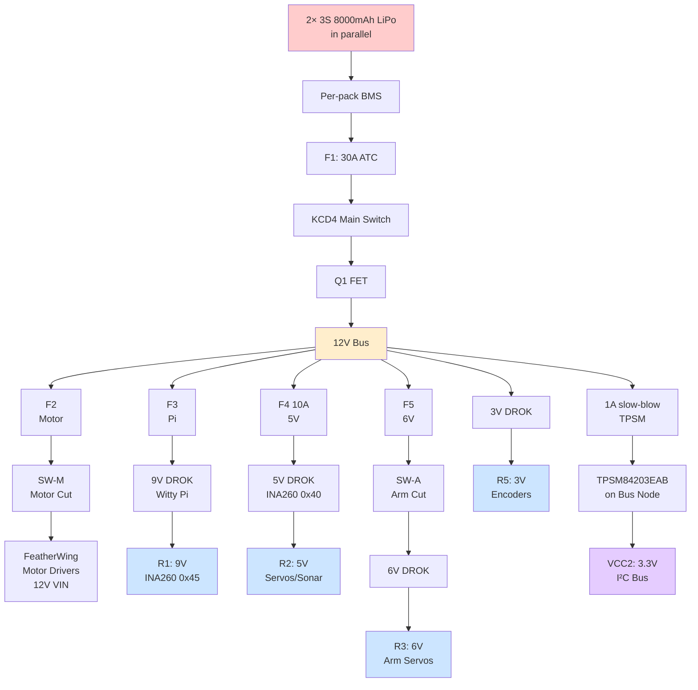
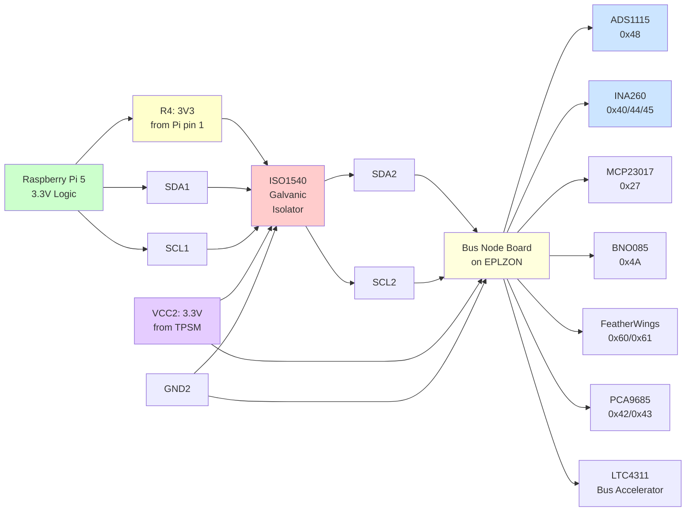
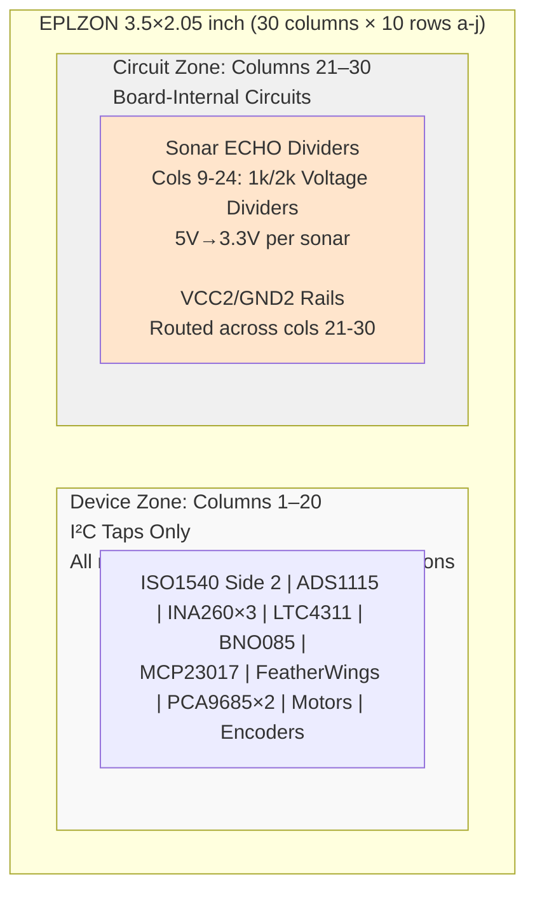
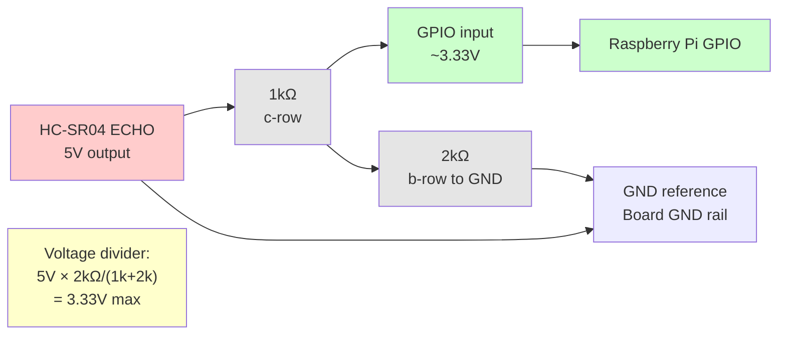

# WildWilly Autonomous Rover

## Master Hardware Design — As-Built

**Revision 2.0 · Current Configuration**

---

## Document Control

| Field | Value |
|-------|-------|
| Project | WildWilly Autonomous Rover |
| Document | Master Hardware Design — as-built, current configuration only |
| Revision | 2.0 |
| Date | 2026-08-18 |
| Owner | Howard Himmel |
| Status | Build complete; AI accelerator bonded; live verification in progress |
| Supersedes | As-Built Design Document v1.0 (2026-08-15) |
| Companions | Functional Requirements v3.1; Software Design v1.0 |
| Historical record | Master Engineering Package rev 6.2.0 retains all incident history, superseded designs, and revision lineage. Retain it. |

**Scope of this document.** This describes the rover as it is currently built.
It contains no incident narrative, no superseded design options, and no
revision archaeology. Where a past failure produced a standing rule, the rule
appears in §12 as a constraint — without the story behind it.

**Changes in revision 2.0.** §5.2 rewritten: the AI HAT+ 2 is now PCIe-bonded
and enumerating, and the driver package line that made it fail to bind is
recorded. §13 verification status and §14 open items advanced to the
2026-08-18 state. §17 added: document map and the reference-integrity defect
in `CLAUDE.md`. Everything else is carried forward unchanged from v1.0.

**Scope baseline.** Drive, see, talk/listen, arm pick-and-place on flat ground,
and basic flat-terrain autonomy. Stair-climbing is a stretch goal, not a
baseline requirement.

---

## 1. System Overview

Six-wheel rocker-bogie rover. Independent drive and steering on all six
corners, a 5-DOF arm with gripper, and a Raspberry Pi 5 host with an NPU
accelerator for vision and speech.

| Subsystem | Configuration |
|-----------|---------------|
| Compute | Raspberry Pi 5, AI HAT+ 2 (Hailo-10H, 8GB) |
| Drive | 6 × JGA25-370B gearmotors with quadrature encoders |
| Steering | 6 × GDW DS041MG servos |
| Arm | 7 servos — 4 × MG996R, 3 × MG90S |
| Ranging | 3 × HC-SR04 sonar (front, left, right) |
| Orientation | BNO085 9-DoF IMU with on-chip fusion |
| Vision | Front CSI camera, rear USB camera |
| Power | 2 × 3S 8000mAh LiPo in parallel |
| Bus | Galvanically isolated I²C, 10 devices |

Physical layout: Pi 5, SI board and audio HAT in the head assembly; power
distribution, bus node board and motor drivers in the body tray.

---

## 2. Power Architecture

### 2.1 Distribution tree

| ID | Path | Gauge | Protection |
|----|------|-------|------------|
| P1 | 2 × 3S 8000mAh → hard parallel, per-pack BMS | 12–14 AWG | BMS per pack |
| P2 | Battery+ → F1 → KCD4 switch → Q1 FET → +12V bus | 12 AWG | F1 30A ATC |
| P3 | +12V bus → F2 → **SW-M** → INA260 0x44 → both FeatherWing VIN | 16 AWG | F2 |
| P4 | +12V bus → F3 → Switch 2 → **DROK-Pi** (9V to Witty Pi) | 16 AWG | F3 |
| P5 | +12V bus → F4 → **DROK-5V** input | 16 AWG | F4 10A |
| P6 | +12V bus → F5 → **SW-A** → **DROK-6V** input | 16 AWG | F5 |
| P8 | +12V bus → F6 polyfuse (RXEF110 1.1A) → **TPSM84205** (12V→5V) → **AMS1117-3.3** → isolated 3.3V rail (VCC2) | 20–22 AWG | F6 PTC |
| P7 | Charge Y-cable (main + balance) → battery side of KCD4 | 14 AWG | — |

**Distribution tree diagram:**



### 2.2 Regulated rails

| ID | Rail | Source | Feeds | Monitor |
|----|------|--------|-------|---------|
| R1 | 9V | **DROK-Pi** buck | Witty Pi 5 VIN (KF350-2P) → Witty Pi → Pi 5 | INA260 **0x45** |
| R2 | 5V | **DROK-5V** buck | Steering servo distribution, sonar VCC, Pi screen | INA260 **0x40** |
| R3 | 6V | **DROK-6V** buck | Arm servo distribution | — |
| R5 | **⚠ 3V or 5V?** | **DROK-4** buck | Motor Hall encoders (JGA25-370B) — **voltage TBD, see warning below** | — |
| R4 | 3V3 | Pi header pin 1 | ISO1540 Side 1 VCC only | — |
| — | 3V3 (VCC2) | **Two-stage chain** (§3): TPSM84205 (12V→5V) → AMS1117-3.3 (5V→3.3V) | Entire isolated I²C bus (devices, not encoders) | — |
| — | +12V bus | Battery via F1/KCD4/Q1 | Both FeatherWing VIN (motors) | INA260 **0x44** (P3 monitoring) |
| — | +12V main | Battery via F1/KCD4/Q1 | All four DROK inputs + isolated power chain (P8) | — |

⚠ **DROK inventory status (2026-08-28).** Four DROK adjustable units total: DROK-Pi (9V), DROK-5V, DROK-6V, and DROK-4 (encoder rail, R5). Set each off-load to rated voltage before connecting downstream. **DROK-4 voltage still unresolved:** encoders may want 3.3V, 5V, or the recorded 3.0V — vendor part number was never captured, and 3.0V is dangerously close to the 2.83V that killed them. Meter before connecting.

⚠ **Isolated rail VCC2 — two-stage power chain (2026-08-28 repair).** The 2026-08-25
root cause stands: the old AMS1117-3.3, fed 5.14V from the servo rail, degraded
into thermal foldback and sagged to 2.83V, killing all six Hall encoders. The
repair now installed uses a **two-stage chain** to eliminate the dissipation:

- **Stage 1:** +12V bus → F6 polyfuse (RXEF110, 1.1A hold) → **TPSM84205** buck (12V → 5V at ~95% efficiency)
- **Stage 2:** TPSM 5V output → **AMS1117-3.3** (5V → 3.3V at ~80% efficiency, now dropping only ~1.7V at bus current)

The TPSM pre-regulates 12V down to 5V, removing the thermal stress that killed its
predecessor. **CRITICAL:** This chain requires the **TPSM84205** (5V family) — NOT the
84203 (3.3V out) or 84212 (12V out). The AMS1117 needs ≥~4.5V input; a 84203 with
3.3V out would fail. **Verify the part marking before fitting.** The AMS1117 remains
a single-point-of-failure on the isolated bus; its ground pin is the sole GND2 star
reference. Replace if its age or thermal history suggests degradation — use a fresh
part, not the 2026-08-25 casualty.

⚠ **Converter consolidation (2026-08-28).** The FEICHAO 8A UBEC and DZS buck are
retired, replaced by **four DROK adjustable bucks**: DROK-Pi (9V), DROK-5V, DROK-6V,
and DROK-4 (pending specification). Owner's stated reason: reliable, matched components,
one converter per rail. Rail voltages, roles, fuses, and downstream wiring are unchanged.
**DROK-4's set-point and load remain unspecified** — confirm before power-up.

⚠ **ENCODER RAIL VOLTAGE — VERIFY BEFORE POWERING THE ENCODERS.** R5 is recorded
as **3V**. That is *below* the 3.3V minimum this document already gives for these
Hall encoders (see the 2026-08-25 root cause above), and only **170mV above the
2.83V that killed all six of them**. If "3" means 3.3V, fine. If it is literally
3.0V, this reproduces the original failure exactly — the encoders will sit
powered-but-inoperative while every I²C device on the bus tests healthy, which is
the signature that cost days to diagnose. **Meter the rail before connecting the
encoders, and settle the still-open question of whether these encoders want 3.3V
or 5V** — the vendor part number was never recorded. If they want 4.5V+, R5 is
the wrong rail regardless of how it measures.

Moving the encoders off VCC2 onto R5 frees six GND and six 3V3 taps in §4.1 rows
15–20; strike those rows once R5 is confirmed.

⚠ **R4 corrected 2026-08-25 (owner).** This table previously listed encoder
distribution on R4, the Pi's own 3V3 header pin. That is wrong as-built: **the
encoders are powered from the isolated bus rail (VCC2/GND2), the same domain as
the MCP23017 expander that reads them.** Header pin 1 feeds ISO1540 Side 1 only.

The distinction matters and cost real time on 2026-08-25. If the encoders had
been on R4, they would have been driving GND1-referenced signals into
GND2-referenced expander inputs across a barrier §3.1 requires to have no DC
path — which would have neatly explained all six encoders reading static. They
are not, sensors and expander share a reference, and that explanation is void.

**ROOT CAUSE FOUND 2026-08-25: the AMS1117-3.3 has failed and the isolated rail
sits at 2.83V.** Measured that day: input 5.143V (healthy, from R2), output
**2.83V** against a 3.3V target. An AMS1117-3.3 fed 5.14V has ample headroom —
dropout is only ~1.1–1.3V — so producing 2.83V means the part is degraded, not
starved. This is the thermal foldback this document already warns about in §12
("the dissipation drives it into thermal foldback and the isolated rail
collapses progressively"), now measured rather than predicted.

**Why this killed the encoders and nothing else.** Every I²C device on that rail
has enough headroom to keep working at 2.83V — MCP23017 down to 1.8V, PCA9685 to
2.3V, INA260 to 2.7V. Hall encoders typically need 3.3V minimum and often 4.5V.
So the bus, the expander and the current monitors all test perfectly healthy
while all six Hall sensors sit powered-but-inoperative, holding a static output
they have not the supply to switch. That is exactly the measured signature, and
it is the only hypothesis tried that explains all six failing identically.

**Repair: replaced by the TPSM84203EAB** — designed 2026-08-28, build pending.
Layout §4, pin detail §16.2. Two things still to settle BEFORE fitting it:
verify the pinout actually matches rather than trusting "TO-220 drop-in", and
establish whether these encoders want 3.3V or 5V — the vendor part number was
never recorded, and JGA25-370 spans variants with both. If they need 5V the
module must be set for 5V AND the twelve signal lines need level shifting, since
the MCP23017 runs at 3.3V and its inputs are NOT 5V tolerant (abs max ~VDD+0.6V).
That decision is far cheaper before installation than after.

---

**Superseded investigation notes (kept for the reasoning, which generalises).** Established by
measurement that day: the MCP23017 is alive and correctly configured (IODIR
0xFF, GPPU 0xFF, sensible mixed resting levels per wheel), the I²C bus is
healthy, and all six motors physically turn (0.068–0.099 A each). Yet driving
any wheel produces no edges on any encoder pin, where ~340 would be expected
over a 2.5s drive at 0.6 duty. Hand-turning a wheel produces nothing at all —
the encoder is on the motor shaft behind the 17.1:1 gearbox and does not
back-drive, so any encoder test on this rover must be taken under power.

The next measurement is at the motor, not in software: probe a yellow/green
signal wire at the motor's own connector while that motor is driven. Toggling
there means the sensor works and the signal is lost between connector and
expander; static there means the sensors are not producing output despite
having power.

**R1 changed 2026-08-23/24.** It was "5.0–5.1V, Pi buck → Pi header pins 2/4,
monitored by INA260 0x44." The Pi is no longer fed that way: the DROK buck now
supplies 9V into Witty Pi's VIN terminal, and Witty Pi supplies the Pi. Its
monitor is 0x45, not 0x44 — see §16.4 for the live measurements confirming this
and the 0x44/0x45 transposition that was corrected at the same time.

Set each DROK off-load before connecting anything downstream: **9V** rail to the
Witty Pi's input spec, **5V** to 5.0–5.1V, **6V** to 6.0V, **3V** per the warning
above. These are adjustable trimpot modules — re-verify after any knock, and note
that the 5V setting directly sets the sonar ECHO divider outputs (§16.13).

**Witty Pi 5 power feed — reworked 2026-08-23.** Witty Pi 5 (real-time
clock + power management HAT, sits between the +12V/battery side and the Pi's
own 5V input; see §15.6 for physical placement) was originally fed via its
USB-C VUSB input at ~5V. That path measured a real, consistent ~0.3V loss
between Witty Pi's own output and the Pi's PMIC input (`vcgencmd
pmic_read_adc EXT5V_V`), enough to trip under-voltage during a voice-command
current spike. **Re-fed via Witty Pi's VIN screw terminal (KF350-2P,
documented 6–30V input, 5A output) from a DROK adjustable buck set to ~9V**
instead — a separate unit from the Pi-rail buck in item 7 of §14's Open
Items list; do not conflate the two without physically confirming they're
the same part. Higher input voltage means proportionally lower input
current for the same power draw, which reduces the same-resistance voltage
loss. Witty Pi's low-voltage cutoff (`wp5` menu option 7) was moved from
4.5V to **8.0V** to match — the old value was set against a ~5V input and
was effectively inert against a 9V one. Live-measured after the change:
V-IN ~9.0–9.2V, V-OUT ~5.4V (up from the USB-fed path's mid-4V range at the
Pi's own input). Effectiveness of this change in isolation is not yet fully
confirmed independent of the I²C fault below, which was found and partially
addressed around the same time.

### 2.3 Protection

- **F1** 30A ATC main fuse, off-board. **F2–F5** branch fuses.
- **Q1** FQP27P06 P-channel MOSFET for reverse polarity, with a 220nF
  gate-source cap limiting turn-on inrush.
- **D1** P6KE15A TVS for transients.
- Dual 3S BMS, one per pack.
- Latching mushroom E-stop cuts motors and arm.
- **SW-M and SW-A — added 2026-08-23, closing FRD v3.1 G-1.** Two dedicated
  physical switches, placed directly in the distribution tree (§2.1): **SW-M**
  in P3, between F2 and both FeatherWing motor drivers; **SW-A**
  in P6, between F5 and the **6V DROK** input (arm servo supply, R3). Relationship
  to the existing latching mushroom E-stop above — **replaces it, is driven by
  it, or is fully independent — not yet confirmed, owner to specify.**
  SW-M's placement was chosen so the motor side of G-1 would be observable
  through the current monitor then sitting downstream of it (0x44). **That no
  longer holds** — 0x44 moved to the +12V main input on 2026-08-28, upstream
  of SW-M, so a motor cut is invisible to it again. See the G-1 regression in
  §16.4. SW-A's side (P6/R3) still has no
  current monitor, so it needs either a new INA260 or a direct switch-state
  sense to be observable in software.
- **Switch 2** in the Pi buck input line — de-powers the Pi and the 3V3 bus
  after a software shutdown.

> **UNVERIFIED as of 2026-08-28.** This regression assumes the device moving to
> the 12V input is 0x44. The owner subsequently described the three monitors by
> *rail* as Pi / UBEC 5V / DZS 6V, with the 5V and 6V staying put — which makes
> the **Pi-rail** monitor the one that moves, and this regression spurious. That
> conflicts with `config.py`'s measured 0x44 = 11.373V on the motor bus. Resolve
> by reading bus voltage at 0x40/0x44/0x45 before treating this as fact.


### 2.4 Capacitors — complete list

| Qty | Value | Location |
|-----|-------|----------|
| 1 | 220nF | Q1 gate-source soft-start |
| 1 | 1000µF 16V + 1 × 0.1µF ceramic | Pi 5V rail, at header pins 2+4 |
| 1 | 1000µF 16V | PCA9685 0x42 V+, C2 pad |
| 1 | 2200µF 16V Rubycon low-ESR | PCA9685 0x43 V+, C2 pad |
| 1 | 10µF ceramic **50V** | Bus node C1 — TPSM Cin, `c25c`↔`c26c` |
| 2 | 47µF ceramic ≥1210 | Bus node C2/C3 — TPSM Cout pair, `c27c`↔`c28c` and `c27e`↔`c28e` |
| 1 | 47µF/35V radial electrolytic | Bus node C6 — 12V input bulk, `c26a`↔`G26`, stripe (−) up |
| 2 | 10µF ceramic 25V | Bus node C4/C5 — 3V3 rail decoupling, `V29`↔`G29` and `V30`↔`G30` |
| *opt* | 0.1µF ceramic | Bus node C7 — HF decoupler, `V26`↔`G28` diagonal |

Eleven capacitors total, twelve with the optional HF decoupler. The two 10µF
AMS1117 caps retire with the part.

**Cout is not optional.** TI specifies a 94µF ceramic minimum (2×47µF) on the
TPSM output; a single 10µF there will oscillate. C4/C5 sit downstream on the
rail and do not count toward it. C6 is why the TPSM feed takes a **slow-blow**
fuse — inrush charging it trips a fast-blow.

Original note: The Pi-rail pair sits at the **header end** of the
feed, not at the buck — GPIO power bypasses the Pi's onboard input
protection, so that feed carries its own local decoupling and its own fuse.

### 2.5 Voltage limits

| Rail | Nominal | Floor |
|------|---------|-------|
| Pi 5V | 5.0–5.1V | 4.85V |
| Pack | 12.6V full, 11.1V nominal | 10.2V cutoff |

Charge to 12.6V (4.20V/cell). Storage charge 11.4V (3.8V/cell). Packs must be
within 0.05V per cell of each other before paralleling — connect the main Y
first, the balance Y a minute later.

---

## 3. I²C Bus and Isolation

### 3.1 Topology

The Pi's I²C controller (GND1 domain) is separated from every device (GND2
domain) by an ISO1540 bidirectional isolator. Side 2 is powered by a
**two-stage power chain** (updated 2026-08-28):

- **+12V bus → F6 polyfuse → TPSM84205 (5V out) → AMS1117-3.3 (3.3V out) → VCC2 rail**

This two-stage design eliminates the thermal dissipation that caused the 2026-08-25
failure: the TPSM buck (~95% efficient) pre-regulates 12V to 5V, leaving the
AMS1117 to drop only ~1.7V at bus current instead of the previous ~1.9V at servo
load, which triggered thermal foldback. The isolated bus is now independent of the
servo rail and comes up with base 12V power.

```
Pi native I²C (GND1)      ISO1540        Isolated bus (GND2)
─────────────────────────────────────────────────────────────
GP2  SDA  ──────────>  Side 1 ‖ Side 2  ──────────>  SDA2 rail
GP3  SCL  ──────────>  Side 1 ‖ Side 2  ──────────>  SCL2 rail
3V3       ──────────>  Side 1 ‖ Side 2  <──────────  AMS1117-3.3 out
GND       ──────────>  Side 1 ‖ Side 2  ──────────>  GND2 star
```

**Isolation topology diagram:**



GND2's reference is the bus node board's GND rail, tied at the TPSM ground pin
(`c27b` → `c27a` → `G27`).

> ⚠ **GND1 and GND2 are not galvanically separate, and never have been.**
> Earlier revisions of this document asserted "the two ground domains must show
> no DC path between them." That is not achievable with this topology, for
> three independent reasons:
>
> 1. **A non-isolated regulator cannot create a ground domain.** The AMS1117's
>    GND pin was common to its input and output, so GND2 was tied to the 5V
>    rail's ground — i.e. GND1 — the whole time. The TPSM is a non-isolated buck
>    and behaves the same way.
> 2. **The star-ground bond** (§4.1 row 1) deliberately ties the board GND rail
>    to the system star point.
> 3. **The six sonar GPIO wires** (§16.13) cross the barrier by design, and the
>    ECHO divider bottoms reference the board GND rail that the Pi then reads
>    against its own ground.
>
> The ISO1540 provides **common-mode noise rejection on the I²C lines**, which
> is real and worth having. It is not a safety barrier and must not be relied on
> as one. Corrected 2026-08-28.

**Fault found and partially fixed, 2026-08-23.** The power wire to this
isolated-side 3V3 rail (VCC2, from the AMS1117 above) had come loose,
taking down the entire isolated bus — every device on it (encoders, IMU,
ADC, both PCA9685s, all three INA260 current monitors) stopped responding
simultaneously, while Witty Pi (a separate power domain via its own VIN
feed, not on this isolated 3V3 rail) kept working throughout, which is what
made the fault pattern legible. Reseated; `i2cdetect` confirmed the full bus
enumerating again (`0x27, 0x40/0x42/0x43/0x44/0x45, 0x48, 0x4a, 0x51, 0x60,
0x61, 0x70`) after the reseat. **Permanent fix (hot glue on the connection)
still pending** as of this checkpoint — the connection worked its way loose
once already and should be treated as provisional until secured. One
current monitor (`0x40`) was still intermittently failing self-test after
the reseat; worth confirming it holds before calling this fully closed.

### 3.2 Pull-ups

| Location | Value |
|----------|-------|
| Side 1 | Pi internal 1.8kΩ + ISO1540 onboard 10kΩ |
| Side 2 | 4.7kΩ rail pair + ISO1540 onboard 10kΩ + device breakouts |

Side 2 measures approximately 1.3kΩ combined. Do not add pull-ups on Side 1 —
that side sinks only 3.5mA and is already near budget.

**The Side-2 pull-ups live on the bus node board**, circuit zone cols 29–30:
R1 (SDA) legs `c29b`↔`c30b`, supply `c29a`→`V28`, output `c30e`→SDA rail col 30.
R2 (SCL) legs `c29h`↔`c30h`, output `c30j`→SCL rail col 30, supplied across the
centre gap by the `c29d`↕`c29f` bridge. **R2 sits below the gap because col-30
*top* already belongs to SDA** — both pull-ups in the top section would short
SDA to SCL.

4.7kΩ at 400kHz supports only ~75pF of bus capacitance; twelve taps on drop
cables is 300–400pF. **The LTC4311 is what keeps this bus inside spec** (§16.5).

### 3.3 Device roll-call

`i2cdetect -y 1` returns **ten devices plus one broadcast address**:

| Address | Device | Function |
|---------|--------|----------|
| 0x27 | MCP23017 | Encoder GPIO expander, 6 channels |
| 0x40 | INA260 | 5V servo/steering rail current |
| 0x42 | PCA9685 | Steering servos, CH0–CH5 |
| 0x43 | PCA9685 | Arm servos, CH0–CH6 |
| 0x44 | INA260 | +12V main input — total system draw (moved upstream 2026-08-28) |
| 0x45 | INA260 | Pi supply: DROK 9V → Witty Pi VIN |
| 0x48 | ADS1115 | Battery voltage ADC |
| 0x4A | BNO085 | 9-DoF IMU |
| 0x60 | FeatherWing | Motor driver, LEFT |
| 0x61 | FeatherWing | Motor driver, RIGHT |

**0x70 is the PCA9685 All-Call broadcast address, not a device.** It answers
whenever either PCA9685 is alive. The LTC4311 bus accelerator has no address
at all — it is a transparent pass-through and never appears in a scan.

A blank or partial scan with the base unpowered is expected behaviour, not a
fault: Side 2 dies with the 12V chain, so the Pi on USB-C alone sees nothing.

---

## 4. Bus Node Board

An **EPLZON 3.5"×2.05" (88.9×52.1mm) gold-plated solderable breadboard**,
30 columns × 0.1", M3 corner mounts. Rev 3.4, 2026-08-28. It carries two
functions: I²C bus distribution and the three sonar ECHO dividers. The isolated
bus power chain (TPSM84205 → AMS1117-3.3) is now external in the P8 path (§2.1),
not on the board.

```
TOP RAILS      row 1: +3.3V    row 2: GND      (30 holes each, column-aligned)
rows a-e       5-hole tie-strips per column
CENTER GAP     breaks the column strips
rows f-j       5-hole tie-strips per column
BOTTOM RAILS   row 1: SDA      row 2: SCL      (30 holes each)
```

**Board layout diagram:**



Per column, `a-e` is one net and `f-j` is a separate net; the centre gap breaks
them. Adjacent columns are not connected. Rails run continuously across all 30
holes.

**Rules.** One lead or wire per hole — never reuse a hole. Components mount
horizontally across columns; vertical runs are rail connections only.

**Zones.** Rail cols **1–20** are the device zone — external I²C connections
only, all taps interchangeable. Cols **21–30** are the circuit zone, where every
board-internal jumper lands.

> **The SDA/SCL separation depends entirely on the centre gap breaking column
> 30.** Meter `c30e`↔`c30f` as OPEN on the bare board before soldering anything
> (§4.5). If that gap does not break the strip, SDA shorts to SCL and the bus is
> dead on arrival.

### 4.1 Device-zone tap allocation — cols 1–20

Colours: GND black, 3V3 red, SDA blue, SCL yellow. This is schematic
role-colouring and differs from the sonar harness key in §6.1.

| Row | GND | 3V3 | SDA | SCL | Device | Addr |
|-----|-----|-----|-----|-----|--------|------|
| 1 | X | — | — | — | Star-ground bond — board GND rail ↔ system star point | — |
| 2 | X | X | X | X | ISO1540 Side 2 | — |
| 3 | X | X | X | X | ADS1115 logic | 0x48 |
| 4 | X | — | — | — | ADS1115 ADDR→GND | 0x48 |
| 5 | X | X | X | X | INA260 servo/steering | 0x40 |
| 6 | X | X | X | X | INA260 +12V main input | 0x44 |
| 7 | X | X | X | X | INA260 Pi supply | 0x45 |
| 8 | X | X | X | X | LTC4311 | none |
| 9 | X | X | X | X | BNO085 IMU | 0x4A |
| 10 | X | X | X | X | MCP23017 encoder | 0x27 |
| 11 | X | X | X | X | FeatherWing LEFT | 0x60 |
| 12 | X | X | X | X | FeatherWing RIGHT | 0x61 |
| 13 | X | X | X | X | PCA9685 steering | 0x42 |
| 14 | X | X | X | X | PCA9685 arm | 0x43 |
| 15 | X | X | — | — | Motor LF | — |
| 16 | X | X | — | — | Motor LM | — |
| 17 | X | X | — | — | Motor LR | — |
| 18 | X | X | — | — | Motor RF | — |
| 19 | X | X | — | — | Motor RM | — |
| 20 | X | X | — | — | Motor RR | — |
| 21 | X | — | — | — | Sonar divider GND ref — **circuit zone** `G22`/`G23`/`G24` (§4.2) | — |

**Power regulators are now external.** The isolated-bus power chain (TPSM84205 → AMS1117-3.3)
is in the P8 path (§2.1, §3), no longer on the board. Row 1 is allocated to the
star-ground bond, which ties the board GND rail to the system star point.

**Devices taking more than one rail tap:** ADS1115 only, whose second tap is a
GND for the ADDR strap selecting 0x48.

**Single-tap devices worth noting.** The BNO085 takes four connections only —
the Adafruit breakout has no AD0 pin, and its address-select pin (DI) is
pulled low on-board, fixing it at 0x4A. The LTC4311 also takes four — its EN
pin is already pulled high to VIN on the breakout.

**Tap budget.** Twelve four-wire taps (ten addressed devices, ISO1540 side 2,
LTC4311), plus the ADS1115 ADDR strap and the star-ground bond, against 20 holes
per rail. **GND is the binding constraint** — a device needs all four rails, so
expansion is GND-limited. Rows 15–20 are pending the encoder-rail open item in
§2.2.

### 4.2 Circuit zone — cols 21–30

| Rail | Allocation |
|---|---|
| **+3.3V** | `V25` LED feed · `V27` TPSM output · `V28` R1 supply · `V29`/`V30` C4/C5. Free: V21–V24, V26 |
| **GND** | `G21` ISO 2nd return · `G22`/`G23`/`G24` divider grounds · `G25`/`G27` power block · `G26` C6 (−) · `G29`/`G30` C4/C5. **Free: G28 only** |
| **SDA** | col 30 — R1 output |
| **SCL** | col 30 — R2 output |

Board furniture, by block:

- **Power block, cols 25–28 top** — TPSM, C1, C2, C3, C6, P2 input. §16.2.
- **Pull-ups and rail caps, cols 29–30** — R1, R2, the 3.3V bridge, C4, C5. §3.2.
- **Power LED, cols 24–26 bottom** — feed `c25f`→`V25`; anode `c25g` ↔ cathode
  `c26g`; R9 1kΩ `c26i`↔`c24i` (0.2" span, keep `c25i` clear); ground via the
  c24 bottom strip, already tied to `G24` by the RIGHT divider return. ~1.3mA.
  It exists to make the "devices dark on USB-C-only" state visible at a glance.
- **Sonar dividers, cols 9–24 bottom** — §16.13.
- **ISO1540 side-2 drop, col 12** — §16.1.

C6 occupies `G26`, so no vertical +3.3V/GND rail pair remains free. The optional
HF decoupler (§2.4) fits diagonally as `V26`↔`G28`, 0.2" with bent leads.

### 4.3 Wire list — 12 jumpers

`c25a`→`G25` · `c27a`→`G27` · `c28a`→`V27` · `c29a`→`V28` · `c29d`↕`c29f` ·
`c30e`→`SDA30` · `c30j`→`SCL30` · `c25f`→`V25` · `c12f`→`G22` · `c12g`→`G21` ·
`c18f`→`G23` · `c24f`→`G24`

Plus the ISO1540 **VCC2** wire to one open +3.3V device-zone tap — pick a
specific tap and record it in §4.1.

The TPSM feeds `V27` and R1 taps `V28`, shifted one column apart so the two
3.3V diagonals run parallel and never cross. The three divider-ground runs are
insulated wire crossing cols 12–24 *over* the board — under a wire, not
occupied; those holes remain usable.

### 4.4 Free space

- **Top strips:** `c1`–`c24` entirely free. c25–c28 power block; c29/c30 partial.
- **Bottom strips:** `c1`–`c8`, `c13`, `c14`, `c19`, `c20`, `c27`–`c28` free.
  Everything else partial.

### 4.5 Build order and verification

**Before soldering anything:**

1. Meter the bare board. `c30e`↔`c30f` must be **OPEN** — repeat on 2–3 random
   columns. Confirm 4 rails = 4 independent nets, each continuous across 30 holes.
2. Confirm TPSM pin order against the physical part, face-on (§12 rule 3 applies
   — orientation errors on this rover have cost real time).
3. **Dry-fit C6 before soldering — the constraint is body diameter, not lead
   pitch.** Electrolytic leads bend easily over this span, so a 2.5mm or 5mm
   part will both seat between `c26a` and `G26` whichever way that gap measures.
   What does not bend is the can: at 6.3mm diameter its 3.15mm radius covers
   `c25a` and `c27a`, 2.54mm away on either side, and an 8mm can also crowds the
   TPSM body at `c26b` one pitch over. This is why the row-a jumpers go in first
   (step 4). Confirm ceramic lead pitch separately, 2.54mm vs 5mm.

**Assembly:**

4. Power block — **row-a jumpers first**, then P2, C1, TPSM, C2, C3, **C6 last**.
   A 6.3mm can at `c26a` has a 3.15mm radius and its neighbours sit 2.54mm away,
   so it covers both jumper holes. Bring up on a bench supply with the current
   limit at ~200mA: expect 3.3V ±0.1V at `V27` **and** at rail col 1 (far end),
   and the LED lit.
5. Pull-ups, C4/C5, the bridge, and the optional `V26`↔`G28` decoupler.
   SDA/SCL idle ~3.3V.
6. Sonar section — headers, dividers, GPIO pins, ground wires. 5V on the ECHO
   pins must give 3.2–3.4V at the junctions.
7. ISO side-2 drop pins. Continuity `c12j`↔GND rail. No +3.3V↔GND continuity
   (the caps charge, then it opens).
8. Connect the ISO module, the LTC4311 (shortest leads — §16.5), and the
   devices → `i2cdetect` roll-call per §3.3.

---

## 5. Compute and Interfaces

### 5.1 Raspberry Pi 5

Powered through the GPIO header from the Pi buck, not USB-C. The GPIO path
bypasses the Pi's onboard input protection, so brownout protection is
**not implemented in software at all.** Earlier revisions of this document
claimed it was "firmware-only, via the INA260 at 0x44"; no such code exists
(`safety.py` has no INA260 logic; `config.py:177` — monitors are log-only
with no trip thresholds). Corrected 2026-08-28. There is no hardware
supervisor either.

### 5.2 AI HAT+ 2

Hailo-10H with 8GB dedicated on-board RAM. Attaches by PCIe FFC, not the
40-pin header and not USB-C. Header pins 27/28 (ID_SD/ID_SC) are reserved for
its EEPROM and must not be used.

**Status: PCIe-bonded and enumerating as of 2026-08-16.** The device presents
as `/dev/hailo0`; `hailortcli fw-control identify` reports firmware 5.1.1,
architecture HAILO10H.

**Driver package line — this is the part that matters.** The Hailo-10H does
*not* work with the `hailo-all` package line, which is Hailo-8 only. That
driver loads without error but its PCI ID table does not contain the
Hailo-10H's ID `1e60:45c4`, so it silently never binds the device — no error,
no `/dev/hailo0`, nothing to diagnose against. The correct line is
`hailo-h10-all`, which supplies `h10-hailort`,
`h10-hailort-pcie-driver` and `python3-h10-hailort`.

Setup sequence: enable PCIe Gen 3 (`raspi-config` → Advanced Options → PCIe
Speed — Gen 2 is the default and halves bandwidth), install the
`hailo-h10-all` line, then verify with `hailortcli fw-control identify`.
Post-processing assets install to `/usr/share/rpi-camera-assets/`.

Capability: object detection, semantic and instance segmentation, pose
estimation, plus on-device Whisper speech-to-text and vision-language models.
The 8GB of dedicated on-board RAM is what allows LLM/VLM and Whisper workloads
to run without consuming Pi system memory.

**Not yet consumed by software.** `vision.py`'s `ObjectDetector` remains
CPU-only YOLOv8 with `ENABLE_OBJECT_RETRIEVAL=False`. Bonding the accelerator
and using it are separate milestones; only the first is done. The
architectural constraint on how it may be used is §12 rule 18.

### 5.3 GPIO breakout

Seengreat RPi PX00 Expansion A, ribbon-connected to the Pi 5. Passive 1:1
passthrough — standard 40-pin layout, no buffers, level shifters or added
pull-ups. Its passivity is a requirement, not a convenience: anything added to
GP2/GP3 counts against the ISO1540 Side 1 budget.

### 5.4 Vision and display

| Device | Interface |
|--------|-----------|
| Front camera | CSI FFC |
| Rear camera | USB |
| Display | DSI ribbon + separate 3-pin GPIO power |
| AI HAT+ 2 | PCIe FFC |

---

## 6. Sensors

### 6.1 Sonar

3 × HC-SR04 — front (centre), left, right. There is no rear sonar; the only
rear-facing device is the rear USB camera.

| Position | TRIG | ECHO |
|----------|------|------|
| Front | GP5 (pin 29) | GP26 (pin 37) |
| Left | GP13 (pin 33) | GP14 (pin 8) |
| Right | GP4 (pin 7) | GP21 (pin 40) |

ECHO lines pass through 1k/2k dividers on the EPLZON perfboard — the HC-SR04
echoes at 5V. TRIG is driven directly and needs no divider. Sonar VCC is 5V.

Harness colours: **blue GND, purple ECHO, grey TRIG, white VCC.**

### 6.2 Battery voltage sense

10kΩ from the +12V bus to the divider midpoint, and 4.7kΩ ∥ 10kΩ (≈3.2kΩ)
from midpoint to GND. Midpoint goes to **ADS1115 A0**. Expect ~2.76V at
11.4V pack, ~3.06V at 12.6V.

Requires calibration: meter the actual voltage at the divider high side,
compare against the reported value, and set the scale factor in `config.py`.
Verify at two points across the range. The low-voltage shutdown fires from
calibrated volts, so an error here moves the cutoff.

### 6.3 IMU

BNO085, 0x4A. On-chip SH-2 fusion gives drift-free heading without a
magnetometer — useful with six motors nearby.

| Pin | Connection |
|-----|------------|
| VIN | VCC2 rail row 9 |
| GND | GND2 rail row 9 |
| SDA / SCL | SDA2 / SCL2 rail row 9 |
| INT | GP15, physical header pin 10 |
| RST | MCP23017 GPB4 |
| DI, P0, P1, BT, 3Vo | unconnected |

The reset line runs through the MCP23017, so the expander must be initialised
before the IMU can be reset — an ordering dependency in software.

The BNO085 uses I²C clock stretching, which the Pi handles poorly at default
speed. If initialisation succeeds but reads fail intermittently, adjust
`dtparam=i2c_arm_baudrate` — for this part, raising it above the 100kHz
default is usually more effective than lowering it.

### 6.4 Current monitoring

3 × INA260, each inline in its rail rather than a parallel tap. Integrated
2mΩ shunt, factory calibrated — no calibration register to set.

---

## 7. Drive and Steering

### 7.1 Motors

6 × JGA25-370B micro metal gearmotors. **12V nominal, 620 RPM** (owner-corrected
2026-08-25), quadrature encoders at 11 PPR on the motor shaft. One 6-pin JST-PH
per motor.

⚠ **This spec was wrong until 2026-08-25** — it read "6V nominal, ~100–200 RPM",
which is a different gearbox entirely. Anything reasoned from the old figure is
suspect, including any assumption that the motors were being over-driven by the
11.4V rail. They are not: 12V motors on a 12V rail, running at their rated
voltage.

**620 RPM is a low-reduction, speed-optimised gearbox, and that is the reason
drive torque is low.** Torque scales with gear reduction, so the 100–200 RPM
variants of this same motor produce roughly 3–5× the torque. Two independent
factors compound here:

1. **Gearing.** 620 RPM trades reduction for speed.
2. **Wheel radius.** Tractive force at the ground is motor torque × reduction ÷
   wheel *radius*. The 101.6mm wheels (measured 2026-08-25) have a 1.56× larger
   radius than the 65mm the config originally assumed, which is ~35% less force
   at the ground for identical motor torque.

Theoretical top speed is 620/60 × π × 0.1016 ≈ **3.3 m/s (11.9 km/h)** — far
beyond anything an indoor home-assistant rover needs, and that unused speed is
bought entirely with torque. It also explains the ~0.5 duty breakaway measured
2026-08-24: with this little reduction it takes about half the rail voltage just
to overcome static friction and chassis weight. Raising SPEED_SLOW 0.35→0.55
that day spent headroom rather than creating torque; full duty is still full
duty, and no software change can recover what the gearbox gives away.

**If more torque is wanted, it is a motor change, not a tuning change.** A 12V
~130 RPM JGA25-370 shares the body, mount and 6-pin encoder, gives roughly 4.8×
the torque and still tops out near 0.7 m/s. The only downstream change is
ENCODER_COUNTS_PER_REV, already flagged unconfirmed in config.py.

**Reduction ratio is 17.1:1**, owner-supplied 2026-08-25 and consistent with
620 RPM from a ~10,600 RPM bare motor. The vendor part number is still NOT
recorded — capture it before ordering replacements, since JGA25-370 is a family
covering many ratios and wire colours differ between batches (§7.2).

That ratio also corrected `config.ENCODER_COUNTS_PER_REV`. It was 3292, derived
as "823.1 PPR ×4"; 823.1 ÷ 11 PPR implies a **74.8:1** gearbox — the reduction
matching the stale 100–200 RPM spec above, not these motors. The real figure is
11 PPR × 4 × 17.1 = **752**, making the old constant 4.375× too high. Since
`odometry.py` divides by it, reported distances were ~23% of actual from the
encoder side alone; combined with the wheel-diameter error fixed the same day
(0.065m assumed against 0.1016m real), dead reckoning under-reported by roughly
**6.8×** before 2026-08-25.

The 11 PPR figure itself still comes from this same section, which was wrong
about the motors — so 752 is derived, not measured. `scripts/encoder_calibration.py`
confirms it by hand-turning a wheel a known number of revolutions, and settles
the unverified A/B channel column in §7.2 in the same pass.

| Wire | Function | Lands on |
|------|----------|----------|
| Red | Motor + | FeatherWing motor terminal |
| White | Motor − | FeatherWing motor terminal |
| Blue | Encoder VCC | 3V3 encoder distribution |
| Black | Encoder GND | Encoder GND distribution → star |
| Yellow | Encoder Phase A | MCP23017, even pin of pair |
| Green | Encoder Phase B | MCP23017, odd pin of pair |

Meter each crimp before trusting wire colour — batch variation is documented.

### 7.2 Motor driver assignment

Each FeatherWing drives one side.

**As-built port order is M1 = MIDDLE, M2 = FRONT, M3 = REAR** — not the
front/middle/rear order the port numbers suggest. Verified 2026-08-24 by
driving one wheel at a time with the rover on a block and recording which
wheel physically turned (M2-left → left front, M1-right → right middle,
M2-right → right front; the rest follow by elimination, and the convention is
symmetric across both kits). `config.MOTOR_PORT` was corrected to match.

| Motor | Position | Driver | Encoder A/B |
|-------|----------|--------|-------------|
| LF | Left front | 0x60 **M2** | GPA0 / GPA1 |
| LM | Left middle | 0x60 **M1** | GPA2 / GPA3 |
| LR | Left rear | 0x60 M3 | GPB0 / GPB1 |
| RF | Right front | 0x61 **M2** | GPA4 / GPA5 |
| RM | Right middle | 0x61 **M1** | GPA6 / GPA7 |
| RR | Right rear | 0x61 M3 | GPB2 / GPB3 |

⚠ **The Encoder A/B column is NOT verified.** Only the driver ports were
tested. The motor ports turned out not to follow position order, so the
encoder channel assignment cannot be assumed to either — it may follow the
physical wheels, or the same M1/M2 swap, or neither. This affects per-wheel
odometry attribution only; whole-side drive is unaffected. Settle it the same
way: turn one wheel by hand and read which encoder channel counts.

**RESOLVED 2026-08-25 — the LEFT MIDDLE motor on 0x60 M1 was a disconnected
connector, not a failed motor.** Reconnected during teardown; the wheel was
confirmed turning under command on 2026-08-25.

Kept because the diagnostic reasoning generalises to the other five legs. The
symptom was zero current draw at 0.35/0.60/0.80/0.90 duty in both directions,
against ~0.11 A for every healthy motor free-running. Twelve consecutive
pulses gave identical near-zero readings — that repeatability is what pointed
at wiring rather than a commutator dead spot, which varies between attempts at
the same duty. One slight tick early on showed contact had existed
momentarily. Note also that a **stall reads HIGHER than healthy, not lower**:
a motor humming without turning is still drawing. A near-zero reading only
ever means the circuit is open, so connector, crimp and screw terminal come
before any suspicion of the motor or the driver channel.

`scripts/wheel_current_test.py` reproduces this measurement per wheel.

Adafruit FeatherWing #2927, used standalone with no Feather host board.
Direction and PWM are handled internally over I²C — there are no direction
GPIOs and no STBY pin.

### 7.3 Steering

6 × GDW DS041MG, one per corner, on PCA9685 0x42 channels CH0–CH5 in the
order LF, RF, LM, RM, LR, RR.

Each servo plugs into a 3-pin channel header — signal, V+ and GND all pass
through the board. The board takes its own V+ from the 5V rail (R2, DROK).

1500µs centre, 500–2500µs for 180°. Confirm per unit; some stock ships in
900–2100µs / 120° mode.

---

## 8. Arm

5-DOF plus gripper, 7 servos on PCA9685 0x43. The board takes its V+ from the
6V rail (R3, DROK — was the DZS); servos plug into 3-pin channel headers.

**Motor and arm control topology diagram:**


| Joint | Servo | Channel |
|-------|-------|---------|
| J0 base yaw | MG996R | CH0 |
| J1a shoulder (right) | MG996R | CH1 |
| J1b shoulder (left) | MG996R | CH2 |
| J2 elbow | MG996R | CH3 |
| J3 wrist rotate | MG90S | CH4 |
| J4 wrist pitch | MG90S | CH5 |
| J5 gripper | MG90S | CH6 |

J1a and J1b are a mirrored pair driving one physical axis:
`J1b = 2 × 1500µs − J1a`. They must be commanded together.

The arm connects through a bulkhead connector so it detaches without
desoldering.

---

## 9. Pin Assignments — Pi 40-pin Header

| Pin | BCM | Connects to |
|-----|-----|-------------|
| 1 | 3V3 | ISO1540 Side 1 VCC (**not** encoder distribution — see §2.2) |
| 2, 4 | 5V | Pi buck output |
| 3 | GP2 | ISO1540 Side 1 SDA |
| 5 | GP3 | ISO1540 Side 1 SCL |
| 6, 9 | GND | Pi return → star |
| 7 | GP4 | Sonar RIGHT TRIG |
| 8 | GP14 | Sonar LEFT ECHO (÷) |
| 10 | GP15 | BNO085 INT |
| 27, 28 | GP0/GP1 | RESERVED — AI HAT EEPROM |
| 29 | GP5 | Sonar FRONT TRIG |
| 33 | GP13 | Sonar LEFT TRIG |
| 37 | GP26 | Sonar FRONT ECHO (÷) |
| 40 | GP21 | Sonar RIGHT ECHO (÷) |
Free and unused: **GP7–GP11**, and the twelve pins formerly used for motor
direction. (GP7 was briefly earmarked for MCP23017 INTA/interrupt-driven
quadrature decode, decided 2026-08-18 — **retracted 2026-08-23**: that wire
would have run directly across the ISO1540 galvanic isolation barrier
[§3.1], the MCP23017 being on the isolated side, and interrupt-driven decode
would not actually have reduced I²C transaction count anyway. See FRD v3.1
G-2 and Software Design v1.0 S-2 for the full reasoning. GP7 is free again.)

**GP14 and GP15 are UART0 TXD/RXD.** The serial console must remain disabled
or the kernel claims both pins — and drives GP14 as an output onto the left
sonar's divider node. Disable via `raspi-config` → Interface Options → Serial
Port, answering **no** to both prompts. Verify with
`gpioinfo | grep -E 'line *1[45]'`; both must show unused.

---

## 10. Ground

Single-point star. Every converter negative, board ground and sensor return
lands on it.

The GND2 rail is referenced at the TPSM ground pin (§16.2). It is **not**
galvanically separate from GND1 — see the correction in §3.1; the star-ground
bond ties them deliberately. Measurements should still stay within one
domain — a reading taken between domains is a floating value and means
nothing.

---

## 11. Software

Python, modular, running from `willy-rover.service`. Modules include
`brain`, `safety`, `motors`, `arm`, `navigation`, `odometry`, `sensors`,
`vision`, `voice`, `world_model`, `mapping`, `diagnostics`, `config`, and a
`hw_sim` mock layer selected by `WILLY_SIMULATE` for off-hardware testing.

### 11.1 Control layering

**Reflex layer** — sonar, encoders, current monitors. Deterministic, drives
the emergency stop, never waits on vision.

**Deliberative layer** — the NPU. Frame-rate at best, variable latency,
seconds-scale for language models. Feeds `world_model` for planning and
classification only.

An obstacle stop must never depend on a detection frame arriving.

### 11.2 Startup self-test

Enumerate all ten I²C devices, confirm the BNO085 interrupt is live on GP15,
and confirm all six encoder channels change count under manual rotation.
Motion stays inhibited unless every check passes.

The self-test must distinguish "base unpowered" from "bus fault" — a blank
scan on USB-C-only power is expected, not a failure.

### 11.3 Shutdown

`shutdown -h now` completes with the rail still powered; Switch 2 then
de-powers the Pi and the 3V3 bus. Low-battery shutdown triggers proactively
from calibrated pack voltage, ahead of the 10.2V cutoff.

Bulk capacitance cannot hold a Pi 5 up through a hard power cut — that would
require farads, not microfarads. A cut at the main switch or E-stop with the
OS running risks filesystem corruption.

---

## 12. Design Constraints

Standing rules. Each exists because violating it has consequences that are
not obvious from the schematic.

**Wiring**

1. Motor− (white) lands on a FeatherWing motor terminal. Never on an
   MCP23017 GPIO or any logic pin.
2. **The isolated-bus power chain (P8) uses TPSM84205 (5V output), NOT 84203 (3.3V) or 84212 (12V).** 
   The TPSM84205 draws from +12V via F6 polyfuse, pre-regulates to 5V (~95% efficient), 
   then feeds AMS1117-3.3 (5V → 3.3V at ~80% efficient). **Do not use a 84203 or 84212** — 
   the 84203 outputs only 3.3V and cannot feed the AMS1117 (which needs ≥4.5V in); the 84212 
   outputs 12V and bypasses the pre-regulation that prevents thermal foldback. Verify the part 
   marking before fitting. The two-stage design removes the dissipation that killed the 
   previous single-stage AMS1117 and makes the bus independent of servo load.
3. ISO1540 sides are not interchangeable. Side 1 takes 40pF and one device;
   Side 2 takes 400pF and multiple nodes. The device bus goes on Side 2.
   Identify Side 1 by the SOIC-8 pin-1 marker — pins 1–4 are VCC1, SDA1,
   SCL1, GND1 — and mark the board physically.
4. Meter every pin of an unlabelled module against its datasheet before
   applying power. Never identify a pin by swapping a live connection.

**Before power-up**

5. **TPSM84205 decoupling (P8 path):** 10µF/50V on 12V input, 2× 47µF ceramic on 5V output 
   (TI minimum 94µF). **AMS1117-3.3 decoupling:** 10µF/50V on 5V input (from TPSM), 10µF on 3.3V output 
   (≥10mm from pins). The AMS1117 remains the critical stage on isolated rail — use a fresh part.
6. 4.7kΩ pull-ups present on SDA2 and SCL2.
7. ~~GND1/GND2 isolation confirmed — no DC path between domains.~~
   **Struck 2026-08-28** — not achievable with this topology and never was
   (§3.1). Replace with: confirm the star-ground bond is present and the board
   GND rail reads continuous to the system star point.
8. ADS1115 A0 metered in the 2.76–3.06V window. A reading near 12V means the
   divider is open and the ADC will be destroyed on power-up.
9. Address straps verified individually on both PCA9685s and all three
   INA260s.
10. Serial console disabled.

**Diagnostic principles**

11. A degrading failure is thermal. A wiring fault gives the same wrong
    answer every time; a part in thermal foldback gives a progressively
    worse one.
12. Cross-domain measurements are meaningless. Reference every reading to the
    ground of the side being measured.
13. 0x70 in a scan proves a PCA9685 is alive and nothing else. Never count it
    toward the device total.

**Power**

14. Never run USB-C and the Pi buck simultaneously — two sources on one rail.
15. Do not erode the Pi rail margin. Floor is 4.85V; measured 5.144V.
16. The 5V rail worst case is already near 9A against an 8A UBEC rating.
    Budget any new load on this rail before fitting it.
17. Packs within 0.05V per cell before paralleling. Main Y first, balance Y
    a minute later.

18. The AI accelerator stays out of the safety path. Sonars, encoders and the
    current monitors are the reflex layer — deterministic, and what drives the
    stop. The Hailo is the deliberative layer: frame-rate at best, variable
    latency, seconds-scale for LLM and VLM work. An obstacle stop must never
    wait on a detection frame arriving. Vision informs navigation; it does not
    gate the stop.
19. Bonding the accelerator is not integrating it. `/dev/hailo0` enumerating
    says nothing about whether any inference path has been validated.

---

## 13. Verification Status

| Item | Status |
|------|--------|
Status as of 2026-08-18.

| Item | Status | Evidence |
|------|--------|----------|
| Full ten-device roll-call through the isolator | PASS | `i2cdetect -y 1` returns 0x27, 0x40, 0x42, 0x43, 0x44, 0x45, 0x48, 0x4A, 0x60, 0x61, plus 0x70 All-Call |
| Pi boots from battery, not USB-C | PASS | Rail 5.144V against a 4.85V floor; `vcgencmd get_throttled` = 0x0, clearing the sticky since-boot bit as well as the live one |
| Serial console disabled, GP14/GP15 free | PASS | `gpioinfo` shows both unused on the header gpiochip |
| Bus node board fully populated | PASS | All rail positions landed |
| Breakout connections verified | PASS | Seengreat PX00 in the path during the clean roll-call |
| AI accelerator PCIe bond | PASS | `/dev/hailo0`; firmware 5.1.1, HAILO10H |
| Pi-rail INA260 address | PASS — 0x44 | 0x46 does not answer; `config.INA260_PI_ADDR=0x44` agrees |
| Sonars connected | Connected, not range-tested | — |
| Encoder counts on all six channels | Not tested | — |
| BNO085 interrupt and fusion output | Not tested | INT on GP15 is unused by the driver; library polls over I²C |
| Battery divider calibration | **DONE** (2026-08-16, owner-confirmed) | `BATTERY_DIVIDER_SCALE` re-trimmed 0.2865→0.2386 against a simultaneous ADC/multimeter reading (2.9112V ADC vs. 12.2V meter); `BAT_FULL_V` corrected to 11.58V, now above `BAT_WARN_V`. See `config.py`. |
| Steering servo sweep | Not tested | — |
| Arm servo range and per-joint limits | Not tested | §20.6 calibration; `arm_jog.py` is the tool |
| Motor direction and mapping | Not tested | — |
| Motor crimps | 1 of 6 verified | — |

**Nothing in the hardware build is outstanding.** Every remaining row is a
measurement, not a construction task.

---

## 14. Open Items

1. **Motor crimps** — five of six unverified against the colour scheme in
   §7.1. Meter before first motion.
2. ~~Battery divider calibration~~ — done 2026-08-16, owner-confirmed; see §13.
3. **PCA9685 V+ current path** — servo current now flows through each board's
   V+ terminal, PCB trace and channel headers rather than signal current
   only. Worst-case steering draw is near 9A. Confirm against the board's
   ratings before running all six servos under load simultaneously.
4. **AI HAT+ 2 power budget** — draws from the 5V rail, which is already the
   tightest in the design.
5. **Runtime measurement** — log the three INA260s through a representative
   run and integrate, rather than relying on estimates.
6. ~~**AMS1117 thermal watch**~~ — **closed 2026-08-28.** The part is retired
   (§15.8); the TPSM84203EAB that replaces it is a ~95%-efficient switcher and
   does not share the failure mode. Superseded by the bus node board build
   (§4.5).
7. **Pi-rail buck identity** — DROK 12A LCD versus Elecbee 5V/5A across older
   documents. Electrically settled: the rail measures correctly and its
   monitor is confirmed at 0x44. This is a labelling question only. Identify
   the physical part and fix §15.6.
8. **JGA25-370B Hall output drive type** — push-pull or open-collector is
   unknown, and no official datasheet exists for this motor family. This
   decides whether external pull-ups are needed at all. Meter one output
   against VCC and GND with the shaft held.
9. ~~AI accelerator not yet in the software path~~ — done 2026-08-21 for
   vision (Hailo YOLOv8, live-verified, enabled). Voice LLM attempted but not
   enabled — see item 11 below. See Software Design v1.0 §7.
10. ~~Wire the MCP23017 encoder chip's INTA pin to GP7~~ — **retracted
    2026-08-23**, not just deferred. Would have run a conductor across the
    ISO1540 isolation barrier (MCP23017 is on its isolated side, §3.1) and
    would not have reduced I²C transaction count regardless. Bench-testing
    the actual edge rate (mark a wheel, jog known turns) replaces this as
    the real next step — see Software Design v1.0 S-2 and FRD v3.1 G-2.
11. **Hailo NPU intent-parsing LLM (`qwen2:1.5b`) scored 0% on a 32-case
    reliability batch** (2026-08-23) — real, not a config issue. Needs
    investigation before `ENABLE_HAILO_LLM` can be enabled. See Software
    Design v1.0 §7 and `docs/superpowers/plans/2026-08-23-hailo-voice-
    offload.md` Task 4.
12. **§3.1's I²C 3.3V connector needs a permanent fix (hot glue), not just a
    reseat** (2026-08-23) — worked loose once already, taking the entire
    isolated bus down. One current monitor (`0x40`) was still intermittently
    failing self-test after the reseat; confirm it holds before treating
    this as closed.

---

## 15. Bill of Materials

Current components only. Anything superseded, retired or never fitted is
listed in §15.8 rather than carried as a line item.

### 15.1 Compute and interface

| Component | Role | Qty | Status |
|-----------|------|-----|--------|
| Raspberry Pi 5 (8GB) | Host controller | 1 | Installed |
| AI HAT+ 2 (Hailo-10H, 8GB) | NPU — vision, speech, VLM | 1 | On order |
| 5" DSI touch display, 800×480 | Face / UI | 1 | Installed |
| Arducam IMX708 (CSI) | Front camera | 1 | Installed |
| OV9782 (USB) | Rear camera | 1 | Installed |
| ReSpeaker USB mic + speaker | Voice I/O | 1 | Installed |
| Seengreat RPi PX00 Expansion A | 40-pin passive GPIO breakout | 1 | Installed |
| Raspberry Pi Active Cooler | Pi 5 blower + heatsink | 1 | Installed |
| 5V case fan, 30–40mm | Head assembly exhaust | 1 | Installed |
| SanDisk Extreme PRO SSD 500GB | Boot drive | 1 | Installed |

### 15.2 Drive and steering

| Component | Role | Qty | Status |
|-----------|------|-----|--------|
| JGA25-370B gearmotor + encoder | Drive wheels | 6 | Installed |
| Adafruit FeatherWing #2927 | I²C motor driver — 0x60 left, 0x61 right | 2 | Installed |
| GDW DS041MG servo | Corner steering — PCA9685 0x42 | 6 | Installed |

### 15.3 Arm

| Component | Role | Qty | Status |
|-----------|------|-----|--------|
| MG996R metal-gear servo | J0 base, J1a/J1b shoulder, J2 elbow | 4 | Installed |
| MG90S micro servo | J3 wrist rotate, J4 wrist pitch, J5 gripper | 3 | Installed |
| 608 bearing | Arm joint | 1 | Verify |
| 6203 bearing | Arm joint | 2 | Verify |
| M8 60mm bolt + anti-loosening nut | Arm pivot | 2 | Verify |
| Servo bulkhead connector | 7-lead detachable arm harness | 1 | Built |
| Braided split sleeve | Arm harness protection | 1 | Ordered |

### 15.4 I²C bus and isolation

| Component | Role | Qty | Status |
|-----------|------|-----|--------|
| Adafruit ISO1540 (#4903) | Galvanic I²C isolator | 1 | Installed |
| 4.7kΩ resistor | SDA2 / SCL2 rail pull-ups | 2 | Installed |
| Adafruit LTC4311 | I²C accelerator — no address | 1 | Installed |
| MCP23017 | Encoder GPIO expander, 0x27 | 1 | Installed |
| ADS1115 | Battery voltage ADC, 0x48 | 1 | Installed |
| INA260 current sensor | 0x40 servo, 0x44 12V, 0x45 Witty Pi | 3 | Installed |
| Adafruit PCA9685 | 0x42 steering, 0x43 arm | 2 | Installed |
| 1000µF 16V electrolytic | PCA9685 0x42 V+, C2 pad | 1 | Installed |
| Rubycon 2200µF 16V low-ESR | PCA9685 0x43 V+, C2 pad | 1 | Installed |

### 15.5 Sensing

| Component | Role | Qty | Status |
|-----------|------|-----|--------|
| BNO085 9-DoF IMU | Orientation, 0x4A | 1 | Installed |
| HC-SR04 sonar | Front, left, right | 3 | Installed |
| 1kΩ resistor | Sonar ECHO dividers, high side | 3 | Installed |
| 2kΩ resistor | Sonar ECHO dividers, low side | 3 | Installed |
| 10kΩ resistor | Battery divider high side | 1 | Installed |
| 10kΩ + 4.7kΩ resistor | Battery divider low side (parallel ≈3.2kΩ) | 2 | Installed |
| EPLZON perfboard | Bus node board (§4) — I²C distribution, 3 sonar ECHO dividers | 1 | Rev 3.4 to build |

### 15.6 Power

| Component | Role | Qty | Status |
|-----------|------|-----|--------|
| 3S LiPo 8000mAh | Two packs, hard-paralleled | 2 | Installed |
| 3S BMS 40–60A with balance | One per pack | 2 | Installed |
| ~~FEICHAO 8A UBEC~~ | Replaced 2026-08-28 — see §15.8 | — | Removed |
| ~~DZS Elec 12A adjustable buck~~ | Replaced 2026-08-28 — see §15.8 | — | Removed |
| **DROK-Pi** adjustable buck | 12V → 9.0V for Witty Pi VIN (R1) | 1 | To fit |
| **DROK-5V** adjustable buck | 12V → 5.0V for steering servos (R2, INA260 0x40) | 1 | To fit |
| **DROK-6V** adjustable buck | 12V → 6.0V for arm servos (R3) | 1 | To fit |
| **DROK-4** adjustable buck | Encoder distribution (R5) — **⚠ voltage TBD: 3.3V or 5V?** (§2.2) | 1 | **Pending voltage decision** |
| **Isolated bus power chain (P8):** | — | — | — |
| **TI TPSM84205** | 12V → 5.0V pre-regulator (1.5A) — **NOT 84203 or 84212** | 1 | **To build** |
| RXEF110 1.1A polyfuse | F6, TPSM12V input, PTC resettable | 1 | **To build** |
| AMS1117-3.3 | 5V → 3.3V final stage, VCC2 (isolated bus + encoders), **fresh part** | 1 | **To fit** |
| 10µF 50V ceramic | TPSM Vin bypass | 1 | **To build** |
| 2× 47µF ceramic | TPSM Vout (TI min 94µF total) | 2 | **To build** |
| 10µF 50V electrolytic | AMS1117 Vin (≥10mm from pins) | 1 | **To build** |
| 10µF ceramic | AMS1117 Vout, VCC2 | 1 | **To build** |
| — | — | — | — |
| Rubycon ZL 1000µF 16V low-ESR | Pi 5V rail bulk, at header (from Witty Pi) | 1 | Installed |
| 0.1µF ceramic | Pi 5V rail HF bypass | 1 | Installed |
| FQP27P06 P-FET (Q1) | Reverse-polarity protection | 1 | Built |
| 220nF capacitor | Q1 gate-source soft-start | 1 | Installed |
| P6KE15A TVS diode (D1) | Transient suppression | 1 | Installed |
| 30A ATC fuse + holder (F1) | Main fuse, off-board | 1 | Built |
| Branch fuses F2–F5 | 10A / 5A / 10A / 10A | 4 | Built |
| KCD4 rocker switch | Main power | 1 | Installed |
| Latching mushroom E-stop | Cuts motors and arm | 1 | Installed |
| Switch 2 | Pi-rail cutoff, in buck input line | 1 | Built |
| 7-port distribution / ground block | Single-point star | 1 | Installed |
| Shrouded EC5 bulkhead + JST-XH balance extension | Charge-in-place access | 1 | Installed |
| Charge Y-cable — main and balance | Parallel charging both packs | 1 | In use |
| iMAX B6 80W balance charger | 6A maximum | 1 | On hand |

### 15.7 Consumables and hardware

PETG filament; M2.5 and M3 fasteners; 12–14 AWG, 16 AWG, 20 AWG and 22 AWG
wire; JST-PH 6-pin motor connectors; Dupont connectors; threadlocker.

### 15.8 Removed from the design

Listed so their absence is deliberate and traceable, not an omission.

| Component | Reason |
|-----------|--------|
| MCP3008 SPI ADC | Replaced by ADS1115 on I²C. Freed GP8–GP11. |
| TB6612FNG discrete drivers | Replaced by 2 × FeatherWing #2927 |
| Pimoroni Nano HAT Hacker | Replaced by the Seengreat breakout |
| MPU-6050 IMU | Superseded at design stage by the BNO085 |
| 3 × 470µF 25V "buck output surge buffer" | Never assigned to a converter; bucks carry their own output capacitance and both servo rails carry bulk downstream |
| 0.1µF encoder filter capacitors | Never fitted. At ~114 Hz per channel they would have destroyed the count against the MCP23017's internal pull-ups. |
| 2 × 1000µF interim arm decoupling | Superseded — the single Rubycon can was fitted instead |
| 2×3S paraboard | Replaced by main + balance Y cables |
| Elecbee 5V/5A buck | Retired in favour of the current Pi rail buck |
| FEICHAO 8A UBEC | Replaced 2026-08-28 by a dedicated 5V DROK. Worst-case draw on this rail was already near 9A against the UBEC's 8A rating (§12), so it was running with no margin. |
| DZS Elec 12A adjustable buck | Replaced 2026-08-28 by a dedicated 6V DROK. One converter per rail, reliable similar components (owner). |
| AMS1117-3.3 linear regulator | Retired 2026-08-28. Failed twice by thermal foldback — the second time degrading to 2.83V, killing the encoders and flickering the whole bus. Replaced by the TPSM84203EAB (§16.2), which also moves the bus rail off the 5V UBEC onto +12V. |

**One item to confirm:** the Pi rail buck's identity is recorded inconsistently
across older documents — a DROK 12A LCD unit in some, an Elecbee 5V/5A in
others. The rail measures correctly and the monitor is confirmed at 0x44, so
this is a labelling question rather than an electrical one. Confirm the part
physically and settle §15.6. *(The monitor reference here previously read 0x44;
the Pi supply monitor is 0x45 — corrected 2026-08-28. See §16.4.)*

---

## 16. Complete Pin-to-Pin Connection Schedule

Every conductor in the design, by connector or harness. §9 gives the Pi header
view; this gives the device view. Supersedes the standalone
`WildWilly_PIN_TO_PIN_SCHEDULE_v1.0` document, which was drafted before the
isolator orientation, breakout swap and servo power method were settled.

### 16.1 ISO1540 isolator

Both halves silkscreen VCC / GND / SDA / SCL — there are no numbered pads.
Side 1 is the half nearest the SOIC-8 pin-1 marker (§12 rule 3).

| Side 1 pad | To | | Side 2 pad | To |
|---|---|---|---|---|
| VCC | Pi header pin 1 (3V3) | | VCC | VCC2 rail — one open +3.3V device-zone tap |
| GND | Pi header pin 6 or 9 | | GND | GND2 star |
| SDA | Pi header pin 3 (GP2) | | SDA | SDA2 rail |
| SCL | Pi header pin 5 (GP3) | | SCL | SCL2 rail |

A STEMMA QT connector on each half sits on the same nets as that half's pads.

**Side 2 lands on the bus node board at column 12**, as a vertical 3-pin drop
at 0.1": GND2 `c12j`, SDA2 the SDA rail hole at col 12, SCL2 the SCL rail hole
at col 12. VCC2 is a fourth wire to any open +3.3V device-zone tap.

The col-12 bottom strip carries `f`=`c12f`→`G22`, `g`=`c12g`→`G21` (a second
low-Z return), `h`=the FRONT divider's 2kΩ leg, `j`=the GND2 pin; `i` is free.

> **The bus is not galvanically isolated.** The ISO1540 isolates the I²C lines
> and nothing else. The six sonar GPIO wires (§16.13) run Pi ↔ board directly,
> and the ECHO divider bottoms tie the board's GND rail to what the Pi reads.
> The two domains also meet at the battery star point (§10). Treat this part as
> **noise rejection on I²C**, which it genuinely provides — never as a safety
> barrier.

Confirm the breakout carries its own decoupling; 2 × 0.1µF, one per side, if not.

### 16.2 Isolated bus power chain — P8 (external)

Two-stage regulation for VCC2 rail: **TPSM84205 → AMS1117-3.3** (updated 2026-08-28).

**Stage 1: TPSM84205 (12V → 5V pre-regulator)**

TI spec: 4.5–28V in, 5.0V/1.5A, ~95% efficiency, TO-220-6. Polyfuse F6 (RXEF110 1.1A, 
PTC resettable) on 12V input. Decoupling: 10µF/50V on input, 2× 47µF ceramic on output.

**Stage 2: AMS1117-3.3 (5V → 3.3V final stage)**

TI spec: 4.5–28V in, 3.3V/1A, TO-220. Draws 5V from TPSM output; supplies VCC2 rail 
and ISO1540 Side 2 VCC. GND pin is the sole GND2 star reference. Decoupling: 10µF/50V 
on 5V input (from TPSM), 10µF ceramic on 3.3V output. **Use a fresh part** — the 
2026-08-25 casualty is degraded.

**Why two stages?** The 2026-08-25 root cause: single-stage AMS1117 fed 5.14V from servo 
rail, dissipated ~1.9W at bus load, thermally folded back, sagged to 2.83V, killed encoders. 
The TPSM pre-regulates 12V to 5V at ~95% efficiency, leaving AMS1117 to drop only ~1.7V at 
bus current — removing the thermal stress and making the bus independent of servo load. Bus 
stays dark on USB-C only (no 12V) by design.

**Known behaviour:** TPSM input draw is ~145mA at 0.5A out, ~434mA at 1.5A max. F6 polyfuse 
protects the harness; TPSM fails before fuse opens. **CRITICAL:** use TPSM84205 (5V output), 
NOT 84203 (3.3V) or 84212 (12V). The AMS1117 needs ≥4.5V in; a 84203 would fail immediately.

### 16.3 ADS1115 — 0x48, rows 3–4

| Pin | To |
|---|---|
| VDD | VCC2 rail row 3 |
| GND | GND2 rail row 3 |
| SDA | SDA2 rail row 3 |
| SCL | SCL2 rail row 3 |
| ADDR | GND2 rail row 4 — selects 0x48 |
| A0 | Battery divider midpoint |
| A1–A3, ALRT | unconnected |

### 16.4 INA260 × 3

Each is wired **inline** in its rail — the rail passes through VIN+ and VIN−,
it is not a parallel tap.

| Addr | Row | VIN+ from | VIN− to |
|---|---|---|---|
| 0x40 | 5 | **5V DROK** output | Servo/steering distribution + sonar VCC |
| 0x44 | 6 | +12V bus via F2 | Both FeatherWing VIN terminals |
| 0x45 | 7 | DROK 9V buck output | Witty Pi VIN terminal → Pi |

**0x44/0x45 corrected 2026-08-24 — they were transposed in this table.** All three
measured live off the bus with base power on and the self-test passing:
`0x40 → 5.148 V @ 0.136 A`, `0x44 → 11.373 V @ 0.112 A`, `0x45 → 9.068 V @ 0.002 A`.
0x40 matched its entry exactly. The other two did not: this table had the Pi's
monitor on 0x44 as a 5.0–5.1V Pi-buck rail and the motor bus on 0x45, but 0x44
reads ~11.4V and 0x45 reads 9V. The 2026-08-23 power rework is why — the Pi is no
longer fed 5V from the Pi buck, it is fed 9V via DROK → Witty Pi VIN, so its
monitor moved to 0x45 and the +12V motor bus moved to 0x44. Owner-confirmed.
`config.py`'s `INA260_MOTOR_ADDR`/`INA260_PI_ADDR` were corrected to match (the
names were always right; only the two address values were swapped).

0x45 reads ~0A whenever the Pi is running on AC rather than battery — that is
correct behaviour, not a fault: the DROK feed is simply unloaded.

**Physical placement (owner, 2026-08-24).** Viewed from the **front** of Willy,
left to right:

| Position | Addr | Voltage | Rail |
|---|---|---|---|
| **Left** | 0x45 | 9V | DROK → Witty Pi VIN → Pi |
| **Middle** | 0x44 | 12V | +12V bus → both FeatherWing VIN (motors) |
| **Right** | 0x40 | 5V | **5V DROK** → servos, sonar VCC, Pi screen |

Left and right were owner-stated; the middle follows by elimination (only three
boards). Note the layout is 9V, 12V, 5V left-to-right — not sorted by voltage and
not matching I²C address order either, so don't infer position from either one.

This matters for troubleshooting: the leading cause of an INA260 dropping off the
bus on this build is a loose logic-side wire (see 0x40, 2026-08-24), so being able
to go straight to the right physical board without tracing addresses is worth
having.

Logic pins on each: VCC, GND, SDA, SCL from that device's own row.

### 16.5 LTC4311 — no address, row 8

| Pin | To |
|---|---|
| VIN | VCC2 rail row 8 |
| GND | GND2 rail row 8 |
| SDA | SDA2 rail row 8 |
| SCL | SCL2 rail row 8 |
| EN | **unconnected** — pulled high to VIN on the breakout |

Four wires only. Transparent to the bus; never appears in a scan.

**Mount it off-board, adjacent to the bus node board, with the shortest leads
of any device.** It is an edge-rate accelerator: on a long drop cable it adds
capacitance at the wrong point and can mis-trigger. With twelve taps at
300–400pF against 4.7kΩ pull-ups (§3.2), this part is what keeps the bus
inside I²C timing.

### 16.6 BNO085 — 0x4A, row 9

| Pin | To |
|---|---|
| VIN | VCC2 rail row 9 |
| GND | GND2 rail row 9 |
| SDA | SDA2 rail row 9 |
| SCL | SCL2 rail row 9 |
| INT | Pi header pin 10 (GP15) |
| RST | MCP23017 GPB4 |
| DI, P0, P1, BT, 3Vo | unconnected |

DI unconnected fixes the address at 0x4A. There is no AD0 pin on this
breakout.

### 16.7 MCP23017 — 0x27, row 10

| Pin | To |
|---|---|
| VDD | VCC2 rail row 10 |
| VSS | GND2 rail row 10 |
| SDA / SCL | SDA2 / SCL2 rail row 10 |
| A0, A1, A2 | Address straps — set for 0x27 |
| RESET | VCC2, tied high |
| GPA0 / GPA1 | LF encoder — yellow / green |
| GPA2 / GPA3 | LM encoder — yellow / green |
| GPA4 / GPA5 | RF encoder — yellow / green |
| GPA6 / GPA7 | RM encoder — yellow / green |
| GPB0 / GPB1 | LR encoder — yellow / green |
| GPB2 / GPB3 | RR encoder — yellow / green |
| GPB4 | BNO085 RST |
| GPB5–GPB7 | unused |

Encoder lines land directly on the GPIO pins — no external components.
Convention: yellow to the even-numbered pin, green to the odd.

**No motor power lead ever lands here.**

**Connector note (owner-confirmed 2026-08-23, physical inspection):** the
connector style at this end is the **same physical connector style** as the
motor-side JST-PH plug (§7.1) — not Dupont as previously assumed here from
the BOM's separate listing of "JST-PH 6-pin motor connectors" and "Dupont
connectors" (§15.7). The two ends differ in **wire-color assignment**, not
connector type. Do not use the earlier Dupont assumption when sourcing
replacement connectors or planning the G-2 interrupt wire (§14 item 10) —
match the actual JST-PH style in hand.

### 16.8 FeatherWing #2927 × 2 — rows 11–12

| Addr | Row | VIN | Logic | Motor terminals |
|---|---|---|---|---|
| 0x60 | 11 | +12V via F2 and SW-M (no current monitor since 2026-08-28) | VCC2/GND2/SDA2/SCL2 row 11 | M1 = LF, M2 = LM, M3 = LR, M4 spare |
| 0x61 | 12 | same | row 12 | M1 = RF, M2 = RM, M3 = RR, M4 spare |

Standalone — no Feather host board. Direction and PWM are internal, so there
are no direction GPIOs and no STBY pin.

### 16.9 PCA9685 × 2 — rows 13–14

| Addr | Row | Logic | Board V+ | Address straps |
|---|---|---|---|---|
| 0x42 | 13 | VCC2/GND2/SDA2/SCL2 row 13 | 5V rail (R2) | A1 bridged |
| 0x43 | 14 | row 14 | 6V rail (R3) | A0 **and** A1 bridged |

Base address is 0x40; each bridged jumper adds its bit. Servos plug into the
3-pin channel headers, so signal, V+ and GND all pass through the board.

Bulk capacitance at each board's V+: 1000µF on 0x42, 2200µF on 0x43.

### 16.10 Motors × 6

One 6-pin JST-PH per motor, fanned to Dupont. Meter each crimp before
trusting the colour.

| Wire | Function | Lands on |
|---|---|---|
| Red | Motor + | FeatherWing motor terminal (+) |
| White | Motor − | FeatherWing motor terminal (−) |
| Blue | Encoder VCC | 3V3 encoder distribution |
| Black | Encoder GND | Encoder GND distribution → star |
| Yellow | Encoder phase A | MCP23017, even pin of the pair |
| Green | Encoder phase B | MCP23017, odd pin of the pair |

Motor rows 15–20 on the bus node board carry the encoder 3V3 and GND taps;
motor power itself comes from the FeatherWing terminals, not the rails.

### 16.11 Steering servos × 6

Each plugs into a 3-pin channel header on the 0x42 board.

| Servo | Channel |
|---|---|
| LF | CH0 |
| RF | CH1 |
| LM | CH2 |
| RM | CH3 |
| LR | CH4 |
| RR | CH5 |

### 16.12 Arm servos × 7

Each plugs into a 3-pin channel header on the 0x43 board, through the arm
bulkhead connector.

| Joint | Servo | Channel |
|---|---|---|
| J0 base yaw | MG996R | CH0 |
| J1a shoulder right | MG996R | CH1 |
| J1b shoulder left | MG996R | CH2 |
| J2 elbow | MG996R | CH3 |
| J3 wrist rotate | MG90S | CH4 |
| J4 wrist pitch | MG90S | CH5 |
| J5 gripper | MG90S | CH6 |

J1a and J1b drive one axis as a mirrored pair and are commanded together.

### 16.13 Sonar × 3

Harness: white VCC, blue GND, grey TRIG, purple ECHO.

| Position | VCC | TRIG → | ECHO → divider → |
|---|---|---|---|
| Front | 5V rail | Pi pin 29 (GP5) | Pi pin 37 (GP26) |
| Left | 5V rail | Pi pin 33 (GP13) | Pi pin 8 (GP14) |
| Right | 5V rail | Pi pin 7 (GP4) | Pi pin 40 (GP21) |

Each ECHO divider: 1kΩ from the sensor's ECHO to the midpoint, 2kΩ from
midpoint to GND, midpoint to the Pi. TRIG connects directly.
5V × 2k/3k = **3.33V**.

**Sonar ECHO divider circuit diagram (one of three):**



**All three dividers are on the bus node board** (§4), bottom rows, cols 9–24:

| | FRONT | LEFT | RIGHT |
|---|---|---|---|
| Header (JST-PH 2-pin, row j) | TRIG `c9j` · ECHO `c10j` | TRIG `c15j` · ECHO `c16j` | TRIG `c21j` · ECHO `c22j` |
| TRIG pin → Pi | GP5 `c9h` | GP13 `c15h` | GP4 `c21h` |
| 1kΩ | `c10g`↔`c11g` | `c16g`↔`c17g` | `c22g`↔`c23g` |
| Junction → Pi | GP26 `c11i` | GP14 `c17i` | GP21 `c23i` |
| 2kΩ | `c11h`↔`c12h` | `c17h`↔`c18h` | `c23h`↔`c24h` |
| Divider ground | `c12f`→`G22` | `c18f`→`G23` | `c24f`→`G24` |

Matches `config.py:65-67`. **The third sonar is RIGHT**, bearing +90°
(`config.py:262`) — there is no rear sonar (§6.1).

Sonar VCC and GND connect **off-board** at the 5V servo rail and star ground;
the board carries signals only. The divider bottoms therefore reference the
board's GND rail while the sensors reference star ground — an accepted
trade-off with a commissioning check attached:

> **Verify the ECHO junctions hold 3.2–3.4V under worst-case servo load, not at
> idle.** Idle is exactly when the star-ground IR drop this check exists to catch
> is absent. If they wander more than 0.2V, add one bond wire from sonar ground
> to any open device-zone GND tap. Re-check whenever the 5V trimpot moves — the
> rail is adjustable and it sets the divider output directly.

The 1kΩ series element is also the overvoltage protection. A buck cannot sink
current, so back-driven servos can push the 5V rail up. At 6V with the Pi
clamping the junction to 3.6V the clamp sinks only 0.6mA — (6−3.6)/1k in,
3.6/2k out; at 7V it is 1.6mA. **Do not shrink it.**

⚠ **GPIO14 is UART0 TXD on a Pi 5**, and LEFT ECHO sits there. If the serial
console is enabled the UART drives that pin against the divider. Confirm it is
disabled, or move LEFT ECHO.

*Optional — 220Ω series TRIG protection*, placeable as drawn: FRONT `c9g`↔`c8g`
with GP5 moving to `c8h`; LEFT `c15g`↔`c14g`, GP13 → `c14h`; RIGHT `c21g`↔`c20g`,
GP4 → `c20h`. Insurance against a miswire, not a functional need — TRIG is an
HC-SR04 input and never back-drives.

### 16.14 Battery divider

| Node | To |
|---|---|
| High | +12V bus |
| R1 10kΩ | High → midpoint |
| R2 10kΩ ∥ 4.7kΩ (≈3.2kΩ) | Midpoint → GND |
| Midpoint | ADS1115 A0 |
| Low | GND2, referenced at bus node row 21 |

### 16.15 Vision, display, accelerator

| Device | Interface | To |
|---|---|---|
| Front camera | CSI FFC | Pi CSI connector |
| Rear camera | USB | Pi USB port |
| Display | DSI ribbon + 3-pin GPIO power | Pi DSI + GPIO |
| AI HAT+ 2 | PCIe FFC | Pi PCIe connector |

None of these touch the 40-pin header except the display's power tap.

---

**End of As-Built Design Document rev 1.0**

---

## 17. Document Set and Reference Integrity

### 17.1 The current document set

| Document | Revision | Covers |
|----------|----------|--------|
| Master Hardware Design (this document) | 2.0 | As-built hardware, BOM, pin-to-pin schedule |
| Functional Requirements | 3.1 | What the rover must do, and how each requirement is proven |
| Software Design | 1.0 | Module architecture, control layering, FSM, safety gate |
| Master Engineering Package | rev 6.2.0 | **Historical record only** — incident narrative, superseded designs, revision lineage. Retain; do not treat as current. |

### 17.2 Reference-integrity defect in `CLAUDE.md` — open

The repository's `CLAUDE.md` names *Master Engineering Package rev 6.0.7* as
the authoritative source and states that its §5.7, §9.1, §11.1 and §17.4
citations refer to it.

Verified against the file: `docs/WildWilly_Master_Engineering_Package_rev6.0.7.md`
contains §9.1 and §11.1, but contains **no §5.7 and no §17.4 or §17.5**. Those
sections were created in rev 6.2.0, which is not committed to the repository at
all.

The consequence is specific, not theoretical: an agent following `CLAUDE.md`
goes looking for the ISO1540/regulator as-built and the bus-node row allocation
and finds nothing — both now live here, in §16.1/§16.2 and §4.1 respectively. Those are the two sections behind both
isolator incidents.

Further, rev 6.0.7 is the oldest document in the repository. It predates the
isolator orientation fix, the Seengreat breakout swap, channel-header servo
power, the FeatherWings and the ADS1115.

**Resolution.** Repoint `CLAUDE.md`'s as-built citations at this document —
§16 carries the pin-to-pin schedule and §12 the design constraints, covering
the same ground with current content — and remove the "rev 6.0.7 authoritative"
line. If the historical record is wanted in-repo, commit rev 6.2.0 alongside
rather than in place of this set.

---

*End of document.*
