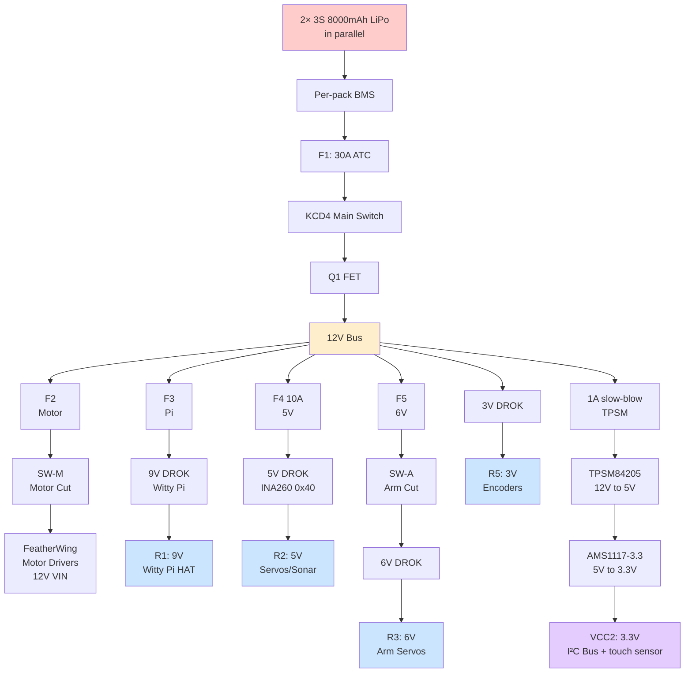
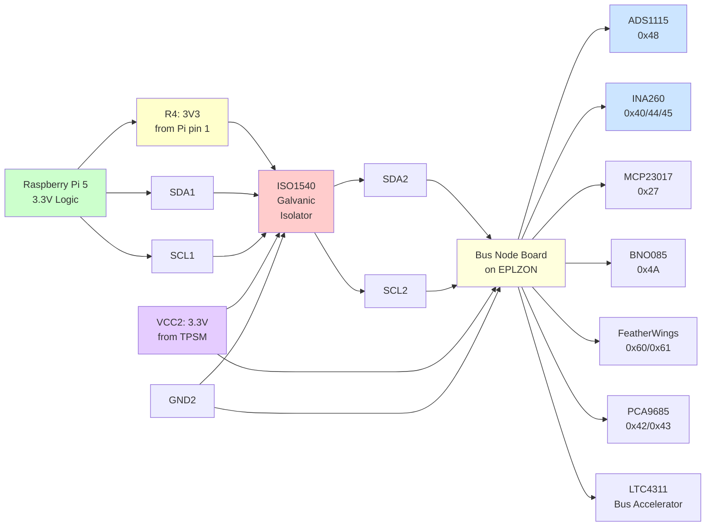
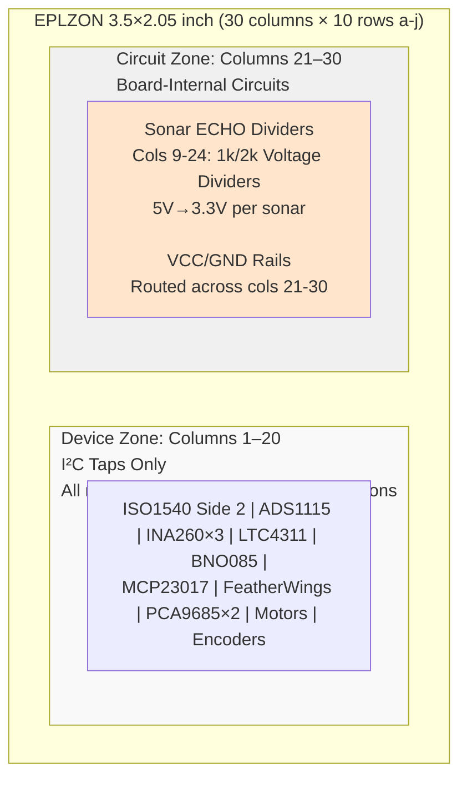
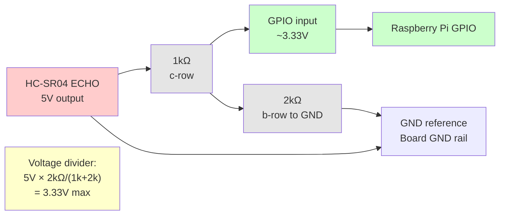

# WildWilly Autonomous Rover

## Master Hardware Design — As-Built

**Revision 2.1 · Current Configuration · 2026-09-14**

---

## Document Control

| Field | Value |
|-------|-------|
| Project | WildWilly Autonomous Rover |
| Document | Master Hardware Design — as-built, current configuration only |
| Revision | 2.1 |
| Date | 2026-09-14 |
| Owner | Howard Himmel |
| Status | Build complete; AI accelerator bonded; live verification in progress. **Filename retains `v2.0` deliberately** — renaming would break every cross-reference in Software Design, the FRD and `CLAUDE.md`. The revision field above is authoritative. |
| Supersedes | As-Built Design Document v1.0 (2026-08-15) |
| Companions | Functional Requirements v3.1; Software Design v1.0 |
| Historical record | Master Engineering Package rev 6.2.0 retains all incident history, superseded designs, and revision lineage. Retain it. |

**Scope of this document.** This describes the rover as it is currently built.
It contains no incident narrative, no superseded design options, and no
revision archaeology. Where a past failure produced a standing rule, the rule
appears in §12 as a constraint — without the story behind it.

**Changes in revision 2.1 (2026-09-11).** A consistency pass against §0. Revision
2.0 carried most of v1.0 forward unchanged, and §0's 2026-09-08 as-built capture then
contradicted a dozen of those carried-forward sections without correcting them. This
revision reconciles them: §1's bus description, §2.2's R1 and R5 rows, §9's pin
assignments, §11.2's device count, §12 rules 2/3/5, §13's verification table, §14
item 6, and six §15 BOM rows. Sections describing removed hardware are struck and
marked rather than deleted, matching the treatment already used in §16.1/§16.2. One
item — whether the 4.7kΩ pull-ups are fitted — is left **disputed pending
measurement** rather than resolved by guesswork; see §0.

**Changes in revision 2.0.** §5.2 rewritten: the AI HAT+ 2 is now PCIe-bonded
and enumerating, and the driver package line that made it fail to bind is
recorded. §13 verification status and §14 open items advanced to the
2026-08-18 state. §17 added: document map and the reference-integrity defect
in `CLAUDE.md`. Everything else is carried forward unchanged from v1.0.

**Scope baseline.** Drive, see, talk/listen, arm pick-and-place on flat ground,
and basic flat-terrain autonomy. Stair-climbing is a stretch goal, not a
baseline requirement.

---

## 0. AS-BUILT 2026-09-08 — READ THIS FIRST

**Sections 2, 3, 4, 16.1 and 16.2 describe a bus architecture that no longer
exists.** They are retained for history and because the reasoning in them is
still instructive, but they are **not** the current build. This section is.

### What was removed

| Part | Status |
|---|---|
| **ISO1540 isolator** | Removed. There is no isolation on the I²C bus. |
| **VCC2 / GND2 isolated rail** | Gone with it. One ground, one 3.3V supply. |
| **AMS1117-3.3** | Removed — touchscreen went back on Pi power, leaving it no consumers. |
| **TPSM84205** | **STILL PHYSICALLY FITTED, but OUT OF SERVICE** — owner-confirmed 2026-09-09: "the TPSM is there, not really used". With no isolated rail it has nothing to supply. It is *not* removed, so do not expect an empty footprint; treat it as dormant hardware. The **TPSM84203EAB** single-stage replacement was never built at all. |
| **F6 polyfuse and the P8 path** | Gone with the power chain. |
| **Seengreat breakout HAT + ribbon** | Removed. |

### Current topology

```
Pi 40-pin header (GP2/GP3)
  ├─ Witty Pi 5 HAT+                      0x51
  └─ GODIY I²C hub ── GODIY I²C hub      (passive, daisy-chained)
        ├─ MCP23017 0x27   (Waveshare board)
        ├─ INA260   0x40 0x44 0x45
        ├─ PCA9685  0x42 0x43              (+0x70 All-Call)
        ├─ ADS1115  0x48
        ├─ BNO085   0x4A
        ├─ FeatherWing 0x60 0x61
        └─ LTC4311 accelerator             (no address, transparent)
```

Both hubs are **passive fan-outs**, so this is **one electrical segment**. There
is no segmentation and no containment: any device holding SDA or SCL low takes
the entire bus down. That happened repeatedly on 2026-09-07/08.

**RESOLVED 2026-09-14 — the 4.7kΩ rail pull-ups are NOT fitted.** Owner-confirmed.
This section previously claimed they were re-fitted, contradicting §3.2 and the §15
BOM, which both said removed. §3.2 and the BOM were right.

The bus therefore runs on the **Pi's own 1.8kΩ pull-ups on GP2/GP3**, plus whatever
the device breakouts carry. That is adequate — see §3.2's recomputation — and the 20
consecutive clean scans confirm it.

A TCA9548A multiplexer (strapped
`0x74`) was bought, wired and proven working during the 2026-09-07/08 debugging,
then removed in favour of this simpler topology — see
`docs/superpowers/specs/2026-09-07-i2c-mux-design.md`, which describes a design
that was **not** built.

### Power rails — four DROK converters

| Rail | Volts | Source | Feeds | Monitor |
|------|-------|--------|-------|---------|
| R1 | **9V** | DROK-Pi | Witty Pi 5 VIN → Pi | **Witty Pi HAT** (no INA260 — corrected 2026-09-15) |
| R2 | 5V | DROK-5V | Steering servos, sonar VCC, Pi screen | INA260 `0x40` |
| R3 | 6V | DROK-6V | Arm servo distribution | — |
| R5 | **3.3V** | DROK-4 | **Motor Hall encoders ONLY** — corrected 2026-09-14 | — |
| — | +12V | Battery via F1/KCD4/Q1 | Both FeatherWing VIN, all DROK inputs | INA260 `0x45` |

⚠ **CORRECTED 2026-09-14 — I²C device logic is fed from the PI'S OWN 3.3V, not
R5.** Owner-stated. Every table in this document said R5 fed "Hall encoders and all
I²C device logic"; it feeds **the encoders only**. Two consequences, both material:

1. **Pi header pin 1 (3V3) is loaded, and always has been.** §5.3, §9 and the struck
   R4 row all said Pi 3V3 had no consumer. Wrong — it powers the whole device bus.
   The breakout HAT therefore **does** need a 3V3 line, which was removed from its
   list on 2026-09-11 in the belief that nothing loaded that pin.
2. **R5 can now be changed without touching the I²C bus.** Since the encoders are its
   only consumer, raising R5 to 5V no longer risks the MCP23017, PCA9685s or anything
   else. That makes the standing encoder-supply hypothesis a *clean* experiment —
   see the warning below §2.2's rails table. The twelve encoder **signal** lines still
   land on a 3.3V MCP23017 whose inputs are not 5V tolerant, so level shifting is
   still required; only the supply question is now separable.

**R5 = 3.3V settles the "3V or 5V — voltage TBD" question open in §2.2 since
2026-08-28.**

⚠ **CORRECTED 2026-09-14.** Two claims here were backwards:

- ~~"the bus does not load the Pi's own 3V3 pin"~~ — **it does.** All I²C device
  logic runs from Pi header pin 1. R5 being 3.3V only means the *encoders* are not on
  that pin.
- ~~"R5 is a single point of failure for the encoders and the entire I²C bus…
  budget six Hall encoders, eleven I²C devices, all bus pull-ups"~~ — **R5 feeds the
  encoders and nothing else.**

**The single point of failure for device logic is Pi header pin 1**, and that is the
budget worth writing down: eleven devices' logic plus the bus pull-ups plus the
SEN0628's <80mA, against a pin the Pi 5 rates for a few hundred mA. Comfortable, but
it is a real rail with a real load — not, as several sections claimed until
2026-09-14, an unused pin.

**R5's own budget is just the six Hall encoders**, which is what makes it safely
changeable (see the note above §2.2's rails table).

### Verified 2026-09-08

Eleven devices plus the `0x70` All-Call broadcast, **20 consecutive scans, zero
bus errors**, stable across power cycles. See §0.1 for the roll-call, which
matches §3.3's table.

### Open hardware items as of 2026-09-08

1. **Battery divider has no +12V feed.** ADS1115 `0x48` is healthy — all four
   channels convert correctly — but A0 reads **0.0146V** against the required
   2.76–3.06V. `brain.py` maps that to ~0.06V, below `BAT_SHUTDOWN_V=10.2`, and
   will perform a controlled shutdown believing the pack is flat.
   `sensors.py`'s guard only catches *failed* reads; a successful read of a real
   zero passes straight through. **Do not enable `willy-rover.service` until A0
   is in band.** The divider was added 2026-09-02.

   ⚠ **CLOSED 2026-09-14 (owner): the divider is fed, its voltages are in spec, and the
   ADS1115 reports real pack voltage.** The 0.0146V reading recorded here was valid when
   taken — the feed had not yet been connected — and the hardware has since been
   completed. The shutdown-on-boot risk described below no longer applies, and the
   service is safe to enable on this account.
   
   Two things remain, neither blocking:
   - ~~**Re-trim `BATTERY_DIVIDER_SCALE` against a meter.**~~ **DONE 2026-09-17: 0.2386 →
     0.3237.** And it was not the "about 1.5% off, low risk" this paragraph predicted — the
     measured ratio is **0.3237, not the designed 0.2423**, a 34% error that was reporting
     15.60V from an 11.5V supply. The fitted divider is not the one §6.2/§16.14 describe
     (~10k/4.7k, not 10k/3.197k). **Meter the actual resistors.**
   - **The software gap stands regardless** — `sensors.py` still cannot tell a real zero
     from a broken sensor, so a *future* divider fault would repeat this silently. See
     Software Design §12 item 13.

   *(An intermediate 2026-09-14 note here diagnosed this as an open circuit — "A0 should
be ~2.9V but reads 0.0146V". That was a theory held for about an hour and is
superseded by the CLOSED note below: the divider is fed and reading correctly. Removed
to avoid two incompatible 2026-09-14 notes in the same item.)*
2. **Encoders unverified.** MCP23017 `0x27` is confirmed healthy (registers
   read/write, internal pull-ups engage, both ports read cleanly). Whether the
   Hall channels actually count is untested — all 16 bits read high at rest,
   which is the pull-ups holding idle lines with nothing driving them. Use
   `~/enctest 20` on the rover and turn each wheel.
3. §14 item 8 — Hall output drive type (push-pull vs open-collector) still
   unknown, and it decides whether 5V encoders would need level shifting at all.
4. **Redesign pending:** the bus node board is to be rebuilt to make room for the
   two GODIY hubs, dropping the TPSM/AMS1117 footprints. The battery divider must
   survive that redesign — and must actually be fed this time.

---

## 1. System Overview

Six-wheel rocker-bogie rover. Independent drive and steering on all six
corners, a 5-DOF arm with gripper, and a Raspberry Pi 5 host with an NPU
accelerator for vision and speech.

| Subsystem | Configuration |
|-----------|---------------|
| Compute | Raspberry Pi 5, AI HAT+ 2 (Hailo-10H, 8GB) |
| Drive | 6 × JGA25-370B gearmotors with quadrature encoders |
| Steering | 6 × GDW DS041MG servos |
| Arm | 7 servos — 4 × MG996R, 3 × MG90S |
| Ranging | 3 × HC-SR04 sonar (front, left, right) |
| Orientation | BNO085 9-DoF IMU with on-chip fusion |
| Vision | Front CSI camera, rear USB camera |
| Power | 2 × 3S 8000mAh LiPo in parallel |
| Bus | **Single non-isolated I²C segment, 11 devices** (see §0). The ISO1540 was removed 2026-09-08 — there is no isolation and no second rail domain |

Physical layout: Pi 5, SI board and audio HAT in the head assembly; power
distribution, bus node board and motor drivers in the body tray.

---

## 2. Power Architecture

> ⚠ **SUPERSEDED 2026-09-08 — see §0.** The P8 isolated-power path is out of
> service: it has nothing to supply now that the isolated rail is gone. Rail
> voltages R1 and R5 have changed. Retained for history.
>
> **Corrected 2026-09-09: "out of service" is not the same as "removed", and §0
> originally said removed.** The TPSM84205 is still physically fitted
> (owner-confirmed) with no consumers. The AMS1117-3.3's only input was the
> TPSM's 5V output, so it cannot be in service either — whether the part is
> still on the board is unconfirmed. Everything below describes how this chain
> worked when it was live.

### 2.1 Distribution tree

| ID | Path | Gauge | Protection |
|----|------|-------|------------|
| P1 | 2 × 3S 8000mAh → hard parallel, per-pack BMS | 12–14 AWG | BMS per pack |
| P2 | Battery+ → F1 → KCD4 switch → Q1 FET → +12V bus | 12 AWG | F1 30A ATC |
| P3 | +12V bus → F2 → **SW-M** → INA260 0x45 → both FeatherWing VIN | 16 AWG | F2 |
| P4 | +12V bus → F3 → Switch 2 → **DROK-Pi** (9V to Witty Pi) | 16 AWG | F3 |
| P5 | +12V bus → F4 → **DROK-5V** input | 16 AWG | F4 10A |
| P6 | +12V bus → F5 → **SW-A** → **DROK-6V** input | 16 AWG | F5 |
| ~~P8~~ | ~~+12V bus → F6 polyfuse (RXEF110 1.1A) → **TPSM84205** (12V→5V) → **AMS1117-3.3** → isolated 3.3V rail (VCC2)~~ **DORMANT since 2026-09-08 (§0):** VCC2 does not exist, so this chain feeds nothing. TPSM still fitted; AMS1117 has no input. Device logic runs from Pi 3V3 (R4) | 20–22 AWG | F6 PTC |
| P7 | Charge Y-cable (main + balance) → battery side of KCD4 | 14 AWG | — |

**Distribution tree diagram:**



### 2.2 Regulated rails

| ID | Rail | Source | Feeds | Monitor |
|----|------|--------|-------|---------|
| R1 | **9V** | **DROK-Pi** buck | Witty Pi 5 VIN (KF350-2P) → Witty Pi → Pi 5 | **Witty Pi HAT monitors its own VIN — no INA260** |
| R2 | 5V | **DROK-5V** buck | Steering servo distribution, sonar VCC, Pi screen | INA260 **0x40** |
| R3 | 6V | **DROK-6V** buck | Arm servo distribution | INA260 **0x44** |
| R5 | **3.3V** | **DROK-4** buck | **Motor Hall encoders (JGA25-370B) ONLY** — corrected 2026-09-14; I²C device logic runs from the Pi's own 3.3V | — |
| **R4** | **3V3** | **Pi header pin 1** | ⚠ **CORRECTED 2026-09-14 — this row was struck as "NO CONSUMER AS-BUILT" and that was WRONG.** Pi 3V3 supplies **all I²C device logic** (owner-stated), and now the SEN0628 as well. It formerly also fed ISO1540 Side 1, which is gone. This is a live rail with a real load and a real budget — the Pi 5's 3V3 pin is good for a few hundred mA, which eleven devices' logic plus pull-ups should sit inside, but it is now a budget that exists | — |
| ~~—~~ | ~~3V3 (VCC2)~~ | ~~Two-stage chain: TPSM84205 → AMS1117-3.3~~ | **OUT OF SERVICE 2026-09-08 (§0).** The isolated bus it fed does not exist. The TPSM is still physically fitted but dormant; the AMS1117 has no input. Struck 2026-09-13 — R4 was struck in rev 2.1 and this row was missed | — |
| — | +12V bus | Battery via F1/KCD4/Q1 | Both FeatherWing VIN (motors) | INA260 **0x45** (P3 monitoring) |
| — | +12V main | Battery via F1/KCD4/Q1 | All four DROK inputs + isolated power chain (P8) | — |

**R1 = 9V — owner-confirmed 2026-09-14, dispute closed.** §0 briefly recorded 9.5V and
rev 2.1 propagated that; it was wrong. `config.py:212`'s "VERIFIED 9.068V", §2.1's P4
row, its diagram and §16.4 were all correct throughout.

⚠ **DROK inventory status — updated 2026-09-11.** Four DROK adjustable units, **all
four now fitted and live** (§0): DROK-Pi (**9V**, R1), DROK-5V (R2), DROK-6V (R3),
DROK-4 (**3.3V**, R5). The rail voltages are settled; the note below is retained only
because one question inside it is still genuinely open.

**Still open: what the encoders themselves want.** R5 is set to 3.3V and also feeds
the encoders **and nothing else** (corrected 2026-09-14), which makes this question
**cleanly testable**: R5 can be changed without risk to any I²C device. Whether these Hall
encoders need 3.3V or 5V is — the vendor part number was never captured, and the
2.83V that killed them is uncomfortably close to 3.3V's lower tolerance. If they turn
out to want 5V, note the MCP23017 runs at 3.3V and its inputs are NOT 5V tolerant, so
moving them is not a rail change but a level-shifting job on twelve signal lines.

⚠ **Isolated rail VCC2 — two-stage power chain (2026-08-28 repair).** ⛔ **OUT OF SERVICE
since 2026-09-08 — re-marked 2026-09-15.** VCC2 was removed with the ISO1540, so this chain
now powers nothing; the TPSM84205 remains physically fitted but dormant and the AMS1117-3.3 has
no input. **I²C device logic runs from the Pi's own 3.3V (R4), and the encoders from R5
(DROK-4).** The failure analysis below is retained because it is still the reason the encoders
died on 2026-08-25 and still governs the §14 thermal-watch item — but nothing it describes is
currently powered.

The 2026-08-25
root cause stands: the old AMS1117-3.3, fed 5.14V from the servo rail, degraded
into thermal foldback and sagged to 2.83V, killing all six Hall encoders. ~~The
repair now installed uses~~ **The 2026-08-28 repair used** a **two-stage chain** to eliminate the dissipation:

- **Stage 1:** +12V bus → F6 polyfuse (RXEF110, 1.1A hold) → **TPSM84205** buck (12V → 5V at ~95% efficiency)
- **Stage 2:** TPSM 5V output → **AMS1117-3.3** (5V → 3.3V at ~80% efficiency, now dropping only ~1.7V at bus current)

The TPSM pre-regulates 12V down to 5V, removing the thermal stress that killed its
predecessor. **CRITICAL:** This chain requires the **TPSM84205** (5V family) — NOT the
84203 (3.3V out) or 84212 (12V out). The AMS1117 needs ≥~4.5V input; a 84203 with
3.3V out would fail. **Verify the part marking before fitting.** The AMS1117 remains
a single-point-of-failure on the isolated bus; its ground pin is the sole GND2 star
reference. Replace if its age or thermal history suggests degradation — use a fresh
part, not the 2026-08-25 casualty.

⚠ **Converter consolidation (2026-08-28).** The FEICHAO 8A UBEC and DZS buck are
retired, replaced by **four DROK adjustable bucks**: DROK-Pi (9V), DROK-5V, DROK-6V,
and DROK-4 (pending specification). Owner's stated reason: reliable, matched components,
one converter per rail. Rail voltages, roles, fuses, and downstream wiring are unchanged.
**DROK-4's set-point and load remain unspecified** — confirm before power-up.

⚠ **ENCODER RAIL VOLTAGE — VERIFY BEFORE POWERING THE ENCODERS.** R5 is recorded
as **3V**. That is *below* the 3.3V minimum this document already gives for these
Hall encoders (see the 2026-08-25 root cause above), and only **170mV above the
2.83V that killed all six of them**. If "3" means 3.3V, fine. If it is literally
3.0V — **note R5 is now set to 3.3V and settled (§0, and the table above), so this
paragraph describes a risk that has been addressed, not a live setting** — this
reproduces the original failure exactly: the encoders would sit
powered-but-inoperative while every I²C device on the bus tests healthy, which is
the signature that cost days to diagnose. **Meter the rail before connecting the
encoders, and settle the still-open question of whether these encoders want 3.3V
or 5V** — the vendor part number was never recorded. If they want 4.5V+, R5 is
the wrong rail regardless of how it measures.

Moving the encoders off VCC2 onto R5 frees six GND and six 3V3 taps in §4.1 rows
15–20; strike those rows once R5 is confirmed.

⚠ **R4 corrected 2026-08-25 (owner).** This table previously listed encoder
distribution on R4, the Pi's own 3V3 header pin. That is wrong as-built: **the
encoders are powered from the same rail as the MCP23017 expander that reads
them**, so they share a reference. As-built that rail is **R5, the DROK-4 3.3V
supply** (§0) — the text below says "isolated bus rail (VCC2/GND2)", which was true
before 2026-09-08 and is retained because the *point* it makes still stands. Header
pin 1 now feeds nothing at all.

The distinction matters and cost real time on 2026-08-25. If the encoders had
been on R4, they would have been driving GND1-referenced signals into
GND2-referenced expander inputs across a barrier §3.1 requires to have no DC
path — which would have neatly explained all six encoders reading static. They
are not, sensors and expander share a reference, and that explanation is void.

**ROOT CAUSE FOUND 2026-08-25: the AMS1117-3.3 has failed and the isolated rail
sits at 2.83V.** Measured that day: input 5.143V (healthy, from R2), output
**2.83V** against a 3.3V target. An AMS1117-3.3 fed 5.14V has ample headroom —
dropout is only ~1.1–1.3V — so producing 2.83V means the part is degraded, not
starved. This is the thermal foldback this document already warns about in §12
("the dissipation drives it into thermal foldback and the isolated rail
collapses progressively"), now measured rather than predicted.

**Why this killed the encoders and nothing else.** Every I²C device on that rail
has enough headroom to keep working at 2.83V — MCP23017 down to 1.8V, PCA9685 to
2.3V, INA260 to 2.7V. Hall encoders typically need 3.3V minimum and often 4.5V.
So the bus, the expander and the current monitors all test perfectly healthy
while all six Hall sensors sit powered-but-inoperative, holding a static output
they have not the supply to switch. That is exactly the measured signature, and
it is the only hypothesis tried that explains all six failing identically.

**Repair: TPSM84205 pre-regulator fitted ahead of the AMS1117-3.3 — installed
and functioning, owner-confirmed 2026-09-07.** The chain is now two-stage
(§3, §16.2): +12V → F6 → TPSM84205 (12V→5V) → AMS1117-3.3 (5V→3.3V) → VCC2.

> **Superseded plan — do not build.** An earlier 2026-08-28 revision of this
> document proposed replacing the AMS1117-3.3 outright with a single-stage
> **TPSM84203EAB** (12V→3.3V), and several sections were written as though that
> had happened. It was not built. The AMS1117-3.3 is still in service and is
> still the final stage. Corrected throughout 2026-09-07; if you find a
> surviving reference to a single-stage 84203 anywhere, it is stale.

One item still to settle:
establish whether these encoders want 3.3V or 5V — the vendor part number was
never recorded, and JGA25-370 spans variants with both. If they need 5V the
module must be set for 5V AND the twelve signal lines need level shifting, since
the MCP23017 runs at 3.3V and its inputs are NOT 5V tolerant (abs max ~VDD+0.6V).
That decision is far cheaper before installation than after.

---

**Superseded investigation notes (kept for the reasoning, which generalises).** Established by
measurement that day: the MCP23017 is alive and correctly configured (IODIR
0xFF, GPPU 0xFF, sensible mixed resting levels per wheel), the I²C bus is
healthy, and all six motors physically turn (0.068–0.099 A each). Yet driving
any wheel produces no edges on any encoder pin, where ~340 would be expected
over a 2.5s drive at 0.6 duty. Hand-turning a wheel produces nothing at all —
the encoder is on the motor shaft behind the 17.1:1 gearbox and does not
back-drive, so any encoder test on this rover must be taken under power.

The next measurement is at the motor, not in software: probe a yellow/green
signal wire at the motor's own connector while that motor is driven. Toggling
there means the sensor works and the signal is lost between connector and
expander; static there means the sensors are not producing output despite
having power.

**R1 changed 2026-08-23/24.** It was "5.0–5.1V, Pi buck → Pi header pins 2/4,
monitored by INA260 0x44." The Pi is no longer fed that way: the DROK buck now
supplies 9V into Witty Pi's VIN terminal, and Witty Pi supplies the Pi. ~~Its
monitor is 0x45, not 0x44 — see §16.4 for the live measurements confirming this
and the 0x44/0x45 transposition that was corrected at the same time.~~
**CORRECTED 2026-09-15: R1 has no INA260 at all.** The Witty Pi HAT monitors its own VIN.
0x45 was relocated onto the +12V bus (reads 11.174V) and 0x44 onto the 6V arm rail
(reads 6.043V).

Set each DROK off-load before connecting anything downstream: **9V** rail to the
Witty Pi's input spec, **5V** to 5.0–5.1V, **6V** to 6.0V, **3V** per the warning
above. These are adjustable trimpot modules — re-verify after any knock, and note
that the 5V setting directly sets the sonar ECHO divider outputs (§16.13).

**Witty Pi 5 power feed — reworked 2026-08-23.** Witty Pi 5 (real-time
clock + power management HAT, sits between the +12V/battery side and the Pi's
own 5V input; see §15.6 for physical placement) was originally fed via its
USB-C VUSB input at ~5V. That path measured a real, consistent ~0.3V loss
between Witty Pi's own output and the Pi's PMIC input (`vcgencmd
pmic_read_adc EXT5V_V`), enough to trip under-voltage during a voice-command
current spike. **Re-fed via Witty Pi's VIN screw terminal (KF350-2P,
documented 6–30V input, 5A output) from a DROK adjustable buck set to ~9V**
instead — a separate unit from the Pi-rail buck in item 7 of §14's Open
Items list; do not conflate the two without physically confirming they're
the same part. Higher input voltage means proportionally lower input
current for the same power draw, which reduces the same-resistance voltage
loss. Witty Pi's low-voltage cutoff (`wp5` menu option 7) was moved from
4.5V to **8.0V** to match — the old value was set against a ~5V input and
was effectively inert against a 9V one. Live-measured after the change:
V-IN ~9.0–9.2V, V-OUT ~5.4V (up from the USB-fed path's mid-4V range at the
Pi's own input). Effectiveness of this change in isolation is not yet fully
confirmed independent of the I²C fault below, which was found and partially
addressed around the same time.

### 2.3 Protection

- **F1** 30A ATC main fuse, off-board. **F2–F5** branch fuses.
- **Q1** FQP27P06 P-channel MOSFET for reverse polarity, with a 220nF
  gate-source cap limiting turn-on inrush.
- **D1** P6KE15A TVS for transients.
- Dual 3S BMS, one per pack.
- Latching mushroom E-stop cuts motors and arm.
- **SW-M and SW-A — added 2026-08-23, closing FRD v3.1 G-1.** Two dedicated
  physical switches, placed directly in the distribution tree (§2.1): **SW-M**
  in P3, between F2 and both FeatherWing motor drivers; **SW-A**
  in P6, between F5 and the **6V DROK** input (arm servo supply, R3). Relationship
  to the existing latching mushroom E-stop above — **replaces it, is driven by
  it, or is fully independent — not yet confirmed, owner to specify.**
  SW-M's placement was chosen so the motor side of G-1 would be observable
  through the current monitor then sitting downstream of it (0x44). ~~**That no
  longer holds** — 0x44 moved to the +12V main input on 2026-08-28, upstream
  of SW-M, so a motor cut is invisible to it again. See the G-1 regression in
  §16.4.~~ ✅ **Observable again as of 2026-09-15**, via **0x45** on the +12V bus
  downstream of SW-M; `brain.py::_check_motor_rail()` reads it.
  ~~SW-A's side (P6/R3) still has no
  current monitor, so it needs either a new INA260 or a direct switch-state
  sense to be observable in software.~~
  ⚠ **SW-A's side now DOES have a monitor — opportunity, not yet taken (2026-09-15).**
  **INA260 0x44 sits on R3**, the 6V arm servo rail. SW-A cuts the 6V DROK's *input*, so
  throwing it collapses R3 and 0x44 would read the drop. That makes the **arm** side of G-1
  observable in software for the first time, by the same mechanism `_check_motor_rail()`
  already uses for motors — no new hardware required. Not implemented: it needs its own
  threshold (R3 idles at 6.043V, so the motor rail's 6.0V figure is unusable here) and an
  owner decision on whether an arm-power cut should log, warn, or do nothing.
- **Switch 2** in the Pi buck input line — de-powers the Pi and the 3V3 bus
  after a software shutdown.

> ~~**UNVERIFIED as of 2026-08-28.** This regression assumes the device moving to
> the 12V input is 0x44. The owner subsequently described the three monitors by
> *rail* as Pi / UBEC 5V / DZS 6V, with the 5V and 6V staying put — which makes
> the **Pi-rail** monitor the one that moves, and this regression spurious. That
> conflicts with `config.py`'s measured 0x44 = 11.373V on the motor bus. Resolve
> by reading bus voltage at 0x40/0x44/0x45 before treating this as fact.~~
>
> ✅ **RESOLVED 2026-09-15 by doing what the note asked** — a live bus-voltage read at all three
> addresses instead of a quoted figure: **0x40 = 4.986V (R2 5V), 0x44 = 6.043V (R3 6V arm),
> 0x45 = 11.174V (+12V bus)**, owner-confirmed, pack metered at 11.36V.
>
> Note which source turned out to be right. **The owner's rail-based description named a 6V
> monitor, and there is one.** It was overruled by a `config.py` measurement that was accurate
> when taken and had since been invalidated by a physical relocation. A stored measurement is a
> historical claim, not a live one.


### 2.4 Capacitors — complete list

| Qty | Value | Location |
|-----|-------|----------|
| 1 | 220nF | Q1 gate-source soft-start |
| 1 | 1000µF 16V + 1 × 0.1µF ceramic | Pi 5V rail, at header pins 2+4 |
| 1 | 1000µF 16V | PCA9685 0x42 V+, C2 pad |
| 1 | 2200µF 16V Rubycon low-ESR | PCA9685 0x43 V+, C2 pad |
| 1 | 10µF ceramic **50V** | Bus node C1 — TPSM Cin, `c25c`↔`c26c` |
| 2 | 47µF ceramic ≥1210 | Bus node C2/C3 — TPSM Cout pair, `c27c`↔`c28c` and `c27e`↔`c28e` |
| 1 | 47µF/35V radial electrolytic | Bus node C6 — 12V input bulk, `c26a`↔`G26`, stripe (−) up |
| 2 | 10µF ceramic 25V | Bus node C4/C5 — 3V3 rail decoupling, `V29`↔`G29` and `V30`↔`G30` |
| *opt* | 0.1µF ceramic | Bus node C7 — HF decoupler, `V26`↔`G28` diagonal |

Eleven capacitors total on the bus node board, twelve with the optional HF
decoupler. **The two 10µF AMS1117 caps do NOT retire** — corrected 2026-09-07.
An earlier revision said they retired "with the part", on the assumption the
AMS1117-3.3 was being replaced by a single-stage TPSM84203EAB. That replacement
was never built: the AMS1117 is still stage 2 (§16.2), so its Vin and Vout
decoupling is still required and is listed separately in the BOM (§15).

**Cout is not optional.** TI specifies a 94µF ceramic minimum (2×47µF) on the
TPSM output; a single 10µF there will oscillate. C4/C5 sit downstream on the
rail and do not count toward it. C6 is why the TPSM feed takes a **slow-blow**
fuse — inrush charging it trips a fast-blow.

Original note: The Pi-rail pair sits at the **header end** of the
feed, not at the buck — GPIO power bypasses the Pi's onboard input
protection, so that feed carries its own local decoupling and its own fuse.

### 2.5 Voltage limits

| Rail | Nominal | Floor |
|------|---------|-------|
| Pi 5V | 5.0–5.1V | 4.85V |
| Pack | 12.6V full, 11.1V nominal | 10.2V cutoff |

Charge to 12.6V (4.20V/cell). Storage charge 11.4V (3.8V/cell). Packs must be
within 0.05V per cell of each other before paralleling — connect the main Y
first, the balance Y a minute later.

---

## 3. I²C Bus and Isolation

> ⚠ **SUPERSEDED 2026-09-08 — see §0.** The ISO1540 is removed; there is no
> isolation, no Side 1/Side 2, no VCC2 and no GND2. The bus is one segment on
> the Pi's own I²C via two passive hubs. The roll-call in §3.3 is still
> correct. Retained for history.

### 3.1 Topology — ⛔ REMOVED HARDWARE, HISTORICAL RECORD ONLY

> **EVERYTHING IN §3.1 DESCRIBES PARTS THAT ARE NO LONGER IN THE ROVER.** Re-marked
> 2026-09-15 because §3's banner was not enough: the text below was written in the present
> tense, so every paragraph and both diagrams went on asserting a live topology, and a reader
> landing here from a search had no way to tell. That is this project's dominant documentation
> defect — *correct writing left in place* — and a banner two headings up does not fix it.
>
> **AS-BUILT, and the only thing to design against: see §0 and the §3.3 roll-call.** One
> non-isolated I²C segment on the Pi's own `/dev/i2c-1`, via two passive GODIY hubs. **No
> ISO1540. No Side 1 / Side 2. No VCC2. No GND2.** Device logic runs from the **Pi's own 3.3V**
> (header pin 1, rail R4). The TPSM84205 is still physically fitted but dormant; the AMS1117-3.3
> has no input and is out of service.
>
> Kept rather than deleted because it is the only record of why the parts were fitted, and
> §16's fault history refers back to it.

~~The Pi's I²C controller (GND1 domain) is separated from every device (GND2
domain) by an ISO1540 bidirectional isolator. Side 2 is powered by a
**two-stage power chain** (updated 2026-08-28):~~

**As it WAS, until 2026-09-08:** the Pi's I²C controller (GND1 domain) *was* separated from
every device (GND2 domain) by an ISO1540 bidirectional isolator, and Side 2 *was* powered by a
two-stage chain:

- **+12V bus → F6 polyfuse → TPSM84205 (5V out) → AMS1117-3.3 (3.3V out) → VCC2 rail**

This two-stage design eliminates the thermal dissipation that caused the 2026-08-25
failure: the TPSM buck (~95% efficient) pre-regulates 12V to 5V, leaving the
AMS1117 to drop only ~1.7V at bus current instead of the previous ~1.9V at servo
load, which triggered thermal foldback. The isolated bus is now independent of the
servo rail and comes up with base 12V power.

```
Pi native I²C (GND1)      ISO1540        Isolated bus (GND2)
─────────────────────────────────────────────────────────────
GP2  SDA  ──────────>  Side 1 ‖ Side 2  ──────────>  SDA2 rail
GP3  SCL  ──────────>  Side 1 ‖ Side 2  ──────────>  SCL2 rail
3V3       ──────────>  Side 1 ‖ Side 2  <──────────  AMS1117-3.3 out
GND       ──────────>  Side 1 ‖ Side 2  ──────────>  GND2 star
```

**Isolation topology diagram:**



GND2's reference is the bus node board's GND rail, tied at the TPSM ground pin
(`c27b` → `c27a` → `G27`).

> ⚠ **GND1 and GND2 are not galvanically separate, and never have been.**
> Earlier revisions of this document asserted "the two ground domains must show
> no DC path between them." That is not achievable with this topology, for
> three independent reasons:
>
> 1. **A non-isolated regulator cannot create a ground domain.** The AMS1117's
>    GND pin was common to its input and output, so GND2 was tied to the 5V
>    rail's ground — i.e. GND1 — the whole time. The TPSM is a non-isolated buck
>    and behaves the same way.
> 2. **The star-ground bond** (§4.1 row 1) deliberately ties the board GND rail
>    to the system star point.
> 3. **The six sonar GPIO wires** (§16.13) cross the barrier by design, and the
>    ECHO divider bottoms reference the board GND rail that the Pi then reads
>    against its own ground.
>
> The ISO1540 provides **common-mode noise rejection on the I²C lines**, which
> is real and worth having. It is not a safety barrier and must not be relied on
> as one. Corrected 2026-08-28.

**Fault found and partially fixed, 2026-08-23.** The power wire to this
isolated-side 3V3 rail (VCC2, from the AMS1117 above) had come loose,
taking down the entire isolated bus — every device on it (encoders, IMU,
ADC, both PCA9685s, all three INA260 current monitors) stopped responding
simultaneously, while Witty Pi (a separate power domain via its own VIN
feed, not on this isolated 3V3 rail) kept working throughout, which is what
made the fault pattern legible. Reseated; `i2cdetect` confirmed the full bus
enumerating again (`0x27, 0x40/0x42/0x43/0x44/0x45, 0x48, 0x4a, 0x51, 0x60,
0x61, 0x70`) after the reseat. **Permanent fix (hot glue on the connection)
still pending** as of this checkpoint — the connection worked its way loose
once already and should be treated as provisional until secured. One
current monitor (`0x40`) was still intermittently failing self-test after
the reseat; worth confirming it holds before calling this fully closed.

### 3.2 Pull-ups

⚠ **The Side-2 4.7kΩ rail pull-ups (R1/R2) have been REMOVED from the board.**
Recorded 2026-09-07, on the owner's report that a previous Claude session
directed their removal. The date and the stated reason were not written down at
the time, and nothing in this repository recorded the change until now — every
table below described a board that no longer existed.

### RECOMPUTED 2026-09-14 — the ISO1540's removal changed the answer

Everything below this heading was written for a two-sided bus and was never
recomputed when the isolator came out on 2026-09-08. **It is not a naming problem;
the electrical conclusion changes.**

**There is one segment, and the Pi's own pull-ups are now on all of it.** The Pi 5
carries physical **1.8kΩ** pull-ups on GP2/GP3. Those used to sit on Side 1, isolated
from every device. With the ISO1540 gone and the hubs hanging straight off the header,
they pull up the entire bus.

| Source | Value | Present? |
|--------|-------|----------|
| **Pi internal, GP2/GP3** | **1.8kΩ** | **Yes — on the board, always** |
| ~~ISO1540 onboard~~ | ~~10kΩ × 2~~ | **Gone with the part, 2026-09-08** |
| ~~4.7kΩ rail pair (R1/R2)~~ | ~~4.7kΩ~~ | **NOT FITTED — owner-confirmed 2026-09-14.** Removed 2026-09-07; §0's contrary claim is withdrawn |
| Device breakouts | typically 10kΩ each | Uncatalogued; in parallel they only strengthen the total |

**At 1.8kΩ alone the bus is comfortably fine**, which is the point the old text could
not reach:

| Pull-up | RC at 400pF | ~3τ to threshold | vs the 10µs bit |
|---|---|---|---|
| **1.8kΩ (Pi alone, as-built)** | **0.72µs** | **~2.2µs** | **fine** |
| 1.3kΩ (old Side-2 figure) | 0.52µs | ~1.6µs | fine |
| 10kΩ | 4µs | ~12µs | exceeds the bit — bus dead |

**And it is empirically confirmed.** §0 records eleven devices across 20 consecutive
scans with zero bus errors on 2026-09-08, stable across power cycles. A bus with
inadequate pull-ups does not do that.

**The 4.7kΩ question is CLOSED (owner-confirmed 2026-09-14): they are not fitted.**
The bus runs on the Pi's 1.8kΩ plus uncatalogued breakout pull-ups — comfortably
adequate, and confirmed by 20 consecutive clean scans. Sink current from the Pi's pair
alone is ~1.8mA against the ~3mA a device is specced for, so there is headroom but not
a lot: **do not add pull-ups anywhere without measuring the combined value first.**

**The old warning about not adding pull-ups is now the general case.** It said "do not
add pull-ups on Side 1 — that side sinks only 3.5mA". There is no Side 1; the
constraint applies to the whole bus, and the Pi's 1.8kΩ is already most of the budget.
**Do not add pull-ups anywhere without measuring first.**

The LTC4311 still earns its place at this cabling capacitance, and confirming it is
fitted and enabled (§16.5) is still worth doing — but the bus is not depending on it
to survive, as the text below assumed.

---

*Everything below is retained as the pre-2026-09-08 analysis. It describes a
two-sided bus that no longer exists.*

| Location | Value |
|----------|-------|
| Side 1 | Pi internal 1.8kΩ + ISO1540 onboard 10kΩ |
| Side 2 | ISO1540 onboard 10kΩ + device breakouts — **the 4.7kΩ rail pair is gone** |

**The combined Side-2 resistance is now unmeasured.** It was ~1.3kΩ with the
rail pair fitted. Without it the value depends entirely on how many device
breakouts still carry their own pull-ups, which has never been catalogued.

~~Do not add pull-ups on Side 1 — that side sinks only 3.5mA and is already near
budget.~~ Superseded by the whole-bus statement above.

**Why removing them can be correct.** Combined 1.3kΩ at 3.3V draws ~2.5mA
against the 3mA I²C sink budget, which is tight; and an LTC4311 supplies the
fast edge actively, so strong static pull-ups work against it rather than with
it. Removal is a defensible change **provided the LTC4311 is fitted and
enabled**. This reasoning is reconstructed, not a record of the original intent.

⚠ ~~**Without the accelerator it is a bus-killer, and that is a live hypothesis
for the 2026-09-07 fault.**~~ **WEAKENED 2026-09-14** — that hypothesis assumed the
devices were isolated from the Pi's 1.8kΩ pull-ups. Since 2026-09-08 they are not. The
original text follows: 4.7kΩ at 400kHz supports only ~75pF; twelve taps on
drop cables is 300–400pF. At the 100kHz this bus actually runs, one bit is 10µs:

| Side-2 pull-up | RC at 400pF | ~3τ to threshold | vs 10µs bit |
|---|---|---|---|
| 1.3kΩ (as previously documented) | 0.52µs | ~1.6µs | fine |
| ~2kΩ (breakouts still populated) | 0.8µs | ~2.4µs | fine |
| 10kΩ (ISO1540 alone) | 4µs | ~12µs | **exceeds the bit — bus dead** |

**Confirm the LTC4311 is still fitted and enabled (§16.5)** before treating the
removal as safe. See §14 for the open item.

### 3.3 Device roll-call

`i2cdetect -y 1` returns **eleven devices plus one broadcast address** — the
ten below plus the Witty Pi 5 HAT+ at `0x51`, which sits on the Pi header
rather than this bus. Verified 2026-09-08 across 20 consecutive scans with
zero bus errors. Expect eleven, not twelve: `0x70` is All-Call, not a device.

| Address | Device | Function |
|---------|--------|----------|
| 0x27 | MCP23017 | Encoder GPIO expander, 6 channels |
| 0x40 | INA260 | 5V servo/steering rail current |
| 0x42 | PCA9685 | Steering servos, CH0–CH5 |
| 0x43 | PCA9685 | Arm servos, CH0–CH6 (CH7 unused, remapped 2026-09-06) |
| 0x44 | INA260 | **R3, 6V arm servo rail** — corrected 2026-09-15 (was recorded as +12V main) |
| 0x45 | INA260 | **+12V bus → both FeatherWing VIN** — corrected 2026-09-15 (was recorded as the 9V Pi feed). **Board rebuilt with new parts 2026-09-17** after it stopped ACKing entirely (20/20 direct reads failed while every other address answered); reads 11.364V @ 0.019A since, and identifies correctly as TI/INA260 (`MfgID 0x5449`, `DieID 0x2270`) |
| 0x48 | ADS1115 | Battery voltage ADC |
| 0x4A | BNO085 | 9-DoF IMU |
| 0x60 | FeatherWing | Motor driver, LEFT |
| 0x61 | FeatherWing | Motor driver, RIGHT |

**0x70 is the PCA9685 All-Call broadcast address, not a device.** It answers
whenever either PCA9685 is alive. The LTC4311 bus accelerator has no address
at all — it is a transparent pass-through and never appears in a scan.

⚠ **REVERSED 2026-09-14 — a blank scan on USB-C power is now a FAULT, not expected.**
This said a blank or partial scan with the base unpowered was normal, because "Side 2
dies with the 12V chain, so the Pi on USB-C alone sees nothing". That was true when
device logic came off the isolated rail. **It does not any more: device logic runs
from the Pi's own 3.3V, so a USB-C-powered Pi powers the whole device bus.** Expect a
full eleven-device roll-call on USB-C alone. A blank scan means a real bus fault.

What *does* still change with the base unpowered is anything drawing from the 12V
rails — the FeatherWings' motor supply, the servo rails, the encoders on R5 — so
devices will answer while their loads are dead.

---

## 4. Bus Node Board

> ⚠ **SUPERSEDED 2026-09-08 — see §0.** This board is being redesigned to
> house the two GODIY hubs and to drop the TPSM/AMS1117 footprints. The
> battery divider is the one part that must carry forward — and must be fed.

An **EPLZON 3.5"×2.05" (88.9×52.1mm) gold-plated solderable breadboard**,
30 columns × 0.1", M3 corner mounts. Rev 3.4, 2026-08-28. It carries two
functions: I²C bus distribution and the three sonar ECHO dividers. The isolated
bus power chain (TPSM84205 → AMS1117-3.3) is now external in the P8 path (§2.1),
not on the board.

```
TOP RAILS      row 1: +3.3V    row 2: GND      (30 holes each, column-aligned)
rows a-e       5-hole tie-strips per column
CENTER GAP     breaks the column strips
rows f-j       5-hole tie-strips per column
BOTTOM RAILS   row 1: SDA      row 2: SCL      (30 holes each)
```

**Board layout diagram:**



Per column, `a-e` is one net and `f-j` is a separate net; the centre gap breaks
them. Adjacent columns are not connected. Rails run continuously across all 30
holes.

**Rules.** One lead or wire per hole — never reuse a hole. Components mount
horizontally across columns; vertical runs are rail connections only.

**Zones.** Rail cols **1–20** are the device zone — external I²C connections
only, all taps interchangeable. Cols **21–30** are the circuit zone, where every
board-internal jumper lands.

> **The SDA/SCL separation depends entirely on the centre gap breaking column
> 30.** Meter `c30e`↔`c30f` as OPEN on the bare board before soldering anything
> (§4.5). If that gap does not break the strip, SDA shorts to SCL and the bus is
> dead on arrival.

### 4.1 Device-zone tap allocation — cols 1–20

Colours: GND black, 3V3 red, SDA blue, SCL yellow. This is schematic
role-colouring and differs from the sonar harness key in §6.1.

| Row | GND | 3V3 | SDA | SCL | Device | Addr |
|-----|-----|-----|-----|-----|--------|------|
| 1 | X | — | — | — | Star-ground bond — board GND rail ↔ system star point | — |
| ~~2~~ | ~~X~~ | ~~X~~ | ~~X~~ | ~~X~~ | ~~ISO1540 Side 2~~ **REMOVED 2026-09-08 — column 2 is free** | — |
| 3 | X | X | X | X | ADS1115 logic | 0x48 |
| 4 | X | — | — | — | ADS1115 ADDR→GND | 0x48 |
| 5 | X | X | X | X | INA260 servo/steering | 0x40 |
| 6 | X | X | X | X | INA260 **6V arm rail (R3)** | 0x44 |
| 7 | X | X | X | X | INA260 **+12V bus** | 0x45 |
| 8 | X | X | X | X | LTC4311 | none |
| 9 | X | X | X | X | BNO085 IMU | 0x4A |
| 10 | X | X | X | X | MCP23017 encoder | 0x27 |
| 11 | X | X | X | X | FeatherWing LEFT | 0x60 |
| 12 | X | X | X | X | FeatherWing RIGHT | 0x61 |
| 13 | X | X | X | X | PCA9685 steering | 0x42 |
| 14 | X | X | X | X | PCA9685 arm | 0x43 |
| 15 | X | X | — | — | Motor LF | — |
| 16 | X | X | — | — | Motor LM | — |
| 17 | X | X | — | — | Motor LR | — |
| 18 | X | X | — | — | Motor RF | — |
| 19 | X | X | — | — | Motor RM | — |
| 20 | X | X | — | — | Motor RR | — |
| 21 | X | — | — | — | Sonar divider GND ref — **circuit zone** `G22`/`G23`/`G24` (§4.2) | — |

**Power regulators are now external.** The isolated-bus power chain (TPSM84205 → AMS1117-3.3)
is in the P8 path (§2.1, §3), no longer on the board. Row 1 is allocated to the
star-ground bond, which ties the board GND rail to the system star point.

**Devices taking more than one rail tap:** ADS1115 only, whose second tap is a
GND for the ADDR strap selecting 0x48.

**Single-tap devices worth noting.** The BNO085 takes four connections only —
the Adafruit breakout has no AD0 pin, and its address-select pin (DI) is
pulled low on-board, fixing it at 0x4A. The LTC4311 also takes four — its EN
pin is already pulled high to VIN on the breakout.

**Tap budget.** Twelve four-wire taps (ten addressed devices, ISO1540 side 2,
LTC4311), plus the ADS1115 ADDR strap and the star-ground bond, against 20 holes
per rail. **GND is the binding constraint** — a device needs all four rails, so
expansion is GND-limited. Rows 15–20 are pending the encoder-rail open item in
§2.2.

### 4.2 Circuit zone — cols 21–30

| Rail | Allocation |
|---|---|
| **+3.3V** | `V25` LED feed · `V27` TPSM output · `V29`/`V30` C4/C5. **Free: V21–V24, V26, and V28** — V28 was R1's supply until the pull-ups were removed (§3.2) |
| **+12V** | `V21` battery divider R3 high side (external 12V feed) |
| **GND** | `G21` ISO 2nd return · `G22` battery divider midpoint + sonar div ref · `G23`/`G24` sonar div grounds · `G25`/`G27` power block · `G26` C6 (−) · `G29`/`G30` C4/C5. **Free: G28 only** |
| **SDA** | col 30 — *(was R1 pull-up output; vacant since the pull-ups were removed, §3.2)*; col 22 — battery divider midpoint → ADS1115 A0 |
| **SCL** | col 30 — *(was R2 pull-up output; vacant since the pull-ups were removed, §3.2)* |

Board furniture, by block:

- **Power block, cols 25–28 top** — TPSM, C1, C2, C3, C6, P2 input. §16.2.
- **Rail caps, cols 29–30** — the 3.3V bridge, C4, C5. R1/R2 previously sat here and are removed (§3.2), so cols 29–30 are now largely free.
- **Battery voltage divider, cols 21–24 top** — **NEW (2026-09-02):** R3/R4 (10kΩ + 10kΩ∥4.7kΩ) 
  measure +12V bus → ADS1115 A0. R3 `c21c`↔`c22c`, R4 `c22b`↔`c23b`, midpoint tap 
  `c22f`→ADS row 3 A0 input, ground via `G22`. Accounts for the full battery voltage across 
  shutdown/safe/rth/warn tiers (§13.2). **12V input:** external P8 12V feed to col 21 top.
- **Power LED, cols 24–26 bottom** — feed `c25f`→`V25`; anode `c25g` ↔ cathode
  `c26g`; R9 1kΩ `c26i`↔`c24i` (0.2" span, keep `c25i` clear); ground via the
  c24 bottom strip, already tied to `G24` by the RIGHT divider return. ~1.3mA.
  It exists to make the "devices dark on USB-C-only" state visible at a glance.
- **Sonar dividers, cols 9–24 bottom** — §16.13.
- **ISO1540 side-2 drop, col 12** — §16.1.

C6 occupies `G26`, so no vertical +3.3V/GND rail pair remains free. The optional
HF decoupler (§2.4) fits diagonally as `V26`↔`G28`, 0.2" with bent leads.

### 4.3 Wire list — 12 jumpers

`c25a`→`G25` · `c27a`→`G27` · `c28a`→`V27` · `c29a`→`V28` · `c29d`↕`c29f` ·
`c30e`→`SDA30` · `c30j`→`SCL30` · `c25f`→`V25` · `c12f`→`G22` · `c12g`→`G21` ·
`c18f`→`G23` · `c24f`→`G24`

Plus the ISO1540 **VCC2** wire to one open +3.3V device-zone tap — pick a
specific tap and record it in §4.1.

The TPSM feeds `V27`. R1 previously tapped `V28`, one column apart so the two
3.3V diagonals run parallel and never cross. The three divider-ground runs are
insulated wire crossing cols 12–24 *over* the board — under a wire, not
occupied; those holes remain usable.

### 4.4 Free space

- **Top strips:** `c1`–`c24` entirely free. c25–c28 power block; c29/c30 partial.
- **Bottom strips:** `c1`–`c8`, `c13`, `c14`, `c19`, `c20`, `c27`–`c28` free.
  Everything else partial.

### 4.5 Build order and verification

**Before soldering anything:**

1. Meter the bare board. `c30e`↔`c30f` must be **OPEN** — repeat on 2–3 random
   columns. Confirm 4 rails = 4 independent nets, each continuous across 30 holes.
2. Confirm TPSM pin order against the physical part, face-on (§12 rule 3 applies
   — orientation errors on this rover have cost real time).
3. **Dry-fit C6 before soldering — the constraint is body diameter, not lead
   pitch.** Electrolytic leads bend easily over this span, so a 2.5mm or 5mm
   part will both seat between `c26a` and `G26` whichever way that gap measures.
   What does not bend is the can: at 6.3mm diameter its 3.15mm radius covers
   `c25a` and `c27a`, 2.54mm away on either side, and an 8mm can also crowds the
   TPSM body at `c26b` one pitch over. This is why the row-a jumpers go in first
   (step 4). Confirm ceramic lead pitch separately, 2.54mm vs 5mm.

**Assembly:**

4. Power block — **row-a jumpers first**, then P2, C1, TPSM, C2, C3, **C6 last**.
   A 6.3mm can at `c26a` has a 3.15mm radius and its neighbours sit 2.54mm away,
   so it covers both jumper holes. Bring up on a bench supply with the current
   limit at ~200mA: expect 3.3V ±0.1V at `V27` **and** at rail col 1 (far end),
   and the LED lit.
5. C4/C5, the bridge, and the optional `V26`⇔`G28` decoupler. **The R1/R2 pull-ups are no longer fitted** (§3.2) — do not re-add them without first confirming the LTC4311 and measuring combined Side-2 resistance.
   SDA/SCL idle ~3.3V.
6. Sonar section — headers, dividers, GPIO pins, ground wires. 5V on the ECHO
   pins must give 3.2–3.4V at the junctions.
7. ISO side-2 drop pins. Continuity `c12j`↔GND rail. No +3.3V↔GND continuity
   (the caps charge, then it opens).
8. Connect the ISO module, the LTC4311 (shortest leads — §16.5), and the
   devices → `i2cdetect` roll-call per §3.3.

---

## 5. Compute and Interfaces

### 5.1 Raspberry Pi 5

Powered through the GPIO header from the Pi buck, not USB-C. The GPIO path
bypasses the Pi's onboard input protection, so brownout protection is
**not implemented in software at all.** Earlier revisions of this document
claimed it was "firmware-only, via the INA260 at 0x44"; no such code exists
(`safety.py` has no INA260 logic; `config.py:177` — monitors are log-only
with no trip thresholds). Corrected 2026-08-28. There is no hardware
supervisor either.

### 5.2 AI HAT+ 2

Hailo-10H with 8GB dedicated on-board RAM. Attaches by PCIe FFC, not the
40-pin header and not USB-C. Header pins 27/28 (ID_SD/ID_SC) are reserved for
its EEPROM and must not be used.

**Status: PCIe-bonded and enumerating as of 2026-08-16.** The device presents
as `/dev/hailo0`; `hailortcli fw-control identify` reports firmware 5.1.1,
architecture HAILO10H.

**Driver package line — this is the part that matters.** The Hailo-10H does
*not* work with the `hailo-all` package line, which is Hailo-8 only. That
driver loads without error but its PCI ID table does not contain the
Hailo-10H's ID `1e60:45c4`, so it silently never binds the device — no error,
no `/dev/hailo0`, nothing to diagnose against. The correct line is
`hailo-h10-all`, which supplies `h10-hailort`,
`h10-hailort-pcie-driver` and `python3-h10-hailort`.

Setup sequence: enable PCIe Gen 3 (`raspi-config` → Advanced Options → PCIe
Speed — Gen 2 is the default and halves bandwidth), install the
`hailo-h10-all` line, then verify with `hailortcli fw-control identify`.
Post-processing assets install to `/usr/share/rpi-camera-assets/`.

Capability: object detection, semantic and instance segmentation, pose
estimation, plus on-device Whisper speech-to-text and vision-language models.
The 8GB of dedicated on-board RAM is what allows LLM/VLM and Whisper workloads
to run without consuming Pi system memory.

**Not yet consumed by software.** `vision.py`'s `ObjectDetector` remains
CPU-only YOLOv8 with `ENABLE_OBJECT_RETRIEVAL=False`. Bonding the accelerator
and using it are separate milestones; only the first is done. The
architectural constraint on how it may be used is §12 rule 18.

### 5.3 GPIO breakout

**The Seengreat RPi PX00 Expansion A and its ribbon are OUT of the build** (§1),
removed 2026-09-08 with the rest of the isolated-bus hardware. Until its
replacement arrives the header has no breakout: everything lands on the Pi's
40-pin header directly.

**Replacement: GeeekPi Micro GPIO Terminal Block Breakout Board — INSTALLED
2026-09-14** (owner-confirmed). The Xikentec HDO040 photographed on 2026-09-09 was
tried and **rejected: physically too large for the head assembly.** Note that
constraint for any future replacement — the space is tight enough that a full-size
40-pin HAT with terminal blocks does not fit, which is also why the "Micro" variant
was chosen.
**Thirteen** lines have to land on it, fourteen with the optional ToF return:

| # | Line | Pi pin | Notes |
|---|------|--------|-------|
| 1–2 | Sonar front TRIG / ECHO | GP5 / GP26 | ECHO via divider — see below |
| 3–4 | Sonar left TRIG / ECHO | GP13 / GP14 | ECHO via divider |
| 5–6 | Sonar right TRIG / ECHO | GP4 / GP21 | ECHO via divider |
| 7–8 | I²C SDA / SCL | GP2 / GP3 | to the GODIY hubs (§3.1) |
| 9 | **BNO085 INT** | **GP15**, header pin 10 | §6.3. Wired but **unused by the driver** — the library polls over I²C (§16 open-items table) |
| 10 | 5V | pins 2/4 | HC-SR04 VCC |
| 11 | GND | pins 6/9 | |
| **12** | **3V3** | **header pin 1** | **I²C device logic + SEN0628.** Removed from this list 2026-09-11 in error; restored 2026-09-14 |
| **13** | **SEN0628 ToF — sensor TX → Pi RX** | **GP9** — terminal silkscreened **`MISO`** (physical pin 21) | §6.5. **Required.** Confirm the Pi 5 UART overlay mapping first |
| *14* | *SEN0628 ToF — Pi TX → sensor RX* | *GP8* — terminal silkscreened **`CE0`** (physical pin 24) | *Optional* — only to send the sensor configuration |

**So it is 13 lines, or 14 with the optional ToF return.** The count has moved three
times: eleven as first written on 2026-09-09, twelve when the ToF UART was added on
2026-09-13, thirteen when 3V3 was restored on 2026-09-14. **Count from this table, not
from any prose figure elsewhere in the repo.**

⚠ **REVERSED 2026-09-14 — 3V3 IS required, and this paragraph was wrong.** It said
Pi 3V3 had no consumer and that device logic came from the DROK R5 rail. **It does
not: the I²C device logic is fed from the Pi's own 3.3V** (owner-stated). R5/DROK-4
feeds the **motor encoders only**.

So **a 3V3 line does land here**, and it was removed from this list on 2026-09-11 on a
false premise. It carries the entire device bus plus the SEN0628 — a real load on a
pin the Pi 5 rates for a few hundred mA.

**The BNO085's other GPIO line does not land here either.** RST runs to
MCP23017 **GPB4**, not to the Pi header (§6.3), which is why the expander must
be initialised before the IMU can be reset.

**Added 2026-09-13: the SEN0628 UART makes this 12–13 lines, not 11.** Block 1 is no
longer unused. `GP8`/`GP9` — silkscreened `CE0` and `MISO`, their SPI names — carry the
ToF sensor's UART (§6.5). Only RX is strictly needed, so it may be one line or two, and
the sensor's 3V3 supply comes off header pin 1, which the note above records as having
no consumer. It has one now. **Label those terminals for what they carry**, or the next
person wires SPI to an SPI-named terminal that is running a UART.

**The ECHO dividers stay on the sensor side of the terminals.** HC-SR04 ECHO
idles at 5V and the Pi's GPIO is not 5V tolerant, so the divider must never end
up downstream of the breakout — §16.13 check 6 is the bench test for this
(3.2–3.4V at each junction).

**Two things to confirm on this specific board.** First, **whether it carries per-pin
LEDs.** GeeekPi's "Micro" terminal blocks are generally passive; their HAT variant has
status LEDs. If there are none, this board adds no load anywhere and the ECHO-divider
and SDA/SCL loading concerns raised for the HDO040 candidate do not apply. Second, the
listing names Pi 4B/3B+/3B/2B/Zero and **does not mention the Pi 5** — for a passive
1:1 passthrough that is almost certainly a marketing omission rather than an
incompatibility, since the header pinout is unchanged, but confirm nothing on the board
assumes a pre-Pi-5 pin function.

Passivity remains a requirement, not a convenience: whatever the replacement is,
anything it adds to GP2/GP3 counts against the bus budget (§3.2), and the bus has
no isolation left to spend.

### 5.4 Vision and display

| Device | Interface |
|--------|-----------|
| Front camera | CSI FFC — **mounted 15° downward** (owner-stated 2026-09-11) |
| Rear camera | USB — **mounted 15° downward** |
| Display | DSI ribbon + separate 3-pin GPIO power |
| AI HAT+ 2 | PCIe FFC |

---

**The 15° down-angle was undocumented until 2026-09-11** and is load-bearing for
FR-1200-005: it is what puts the ground plane in frame, which is what makes
camera-based stair-edge detection possible at all. Mount height is still
unrecorded — **measure it**, because a ground-plane model needs both numbers and
anyone building floor detection will otherwise guess.

`vision.py::localize()` does **not** model this tilt. It computes bearing from
horizontal pixel offset and range from bounding-box width, with no ground plane
anywhere in it. That is adequate for what it does today and wrong for floor
geometry — do not extend it for stair detection without adding the tilt and the
height explicitly.

> **The camera is not the drop detector — §6.5's ToF is.** Added 2026-09-15, because this
> section discussed floor and stair geometry at length without once pointing at the sensor that
> actually measures it, and a reader could reasonably leave here thinking the camera solves it.
>
> | | Job | Layer |
> |---|---|---|
> | **Camera** (this section) | *Proposes* stair candidates during a mapping run; discontinuities at range | Deliberative |
> | **Multi-zone ToF, §6.5** | *The actual drop detector.* Per-zone floor profile; a zone returning meaningfully shorter than its stored baseline is an obstacle, a zone returning nothing where floor is expected is a drop | **Reflex** |
>
> They are not redundant and they are not interchangeable: a camera estimate must never gate a
> stop (§12 rule 18), and a reflex detector must never wait on a deliberative one. The two also
> fail in opposite directions — ToF looks straight through **glass** that the camera and sonar
> both see, which is the same argument §6.5 makes for keeping sonar alongside ToF.
>
> Cross-references: Software Design §6.5 (front obstacle fusion) and §6.6 (stair standoff);
> `tof.py`; `vision.py`'s header, which until 2026-09-15 asserted "there is no depth sensor".

### 5.5 Audio I/O

Two USB audio devices, split by role since the mic swap of 2026-09-09. They are
distinguishable in `arecord -l` only by one word — *Audio* vs *Sound* — so read
carefully before changing anything.

| Role | Device | USB ID | Capability |
|------|--------|--------|------------|
| **Speaker** (output) | USB PnP **Audio** Device (the puck) | `0c76:1203` | capture + playback |
| **Microphone** (input) | USB PnP **Sound** Device | `08bb:2902` | capture only |

The puck's own microphone is **deliberately unused** (owner decision 2026-09-09):
its speaker is kept, its mic is not. It remains the only non-HDMI playback device
on the rover, so disabling the puck outright would leave Willie mute.

**The capture mic cannot do 16 kHz.** Its hardware offers 48000 and 44100 only
(`cat /proc/asound/card*/stream0`), while openwakeword requires 16 kHz, and
PortAudio exposes the raw `hw:` devices with no plug/default/PipeWire route — so
ALSA cannot convert. `voice.py` captures at 48 kHz and decimates 3:1 in software.
See Software Design §6.4.

Card *indices* follow USB enumeration order and can change across reboots, so
nothing may be pinned to `hw:2,0` / `hw:3,0`. Capture is selected by device name;
playback follows PipeWire's default sink.

## 6. Sensors

### 6.1 Sonar

3 × HC-SR04 — front (centre), left, right. There is no rear sonar; the only
rear-facing device is the rear USB camera.

| Position | TRIG | ECHO |
|----------|------|------|
| Front | GP5 (pin 29) | GP26 (pin 37) |
| Left | GP13 (pin 33) | GP14 (pin 8) |
| Right | GP4 (pin 7) | GP21 (pin 40) |

ECHO lines pass through 1k/2k dividers on the EPLZON perfboard — the HC-SR04
echoes at 5V. TRIG is driven directly and needs no divider. Sonar VCC is 5V.

Harness colours: **blue GND, purple ECHO, grey TRIG, white VCC.**

### 6.2 Battery voltage sense

10kΩ from the +12V bus to the divider midpoint, and 4.7kΩ ∥ 10kΩ (≈3.2kΩ)
from midpoint to GND. Midpoint goes to **ADS1115 A0**. Expect ~2.76V at
11.4V pack, ~3.06V at 12.6V.

⚠ **THE FITTED PARTS DO NOT MATCH THIS DESCRIPTION.** Calibrated 2026-09-17: A0 read
**3.7229V against a metered 11.5V**, giving a scale of **0.3237**, where the 10k/3.197k
divider described above would give 0.2423 and ~2.76V. The fitted low-side is closer to
**4.7k** (10k/4.7k = 0.3197 nominal, within resistor tolerance of the measurement).
**Meter the actual resistors and correct this section** — the expected-voltage figures
above are wrong for the hardware as built.

Also note the headroom this leaves: at PGA ±4.096V the ADS1115 saturates at 4.096V, so
a scale of 0.3237 can only represent a pack up to **12.65V**. A rested 3S LiPo is 12.6V.
Above that the reading clips and silently under-reports. Every threshold in the ladder
sits below 11.6V so the safety path is unaffected, but a full-charge or on-charger
reading cannot be trusted without moving to PGA ±6.144V.
Verify at two points across the range. The low-voltage shutdown fires from
calibrated volts, so an error here moves the cutoff.

### 6.3 IMU

BNO085, 0x4A. On-chip SH-2 fusion gives drift-free heading without a
magnetometer — useful with six motors nearby.

| Pin | Connection |
|-----|------------|
| VIN | VCC rail row 9 |
| GND | GND rail row 9 |
| SDA / SCL | SDA / SCL rail row 9 |
| INT | GP15, physical header pin 10 |
| RST | MCP23017 GPB4 |
| DI, P0, P1, BT, 3Vo | unconnected |

The reset line runs through the MCP23017, so the expander must be initialised
before the IMU can be reset — an ordering dependency in software.

The BNO085 uses I²C clock stretching, which the Pi handles poorly at default
speed. If initialisation succeeds but reads fail intermittently, adjust
`dtparam=i2c_arm_baudrate` — for this part, raising it above the 100kHz
default is usually more effective than lowering it.

### 6.4 Current monitoring

3 × INA260, each inline in its rail rather than a parallel tap. Integrated
2mΩ shunt, factory calibrated — no calibration register to set.

---

### 6.5 Multi-zone ToF — DFRobot SEN0628 (WORKING 2026-09-15 — 200/200 clean frames)

> **Software status.** `tof.py`, the `sensors.py` fusion and
> `scripts/calibrate_tof_floor.py` are written and tested (24 tests). Only the UART frame
> parser is missing, because the wire format has never been observed — it raises
> `NotImplementedError` saying so. When the sensor arrives: bench it on USB-C, watch the
> serial output, implement `read_frame()` against the real stream, capture a floor profile
> on clear floor, then set `ENABLE_TOF=True`.

**Part changed 2026-09-13.** A bare MusRock VL53L7CX breakout was ordered 2026-09-10
and did not arrive. Replaced with **DFRobot SEN0628** ($22) — same VL53L7CX sensor,
but with an **RP2040 in front of it**, which changes three things this section had
designed around. **Added alongside the front sonar, not replacing it** — owner
decision 2026-09-10, unchanged.

| | |
|---|---|
| Part | DFRobot SEN0628 — VL53L7CX + onboard RP2040 |
| Zones | 64. **60° H × 60° V, 90° diagonal** — ~7.5°/zone, ~13cm at 1m |
| Range | 20mm – 3500mm. Thresholds are `DIST_STOP=20` / `DIST_SLOW=40` / `DIST_CLEAR=60`cm, so range is not a constraint |
| Rate | 15–60Hz — deterministic, so it may sit in the REFLEX layer (unlike vision) |
| Interface | **UART or I²C, set by an on-board DIP switch.** UART 115200 fixed. I²C 0x30/0x31/0x32/0x33, all free on this bus |
| Supply | 3.3–5V, <80mA |
| In the box | Sensor, PH2.0-4P cable, aluminium bracket + support, M3 screws and standoffs |
| Docs | SKU SEN0628 — DFRobot wiki, `DFRobot_MatrixLidar` GitHub library, UF2 firmware over USB-C |

**The FOV in the previous revision was wrong.** It recorded ~90° as the vertical
spread, from the MusRock listing's "90° × 90°" claim. ST's real figure, which DFRobot
states correctly, is **60° H × 60° V**, 90° on the *diagonal*. That matters: a 60°
vertical puts the floor intersection at roughly **1.7× the mounting height**, not 1×,
so materially fewer zones see carpet than the floor-profile section below assumed.

**What the RP2040 changes:**

- **No firmware upload on the Pi's bus.** A bare VL53L7CX needs ~84KB pushed at every
  init; the RP2040 does that locally. That was the entire reason the previous revision
  mandated the TCA9548A, and **that requirement is withdrawn**.
- **UART is available**, so the sensor can stay off the I²C bus completely.
- **A firmware layer now sits between us and the sensor.** It does expose the raw 8×8
  matrix (confirmed in a purchaser's account of the serial output — rows y0–y7, eight
  columns each), which is what the floor profile needs. But firmware v1.3 is required,
  and one of six reviewers reports the board reset-looping every few seconds on both
  I²C and USB even after flashing it. **Prove a stable multi-minute stream before
  wiring it into the reflex path**, and return it inside 30 days if it will not hold
  one.

**UART protocol — ESTABLISHED 2026-09-15**, read verbatim out of `DFRobot_MatrixLidar.cpp`
rather than guessed, and partially confirmed against live bytes. `scripts/tof_probe.py`
implements it; `tof.py::read_frame()` is still to be written against it.

```
request   [0x55][argsNumH][argsNumL][cmd][args...]     argsNum = len(args) + 1
reply     [status][cmd][lenL][lenH][payload...]         lenL BEFORE lenH
          0x53 = STATUS_SUCCESS, 0x63 = STATUS_FAILED, 0xFF = skippable filler
getAllData             55 00 01 02
setRangingMode 8x8     55 00 05 01 00 00 00 08   + 5s settle
payload   little-endian uint16 mm, 64 zones = 128 bytes, 4000 = invalid
```

⚠ **The sensor does NOT stream — it is strictly request/response.** Proven two ways: the
vendor library polls (`getAllData()` writes a frame, then blocks in `recvPacket()`), and
**30 seconds of passive listening on a powered, correctly-wired sensor returned zero bytes.**
Consequences that cost a full session on 2026-09-15:

- **Both UART wires are required** — `sensor TX → GP9 (pin 21)` *and* `sensor RX → GP8
  (pin 24)`. Earlier guidance that "only RX is strictly needed" assumed streaming and is
  struck. With one wire, commands never arrive and the sensor is silent for ever.
- **Silence is the normal idle state**, not a fault signature. Do not diagnose from it.
- **`argsNum` is `len+1`.** The un-incremented value returns `STATUS_FAILED`, which reads
  like a hardware fault and is not.
- **`0x53` is a status byte, not a header.** Parsing it as one yields absurd lengths.

**The Pi 5 overlay is `uart3-pi5`, not `uart3`** — VERIFIED on Willie 2026-09-15 and now in
`config.txt`. `dtoverlay -h uart3` reports *"GPIOs 4-7, BCM2711 only"* (Pi 4); `uart3-pi5`
reports *"GPIOs 8-9, Pi 5 only."* The wrong one does not error — it boots clean and puts the
UART on pins nothing is wired to, so the sensor reads as dead hardware. Same silent-failure
shape as the `Type=simple` watchdog and the `__MEASURE__` placeholders.

**Windows sees the sensor** as `USB Serial Device (COMx)` / `VID_2E8A&PID_000A` when running,
and as removable drive `RPI-RP2` / `VID_2E8A&PID_0003` in BOOTSEL (hold **BOOT** while
plugging USB-C). Flashing is drag-and-drop of the `.uf2`; the drive ejects itself on success.
**USB-C is for firmware only** — the CDC interface does not answer the command protocol with
the DIP set to UART, so USB silence is not evidence of a fault. v1.3 fixes *"the bug where
invalid values remained unchanged — all invalid values will be uniformly set to 4000"*, so
**seeing 4000s is evidence of v1.3, not of a defect.**

~~**Unit #1 (bought 2026-09-14) is suspect and a replacement was ordered 2026-09-15.** It
returned a handful of valid millimetre readings on 2026-09-15 and has emitted nothing since —
across four power cycles, both firmware versions, both transports, and with both data lines
confirmed connected. It never met §6.5's stable-multi-minute-stream bar. Return window to
~2026-10-14.~~

✅ **RETRACTED THE SAME DAY. THE SENSOR WAS NEVER FAULTY — IT WAS ON A DEAD POWER RAIL.**
Its 3.3V was taken from the **TPSM chain**, which has been dormant since the ISO1540 came out on
2026-09-08 (§0: *"still physically fitted, just unused"*; the AMS1117 below it has no input).
Owner moved the supply to the **Pi's own 3V3 / I²C rail (R4)** and it worked immediately:

> **200/200 clean frames**, 128-byte payloads, 62–63 of 64 zones live, **0.13s per frame**,
> zero dropouts. `SETMODE_8x8` succeeds (3.6s — it is slow, this is normal), then `getAllData`
> returns in 130ms. Measured with `scripts/tof_probe.py -n 200`, 2026-09-15.

**WHY THIS FOOLED EVERY "IS IT POWERED?" CHECK, which is the part worth remembering.** A
marginal supply is not an absent one. The LED lit, the RP2040 booted far enough to hold its TX
line idle-high against a forced pull-down, and it answered a few commands after each power
cycle before going quiet. Every one of those reads as "powered and alive". It enumerated over
USB-C too — but USB supplies its own power, so that proved nothing about the rover rail.
**The diagnosis that was missed: prove which RAIL a device is on, not merely that it has some
voltage.** The correct rail was written in CLAUDE.md the whole time — *"under 80mA off Pi header
pin 1, which already carries the whole I²C device bus."*

⚠ **Consequence for the R4 budget, and nothing monitors it.** The SEN0628 draws up to **80mA**
and is now the single largest consumer on the Pi's 3V3 pin, alongside eleven devices' logic and
the bus pull-ups. §2.2's R4 row already flags that this is *"a budget that exists"*. There is no
INA260 on R4, so if it goes tight the symptom will be I²C flakiness rather than anything
labelled a power fault — and it would start appearing only once `ENABLE_TOF` goes True. Watch
for that correlation specifically.

**Firmware v1.3 was flashed 2026-09-15** (board `E66554A14B3CA123`) during the mis-diagnosis.
Harmless, and §6.5 requires v1.3 anyway. **The replacement ordered that day is now a spare**,
not a swap.

**Why both, and not a swap.** The two sensors fail in opposite directions.
Sonar is blind to chair legs, soft furnishings and angled surfaces. ToF is blind
to **glass** — it looks straight through a glass table or patio door, which sonar
reflects off perfectly well. Neither covers the other's blind spot, so both stay.
The same reasoning applies to a lidar later: it shares the ToF's glass problem.

**The TCA9548A is no longer required.** The mux was mandated because of the
84KB-per-init upload; the RP2040 removes it, so the containment argument falls away.

**Set the DIP switch before wiring anything.** Three positions, selecting interface
(UART or I²C) and address. Wrong setting = a silent device that looks like a wiring
fault.

**Power it from 3.3V, not 5V.** It accepts 3.3–5V, but on UART the logic level
follows the supply and the Pi's RX is not 5V tolerant. At <80mA it can come off Pi
header **pin 1 (3V3)** — which already carries all I²C device logic (§2.2), so this is
an *additional* <80mA load on an existing rail, not its first consumer. The R5 DROK 3.3V rail is the alternative.

**Bench bring-up over USB-C first**, before wiring it to Willie at all: a serial
monitor shows the 8×8 grid directly, which proves the board and the firmware without
involving the rover. Note also that the sensor ships with a small protective film over
the optics that the documentation does not mention.

**UART is the chosen interface** (owner decision 2026-09-13 — the rover's four USB
ports are all occupied, and UART keeps the sensor off a bus that took the whole rover
down twice).

**Only RX is strictly required.** The sensor transmits; the Pi listens. Minimum wiring
is three conductors:

| Sensor | To | Note |
|---|---|---|
| VCC | Pi header **pin 1 (3V3)** | <80mA, *added to* the I²C device-logic load that pin already carries (§2.2) |
| GND | Pi header pin 6 or 9 | |
| **TX** | **Pi RX of the chosen UART** | the data |
| RX | Pi TX *(optional)* | only needed to send the sensor configuration |

**Which UART is an open question with a one-command answer.** `GP14`/`GP15` are UART0
and both are taken (sonar left ECHO, BNO085 INT — §9). `GP8`/`GP9` are the obvious
candidates: they are free, and **SPI0 is already disabled** (`dtparam=spi=off`, found
and fixed 2026-08-20 — see §12 and CLAUDE.md), so the kernel is not holding them. On a
Pi 5 the alternate-UART pin mapping is an RP1 matter and the BCM2711 mapping quoted
for the Pi 4 does **not** carry over unchanged, so confirm on the unit before wiring:

```
ls /boot/firmware/overlays/ | grep uart
dtoverlay -h uart3
sudo cat /sys/kernel/debug/gpio | grep spi0     # must be empty
```

The first two give the overlay-to-pin mapping for this kernel; the third confirms SPI0
really has released GP7–GP11. Then add the overlay to `/boot/firmware/config.txt`,
reboot, and read `/dev/ttyAMA*` at 115200.

⚠ **The GeeekPi breakout labels its terminals with SPI names** (owner-confirmed
2026-09-14), so the ToF UART lands on terminals marked **`MISO`** (GP9, physical pin
21) and **`CE0`** (GP8, physical pin 24). **Re-label them for the UART they actually
carry.** An SPI-named terminal running a UART is how the next person wires SPI to it —
and SPI0 must stay disabled (§12), so that mistake would break the sensor and the pin
reservation at once.

**I²C remains a viable fallback** if the alternate-UART question stalls the build —
four wires onto the existing GODIY hubs at address 0x30. Without the firmware upload
it is just 64 values per frame, not the hazard it was. The DIP switch makes swapping
between the two a two-minute change, not a rebuild.

**The floor is always in view, and must be subtracted — not masked.** With a wide
vertical FoV aimed forward, the lower rows of the 8×8 grid see carpet ahead and
return a constant reading. Fed straight into the fusion below, that is a permanent
obstacle and the rover never moves.

The obvious fix — drop the bottom rows — is the wrong one, and §6.5 said so until
2026-09-11. Blanket-masking a row throws away real obstacles in it: mounted around
20cm the floor first appears about 32cm out, inside `DIST_SLOW`, so the masked rows
are exactly where a shoe or a cable at close range would show up.

**Use a per-zone floor profile instead.** Park the rover on clear, level floor,
record what each of the 64 zones returns, and store that as the expected floor
distance for that zone. At runtime a zone counts as an obstacle only when it
returns **meaningfully shorter** than its stored value. Low obstacles stay visible
in the very zones a mask would have discarded, and mount height stops being
critical — the calibration absorbs the geometry instead of the code encoding it.

Consequences worth knowing:

- **The mount must still be rigid, for a different reason.** The profile is tied to
  the sensor's exact pose. A bracket that droops invalidates it — which now shows
  up as phantom obstacles rather than silent blindness, so it fails loudly. Better,
  but it still means re-running the calibration after any mechanical change.
- **The profile is floor-dependent.** A thick rug returns shorter than bare boards.
  Calibrate on the surface he actually roams, and use a margin generous enough to
  cover the range of floors in the house rather than one room's.
- **Aim horizontal, never angled down.** A down-angle brings the floor closer in
  every zone and compresses the margin between "floor" and "obstacle".
- **No window in front of the sensor.** ToF parts are very sensitive to cover-glass
  crosstalk; a printed bezel or clear plastic over the aperture will corrupt both
  the calibration and the live readings. Mount the face flush or slightly proud.

**Do NOT use it as the cliff sensor.** The wide vertical FoV does see the floor,
and a drop does read as the floor suddenly being further away, so the temptation
is real. But cliff detection is the one failure with unrecoverable consequences,
and it must not depend on an I²C device on this bus. Dedicated GPIO cliff sensors
stay on the list; treat this as a cross-check only.

**Fusion — one line, at `sensors.py::SonarArray.distances()`.** `'front'` becomes
the **minimum** of the sonar reading and the nearest valid unmasked zone. Whichever
sensor sees something closer wins: fail-safe by construction, no arbitration, no new
state. Everything downstream — `DIST_STOP`/`DIST_SLOW`/`DIST_CLEAR`, `_roam()`,
`_slow()`, `_avoid()` — is untouched. If the sensor is unavailable (dropped UART, or
the sensor's own RP2040 resetting), fall back to sonar alone and log it:
**adding a sensor must never make the rover less available than it is today.**

A note for whoever fits a lidar later: that same `min()` is where it fuses in too.

---

## 7. Drive and Steering

### 7.1 Motors

6 × JGA25-370B micro metal gearmotors. **12V nominal, 620 RPM** (owner-corrected
2026-08-25), quadrature encoders at 11 PPR on the motor shaft. One 6-pin JST-PH
per motor.

⚠ **This spec was wrong until 2026-08-25** — it read "6V nominal, ~100–200 RPM",
which is a different gearbox entirely. Anything reasoned from the old figure is
suspect, including any assumption that the motors were being over-driven by the
11.4V rail. They are not: 12V motors on a 12V rail, running at their rated
voltage.

**620 RPM is a low-reduction, speed-optimised gearbox, and that is the reason
drive torque is low.** Torque scales with gear reduction, so the 100–200 RPM
variants of this same motor produce roughly 3–5× the torque. Two independent
factors compound here:

1. **Gearing.** 620 RPM trades reduction for speed.
2. **Wheel radius.** Tractive force at the ground is motor torque × reduction ÷
   wheel *radius*. The 101.6mm wheels (measured 2026-08-25) have a 1.56× larger
   radius than the 65mm the config originally assumed, which is ~35% less force
   at the ground for identical motor torque.

Theoretical top speed is 620/60 × π × 0.1016 ≈ **3.3 m/s (11.9 km/h)** — far
beyond anything an indoor home-assistant rover needs, and that unused speed is
bought entirely with torque. It also explains the ~0.5 duty breakaway measured
2026-08-24: with this little reduction it takes about half the rail voltage just
to overcome static friction and chassis weight. Raising SPEED_SLOW 0.35→0.55
that day spent headroom rather than creating torque; full duty is still full
duty, and no software change can recover what the gearbox gives away.

**If more torque is wanted, it is a motor change, not a tuning change.** A 12V
~130 RPM JGA25-370 shares the body, mount and 6-pin encoder, gives roughly 4.8×
the torque and still tops out near 0.7 m/s. The only downstream change is
ENCODER_COUNTS_PER_REV, already flagged unconfirmed in config.py.

**Reduction ratio is 17.1:1**, owner-supplied 2026-08-25 and consistent with
620 RPM from a ~10,600 RPM bare motor. The vendor part number is still NOT
recorded — capture it before ordering replacements, since JGA25-370 is a family
covering many ratios and wire colours differ between batches (§7.2).

That ratio also corrected `config.ENCODER_COUNTS_PER_REV`. It was 3292, derived
as "823.1 PPR ×4"; 823.1 ÷ 11 PPR implies a **74.8:1** gearbox — the reduction
matching the stale 100–200 RPM spec above, not these motors. The real figure is
11 PPR × 4 × 17.1 = **752**, making the old constant 4.375× too high. Since
`odometry.py` divides by it, reported distances were ~23% of actual from the
encoder side alone; combined with the wheel-diameter error fixed the same day
(0.065m assumed against 0.1016m real), dead reckoning under-reported by roughly
**6.8×** before 2026-08-25.

The 11 PPR figure itself still comes from this same section, which was wrong
about the motors — so 752 is derived, not measured. `scripts/encoder_calibration.py`
confirms it by driving a wheel a known number of revolutions **under power** — not by
hand, which produces no counts at all (§2.2: the encoder is behind the 17.1:1 gearbox
and does not back-drive) — and settles
the unverified A/B channel column in §7.2 in the same pass.

| Wire | Function | Lands on |
|------|----------|----------|
| Red | Motor + | FeatherWing motor terminal |
| White | Motor − | FeatherWing motor terminal |
| Blue | Encoder VCC | 3V3 encoder distribution |
| Black | Encoder GND | Encoder GND distribution → star |
| Yellow | Encoder Phase A | MCP23017, even pin of pair |
| Green | Encoder Phase B | MCP23017, odd pin of pair |

Meter each crimp before trusting wire colour — batch variation is documented.

### 7.2 Motor driver assignment

Each FeatherWing drives one side.

**As-built port order is M1 = REAR, M2 = MIDDLE, M3 = FRONT** — not the
front/middle/rear order the port numbers suggest. `config.MOTOR_PORT` is the
authority; this table follows it (synced 2026-09-07).

| Motor | Position | Driver | Encoder A/B |
|-------|----------|--------|-------------|
| LF | Left front | 0x60 **M3** | GPA0 / GPA1 |
| LM | Left middle | 0x60 **M2** | GPA2 / GPA3 |
| LR | Left rear | 0x60 **M1** | GPB0 / GPB1 |
| RF | Right front | 0x61 **M3** | GPA4 / GPA5 |
| RM | Right middle | 0x61 **M2** | GPA6 / GPA7 |
| RR | Right rear | 0x61 **M1** | GPB2 / GPB3 |

⚠ **This mapping is NOT bench-verified, and it replaced one that was.**
Until 2026-09-04 both this table and `config.MOTOR_PORT` read
**M1 = MIDDLE, M2 = FRONT, M3 = REAR**, established 2026-08-24 by driving one
wheel at a time with the rover on a block and recording which wheel physically
turned (M2-left → left front, M1-right → right middle, M2-right → right
front; the rest by elimination, the convention symmetric across both kits).
Commit `484fbdc` (2026-09-04) changed `config.MOTOR_PORT` to the
rear-middle-front order above, for "physical layout symmetry" — that is an
ordering argument, not a measurement, and no record of a rewire or of a re-run
of the one-wheel test exists in this repo. **Re-run that test before trusting
per-wheel attribution**: drive one port at a time and record which wheel turns.
If the 2026-08-24 result still holds, this table and `config.MOTOR_PORT` both
need reverting together.

⚠ **The Encoder A/B column is NOT verified either.** Only the driver ports
were ever tested. The motor ports turned out not to follow position order, so
the encoder channel assignment cannot be assumed to either — it may follow the
physical wheels, or the port permutation, or neither. This affects per-wheel
odometry attribution only; whole-side drive is unaffected. Settle it the same
way — **but not by hand.** §2.2 records that hand-turning produces nothing: the
encoder sits on the motor shaft behind the 17.1:1 gearbox and does not back-drive.
**Any encoder test must be under power**, driving one wheel at a time and reading which
channel toggles. `scripts/encoder_calibration.py` is built on hand-turning and is
therefore invalid on this hardware. (Contradiction corrected 2026-09-14; this section
and §11.2 both said to turn wheels by hand.)

**RESOLVED 2026-08-25 — the LEFT MIDDLE motor on 0x60 M1 was a disconnected
connector, not a failed motor.** Reconnected during teardown; the wheel was
confirmed turning under command on 2026-08-25.

Kept because the diagnostic reasoning generalises to the other five legs. The
symptom was zero current draw at 0.35/0.60/0.80/0.90 duty in both directions,
against ~0.11 A for every healthy motor free-running. Twelve consecutive
pulses gave identical near-zero readings — that repeatability is what pointed
at wiring rather than a commutator dead spot, which varies between attempts at
the same duty. One slight tick early on showed contact had existed
momentarily. Note also that a **stall reads HIGHER than healthy, not lower**:
a motor humming without turning is still drawing. A near-zero reading only
ever means the circuit is open, so connector, crimp and screw terminal come
before any suspicion of the motor or the driver channel.

`scripts/wheel_current_test.py` reproduces this measurement per wheel.

Adafruit FeatherWing #2927, used standalone with no Feather host board.
Direction and PWM are handled internally over I²C — there are no direction
GPIOs and no STBY pin.

### 7.3 Steering

6 × GDW DS041MG, one per corner, on PCA9685 0x42 channels CH0–CH5 in the
order LF, RF, LM, RM, LR, RR.

Each servo plugs into a 3-pin channel header — signal, V+ and GND all pass
through the board. The board takes its own V+ from the 5V rail (R2, DROK).

1500µs centre, 500–2500µs for 180°. Confirm per unit; some stock ships in
900–2100µs / 120° mode.

---

## 8. Arm

5-DOF plus gripper, 7 servos on PCA9685 0x43. The board takes its V+ from the
6V rail (R3, DROK — was the DZS); servos plug into 3-pin channel headers.

**Motor and arm control topology diagram:**


**Channel order is not joint order, and until 2026-09-17 this table was wrong.**
The mapping below was **measured on hardware on 2026-09-17** — each channel driven
alone with the owner watching which joint moved. It supersedes the 2026-09-06
paper remap, which was never true of the physical wiring.

| Joint | Servo | Channel | `config.py` name | Verified |
|-------|-------|---------|------------------|----------|
| J4 wrist pitch | MG90S | **CH0** | `ARM_WRIST_PITCH` | 2026-09-17 |
| J2 elbow | MG996R | **CH1** | `ARM_ELBOW` | 2026-09-17 |
| J1 shoulder | MG996R | **CH2** | `ARM_SHOULDER` | 2026-09-17, lift axis |
| J1b second shoulder axis | MG996R | **CH3** | `ARM_SHOULDER_B` | moves the shoulder; function not yet identified |
| J3 wrist rotate | MG90S | CH4 | `ARM_WRIST_ROT` | 2026-09-17 |
| J5 gripper | MG90S | CH5 | `ARM_GRIPPER` | 2026-09-17 |
| J0 base yaw | MG996R | CH6 | `ARM_BASE` | 2026-09-17 |
| — | unused | CH7 | — | nothing connected (probed) |

**CH0–CH3 were exactly REVERSED versus the 2026-09-06 table; CH4, CH5 and CH6 were
right.** The remap reversed the joint order on paper and the first four plugs were
never reseated to match — or were reseated as a block in the opposite order. Every
free channel on both PCA9685s was probed to be sure nothing was hiding elsewhere:
0x43 CH7 and 0x42 CH6–15 are all electrically empty.

⚠ **The mirrored-pair model is WRONG and has been removed from `arm.py`.** J1a/J1b
were documented as one physical axis with `J1b = 2 × 1500µs − J1a`. Hardware
disagrees: commanding CH2/CH3 mirrored and commanding them identically drew
statistically the same current (0.197A vs 0.176A settled, two amplitudes), where a
genuine shared axis driven the wrong way would fight hard and draw heavily. Keeping
the derivation was actively dangerous — with the shoulder at its verified 750µs
waving position it would have commanded CH3 to 2250µs.

**The ⚠ note that used to sit here — "confirm a servo is actually seated on CH0
before commanding the arm" — was correct in substance and is why this was found.**

**Verified directions and costs (2026-09-17):**

| Joint | Direction | Notes |
|-------|-----------|-------|
| Shoulder CH2 | **decreasing µs raises**, increasing lowers | peaks 2.1–2.6A raising, holds 0.17–0.35A |
| Elbow CH1 | — | 1400→2500µs traversed with no binding (~200°); settles under 0.43A throughout |
| Gripper CH5 | **increasing µs closes**, decreasing opens | jaw contact from ~1700µs |
| Wrist CH0 | increasing lowers | free below ~2300µs; 2400µs+ holds a sustained 0.9A |

**Holding a pose is nearly free; moving costs amps.** The full waving pose holds at
~0.33A. Releasing a channel (`off=0`) makes the arm go limp and fold, so hold poses
rather than releasing them.

**Order matters: open the elbow before moving the shoulder**, or the arm strikes the
top of Willy (owner-stated, §11.4).

⚠ **Never apply `ARM_SERVO_CENTER_US` (1500µs) to the elbow.** The servo fitted
before 2026-09-17 held ~8A there indefinitely and was destroyed by it over the
course of one bench session. `arm.py`'s `center_all()` now skips the elbow
deliberately. The replacement servo settles at 0.388A at 1500µs, which proves the
8A was a damaged servo rather than a mechanical stop — but the exclusion stays until
§20.6 calibration establishes a real safe centre.

⚠ **Any arm motion must watch INA260 `0x44` current from INSIDE the movement loop**
and release a channel that stays above ~2.5A for 0.4s (`ARM_CURRENT_LIMIT_A` /
`ARM_CURRENT_LIMIT_S`). A threshold checked only after a move completes is useless —
that is precisely how the first elbow servo was destroyed. With the guard in place,
no subsequent test on any joint tripped it.

The arm connects through a bulkhead connector so it detaches without
desoldering.

---

## 9. Pin Assignments — Pi 40-pin Header

| Pin | BCM | Connects to |
|-----|-----|-------------|
| 1 | 3V3 | **Feeds ALL I²C device logic** (owner-stated 2026-09-14), plus the SEN0628 ToF (<80mA, §6.5). Formerly also ISO1540 Side 1 VCC. ⚠ This row read "no consumer as-built" until 2026-09-14 — it was never true; the bus has always run from this pin |
| 2, 4 | 5V | Pi buck output |
| 3 | GP2 | I²C SDA → GODIY hubs → all devices (§0) |
| 5 | GP3 | I²C SCL → GODIY hubs → all devices (§0) |
| 6, 9 | GND | Pi return → star |
| 7 | GP4 | Sonar RIGHT TRIG |
| 8 | GP14 | Sonar LEFT ECHO (÷) |
| 10 | GP15 | BNO085 INT |
| 27, 28 | GP0/GP1 | RESERVED — AI HAT EEPROM |
| 29 | GP5 | Sonar FRONT TRIG |
| 33 | GP13 | Sonar LEFT TRIG |
| 37 | GP26 | Sonar FRONT ECHO (÷) |
| 40 | GP21 | Sonar RIGHT ECHO (÷) |
Free and unused: **GP7, GP10, GP11** — and **GP8/GP9 are now claimed for the SEN0628
ToF UART** (§5.3, §6.5), so they are no longer available. Also free: the twelve pins formerly used for motor
direction. (GP7 was briefly earmarked for MCP23017 INTA/interrupt-driven
quadrature decode, decided 2026-08-18 — **retracted 2026-08-23**: that wire
would have run directly across the ISO1540 galvanic isolation barrier
[§3.1], the MCP23017 being on the isolated side, and interrupt-driven decode
would not actually have reduced I²C transaction count anyway. See FRD v3.1
G-2 and Software Design v1.0 S-2 for the full reasoning. GP7 is free again.)

**GP14 and GP15 are UART0 TXD/RXD.** The serial console must remain disabled
or the kernel claims both pins — and drives GP14 as an output onto the left
sonar's divider node. Disable via `raspi-config` → Interface Options → Serial
Port, answering **no** to both prompts. Verify with
`gpioinfo | grep -E 'line *1[45]'`; both must show unused.

---

## 10. Ground

Single-point star. Every converter negative, board ground and sensor return
lands on it.

The GND2 rail is referenced at the TPSM ground pin (§16.2). It is **not**
galvanically separate from GND1 — see the correction in §3.1; the star-ground
bond ties them deliberately. Measurements should still stay within one
domain — a reading taken between domains is a floating value and means
nothing.

---

## 11. Software

Python, modular, running from `willy-rover.service`. Modules include
`brain`, `safety`, `motors`, `arm`, `navigation`, `odometry`, `sensors`,
`vision`, `voice`, `world_model`, `mapping`, `diagnostics`, `config`, and a
`hw_sim` mock layer selected by `WILLY_SIMULATE` for off-hardware testing.

### 11.1 Control layering

**Reflex layer** — sonar, encoders, current monitors. Deterministic, drives
the emergency stop, never waits on vision.

**Deliberative layer** — the NPU. Frame-rate at best, variable latency,
seconds-scale for language models. Feeds `world_model` for planning and
classification only.

An obstacle stop must never depend on a detection frame arriving.

### 11.2 Startup self-test

Enumerate all eleven I²C devices (ten plus the Witty Pi 5 at 0x51 — see §0's
roll-call), confirm the BNO085 interrupt is live on GP15,
and confirm all six encoder channels change count under manual rotation.
Motion stays inhibited unless every check passes.

⚠ **This distinction no longer works as written (2026-09-14).** It said the self-test
must tell "base unpowered" from "bus fault" because a blank scan on USB-C-only power
was expected. Since device logic moved to the Pi's own 3.3V, a USB-C-powered Pi powers
the entire device bus and **a blank scan is a genuine fault in either case**. The
self-test needs no such distinction for *enumeration*; what it cannot infer from a
clean roll-call is whether the 12V rails are up, since every device answers regardless.
`_check_motor_rail()` (INA260 0x44) is the signal for that, not the scan.

### 11.3 Shutdown

`shutdown -h now` completes with the rail still powered; Switch 2 then
de-powers the Pi and the 3V3 bus. Low-battery shutdown triggers proactively
from calibrated pack voltage, ahead of the 10.2V cutoff.

Bulk capacitance cannot hold a Pi 5 up through a hard power cut — that would
require farads, not microfarads. A cut at the main switch or E-stop with the
OS running risks filesystem corruption.

---

## 12. Design Constraints

Standing rules. Each exists because violating it has consequences that are
not obvious from the schematic.

**Wiring**

1. Motor− (white) lands on a FeatherWing motor terminal. Never on an
   MCP23017 GPIO or any logic pin.
2. ~~**The isolated-bus power chain (P8) uses TPSM84205 (5V output), NOT 84203 (3.3V) or 84212 (12V).**~~ **SUPERSEDED 2026-09-08 — the P8 chain is out of service (§0). The TPSM84205 is still physically fitted but has no consumers. Retained because it still governs anyone re-energising this path.** 
   The TPSM84205 draws from +12V via F6 polyfuse, pre-regulates to 5V (~95% efficient), 
   then feeds AMS1117-3.3 (5V → 3.3V at ~80% efficient). **Do not use a 84203 or 84212** — 
   the 84203 outputs only 3.3V and cannot feed the AMS1117 (which needs ≥4.5V in); the 84212 
   outputs 12V and bypasses the pre-regulation that prevents thermal foldback. Verify the part 
   marking before fitting. The two-stage design removes the dissipation that killed the 
   previous single-stage AMS1117 and makes the bus independent of servo load.
3. ~~ISO1540 sides are not interchangeable.~~ **SUPERSEDED 2026-09-08 — the ISO1540 is removed (§0).** Retained as history: Side 1 took 40pF and one device;
   Side 2 takes 400pF and multiple nodes. The device bus goes on Side 2.
   Identify Side 1 by the SOIC-8 pin-1 marker — pins 1–4 are VCC1, SDA1,
   SCL1, GND1 — and mark the board physically.
4. Meter every pin of an unlabelled module against its datasheet before
   applying power. Never identify a pin by swapping a live connection.

**Before power-up**

5. ~~**TPSM84205 decoupling (P8 path):**~~ **SUPERSEDED 2026-09-08 — P8 is out of service (§0).** Retained for anyone re-energising it: **10µF 50V** on 12V input (50V minimum for transient headroom), 
   2× **47µF 50V ceramic** on 5V output (TI minimum 94µF total). **AMS1117-3.3 decoupling:** **10µF 50V** 
   on 5V input (from TPSM, same part as Vin), **10µF 10V+ ceramic** on 3.3V output (≥10mm from pins). 
   **Voltage rating rule:** Input stages (Vin) need 50V for transient protection; output stages can be lower 
   (50V overspecs fine, 10V minimum on 3.3V output). The AMS1117 remains single-point-of-failure on isolated 
   rail — use a fresh part, never the 2026-08-25 casualty.
6. ~~4.7kΩ pull-ups present on SDA2 and SCL2.~~ **STRUCK 2026-09-07 — the rail pair has been removed** (§3.2). Do not verify or re-fit them on the strength of this checklist. **Replacement check, rewritten 2026-09-14** — the old wording referred to SDA2/SCL2/VCC2 and to the ISO1540 holding the lines, and the isolator has been gone since 2026-09-08. Meter **SDA↔VCC and SCL↔VCC** with power off on the single segment. Expect ~1.8kΩ (the Pi's own GP2/GP3 pull-ups, which now serve the whole bus) or lower if breakout pull-ups are populated. **Below ~1.3kΩ, check the sink budget** — the concern is too strong, not too weak. Also confirm the LTC4311 is fitted and enabled (§16.5).
7. ~~GND1/GND2 isolation confirmed — no DC path between domains.~~
   **Struck 2026-08-28** — not achievable with this topology and never was
   (§3.1). Replace with: confirm the star-ground bond is present and the board
   GND rail reads continuous to the system star point.
8. ADS1115 A0 metered in the 2.76–3.06V window. A reading near 12V means the
   divider is open and the ADC will be destroyed on power-up.
9. Address straps verified individually on both PCA9685s and all three
   INA260s.
10. Serial console disabled.

**Diagnostic principles**

11. A degrading failure is thermal. A wiring fault gives the same wrong
    answer every time; a part in thermal foldback gives a progressively
    worse one.
12. Cross-domain measurements are meaningless. Reference every reading to the
    ground of the side being measured.
13. 0x70 in a scan proves a PCA9685 is alive and nothing else. Never count it
    toward the device total.

**Power**

14. Never run USB-C and the Pi buck simultaneously — two sources on one rail.
15. Do not erode the Pi rail margin. Floor is 4.85V; measured 5.144V.
16. The 5V rail worst case is already near 9A. **Rate it against DROK-5V, not the FEICHAO 8A UBEC** — the UBEC was replaced 2026-08-28 (§2.2). The DROK's rating is not recorded here; record it before treating any headroom figure as real. (Corrected 2026-09-14.)
    Budget any new load on this rail before fitting it.
17. Packs within 0.05V per cell before paralleling. Main Y first, balance Y
    a minute later.

18. The AI accelerator stays out of the safety path. Sonars, encoders and the
    current monitors are the reflex layer — deterministic, and what drives the
    stop. The Hailo is the deliberative layer: frame-rate at best, variable
    latency, seconds-scale for LLM and VLM work. An obstacle stop must never
    wait on a detection frame arriving. Vision informs navigation; it does not
    gate the stop.
19. Bonding the accelerator is not integrating it. `/dev/hailo0` enumerating
    says nothing about whether any inference path has been validated.

---

## 13. Verification Status

Status as of **2026-09-11**. Rows carried from 2026-08-18 that §0 has since
overtaken are corrected below rather than left standing.

| Item | Status | Evidence |
|------|--------|----------|
| Full **eleven**-device roll-call, **no isolator** | PASS 2026-09-08, **re-confirmed 2026-09-15** | `i2cdetect -y 1` returns 0x27, 0x40, 0x42, 0x43, 0x44, 0x45, 0x48, 0x4A, **0x51**, 0x60, 0x61, plus 0x70 All-Call. 20 consecutive scans, zero bus errors, stable across power cycles. 0x51 (Witty Pi) was never counted in the old ten. **Both devices that dropped on 2026-09-15 are back — see the incident below** |

> **TWO CONNECTOR FAULTS IN ONE DAY, 2026-09-15 — both recovered by handling the wiring,
> neither a failed part.** This is now the fourth and fifth instance of this rover's
> signature failure, and the pattern is worth trusting over any instinct to replace a chip.
>
> **`0x61` (FeatherWing RIGHT).** Found at 09:12 as a `willy-rover.service` crash loop —
> 46 restarts, one every ~13s. `motors.py:15` builds both MotorKits in one comprehension,
> `brain.py:112` retries 8× over ~6s, then the `ValueError` propagates out of
> `RoverBrain.__init__` and main exits 1. Bus was otherwise perfect: ten devices, no kernel
> errors, `throttled=0x0`, and `MOTORKIT_RIGHT_ADDR=0x61` unchanged since `fe0b019`
> (2026-08-02). **Diagnostic value: 0x60 answered and 0x61 did not, on the same SDA/SCL
> pair** — that rules out the bus in one step and localises the fault to one board's drop.
> Recovered after the wiring was handled. The stack had been opened the previous day for the
> breakout HAT (`ffe6c5e`), which is the likeliest disturbance.
>
> **`0x45` (INA260, **+12V bus monitor**, §4.1 row 7 → column 7).** Dropped off a few hours later,
> after the stack was opened again for the ToF wiring. Five consecutive scans absent,
> direct read `Error: Read failed`. Recovered after handling. **`config.py:224` predicted
> exactly this for `0x40` on 2026-08-24** — *"this device can stop ACKing on I²C while still
> passing power perfectly… points at a marginal logic-side connection, not a dead chip."*
> Same part family, same symptom, same resolution. Note the implication: an inline INA260
> can be off the bus while the rail it monitors works perfectly, so its absence blinds
> monitoring without causing a power fault.
>
> **Standing lesson:** a single device absent from an otherwise-perfect bus is a connector,
> not a chip. Check the drop at its §4.1 column before considering the part. And §3.1's
> *"permanent fix (hot glue) still pending"* note is now overdue on more than one connection.
| Pi boots from battery, not USB-C | PASS | Rail 5.144V against a 4.85V floor; `vcgencmd get_throttled` = 0x0, clearing the sticky since-boot bit as well as the live one |
| Serial console disabled, GP14/GP15 free | PASS | `gpioinfo` shows both unused on the header gpiochip |
| Bus node board fully populated | PASS | All rail positions landed |
| Breakout connections verified | **PARTIAL — a GROUND FAULT was found and fixed 2026-09-17** | The GeeekPi board as installed had a ground defect (owner-found and corrected). It is the leading explanation for the two destroyed sonars: with its GND return open, a sensor's return current flows through the TRIG/ECHO lines and the Pi's protection diodes, which floats the sensor's reference, holds ECHO high, and cooks the part — matching every symptom seen. Front channel verified working since. Original note follows: GeeekPi Micro GPIO Terminal Block fitted; connections not re-verified. Re-run the §16.13 checks, in particular check 6 — the three ECHO divider junctions at 3.2–3.4V. **If this board has no per-pin LEDs** (the "Micro" line generally does not, unlike GeeekPi's LED variant) then it is electrically passive and adds no load, which removes the LED concerns that applied to the HDO040 candidate. **Confirm that before skipping the re-meter** |
| AI accelerator PCIe bond | PASS | `/dev/hailo0`; firmware 5.1.1, HAILO10H |
| Pi-rail INA260 address | **PASS — 0x45** (corrected 2026-09-13) | `config.py:212` `INA260_PI_ADDR=0x45` ("VERIFIED 9.068V"); `config.py:210` `INA260_MOTOR_ADDR=0x44` is the +12V bus. This row said 0x44 — stale from before the 2026-08-28 correction recorded in §15.8, and it survived the rev 2.1 pass. §0, §2.2 and §16.4 were right |
| Sonars connected | **FRONT VERIFIED 2026-09-17** — left and right outstanding | Front reads 79.0–79.5cm stable over 8 samples, ECHO idles LOW. Two original sensors were **destroyed by reverse polarity** and replaced (§16.13). A sensor fitted to the left channel on 2026-09-17 did not respond and coincided with a **+247mA rise on R2** — the shorted-sensor signature — so check connector polarity before powering any newly fitted sonar |
| Encoder counts on all six channels | Not tested | — |
| BNO085 interrupt and fusion output | Not tested | INT on GP15 is unused by the driver; library polls over I²C |
| Battery divider calibration | **RE-TRIMMED 2026-09-17** | `BATTERY_DIVIDER_SCALE` 0.2386 → **0.3237**, from AIN0 = 3.7229V (raw 29783) against a bench supply metered at 11.5V. The old value belonged to the pre-2026-09-02 divider and was reporting **15.60V from an 11.5V input** — impossible for a 3S pack, and it passed every guard because the guards only catch readings that are too LOW. **Two open items:** the implied ratio (~10k/4.7k) does not match the 10k/3.197k described in §16, so meter the fitted parts; and at PGA ±4.096V this scale saturates at **12.65V**, ~50mV above a rested 3S pack, so full-charge readings are untrustworthy without moving to PGA ±6.144V |
| Steering servo sweep | Not tested | — |
| Arm servo range and per-joint limits | **MEASURED 2026-09-17** — channel map corrected; formal per-joint limits still undefined | Every channel identified on hardware (§11.1). Elbow traversed 1400→2500µs with no binding (~200°); shoulder 750→2010µs; wrist 1500→2500µs, free below ~2300µs and holding a sustained 0.9A above it; gripper direction and grip-by-current established. One elbow servo was destroyed during this work (§11.1). §20.6 calibration remains the route to formal limits; `arm_jog.py` is the tool |
| Motor direction and mapping | Not tested | — |
| Motor crimps | 1 of 6 verified | — |

⚠ **This section previously read "Nothing in the hardware build is outstanding."
That was corrected on 2026-09-11 because it was false then, and the items it cited —
an unfed battery divider, a breakout on order, an unresolved pull-up question — were
all closed on 2026-09-14, along with the arm servo connector.

**What remains is verification, not construction**, which is what the original line
was trying to say and was simply three weeks early in saying it. Still outstanding:

- **Encoder signal path** — no edges on any of six channels since 2026-08-25. Must be
  tested under power; hand-turning produces nothing (§16.10).
- **Motor mapping** — `MOTOR_PORT` unverified since 2026-09-04, bench test needed.
- **`arm_jog.py`** — per-joint limits still "Not tested"; now unblocked by the
  connector repair.
- **`BATTERY_DIVIDER_SCALE`** — re-trim against a meter.
- **Breakout connections** — installed 2026-09-14, not re-verified (§16.13 check 6).
- **SEN0628** — not yet fitted.

Do not read this section as a clean bill of health, but the blocker list is now
measurement work rather than wiring.

---

## 14. Open Items

> **Bench procedures prepared 2026-09-14.** The hardware-blocked items in this section now have
> written procedures with blank result fields in `docs/WildWilly_Bench_Test_Procedures.md`,
> including the interpretation rules decided *in advance* so a reading cannot be rationalised
> after the fact. **No result in that document has been observed.** Suggested order is M-1 motor
> mapping first, because every per-wheel claim — odometry, stall attribution, crab steering —
> depends on knowing which wheel is which.

1. **Motor crimps** — five of six unverified against the colour scheme in
   §7.1. Meter before first motion.
2. ✅ **Battery divider calibration — CLOSED 2026-09-17** (`BATTERY_DIVIDER_SCALE` =
   **0.3237**, measured 3.7229V ADC against 11.5V metered). The analysis below was right
   to reopen it and wrong about the magnitude: it guessed ~1.5%, and the real error was
   34%. What follows is kept because the *reasoning* about dates was sound. **New open
   item in its place:** the measured ratio implies ~10k/4.7k, not the 10k/3.197k this
   section describes — meter the fitted parts.

   Original entry: ⚠ **Battery divider calibration — REOPENED 2026-09-13.** It was closed on
   2026-08-16, but that calibration was performed against a **different divider**.
   The one on the board now is new as of 2026-09-02 (§4.2, and three §15 BOM rows
   dated the same day), so an August calibration cannot describe it. A divider
   added in September cannot have been calibrated in August, and the two entries
   contradicted each other until this was caught.

   **The stored value is plausible but unverified.** The current divider is 10kΩ
   high against 10kΩ∥4.7kΩ ≈ 3.197kΩ low, giving a designed ratio of
   3.197/(10+3.197) = **0.2423**. `BATTERY_DIVIDER_SCALE=0.2386` is within about
   1.5% of that, which suggests the new divider was built to reproduce the
   calibrated ratio rather than to replace it. Treat that as an explanation, not a
   verification.

   **This also bears on §0's open item.** §0 says the divider "appears never to
   have been fed", and a real August calibration would mean an earlier divider
   *was* fed. Both can be true — different dividers. **And as of 2026-09-14 the
   owner confirms the present divider is fed, in spec, and the ADS1115 reports real
   pack voltage.** The "never fed" reading and the open-circuit theory that briefly
   replaced it are both withdrawn — the feed was simply connected after §0 was
   written. **What remains of this item is only the re-trim**: the stored
   `BATTERY_DIVIDER_SCALE=0.2386` was calibrated for an earlier divider, and this
   one's designed ratio is ~0.2423. Meter the pack, compare against `battery_pct`,
   and adjust.

   ~~**The divider is fed and reading real pack voltage as of 2026-09-14**, so what is
   left of this item is the re-trim alone: meter the pack, compare against
   `battery_pct`, adjust `BATTERY_DIVIDER_SCALE`.~~ The software gap it exposed —
   `sensors.py` cannot tell a broken sensor from a real zero — is unchanged by the
   repair and stays open at Software Design §12 item 13.

   ⛔ **RE-OPENED 2026-09-15 — THE DIVIDER IS UNFED AGAIN, AND THIS IS A SAFETY ITEM NOW,
   NOT A CALIBRATION ONE.** Owner investigating the divider as of this entry. Measured:

   | | |
   |---|---|
   | A0 | **0.025V**, stable over 6s (5-count spread) — should be ~2.7V off an 11.36V pack |
   | `battery_volts` | 0.09V, rejected by `accept_battery_raw()`'s 5.0V floor |
   | A1 | 0.002V |
   | **A2 / A3** | **0.906V / 0.905V** — UNCONNECTED (`config.py:249`), so this is what a floating input reads on this board |

   **That last row is the diagnosis.** A0 is *not* floating — it sits at 0.025V, pulled to
   ground by the divider's low leg — so the wire from the divider midpoint to A0 is intact and
   the **+12V feed into the top resistor is open**. The ADS1115 itself is healthy: it ACKs,
   converts, and reads all four channels cleanly. Meter the high side at `V21`. Read all four
   channels before suspecting the chip; the unconnected pair is a free control.

   **Consequence while it is open:** `config.py` records the battery-tier ladder as the primary
   safety mechanism and it currently has no input. The plausibility floor holds correctly, so
   nothing acts on the bad number — but nothing will act on a genuinely flat pack either. Do
   not leave Willie running unattended until it is repaired. `0x45` on the +12V bus is a usable
   proxy meanwhile (10.97V at 13:41 on 2026-09-15; pack metered 11.36V earlier that day, a
   0.19V fuse-and-switch drop).

   **Mitigation landed the same day:** `brain.py::_check_battery_crosscheck()` compares the two
   sources and raises `⚠BATTERY SENSE SUSPECT` on the face when they disagree. It would NOT
   have caught this particular fault — 0.09V is already rejected by the implausibility floor —
   but it catches the more dangerous one that clears that floor: a divider reading 7.5V from an
   11.2V pack is plausible, gets adopted, and walks the tier ladder to a shutdown nobody
   ordered. `tests/test_battery_crosscheck.py` (3).
3. **PCA9685 V+ current path** — servo current now flows through each board's
   V+ terminal, PCB trace and channel headers rather than signal current
   only. Worst-case steering draw is near 9A. Confirm against the board's
   ratings before running all six servos under load simultaneously.
4. **AI HAT+ 2 power budget** — draws from the 5V rail, which is already the
   tightest in the design.
5. **Runtime measurement** — log the three INA260s through a representative
   run and integrate, rather than relying on estimates.
6. **AMS1117 thermal watch** — **REOPENED 2026-09-07.** This item was closed on
   2026-08-28 on the premise that the part had been retired in favour of a
   single-stage TPSM84203EAB. That replacement was never built. The AMS1117-3.3
   is still fitted as stage 2.

   **CLOSED AGAIN 2026-09-09 — for a different and better reason.** It is no
   longer the single point of failure on anything: the isolated rail it fed does
   not exist, and the TPSM that fed *it* is fitted but out of service
   (owner-confirmed). A regulator with no input and no consumers cannot overheat,
   so the thermal watch is moot. This closes on the load being gone, NOT on the
   2026-08-28 premise that the part was replaced — that replacement was never
   built. If anything is ever put back on this chain, reopen the watch.
   ~~What genuinely improved: the TPSM84205 pre-regulator is now installed
   (owner-confirmed 2026-09-07), so the AMS1117 drops ~1.7V instead of ~1.9V and
   no longer sits downstream of servo load. That reduces the thermal stress that
   killed it twice; it does not remove it.
   What got worse and is not yet quantified: the AMS1117 also supplies the touch
   sensor (owner, 2026-09-07), so its load is now bus devices **plus** the
   panel. Dissipation is 1.7V × total current, and this part has already failed
   twice by thermal foldback. **Measure the actual AMS1117 current and case
   temperature with the touch sensor active** before treating the two-stage
   chain as having closed the risk. Neither figure is recorded anywhere yet.~~

   **The struck text above is retained only as history.** It described the chain
   as live and argued about its thermal margin; the chain has no input and no
   consumers, so none of it applies. Struck 2026-09-11 — it directly contradicted
   the closure immediately above it.
7. **Pi-rail buck identity** — DROK 12A LCD versus Elecbee 5V/5A across older
   documents. Electrically settled: the rail measures correctly and its
   monitor is confirmed at **0x45** (corrected 2026-09-14; `config.py:212`). This is a labelling question only. Identify
   the physical part and fix §15.6.
8. **JGA25-370B Hall output drive type** — push-pull or open-collector is
   unknown, and no official datasheet exists for this motor family. This
   decides whether external pull-ups are needed at all. Meter one output
   against VCC and GND with the shaft held.
9. ~~AI accelerator not yet in the software path~~ — done 2026-08-21 for
   vision (Hailo YOLOv8, live-verified, enabled). Voice LLM attempted but not
   enabled — see item 11 below. See Software Design v1.0 §7.
10. ~~Wire the MCP23017 encoder chip's INTA pin to GP7~~ — **retracted
    2026-08-23**, not just deferred. Would have run a conductor across the
    ISO1540 isolation barrier (MCP23017 is on its isolated side, §3.1) and
    would not have reduced I²C transaction count regardless. Bench-testing
    the actual edge rate (mark a wheel, jog known turns) replaces this as
    the real next step — see Software Design v1.0 S-2 and FRD v3.1 G-2.
11. ~~**Hailo NPU intent-parsing LLM (`qwen2:1.5b`) scored 0% on a 32-case
    reliability batch** (2026-08-23) — real, not a config issue.~~ **Root cause
    found and fixed 2026-09-14, and it WAS a config issue** — the opposite of
    what this item asserted for three weeks. The model is ChatML-trained and the
    prompt was being sent with no role framing, so it continued the prompt
    template instead of answering it. 16% → 78% of utterances now produce an
    action the rover can carry out; the CPU path rose 72% → 97% from the same
    work. Still open, for different reasons now: see FRD v3.1 G-6 and Software
    Design v1.0 §7.
12. ⚠ **RETARGET OR CLOSE (flagged 2026-09-13).** This item names **§3.1's** I²C
   3.3V connector — but that bus was rebuilt on 2026-09-08 and §3.1's topology no
   longer exists. The loose connector it describes belonged to the isolated bus. If a
   mechanically marginal connection remains on the *current* flat topology, retarget
   this item at that connector by name; if not, close it. Do not carry it forward
   pointing at a section that describes removed hardware.

   Original text: **§3.1's I²C 3.3V connector needs a permanent fix (hot glue), not just a
    reseat** (2026-08-23) — worked loose once already, taking the entire
    isolated bus down. One current monitor (`0x40`) was still intermittently
    failing self-test after the reseat; confirm it holds before treating
    this as closed.

   **RETARGET, don't close (2026-09-15).** Two more connectors dropped devices this day
   (`0x61`, then `0x45` — see §16's roll-call note). That is five instances of the same
   fault on this rover. Whatever the original item pointed at, the underlying issue is live
   and the securing work is overdue on the FeatherWing and column-7 drops specifically.

13. **The system clock jumps forward at boot (found 2026-09-15).** `journalctl` shows the
    earliest `willy-rover` entries of a boot that began **2026-09-14 18:03** stamped
    **Tue 2026-09-22** — a week in the future — and `/var/lib/apt` carries the same future
    date. NTP corrects it afterwards (`timedatectl` reads correctly once up, RTC agrees),
    so the damage is confined to whatever is written before sync: log timestamps, apt state,
    and anything else dated at boot. Future-dated files make `apt` and systemd timers behave
    badly, and they make log correlation actively misleading — the first evidence in a fault
    investigation can appear to come from next week.

    **Prime suspect is the Witty Pi 5's RTC (`0x51`)**, since setting system time at power-on
    is precisely its job. Not yet investigated. Low urgency, but it will re-inject a wrong
    date at every boot until corrected, and it silently corrupts the timeline of every
    future diagnosis.

14. ~~**Three INA260 readings disagree with `config.py`'s recorded "VERIFIED" values
    (2026-09-15).**~~ ✅ **CLOSED the same day — owner supplied the identities and every
    reading fits.** `0x45` is on the **+12V bus** (not the 9V Pi feed), `0x44` is on the
    **R3 6V arm rail** (not the +12V bus), and **R1's 9V is monitored by the Witty Pi HAT**,
    not by any INA260. Measured 4.986V / 6.043V / 11.174V against an owner-metered pack of
    11.36V — each value matches its rail, with the ~0.19V bus-vs-pack delta being the fuse and
    switch drop.

    **Not a documentation error — a hardware change nobody followed.** The August figures were
    correct when taken; the monitors were physically relocated afterwards (the unmerged
    `docs/eplzon-rev3.2-ina260-relocation` branch), and neither `config.py` nor the design docs
    followed them. Software Design §8 and FRD G-1 had both *recommended* precisely this
    relocation; the hardware half was done and the software half was not, for about three weeks.

    **It was not cosmetic.** `brain.py::_check_motor_rail()` — the only software observability
    for a motor-power cut — read the rail named `'motor'`, which had become the 6V arm monitor.
    A real cut left it at 6.043V against a 6.0V threshold and went undetected, while 43mV of
    arm-servo droop would have raised a false alarm. Repointed at the 12V bus, constants renamed
    for voltage rather than consumer, pinned by `tests/test_motor_rail_identity.py`.

    ⚠ **The M-1 gate this item previously imposed is WITHDRAWN.** It said M-1 must wait because
    the FeatherWing VIN might be browned out at 6V. That was wrong — 6.043V was the arm rail.
    The +12V bus reads 11.174V and is healthy, so **M-1 is not blocked by rail voltage.**

---

## 15. Bill of Materials

Current components only. Anything superseded, retired or never fitted is
listed in §15.8 rather than carried as a line item.

### 15.1 Compute and interface

| Component | Role | Qty | Status |
|-----------|------|-----|--------|
| Raspberry Pi 5 (8GB) | Host controller | 1 | Installed |
| AI HAT+ 2 (Hailo-10H, 8GB) | NPU — vision, speech, VLM | 1 | **Installed** — PCIe-bonded and enumerating since 2026-08-16 (§5.2) |
| 5" DSI touch display, 800×480 | Face / UI | 1 | Installed |
| Arducam IMX708 (CSI) | Front camera | 1 | Installed |
| OV9782 (USB) | Rear camera | 1 | Installed |
| USB PnP **Audio** Device puck (`0c76:1203`) | Voice OUTPUT — speaker. Its mic is unused (§5.5) | 1 | Installed |
| USB PnP **Sound** Device (`08bb:2902`) | Voice INPUT — microphone, capture-only, 48kHz native | 1 | Installed |
| **GeeekPi Micro GPIO Terminal Block** breakout | 40-pin passive breakout, **13 lines** — 14 with the optional ToF UART return. Count from §5.3's table, not from prose. Replaces the removed Seengreat | 1 | **Installed 2026-09-14** |
| **DFRobot SEN0628** — VL53L7CX + RP2040, 8×8 ToF | Front obstacle sensing ALONGSIDE sonar, not replacing it (§6.5). UART or I²C | 1 | **Ordered 2026-09-13.** Replaces the MusRock breakout ordered 2026-09-10, which did not arrive |
| Raspberry Pi Active Cooler | Pi 5 blower + heatsink | 1 | Installed |
| 5V case fan, 30–40mm | Head assembly exhaust | 1 | Installed |
| SanDisk Extreme PRO SSD **1TB** | Boot drive | 1 | **Installed** — owner-confirmed 2026-09-14. This row said 500GB; Software Design §1's 1TB was right |

### 15.2 Drive and steering

| Component | Role | Qty | Status |
|-----------|------|-----|--------|
| JGA25-370B gearmotor + encoder | Drive wheels | 6 | Installed |
| Adafruit FeatherWing #2927 | I²C motor driver — 0x60 left, 0x61 right | 2 | Installed |
| GDW DS041MG servo | Corner steering — PCA9685 0x42 | 6 | Installed |

### 15.3 Arm

| Component | Role | Qty | Status |
|-----------|------|-----|--------|
| MG996R metal-gear servo | J0 base, J1a/J1b shoulder, J2 elbow | 4 | Installed |
| MG90S micro servo | J3 wrist rotate, J4 wrist pitch, J5 gripper | 3 | Installed |
| 608 bearing | Arm joint | 1 | Verify |
| 6203 bearing | Arm joint | 2 | Verify |
| M8 60mm bolt + anti-loosening nut | Arm pivot | 2 | Verify |
| Servo bulkhead connector | 7-lead detachable arm harness | 1 | Built |
| Braided split sleeve | Arm harness protection | 1 | Ordered |

### 15.4 I²C bus and isolation

| Component | Role | Qty | Status |
|-----------|------|-----|--------|
| ~~Adafruit ISO1540 (#4903)~~ | ~~Galvanic I²C isolator~~ | 1 | **REMOVED from the build 2026-09-08 (§0).** There is no isolation on the bus |
| ~~4.7kΩ resistor~~ | SDA2 / SCL2 rail pull-ups | 2 | **REMOVED — no longer fitted (§3.2, recorded 2026-09-07)** |
| Adafruit LTC4311 | I²C accelerator — no address | 1 | Installed |
| MCP23017 | Encoder GPIO expander, 0x27 | 1 | Installed |
| ADS1115 | Battery voltage ADC, 0x48 | 1 | Installed |
| INA260 current sensor | **0x40 = R2 5V, 0x44 = R3 6V arm, 0x45 = +12V bus** (corrected 2026-09-15) | 3 | Installed |
| Adafruit PCA9685 | 0x42 steering, 0x43 arm | 2 | Installed |
| 10kΩ resistor | Battery divider on EPLZON (R3 high side, §4.2) | 1 | New 2026-09-02 |
| 10kΩ + 4.7kΩ resistor | Battery divider low side (parallel, ≈3.2kΩ, §4.2) — **now on board** | 2 | New 2026-09-02 |
| 1000µF 16V electrolytic | PCA9685 0x42 V+, C2 pad | 1 | Installed |
| Rubycon 2200µF 16V low-ESR | PCA9685 0x43 V+, C2 pad | 1 | Installed |

### 15.5 Sensing

| Component | Role | Qty | Status |
|-----------|------|-----|--------|
| BNO085 9-DoF IMU | Orientation, 0x4A | 1 | Installed |
| HC-SR04 sonar | Front, left, right | 3 | Installed |
| 1kΩ resistor | Sonar ECHO dividers, high side | 3 | Installed |
| 2kΩ resistor | Sonar ECHO dividers, low side | 3 | Installed |
| 10kΩ resistor | Battery divider high side | 1 | Installed |
| 10kΩ + 4.7kΩ resistor | Battery divider low side (parallel ≈3.2kΩ) | 2 | Installed |
| EPLZON perfboard | Bus node board (§4) — I²C distribution, 3 sonar ECHO dividers, battery voltage divider | 1 | Rev 3.4 updated 2026-09-02 |

### 15.6 Power

| Component | Role | Qty | Status |
|-----------|------|-----|--------|
| 3S LiPo 8000mAh | Two packs, hard-paralleled | 2 | Installed |
| 3S BMS 40–60A with balance | One per pack | 2 | Installed |
| ~~FEICHAO 8A UBEC~~ | Replaced 2026-08-28 — see §15.8 | — | Removed |
| ~~DZS Elec 12A adjustable buck~~ | Replaced 2026-08-28 — see §15.8 | — | Removed |
| **DROK-Pi** adjustable buck | 12V → **9V** for Witty Pi VIN (R1) | 1 | **Installed** — live rail (§0) |
| **DROK-5V** adjustable buck | 12V → 5.0V for steering servos, sonar VCC, screen (R2, INA260 0x40) | 1 | **Installed** — live rail (§0) |
| **DROK-6V** adjustable buck | 12V → 6.0V for arm servos (R3) | 1 | **Installed** — live rail (§0) |
| **DROK-4** adjustable buck | R5 — **3.3V**, **Hall encoders only** (corrected 2026-09-14). I²C device logic is on the Pi's own 3.3V | 1 | **Installed** — live rail |
| **Isolated bus power chain (P8):** | — | — | — |
| **TI TPSM84205** | 12V → 5.0V pre-regulator (1.5A) — **NOT 84203 or 84212** | 1 | **Fitted, but OUT OF SERVICE** — no consumers since 2026-09-08 (§0) |
| RXEF110 1.1A polyfuse | F6, TPSM 12V input, PTC resettable | 1 | **Installed 2026-09-07** |
| AMS1117-3.3 | 5V → 3.3V final stage of the dead P8 chain | 1 | **NOT in service** — its only input was the TPSM's 5V output, which is now dormant, and the touchscreen went back to Pi power. Physical presence unconfirmed |
| ~~10µF **50V** electrolytic~~ | ~~TPSM Vin~~ | 1 | **NOT NEEDED — P8 is out of service (§0).** Only if the chain is ever re-energised |
| ~~2× 47µF **50V** ceramic~~ | ~~TPSM Vout (TI min 94µF total)~~ | 2 | **NOT NEEDED — P8 is out of service (§0).** Only if the chain is ever re-energised |
| ~~10µF 50V electrolytic~~ | ~~AMS1117 Vin, from TPSM~~ | 1 | **NOT NEEDED — P8 is out of service (§0) and open item 6 is closed.** Only if the chain is re-energised |
| ~~10µF ceramic, **10V+**~~ | ~~AMS1117 Vout, VCC2~~ | 1 | **NOT NEEDED — the AMS1117 has no input and VCC2 does not exist (§0)** |
| — | — | — | — |
| Rubycon ZL 1000µF 16V low-ESR | Pi 5V rail bulk, at header (from Witty Pi) | 1 | Installed |
| 0.1µF ceramic | Pi 5V rail HF bypass | 1 | Installed |
| FQP27P06 P-FET (Q1) | Reverse-polarity protection | 1 | Built |
| 220nF capacitor | Q1 gate-source soft-start | 1 | Installed |
| P6KE15A TVS diode (D1) | Transient suppression | 1 | Installed |
| 30A ATC fuse + holder (F1) | Main fuse, off-board | 1 | Built |
| Branch fuses F2–F5 | 10A / 5A / 10A / 10A | 4 | Built |
| KCD4 rocker switch | Main power | 1 | Installed |
| Latching mushroom E-stop | Cuts motors and arm | 1 | Installed |
| Switch 2 | Pi-rail cutoff, in buck input line | 1 | Built |
| 7-port distribution / ground block | Single-point star | 1 | Installed |
| Shrouded EC5 bulkhead + JST-XH balance extension | Charge-in-place access | 1 | Installed |
| Charge Y-cable — main and balance | Parallel charging both packs | 1 | In use |
| iMAX B6 80W balance charger | 6A maximum | 1 | On hand |

### 15.7 Consumables and hardware

PETG filament; M2.5 and M3 fasteners; 12–14 AWG, 16 AWG, 20 AWG and 22 AWG
wire; JST-PH 6-pin motor connectors; Dupont connectors; threadlocker.

### 15.8 Removed from the design

Listed so their absence is deliberate and traceable, not an omission.

| Component | Reason |
|-----------|--------|
| MCP3008 SPI ADC | Replaced by ADS1115 on I²C. Freed GP8–GP11. |
| TB6612FNG discrete drivers | Replaced by 2 × FeatherWing #2927 |
| Pimoroni Nano HAT Hacker | Replaced by the Seengreat breakout |
| MPU-6050 IMU | Superseded at design stage by the BNO085 |
| 3 × 470µF 25V "buck output surge buffer" | Never assigned to a converter; bucks carry their own output capacitance and both servo rails carry bulk downstream |
| 0.1µF encoder filter capacitors | Never fitted. At ~114 Hz per channel they would have destroyed the count against the MCP23017's internal pull-ups. |
| 2 × 1000µF interim arm decoupling | Superseded — the single Rubycon can was fitted instead |
| 2×3S paraboard | Replaced by main + balance Y cables |
| Elecbee 5V/5A buck | Retired in favour of the current Pi rail buck |
| FEICHAO 8A UBEC | Replaced 2026-08-28 by a dedicated 5V DROK. Worst-case draw on this rail was already near 9A against the UBEC's 8A rating (§12), so it was running with no margin. |
| DZS Elec 12A adjustable buck | Replaced 2026-08-28 by a dedicated 6V DROK. One converter per rail, reliable similar components (owner). |
| ~~AMS1117-3.3 linear regulator~~ | **NOT RETIRED — row struck 2026-09-07.** Listing it here was premature: it recorded a planned single-stage TPSM84203EAB replacement that was never built. The AMS1117-3.3 remains in service as stage 2 of the two-stage chain (§16.2) and additionally supplies the touch sensor. Its history stands — it has failed twice by thermal foldback, the second time degrading to 2.83V and killing the encoders — which is why §14 item 6 is reopened rather than closed. What did change on 2026-08-28/2026-09-07 is upstream: the rail now comes off +12V through the TPSM84205 rather than off the 5V UBEC. |

**One item to confirm:** the Pi rail buck's identity is recorded inconsistently
across older documents — a DROK 12A LCD unit in some, an Elecbee 5V/5A in
others. The rail measures correctly and the monitor is confirmed at **0x45** (corrected 2026-09-14), so
this is a labelling question rather than an electrical one. Confirm the part
physically and settle §15.6. *(The monitor reference here previously read 0x44; ~~the Pi supply monitor is 0x45 —
corrected 2026-08-28~~ — **corrected again 2026-09-15: R1's 9V has no INA260 at all. The
Witty Pi HAT monitors its own VIN; 0x45 is now on the +12V bus.** See §16.4.)*

---

## 16. Complete Pin-to-Pin Connection Schedule

Every conductor in the design, by connector or harness. §9 gives the Pi header
view; this gives the device view. Supersedes the standalone
`WildWilly_PIN_TO_PIN_SCHEDULE_v1.0` document, which was drafted before the
isolator orientation, breakout swap and servo power method were settled.

> **Rail naming, corrected 2026-09-09 (owner-confirmed).** There is now exactly ONE
> of each rail — **VCC, GND, SDA, SCL** — because the isolator is gone. The `VCC2` /
> `GND2` / `SDA2` / `SCL2` names below in §16.1 and §16.2 belong to the removed
> two-domain design and are kept only inside those two banner-marked subsections. Every
> live table from §16.3 down uses the single-rail names. If you find a `2`-suffixed rail
> name outside §0, §3, §16.1 and §16.2, it is a leftover — fix it.

### 16.1 ISO1540 isolator

> ⚠ **SUPERSEDED 2026-09-08 — the ISO1540 is removed from the build (§0).**
> Retained for history and because the Side 1 / Side 2 asymmetry cost this
> build twice.


Both halves silkscreen VCC / GND / SDA / SCL — there are no numbered pads.
Side 1 is the half nearest the SOIC-8 pin-1 marker (§12 rule 3).

| Side 1 pad | To | | Side 2 pad | To |
|---|---|---|---|---|
| VCC | Pi header pin 1 (3V3) | | VCC | VCC2 rail — one open +3.3V device-zone tap |
| GND | Pi header pin 6 or 9 | | GND | GND2 star |
| SDA | Pi header pin 3 (GP2) | | SDA | SDA2 rail |
| SCL | Pi header pin 5 (GP3) | | SCL | SCL2 rail |

A STEMMA QT connector on each half sits on the same nets as that half's pads.

**Side 2 lands on the bus node board at column 12**, as a vertical 3-pin drop
at 0.1": GND2 `c12j`, SDA2 the SDA rail hole at col 12, SCL2 the SCL rail hole
at col 12. VCC2 is a fourth wire to any open +3.3V device-zone tap.

The col-12 bottom strip carries `f`=`c12f`→`G22`, `g`=`c12g`→`G21` (a second
low-Z return), `h`=the FRONT divider's 2kΩ leg, `j`=the GND2 pin; `i` is free.

> **The bus is not galvanically isolated.** The ISO1540 isolates the I²C lines
> and nothing else. The six sonar GPIO wires (§16.13) run Pi ↔ board directly,
> and the ECHO divider bottoms tie the board's GND rail to what the Pi reads.
> The two domains also meet at the battery star point (§10). Treat this part as
> **noise rejection on I²C**, which it genuinely provides — never as a safety
> barrier.

Confirm the breakout carries its own decoupling; 2 × 0.1µF, one per side, if not.

### 16.2 Isolated bus power chain — P8 (external)

> ⚠ **SUPERSEDED 2026-09-08 — this entire path is removed (§0).** No TPSM, no
> AMS1117, no F6, no VCC2. Bus logic is fed from **the Pi's own 3.3V (header pin 1)** —
> *this banner said "the 3.3V DROK (R5)" until 2026-09-14; R5 feeds the encoders only.*
> Retained
> for history, including the dropout lesson: a rail that sags with load is a
> linear regulator with no headroom; a buck holds flat.


Two-stage regulation for VCC2 rail: **TPSM84205 → AMS1117-3.3** (updated 2026-08-28).

**Stage 1: TPSM84205 (12V → 5V pre-regulator)**

TI spec: 4.5–28V in, 5.0V/1.5A, ~95% efficiency, TO-220-6. Polyfuse F6 (RXEF110 1.1A, 
PTC resettable) on 12V input. Decoupling: 10µF/50V on input, 2× 47µF ceramic on output.

**Stage 2: AMS1117-3.3 (5V → 3.3V final stage)** — in service, NOT retired.

TI spec: 4.5–28V in, 3.3V/1A, TO-220. Draws 5V from TPSM output; supplies VCC2 rail,
ISO1540 Side 2 VCC, **and the touch sensor** (owner, 2026-09-07). GND pin is the sole
GND2 star reference. Decoupling: 10µF/50V on 5V input (from TPSM), 10µF ceramic on
3.3V output. **Use a fresh part** — the 2026-08-25 casualty is degraded.

⚠ **Load is no longer just the bus, and the total is unrecorded.** With the touch
sensor on this rail the AMS1117 carries bus devices plus the panel, against a 1A part
that has already failed twice by thermal foldback. The TPSM pre-regulator cuts the drop
to ~1.7V, so dissipation is 1.7V × total current — better than before, not eliminated.
Measure AMS1117 current and case temperature with the touch sensor active before
assuming headroom; §14 item 6 stays open until those two numbers exist. If the touch
sensor proves a significant load, giving it its own supply is cheaper than a third
failure of this part.

**Why two stages?** The 2026-08-25 root cause: single-stage AMS1117 fed 5.14V from servo 
rail, dissipated ~1.9W at bus load, thermally folded back, sagged to 2.83V, killed encoders. 
The TPSM pre-regulates 12V to 5V at ~95% efficiency, leaving AMS1117 to drop only ~1.7V at 
bus current — removing the thermal stress and making the bus independent of servo load. Bus 
stays dark on USB-C only (no 12V) by design.

**Known behaviour:** TPSM input draw is ~145mA at 0.5A out, ~434mA at 1.5A max. F6
polyfuse protects the harness; TPSM fails before fuse opens. **CRITICAL:** use
TPSM84205 (5V output), NOT 84203 (3.3V) or 84212 (12V). The AMS1117 needs ≥4.5V in; a
84203 would fail immediately.

This CRITICAL note is live and load-bearing, not historical. A 2026-08-28 revision of
this document proposed elsewhere that the AMS1117 be removed in favour of a
single-stage 84203. That build never happened. Fitting a 84203 into the chain as it
actually stands today would starve the AMS1117 and take the entire isolated bus
down.

### 16.3 ADS1115 — 0x48, rows 3–4

| Pin | To |
|---|---|
| VDD | VCC rail row 3 |
| GND | GND rail row 3 |
| SDA | SDA rail row 3 |
| SCL | SCL rail row 3 |
| ADDR | GND rail row 4 — selects 0x48 |
| A0 | Battery divider midpoint |
| A1–A3, ALRT | unconnected |

### 16.4 INA260 × 3

Each is wired **inline** in its rail — the rail passes through VIN+ and VIN−,
it is not a parallel tap.

| Addr | Row | VIN+ from | VIN− to |
|---|---|---|---|
| 0x40 | 5 | **5V DROK** output | Servo/steering distribution + sonar VCC |
| 0x44 | 6 | ~~+12V bus via F2~~ **DROK-6V output (R3)** | ~~Both FeatherWing VIN terminals~~ **Arm servo distribution** |
| 0x45 | 7 | ~~DROK 9V buck output~~ **+12V bus via F2** | ~~Witty Pi VIN terminal → Pi~~ **Both FeatherWing VIN terminals** |

> ⛔ **THE PARAGRAPH BELOW IS SUPERSEDED — see the 2026-09-15 correction after it.** Its
> measurements were accurate on 2026-08-24 and the monitors have since been physically
> relocated. Retained because it explains why the addresses were assigned as they were.

~~**0x44/0x45 corrected 2026-08-24 — they were transposed in this table.**~~ All three
measured live off the bus with base power on and the self-test passing:
`0x40 → 5.148 V @ 0.136 A`, `0x44 → 11.373 V @ 0.112 A`, `0x45 → 9.068 V @ 0.002 A`.
0x40 matched its entry exactly. The other two did not: this table had the Pi's
monitor on 0x44 as a 5.0–5.1V Pi-buck rail and the motor bus on 0x45, but 0x44
reads ~11.4V and 0x45 reads 9V. The 2026-08-23 power rework is why — the Pi is no
longer fed 5V from the Pi buck, it is fed 9V via DROK → Witty Pi VIN, so its
monitor moved to 0x45 and the +12V motor bus moved to 0x44. Owner-confirmed.
~~`config.py`'s `INA260_MOTOR_ADDR`/`INA260_PI_ADDR` were corrected to match (the
names were always right; only the two address values were swapped).~~

~~0x45 reads ~0A whenever the Pi is running on AC rather than battery — that is
correct behaviour, not a fault: the DROK feed is simply unloaded.~~

✅ **CORRECTED AGAIN 2026-09-15 — owner-stated, live-measured, and this is the current
answer.** The monitors were physically relocated after 2026-08-24 and nothing followed them:

| Addr | 2026-08-24 | 2026-09-15 | Rail now |
|---|---|---|---|
| 0x40 | 5.148V | 4.986V | R2, 5V — unchanged |
| 0x44 | 11.373V | **6.043V** | **R3, 6V arm servo rail** |
| 0x45 | 9.068V | **11.174V** | **+12V bus → both FeatherWing VIN** |

**R1's 9V has no INA260** — the Witty Pi HAT monitors its own VIN. The constants were renamed
to state the *voltage* rather than a consumer (`INA260_5V_ADDR` / `INA260_ARM_6V_ADDR` /
`INA260_BUS_12V_ADDR`), because a name like `INA260_MOTOR_ADDR` silently stops being true when
the wire moves — which is exactly what happened, and it left `brain.py`'s motor-cut detector
watching the arm supply for three weeks.

**Physical placement (owner, 2026-08-24).** Viewed from the **front** of Willie,
left to right:

| Position | Addr | Voltage | Rail |
|---|---|---|---|
| **Left** | 0x45 | ~~9V~~ **12V** | ~~DROK → Witty Pi VIN → Pi~~ **+12V bus → both FeatherWing VIN (motors)** |
| **Middle** | 0x44 | ~~12V~~ **6V** | ~~+12V bus → both FeatherWing VIN (motors)~~ **DROK-6V → arm servo distribution** |
| **Right** | 0x40 | 5V | **5V DROK** → servos, sonar VCC, Pi screen |

⚠ **Voltages and rails corrected 2026-09-15; the POSITIONS are not re-verified.** The
address→position mapping above is from 2026-08-24 and only the wiring is known to have changed
— but since the relocation moved wires, confirm which physical board is which before using this
table to find one by hand.

Left and right were owner-stated; the middle follows by elimination (only three
boards). Note the layout is 9V, 12V, 5V left-to-right — not sorted by voltage and
not matching I²C address order either, so don't infer position from either one.

This matters for troubleshooting: the leading cause of an INA260 dropping off the
bus on this build is a loose logic-side wire (see 0x40, 2026-08-24), so being able
to go straight to the right physical board without tracing addresses is worth
having.

Logic pins on each: VCC, GND, SDA, SCL from that device's own row.

### 16.5 LTC4311 — no address, row 8

| Pin | To |
|---|---|
| VIN | VCC rail row 8 |
| GND | GND rail row 8 |
| SDA | SDA rail row 8 |
| SCL | SCL rail row 8 |
| EN | **unconnected** — pulled high to VIN on the breakout |

Four wires only. Transparent to the bus; never appears in a scan.

**Mount it off-board, adjacent to the bus node board, with the shortest leads
of any device.** It is an edge-rate accelerator: on a long drop cable it adds
capacitance at the wrong point and can mis-trigger. With twelve taps at 300–400pF and the 4.7kΩ rail pull-ups **not fitted** (§3.2), it
earns its place — but **it is not what keeps the bus inside I²C timing**, which this
paragraph claimed until 2026-09-14. §3.2's recomputation is the stronger claim: the
Pi's own 1.8kΩ pull-ups on GP2/GP3 now serve the whole segment, and 1.8kΩ at 400pF is
~2.2µs against a 10µs bit. The bus meets timing without the accelerator; the LTC4311
improves margin rather than supplying it.

### 16.6 BNO085 — 0x4A, row 9

| Pin | To |
|---|---|
| VIN | VCC rail row 9 |
| GND | GND rail row 9 |
| SDA | SDA rail row 9 |
| SCL | SCL rail row 9 |
| INT | Pi header pin 10 (GP15) |
| RST | MCP23017 GPB4 |
| DI, P0, P1, BT, 3Vo | unconnected |

DI unconnected fixes the address at 0x4A. There is no AD0 pin on this
breakout.

### 16.7 MCP23017 — 0x27, row 10

| Pin | To |
|---|---|
| VDD | VCC rail row 10 |
| VSS | GND rail row 10 |
| SDA / SCL | SDA / SCL rail row 10 |
| A0, A1, A2 | Address straps — set for 0x27 |
| RESET | VCC, tied high |
| GPA0 / GPA1 | LF encoder — yellow / green |
| GPA2 / GPA3 | LM encoder — yellow / green |
| GPA4 / GPA5 | RF encoder — yellow / green |
| GPA6 / GPA7 | RM encoder — yellow / green |
| GPB0 / GPB1 | LR encoder — yellow / green |
| GPB2 / GPB3 | RR encoder — yellow / green |
| GPB4 | BNO085 RST |
| GPB5–GPB7 | unused |

Encoder lines land directly on the GPIO pins — no external components.
Convention: yellow to the even-numbered pin, green to the odd.

**No motor power lead ever lands here.**

**Connector note (owner-confirmed 2026-08-23, physical inspection):** the
connector style at this end is the **same physical connector style** as the
motor-side JST-PH plug (§7.1) — not Dupont as previously assumed here from
the BOM's separate listing of "JST-PH 6-pin motor connectors" and "Dupont
connectors" (§15.7). The two ends differ in **wire-color assignment**, not
connector type. Do not use the earlier Dupont assumption when sourcing
replacement connectors or planning the G-2 interrupt wire (§14 item 10) —
match the actual JST-PH style in hand.

### 16.8 FeatherWing #2927 × 2 — rows 11–12

| Addr | Row | VIN | Logic | Motor terminals |
|---|---|---|---|---|
| 0x60 | 11 | +12V via F2 and SW-M (no current monitor since 2026-08-28) | VCC/GND/SDA/SCL row 11 | M1 = LR, M2 = LM, M3 = LF, M4 spare |
| 0x61 | 12 | same | row 12 | M1 = RR, M2 = RM, M3 = RF, M4 spare |

Port order matches §7.2 and `config.MOTOR_PORT` — rear on M1, front on M3.
This table previously read M1 = front / M3 = rear, which agreed with neither
§7.2 nor `config.py`; corrected 2026-09-07. See the §7.2 warning — the
rear-middle-front order itself is not bench-verified.

Standalone — no Feather host board. Direction and PWM are internal, so there
are no direction GPIOs and no STBY pin.

### 16.9 PCA9685 × 2 — rows 13–14

| Addr | Row | Logic | Board V+ | Address straps |
|---|---|---|---|---|
| 0x42 | 13 | VCC/GND/SDA/SCL row 13 | 5V rail (R2) | A1 bridged |
| 0x43 | 14 | row 14 | 6V rail (R3) | A0 **and** A1 bridged |

Base address is 0x40; each bridged jumper adds its bit. Servos plug into the
3-pin channel headers, so signal, V+ and GND all pass through the board.

Bulk capacitance at each board's V+: 1000µF on 0x42, 2200µF on 0x43.

### 16.10 Motors × 6

One 6-pin JST-PH per motor, fanned to Dupont. Meter each crimp before
trusting the colour.

| Wire | Function | Lands on |
|---|---|---|
| Red | Motor + | FeatherWing motor terminal (+) |
| White | Motor − | FeatherWing motor terminal (−) |
| Blue | Encoder VCC | 3V3 encoder distribution |
| Black | Encoder GND | Encoder GND distribution → star |
| Yellow | Encoder phase A | MCP23017, even pin of the pair |
| Green | Encoder phase B | MCP23017, odd pin of the pair |

⚠ **Which rail these taps land on is AMBIGUOUS as of 2026-09-14 — resolve before
wiring.** Rows 15–20 are described here as carrying the encoder 3V3 and GND taps off
the board's +3.3V rail, while §2.2 says to strike rows 15–20 once R5 is confirmed —
and R5 *is* now confirmed as the encoder supply. Both cannot be right. **The encoders
are on R5 (DROK-4), not on the board's 3.3V rail**, so either these rows are vestigial
and should be struck, or the encoder supply physically routes through them from R5.
One look at the board settles it; until then do not wire an encoder from either
assumption.

Motor power itself comes from the FeatherWing terminals, not the rails — that part is
unchanged.

### 16.11 Steering servos × 6

Each plugs into a 3-pin channel header on the 0x42 board.

| Servo | Channel |
|---|---|
| LF | CH0 |
| RF | CH1 |
| LM | CH2 |
| RM | CH3 |
| LR | CH4 |
| RR | CH5 |

### 16.12 Arm servos × 7

Each plugs into a 3-pin channel header on the 0x43 board, through the arm
bulkhead connector.

| Joint | Servo | Channel |
|---|---|---|
| J1a shoulder right | MG996R | CH0 |
| J1b shoulder left | MG996R | CH1 |
| J2 elbow | MG996R | CH2 |
| J4 wrist pitch | MG90S | CH3 |
| J3 wrist rotate | MG90S | CH4 |
| J5 gripper | MG90S | CH5 |
| J0 base yaw | MG996R | CH6 |
| — | unused | CH7 |

Synced to `config.py` 2026-09-07 — see §8 for the remap history and the CH0
warning. J1a and J1b drive one axis as a mirrored pair and are commanded
together.

### 16.13 Sonar × 3

Harness: white VCC, blue GND, grey TRIG, purple ECHO.

⚠ **REVERSE POLARITY DESTROYS THESE SENSORS, AND IT HAS — TWICE (2026-09-17).**
The front and right HC-SR04s were found dead: **19Ω across VCC–GND** (a healthy one
reads **OPEN**), warm to the touch under power, and ECHO held high instead of idling
low. Root cause was a crimped pin that had not clicked home in its housing and backed
out, combined with the breakout ground fault of the same date (§5.3). **Check pin
seating and polarity against the front channel before energising any sonar.**

**The rail tells you before you smell smoke.** A shorted HC-SR04 draws 5V/19Ω ≈ 263mA.
INA260 `0x40` on R2 read **0.136A on 2026-08-24** and **0.526A on 2026-09-15** — the
fault was sitting in the log for two days, written up purely as an INA260 *address*
story, because nobody asked why the current had quadrupled. **Read the current, not
just the addresses.** Healthy R2 with one sonar fitted is ~0.10A; each additional
healthy sensor adds ~15mA, so any step of ~250mA is a short.

**Diagnosing a dead channel, in order (all cheap, all decisive):**

| Test | Healthy | Faulty |
|------|---------|--------|
| ECHO idle level | LOW | HIGH |
| ECHO with internal pull-down | goes low / floats | stays HIGH (driven) |
| Sensor VCC–GND, unplugged | **open circuit** | ~19Ω = destroyed |
| R2 current step when fitted | ~15mA | ~250mA |
| Range reading | stable to ±0.5cm | 999cm (the timeout constant) |

A reading of 999cm is `SONAR_TIMEOUT` firing in `sensors.py`, not a measurement:
`_ping()` waits for ECHO to go low first, and a stuck-high line never lets it start.

| Position | VCC | TRIG → | ECHO → divider → |
|---|---|---|---|
| Front | 5V rail | Pi pin 29 (GP5) | Pi pin 37 (GP26) |
| Left | 5V rail | Pi pin 33 (GP13) | Pi pin 8 (GP14) |
| Right | 5V rail | Pi pin 7 (GP4) | Pi pin 40 (GP21) |

Each ECHO divider: 1kΩ from the sensor's ECHO to the midpoint, 2kΩ from
midpoint to GND, midpoint to the Pi. TRIG connects directly.
5V × 2k/3k = **3.33V**.

**Sonar ECHO divider circuit diagram (one of three):**



**All three dividers are on the bus node board** (§4), bottom rows, cols 9–24:

| | FRONT | LEFT | RIGHT |
|---|---|---|---|
| Header (JST-PH 2-pin, row j) | TRIG `c9j` · ECHO `c10j` | TRIG `c15j` · ECHO `c16j` | TRIG `c21j` · ECHO `c22j` |
| TRIG pin → Pi | GP5 `c9h` | GP13 `c15h` | GP4 `c21h` |
| 1kΩ | `c10g`↔`c11g` | `c16g`↔`c17g` | `c22g`↔`c23g` |
| Junction → Pi | GP26 `c11i` | GP14 `c17i` | GP21 `c23i` |
| 2kΩ | `c11h`↔`c12h` | `c17h`↔`c18h` | `c23h`↔`c24h` |
| Divider ground | `c12f`→`G22` | `c18f`→`G23` | `c24f`→`G24` |

Matches `config.py:65-67`. **The third sonar is RIGHT**, bearing +90°
(`config.py:262`) — there is no rear sonar (§6.1).

Sonar VCC and GND connect **off-board** at the 5V servo rail and star ground;
the board carries signals only. The divider bottoms therefore reference the
board's GND rail while the sensors reference star ground — an accepted
trade-off with a commissioning check attached:

> **Verify the ECHO junctions hold 3.2–3.4V under worst-case servo load, not at
> idle.** Idle is exactly when the star-ground IR drop this check exists to catch
> is absent. If they wander more than 0.2V, add one bond wire from sonar ground
> to any open device-zone GND tap. Re-check whenever the 5V trimpot moves — the
> rail is adjustable and it sets the divider output directly.

The 1kΩ series element is also the overvoltage protection. A buck cannot sink
current, so back-driven servos can push the 5V rail up. At 6V with the Pi
clamping the junction to 3.6V the clamp sinks only 0.6mA — (6−3.6)/1k in,
3.6/2k out; at 7V it is 1.6mA. **Do not shrink it.**

⚠ **GPIO14 is UART0 TXD on a Pi 5**, and LEFT ECHO sits there. If the serial
console is enabled the UART drives that pin against the divider. Confirm it is
disabled, or move LEFT ECHO.

*Optional — 220Ω series TRIG protection*, placeable as drawn: FRONT `c9g`↔`c8g`
with GP5 moving to `c8h`; LEFT `c15g`↔`c14g`, GP13 → `c14h`; RIGHT `c21g`↔`c20g`,
GP4 → `c20h`. Insurance against a miswire, not a functional need — TRIG is an
HC-SR04 input and never back-drives.

### 16.14 Battery divider

| Node | To |
|---|---|
| High | +12V bus |
| R1 10kΩ | High → midpoint |
| R2 10kΩ ∥ 4.7kΩ (≈3.2kΩ) | Midpoint → GND |
| Midpoint | ADS1115 A0 |
| Low | GND, referenced at bus node row 21 |

### 16.15 Vision, display, accelerator

| Device | Interface | To |
|---|---|---|
| Front camera | CSI FFC | Pi CSI connector |
| Rear camera | USB | Pi USB port |
| Display | DSI ribbon + 3-pin GPIO power | Pi DSI + GPIO |
| AI HAT+ 2 | PCIe FFC | Pi PCIe connector |

None of these touch the 40-pin header except the display's power tap.

---

**End of Master Hardware Design rev 2.1**

---

## 17. Document Set and Reference Integrity

### 17.1 The current document set

| Document | Revision | Covers |
|----------|----------|--------|
| Master Hardware Design (this document) | **2.1** | As-built hardware, BOM, pin-to-pin schedule |
| Functional Requirements | 3.1 | What the rover must do, and how each requirement is proven |
| Software Design | **1.1** | Module architecture, control layering, FSM, safety gate |
| Master Engineering Package | rev 6.2.0 | **Historical record only** — incident narrative, superseded designs, revision lineage. Retain; do not treat as current. |

### 17.2 Reference-integrity defect in `CLAUDE.md` — CLOSED 2026-08-18

**Verified closed 2026-09-11 by reading `CLAUDE.md` itself.** It now states "Do
not cite the old Master Engineering Package (any revision) as authoritative",
explains that rev 6.0.7 contains no §5.7/§17.4, and records the correction. This
section stayed titled "open" for three weeks after the fix landed, and Software
Design §12 item 1 — which said "Done 2026-08-18" — was right all along.

The finding is retained below because the *failure mode* is worth keeping.

At the time, `CLAUDE.md` named *Master Engineering Package rev 6.0.7* as
the authoritative source and stated that its §5.7, §9.1, §11.1 and §17.4
citations referred to it.

Verified against the file: `docs/WildWilly_Master_Engineering_Package_rev6.0.7.md`
contains §9.1 and §11.1, but contains **no §5.7 and no §17.4 or §17.5**. Those
sections were created in rev 6.2.0, which is not committed to the repository at
all.

The consequence is specific, not theoretical: an agent following `CLAUDE.md`
goes looking for the ISO1540/regulator as-built and the bus-node row allocation
and finds nothing — both now live here, in §16.1/§16.2 and §4.1 respectively. Those are the two sections behind both
isolator incidents.

Further, rev 6.0.7 is the oldest document in the repository. It predates the
isolator orientation fix, the Seengreat breakout swap, channel-header servo
power, the FeatherWings and the ADS1115.

**Resolution.** Repoint `CLAUDE.md`'s as-built citations at this document —
§16 carries the pin-to-pin schedule and §12 the design constraints, covering
the same ground with current content — and remove the "rev 6.0.7 authoritative"
line. If the historical record is wanted in-repo, commit rev 6.2.0 alongside
rather than in place of this set.

---

*End of document.*
