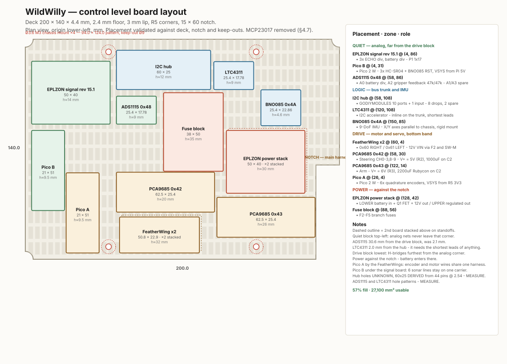
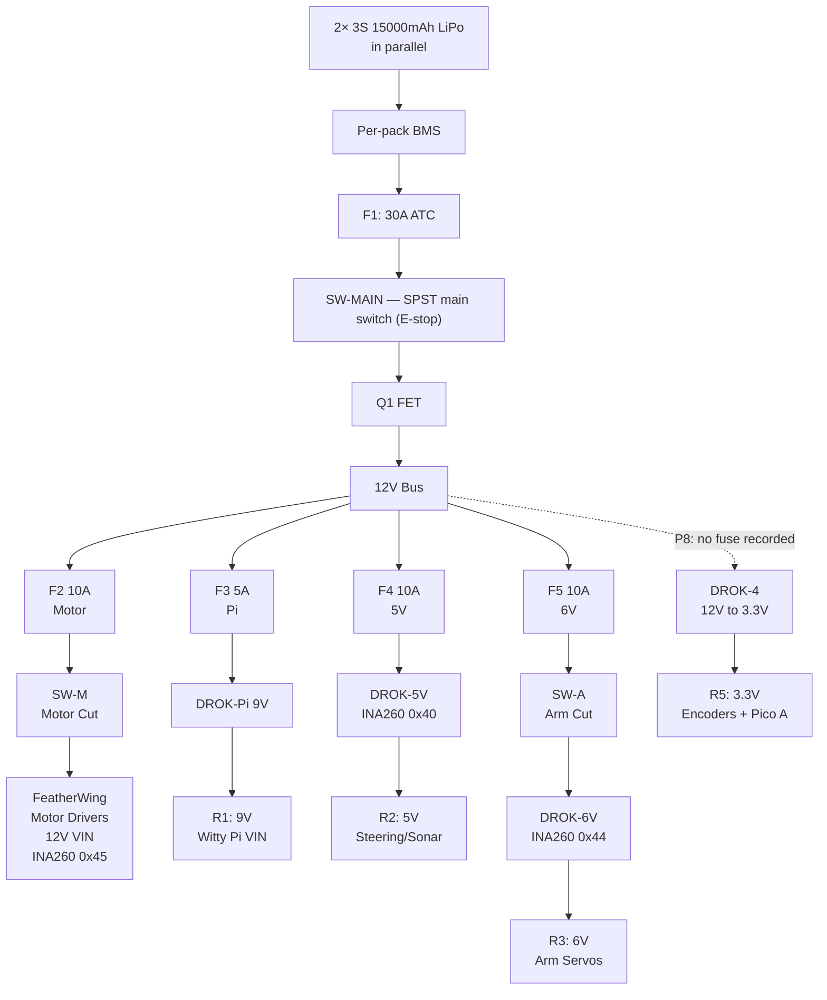
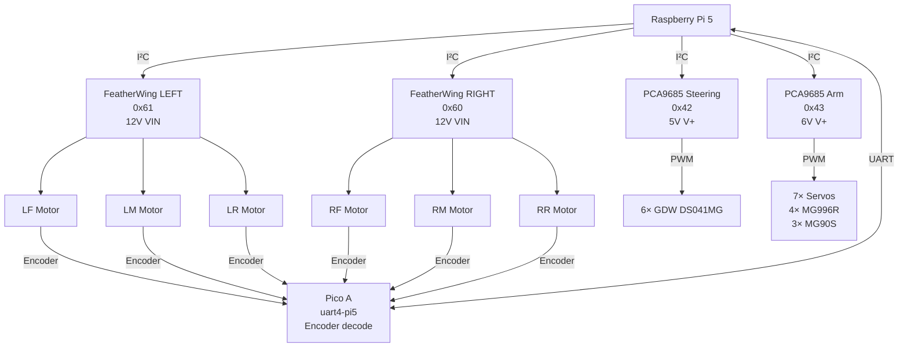

# WildWilly Autonomous Rover

## Master Hardware Design — As-Built

**Revision 2.6 · Current Configuration · 2026-10-02**

---

## Document Control

| Field | Value |
|-------|-------|
| Project | WildWilly Autonomous Rover |
| Document | Master Hardware Design — as-built, current configuration only |
| Revision | 2.6 |
| Date | 2026-10-02 |
| Owner | Howard Himmel |
| Status | Build complete; live verification in progress (§13, §14). The filename keeps `v2.0` so cross-references in the Software Design, the FRD and `CLAUDE.md` stay valid; the Revision field is authoritative |
| Companions | Functional Requirements rev 3.4; Software Design rev 1.4 |

**Scope.** This describes the rover as it is built today. It contains no incident
narrative, no superseded parts and no revision history — git holds that. Where a past
failure produced a standing rule, the rule appears in §12 without the story.

**Scope baseline.** Drive, see, talk/listen, arm pick-and-place on flat ground, and basic
flat-terrain autonomy. Stair-climbing is a stretch goal.

---

## 0. AS-BUILT — READ THIS FIRST

Where any later section disagrees with this one, this one is authoritative.

### Current topology

```
Pi 5 40-pin header
  ├─ I²C1  GP2 SDA1 (phys 3) / GP3 SCL1 (phys 5)
  │    ├─ Witty Pi 5 HAT+                      0x51
  │    └─ GODIY passive I²C hub fan-out
  │          ├─ INA260   0x40 0x44 0x45
  │          ├─ PCA9685  0x42 0x43              (0x70 All-Call, see §3.3)
  │          ├─ ADS1115  0x48
  │          ├─ BNO085   0x4A
  │          ├─ FeatherWing #2927  0x60 0x61
  │          └─ LTC4311 accelerator             (no address, transparent)
  ├─ uart2-pi5  GP4 TXD2 (phys 7) / GP5 RXD2 (phys 29)   → Pico B  (/dev/ttyAMA2)
  ├─ uart3-pi5  GP8 TXD3 (phys 24) / GP9 RXD3 (phys 21)  → SEN0628 ToF (/dev/ttyAMA3)
  └─ uart4-pi5  GP12 TXD4 (phys 32) / GP13 RXD4 (phys 33) → Pico A  (/dev/ttyAMA4)
```

- **Ten I²C devices**, one non-isolated segment. The hubs are passive, so any device
  holding SDA or SCL low takes the whole bus down.
- **Pico A** (encoders, R5 sense) and **Pico B** (three HC-SR04 sonars, BNO085 reset) are
  UART devices (§4.7, §4.8). There is no I²C GPIO expander.
- **The SEN0628 multi-zone ToF** is a UART device on the Pi (§6.5).
- **Pull-ups:** the Pi's own 1.8 kΩ on GP2/GP3 plus whatever the breakouts carry. No
  separate 4.7 kΩ rail pull-ups are fitted (§3.2).
- No I²C multiplexer is fitted.

### Power rails — four DROK converters

| Rail | Volts | Source | Feeds | Monitor |
|------|-------|--------|-------|---------|
| R1 | 9 V | DROK-Pi | Witty Pi 5 VIN → Pi 5 | Witty Pi HAT (no INA260) |
| R2 | 5 V | DROK-5V | Steering servos, sonar VCC — nothing else | INA260 `0x40` |
| R3 | 6 V | DROK-6V | Arm servo distribution | INA260 `0x44` |
| R4 | 3.3 V | Pi header pin 1 | All I²C device logic, SEN0628, BNO085 RST pull-up | — |
| R5 | 3.3 V | DROK-4 | Motor Hall encoders and Pico A VSYS | Pico A ADC2 (GP28) |
| — | +12 V bus | Battery via F1 / SW-MAIN / Q1 | Both FeatherWing VIN (via F2, SW-M), all DROK inputs | INA260 `0x45` |
| — | Pi 5 V | Witty Pi 5 output (~5.4 V) | Pi 5, display (3-pin header tap), Pico B VSYS (breakout terminal) | — |

**Pi header pin 1 is a loaded rail**, not a spare pin: ten devices' logic, the bus
pull-ups and the SEN0628's <80 mA, against a pin the Pi 5 rates for a few hundred mA. A
USB-C-powered Pi therefore powers the whole device bus; a blank scan is always a fault.

**What goes dark with the base 12 V off:** the FeatherWing motor supply, R2, R3, R5 —
so the encoders and Pico A. I²C devices and Pico B keep answering with their loads dead.

---

## 1. System Overview

Six-wheel rocker-bogie rover. Independent drive and steering on all six corners, a
5-DOF arm with gripper, and a Raspberry Pi 5 host with an NPU accelerator for vision and
speech.

| Subsystem | Configuration |
|-----------|---------------|
| Compute | Raspberry Pi 5 (8 GB), AI HAT+ 2 (Hailo-10H, 8 GB), boots from USB SSD |
| Drive | 6 × JGA25-370-35.5K 12 V 170 RPM gearmotors with Hall encoders; 2 × FeatherWing #2927 |
| Encoder decode | Pico A (Pico 2 W), PIO, signed ×2 |
| Steering | 6 × GDW DS041MG servos on PCA9685 0x42 |
| Arm | 7 servos — 4 × MG996R, 3 × MG90S — on PCA9685 0x43 |
| Ranging | 3 × HC-SR04 sonar (front, left, right) via Pico B; DFRobot SEN0628 8×8 ToF (front) |
| Orientation | BNO085 9-DoF IMU, on-chip fusion |
| Gripper sense | Gripper MG90S pot wiper on ADS1115 A2 via 47k/47k divider (uncalibrated) |
| Vision | Front CSI camera (imx708, 15° down); rear USB camera (15° down) |
| Power | 2 × 3S 15000 mAh LiPo in parallel (30 Ah, ≈333 Wh; fitted 2026-10-05), four DROK bucks, Witty Pi 5 HAT+ |
| Bus | One non-isolated I²C segment, ten devices; three UART links |

**Physical layout.** Pi 5, AI HAT and audio in the head assembly. The body is two decks:
the **control level** (§1.1) carries logic, motor drivers, servo drivers, the Picos and
signal conditioning; the **power level** below it carries the four DROK converters, all
three INA260s and the main distribution and ground block.

Chassis: 430 mm long × 400 mm wide across the wheels; wheels 101.6 mm diameter, 90 mm
wide; track 310 mm.

---

### 1.1 Control level board layout



Plan view, dimensions in mm, **origin lower-left**; every coordinate is that board's
lower-left corner. Source: `docs/drawings/WildWilly_Control_Level_Layout.svg`, generated
by `docs/drawings/gen_control_level_layout.py`, which holds the placement as data and
validates it against the deck outline, the harness notch and the four M3 keep-outs.
**Edit the script and re-run it.** There is no PNG fallback.

| Deck | Value |
|---|---|
| Size | 200 × 140 × 4.4 mm |
| Floor | 2.4 mm, rising to 4.4 mm at a 3 mm lip |
| Corners | R5 |
| Harness notch | 15 × 60 mm — the single main harness exit, right edge, y 0–60 |
| Chassis mounts | 4 × Ø3.6 M3 on a 94.0 × 124.0 pattern, Ø9 keep-out |
| Lattice | 2.9 × 7.8 mm slots, 1.5 mm ribs on 4.25 mm X pitch, 2.25 mm cross-ribs every ~10 mm in Y. M2.5 standoffs |
| Occupancy | 61% fill, 25,141 mm² usable |

#### Zones

| Zone | Where | Holds |
|---|---|---|
| QUIET | top-left | Signal board, ADS1115, Pico B |
| LOGIC | top-centre and right | I²C hub, LTC4311, BNO085 |
| DRIVE | bottom band | FeatherWings, both PCA9685s, Pico A |
| POWER | right, against the notch | EPLZON power stack, fuse block |

#### Placement

| Board | Position | Footprint | Height | Mounting holes |
|---|---|---|---|---|
| EPLZON signal board rev 15.1 — 3 × ECHO ÷, battery ÷, P1 1×17 | (4, 86) | 50 × 40 | ≈14 | same as power boards |
| Pico B — 3 × HC-SR04 + BNO085 RST, VSYS from Pi 5 V | (4, 31) | 21 × 51 | ≈9.5 | 47.0 × 11.4, Ø2.1 |
| ADS1115 `0x48` — A0 battery ÷, A2 gripper feedback ÷, A1/A3 spare | (58, 86) | 25.4 × 17.78 | ≈9 | measure |
| I²C hub — GODIYMODULES, 10 ports + 1 input | (58, 108) | 60 × 25 | ≈12 | unknown — measure |
| LTC4311 — inline on the trunk | (120, 108) | 25.4 × 17.78 | ≈9 | measure |
| BNO085 `0x4A` — X/Y axes parallel to chassis | (150, 85) | 25.4 × 22.86 | ≈4.6 | 20.32 × 17.78 |
| FeatherWing ×2 — `0x60` RIGHT, `0x61` LEFT | (60, 4) | 50.8 × 22.9, ×2 stacked | ≈32 | 45.72 × 17.78, Ø2.5 |
| PCA9685 `0x42` — steering CH0–3/8–9, V+ = 5 V (R2), 1000 µF on C2 | (58, 30) | 62.5 × 25.4 | ≈20 | 55.9 × 19.0, Ø2.5 |
| PCA9685 `0x43` — arm, V+ = 6 V (R3), 2200 µF Rubycon on C2 | (122, 14) | 62.5 × 25.4 | ≈26 | 55.9 × 19.0, Ø2.5 |
| Pico A — 6 × encoders, VSYS from R5 | (26, 4) | 21 × 51 | ≈9.5 | 47.0 × 11.4, Ø2.1 |
| EPLZON power stack — ×2 stacked | (128, 42) | 50 × 40 | ≈30 | same board, same holes |
| Fuse block — F2–F5 branch fuses | (88, 56) | 38 × 50 | ≈35 | own mounts |

The I²C hub's 60 × 25 is derived (the minimum for 44 pins at 2.54 mm), its hole pattern
is unknown, and the ADS1115 and LTC4311 holes use Adafruit outlines as placeholders —
measure before printing.

#### Why each board is where it is

- **The analog corner is protected.** The ADS1115 reads the battery divider and the gripper feedback,
  the quietest nets on the rover and the ones the shutdown ladder depends on. It sits
  30.6 mm from the nearest drive board, with the signal board 4 mm away.
- **H-bridges lowest.** The FeatherWings switch 12 V at motor current, so they occupy the
  bottom edge; the PCA9685s sit above them.
- **LTC4311 is 2.0 mm from the hub** — shortest leads of any device (§16.4).
- **Pico A beside the FeatherWings**, so each motor's six-wire harness terminates in one
  place. **Pico B beneath the signal board**, so the six sonar lines stay in the quiet
  corner. The encoder and sonar bundles never share a route.
- **Power against the notch**, where the battery enters.
- **BNO085 is 41.8 mm from the drive block**, rigidly mounted. It is 29 mm from the
  FeatherWings — the closest any quiet device sits to a motor driver; question that
  distance first if IMU noise is suspected.
- **Hub placement:** drop count and routing away from the drive block dominate; trunk
  length on a 200 mm deck does not (a few pF against a 300–400 pF budget).

#### The EPLZON power stack

Two identical 50 × 40 boards on standoffs:

- **LOWER — battery entry and protection.** Battery in, **Q1** (FQP27P06 reverse-polarity
  FET, §2.3), +12 V out. Live whenever the pack is connected and the main switch closed.
- **UPPER — regulated output side.** 9 V / 5 V / 6 V / 3.3 V back up from the power level,
  out to loads: the voltage rails (owner-confirmed 2026-10-02).

#### Stacking

Only hole-matched boards are stacked: FeatherWing ×2, EPLZON power ×2. The PCA9685s stay
flat (different rails; `0x43` carries the 2200 µF can). Pico A and Pico B match but sit in
different zones.

---

## 2. Power Architecture

### 2.1 Distribution tree

| ID | Path | Volts in → out | Rail | Gauge | Protection |
|----|------|---|---|-------|------------|
| P1 | 2 × 3S 15000 mAh → hard parallel, per-pack BMS | — → 12.6 V max, 11.1 V nominal | — | 12–14 AWG | BMS per pack |
| P2 | Battery+ → F1 → SW-MAIN (SPST) → Q1 FET → +12 V bus | 12.6 V → +12 V bus | — | 12 AWG | F1 30 A ATC |
| P3 | +12 V bus → F2 → SW-M → INA260 0x45 → both FeatherWing VIN | 12 V → 12 V | — | 16 AWG | F2 10 A |
| P4 | +12 V bus → F3 → Switch 2 → DROK-Pi → Witty Pi VIN | 12 V → 9 V | R1 | 16 AWG | F3 5 A |
| P5 | +12 V bus → F4 → DROK-5V | 12 V → 5.0 V | R2 | 16 AWG | F4 10 A |
| P6 | +12 V bus → F5 → SW-A → DROK-6V | 12 V → 6.0 V | R3 | 16 AWG | F5 10 A |
| P7 | Charge Y-cable (main + balance) → battery side of SW-MAIN | 12.6 V charge in | — | 14 AWG | — |
| P8 | +12 V bus → DROK-4 | 12 V → 3.3 V | R5 | unrecorded | **no fuse recorded** (§14 item 16) |


```mermaid
graph TD
    BAT["2× 3S 15000mAh LiPo<br/>in parallel"]
    BMS["Per-pack BMS"]
    F1["F1: 30A ATC"]
    KCD4["SW-MAIN — SPST main switch (E-stop)"]
    Q1["Q1 FET"]
    BUS["12V Bus"]
    F2["F2 10A<br/>Motor"]
    F3["F3 5A<br/>Pi"]
    F4["F4 10A<br/>5V"]
    F5["F5 10A<br/>6V"]
    SW_M["SW-M<br/>Motor Cut"]
    FW_MOTOR["FeatherWing<br/>Motor Drivers<br/>12V VIN<br/>INA260 0x45"]
    PI_BUCK["DROK-Pi 9V"]
    R1["R1: 9V<br/>Witty Pi VIN"]
    DROK5["DROK-5V<br/>INA260 0x40"]
    R2["R2: 5V<br/>Steering/Sonar"]
    SW_A["SW-A<br/>Arm Cut"]
    DROK6["DROK-6V<br/>INA260 0x44"]
    R3["R3: 6V<br/>Arm Servos"]
    DROK4["DROK-4<br/>12V to 3.3V"]
    R5["R5: 3.3V<br/>Encoders + Pico A"]
    BAT --> BMS --> F1 --> KCD4 --> Q1 --> BUS
    BUS --> F2 --> SW_M --> FW_MOTOR
    BUS --> F3 --> PI_BUCK --> R1
    BUS --> F4 --> DROK5 --> R2
    BUS --> F5 --> SW_A --> DROK6 --> R3
    BUS -.->|P8: no fuse recorded| DROK4 --> R5
```

### 2.2 Regulated rails

| ID | Rail | Source | Feeds | Monitor |
|----|------|--------|-------|---------|
| R1 | 9 V | DROK-Pi buck | Witty Pi 5 VIN (KF350-2P screw terminal) → Witty Pi → Pi 5 header 5 V | Witty Pi HAT monitors its own VIN |
| R2 | 5 V | DROK-5V buck | Steering servo distribution (PCA9685 0x42 V+), sonar VCC | INA260 0x40 |
| R3 | 6 V | DROK-6V buck | Arm servo distribution (PCA9685 0x43 V+) | INA260 0x44 |
| R4 | 3.3 V | Pi header pin 1 | All I²C device logic, SEN0628, BNO085 RST pull-up (via Pico B carrier R4) | — |
| R5 | 3.3 V | DROK-4 buck | Six Hall encoders and Pico A VSYS | Pico A GP28 (ADC2), flagged below 3.0 V |
| — | +12 V bus | Battery via F1/SW-MAIN/Q1 | Both FeatherWing VIN (motors) | INA260 0x45 |
| — | +12 V main | Battery via F1/SW-MAIN/Q1 | All four DROK inputs | — |

The Hall encoders and their reader (Pico A) share R5, and therefore a reference. Pico A's
buck-boost holds its 3.3 V down to 1.8 V in, so if R5 sags the encoders go static while
Pico A stays alive to report it. **Meter R5 before connecting encoders** — a sagging
encoder supply leaves every Hall sensor powered but static while every I²C device tests
healthy.

**Witty Pi 5 feed.** DROK-Pi supplies ~9 V into Witty Pi's VIN screw terminal (6–30 V
input, 5 A output); Witty Pi outputs ~5.4 V to the Pi. Witty Pi's low-voltage cutoff
(`wp5` menu option 7) is 8.0 V. Measured: V-IN 9.0–9.2 V, Pi 5 V rail 5.144 V.

**Witty Pi RTC sets the boot clock.** `wp5d` copies its RTC into the system clock at boot;
the Pi 5's own RTC has no battery. On 2026-10-06 the Witty Pi RTC was a week fast; it was
reset from internet time, and `scripts/clock_sync.sh` now rewrites it from internet time
before every service start.

Set each DROK off-load before connecting anything downstream: 9 V, 5.0–5.1 V, 6.0 V,
3.3 V. They are trimpot modules — re-verify after any knock. The 5 V setting directly sets
the sonar ECHO divider outputs (§16.12).

### 2.3 Protection

- **F1** 30 A ATC main fuse, off-board. **F2** 10 A, **F3** 5 A, **F4** 10 A, **F5** 10 A
  branch fuses. **P8 (DROK-4 / R5) has no recorded fuse** (§14 item 16).
- **Q1** FQP27P06 P-channel MOSFET for reverse polarity on the battery input, with a
  220 nF gate-source cap limiting inrush. On the lower board of the EPLZON power stack.
  It protects the battery input only; no connector downstream of it is protected.
- **D1** P6KE15A TVS for transients.
- Dual 3S BMS, one per pack.
- **Emergency stop:** the main power switch. It cuts all power including the Pi; there is no separate E-stop and no sense input.
- **SW-M** in P3 (between F2 and both FeatherWings) and **SW-A** in P6 (between F5 and the
  DROK-6V input). A SW-M cut is observable on INA260 0x45 (`_check_motor_rail()`); a SW-A
  cut collapses R3 and is readable on 0x44 but not monitored.
- **Switch 2** in the Pi buck input line — de-powers the Pi and the 3V3 bus after a
  software shutdown.
- **Pico carriers:** each feed passes a 0.5 A PTC (F1) and a series 1N5819 (D1); no
  reverse-polarity diode across the input (§4.8, §14 item 15).

### 2.4 Capacitors — complete list

| Qty | Value | Location |
|-----|-------|----------|
| 1 | 220 nF | Q1 gate-source soft-start |
| 1 | 1000 µF 16 V (Rubycon ZL low-ESR) + 1 × 0.1 µF ceramic | Pi 5 V rail, at header pins 2+4 |
| 1 | 1000 µF 16 V | PCA9685 0x42 V+, C2 pad |
| 1 | 2200 µF 16 V Rubycon low-ESR | PCA9685 0x43 V+, C2 pad |

The signal conditioning board (§4) and the Pico carriers (§4.8) carry no capacitors.

### 2.5 Voltage limits

| Rail | Nominal | Floor |
|------|---------|-------|
| Pi 5 V | 5.0–5.1 V (measured 5.144 V) | 4.85 V |
| Pack | 12.6 V full, 11.1 V nominal | 10.2 V cutoff (`BAT_SHUTDOWN_V`) |

Charge to 12.6 V (4.20 V/cell) on the iMAX B6 (6 A max). **Set the charger's capacity
cut-off above the 15000 mAh pack capacity**, or a charge ends early at storage level
(~11.4 V, which is also `BAT_WARN_V`). Storage charge 11.4 V (3.8 V/cell). Packs must be
within 0.05 V per cell of each other before paralleling — main Y first, balance Y a minute
later.

---

## 3. I²C Bus

### 3.1 Topology

One non-isolated segment on the Pi's `/dev/i2c-1` (GP2 SDA1, GP3 SCL1), fanned out through
passive GODIY hubs, two daisy-chained. Device logic
runs from R4 (Pi header pin 1). Clock 100 kHz (`dtparam=i2c_arm_baudrate` in
`config.txt` is authoritative; `config.I2C_BAUDRATE` mirrors it). Any device holding SDA
or SCL low takes the whole bus down, so a single missing address is diagnosed as a
connector before a dead part.

Reference every measurement to the ground of the side being measured (§10).

### 3.2 Pull-ups

| Source | Value | Present? |
|--------|-------|----------|
| Pi internal, GP2/GP3 | 1.8 kΩ | Yes, always |
| Separate 4.7 kΩ rail pair | — | Not fitted |
| Device breakouts | typically 10 kΩ each | Uncatalogued; in parallel they strengthen the total |

| Pull-up | RC at 400 pF | ~3τ to threshold | vs the 10 µs bit (100 kHz) |
|---|---|---|---|
| 1.8 kΩ (as built) | 0.72 µs | ~2.2 µs | fine |
| 10 kΩ | 4 µs | ~12 µs | exceeds the bit |

Sink current from the Pi's pair alone is ~1.8 mA against the ~3 mA a device is specified
for. **Do not add pull-ups anywhere without measuring the combined value first.** The
LTC4311 improves edge-rate margin; the bus meets timing without it. 400 kHz is ~2.2 µs to
threshold against a 2.5 µs bit — marginal; validate with `scripts/i2c_bus_check.py`
before raising the clock.

### 3.3 Device roll-call

`i2cdetect -y 1` returns **ten devices**:

| Address | Device | Function |
|---------|--------|----------|
| 0x40 | INA260 | R2, 5 V steering/sonar rail |
| 0x42 | PCA9685 | Steering servos, CH0–3 and CH8–9 (2026-10-05) |
| 0x43 | PCA9685 | Arm servos, CH0–CH6 (CH7 unused) |
| 0x44 | INA260 | R3, 6 V arm servo rail |
| 0x45 | INA260 | +12 V bus → both FeatherWing VIN |
| 0x48 | ADS1115 | A0 battery voltage, A2 gripper position feedback |
| 0x4A | BNO085 | 9-DoF IMU |
| 0x51 | Witty Pi 5 HAT+ | RTC, power management, hardware watchdog |
| 0x60 | FeatherWing | Motor driver, RIGHT |
| 0x61 | FeatherWing | Motor driver, LEFT |

**0x70 is the PCA9685 All-Call address, not a device.** It answers from a cold bus while
either PCA9685 is alive, and stops answering once `motors.py`/`arm.py` construction resets
the PCA9685s (clearing ALLCALL). Never count it. The LTC4311 has no address.

**Never scan or quick-write 0x4A while the rover runs** — the BNO085 logs every quick-write
as an SHTP error and its error-list packet stalls the driver. The rover's self-test does
not probe it (§11.2).

---

## 4. Signal Conditioning Board

**EPLZON Mini 17, rev 15.1 — built and resistance-verified.**

Entirely passive: ten resistors and one connector. No ICs, no capacitors, no regulators.
It sits between Pico B, the three HC-SR04 sonars, the ADS1115 and the 12 V pack. I²C
distribution is not on a board. The gripper feedback divider is not on it either — it sits at
the ADS1115 (§6.6).

### 4.1 What software needs to know

| Fact | Value |
|---|---|
| Sonar TRIG (Pico B) | FRONT GP0, LEFT GP2, RIGHT GP4 |
| Sonar ECHO (Pico B, divided) | FRONT GP1, LEFT GP3, RIGHT GP5 |
| ECHO divider ratio | 2/3 — the sonar's 5 V arrives at Pico B as 3.33 V |
| Battery sense | ADS1115 A0, address 0x48 |
| Battery divider ratio | nominal 0.242; calibrated `BATTERY_DIVIDER_SCALE` = 0.2432 (§6.2) |
| P1-15/16, R10 | Unused since the FSR402 was removed 2026-10-04 |

Sonar bearings (`config.SONAR_BEARING_DEG`): front 0°, left −90°, right +90°. There is no
rear sonar.

### 4.2 P1 pinout

One continuous 1×17 male header in row a, columns 1–17.

| Pin | Signal | Dir | Other end | Level |
|---:|---|---|---|---|
| 1 | TRIG-F | in | Pico B GP0 (pin 1) | 3.3 V |
| 2 | TRIG-F | out | FRONT sonar TRIG | 3.3 V |
| 3 | ECHO-F | in | FRONT sonar ECHO | 5 V |
| 4 | ECHO-F ÷ | out | Pico B GP1 (pin 2) | 3.33 V |
| 5 | TRIG-L | in | Pico B GP2 (pin 4) | 3.3 V |
| 6 | TRIG-L | out | LEFT sonar TRIG | 3.3 V |
| 7 | ECHO-L | in | LEFT sonar ECHO | 5 V |
| 8 | ECHO-L ÷ | out | Pico B GP3 (pin 5) | 3.33 V |
| 9 | TRIG-R | in | Pico B GP4 (pin 6) | 3.3 V |
| 10 | TRIG-R | out | RIGHT sonar TRIG | 3.3 V |
| 11 | ECHO-R | in | RIGHT sonar ECHO | 5 V |
| 12 | ECHO-R ÷ | out | Pico B GP5 (pin 7) | 3.33 V |
| 13 | +12 V | in | +12 V bus, via inline fuse | 12.6 V max |
| 14 | A0 | out | ADS1115 (0x48) A0 | ≈2.90 V at 12 V |
| 15 | — | — | unused (was FSR402 lead B) | — |
| 16 | — | — | unused (was ADS1115 A1) | — |
| 17 | GND | — | Pico B GND + ADS1115 GND | 0 V |

Pass-through pairs (0 Ω by design): 1–2, 5–6, 9–10 (TRIG); 15–16 (unused, was the FSR tap).

| Not on this board | Goes to |
|---|---|
| Sonar VCC ×3 | R2 5 V |
| Sonar GND ×3 | R2 ground — must be common with Pi/Pico B ground |

### 4.3 Circuits

**Sonar ECHO dividers (×3)**

```
ECHO (5V) --[ 1k ]--+--[ 2k ]-- GND
                    +-- Pico B GPIO   (5 x 2/3 = 3.33V)
```

TRIG runs Pico → sonar and is only passed through. The 1 kΩ series element is also the
overvoltage protection (§16.12) — do not shrink it.

**HC-SR04 trigger margin.** TRIG threshold is nominally 0.7 × VCC = 3.5 V and Pico B drives
3.3 V. If one sonar gives intermittent echoes while the other two are solid, suspect a
marginal trigger before the divider.

**Battery sense**

```
+12V --[ 10k ]--+--[ 4.7k || 10k = 3.2k ]-- GND
                +-- ADS1115 A0
```

Nominal ratio 3.2/13.2 = 0.242. Calibrate rather than trusting it (§6.2).


### 4.4 Build detail

Rows `a`–`e` and `f`–`j` are independent 5-hole tie-strips split by the centre gap. 17
columns, no power rails.

| Ref | Value | Position |
|---|---|---|
| R1 | 1k | c3c–c4c |
| R3 | 1k | c7c–c8c |
| R5 | 1k | c11c–c12c |
| R7 | 10k | c13c–c14c |
| R2 | 2k | c4e–c4f (across the gap) |
| R4 | 2k | c8e–c8f |
| R6 | 2k | c12e–c12f |
| R8 | 4.7k | c14e–c14f |
| R9 | 10k | c14d–c14g |
| R10 | 10k | c16e–c16f |

Ground bus (bottom section): `c4g-c8g  c8h-c12h  c12i-c14i  c14h-c16h  c16g-c17g`, then
`c17f-c17e` up to pin 17.

Jumpers (10): TRIG `c1b–c2b`, `c5b–c6b`, `c9b–c10b`; old FSR tie `c15b–c16b` (unused); the five ground
links; `c17f–c17e`.

### 4.5 Verification

**Resistance, unpowered — passed.**

| Probe | Expect |
|---|---|
| 1↔2, 5↔6, 9↔10, 15↔16 | 0 Ω |
| Any TRIG pin ↔ anything else | OPEN |
| 3↔4, 7↔8, 11↔12 | 1.0 k |
| 13↔14 | 10.0 k |
| 3, 7, 11 ↔ 17 | 3.0 k |
| 4, 8, 12 ↔ 17 | 2.0 k |
| 13 ↔ 17 | 13.2 k |
| 14 ↔ 17 | **3.2 k** — 4.7 k or 10 k means R8 or R9 is not seated, and battery reads ~⅓ high |
| 15, 16 ↔ 17 | 10.0 k |

**Powered injection check — not yet performed** (§14 item 14). Bench supply, ground to
pin 17: 5 V → pins 3/7/11 gives 3.33 V on 4/8/12; 12 V → pin 13 gives ≈2.90 V on 14.

### 4.6 Failure modes worth recognising in software

| Symptom | Likely cause |
|---|---|
| One sonar flags stuck-ECHO or reads −1 while the other two are fine | Dead sensor (ECHO held high), marginal 3.3 V trigger, or that ECHO wire on the wrong pin |
| All three sonars nonsense, board passes every resistance check | R2 ground not common with Pico B ground — the dividers have no valid reference |
| Battery reads ~⅓ high | R8 or R9 not connected |
| Battery reads plausible but consistently off | Scale not calibrated against a meter |

### 4.7 Sonar and encoders on two Pico 2 W

Two Raspberry Pi Pico 2 W boards, both UART devices to the Pi, on identical carriers
(§4.8). Firmware lives in `firmware/`; `firmware/README.md` carries the wire protocol
(`$<body>*<XX>`, XOR checksum, 115200 baud). **Each board runs its firmware as
`main.py`** — a Pico only autoruns `main.py`.

| | Pico A | Pico B |
|---|---|---|
| UID | `643f69a756a232ea` | `ad25bbf0f1e1f160` |
| MicroPython | v1.29.0, `RPI_PICO2_W` | v1.29.0, `RPI_PICO2_W` |
| Firmware | `firmware/pico_a.py`, **a-0.3** | `firmware/pico_b.py`, **b-0.1** |
| Role | 6 × encoders (12 lines), signed ×2 in PIO; R5 sense | 3 × HC-SR04 (6 lines) + BNO085 RST |
| Frames | `$E` at 50 Hz: counts, R5 mV, flags (R5-low below 3000 mV) | `$S` at 33.3 Hz: per-channel mm (−1 = no echo), age, stuck-ECHO flags; sequence number |
| Power | VSYS from R5 (DROK-4 3.3 V) | VSYS from Pi 5 V at the breakout terminal |
| Link | `uart4-pi5`: Pi GP12 TXD4 (phys 32) → Pico GP13 UART0 RX (pin 17); Pico GP12 UART0 TX (pin 16) → Pi GP13 RXD4 (phys 33). `/dev/ttyAMA4` | `uart2-pi5`: Pi GP4 TXD2 (phys 7) → Pico GP13 UART0 RX (pin 17); Pico GP12 UART0 TX (pin 16) → Pi GP5 RXD2 (phys 29). `/dev/ttyAMA2` |
| Ground | pin 38 → R5 return (supply); pin 18 → Pi GND (signal reference) | one wire: Pi GND → carrier − rail (pin 38) |
| Radio | not initialised; onboard LED via `Pin("LED")` only (§12 rule 17) | same |

**Identify a board by UID, never by port or position** — they are physically identical.
Write A or B on the copper.

**Pico A's two grounds are correct:** pin 38 returns to R5, pin 18 references the Pi —
two sources, meeting only at the star. **Pico B has one ground wire; do not add a
second** — both would go to the same Pi GND and close a loop through the Pico.

Pico B's five wires to the Pi, all on the GeeekPi breakout (§5.3), as a 3-way link cable
(TX / RX / GND) and a 2-way power cable (5 V / 3V3):

| # | Wire | Pi end | Pico B carrier end |
|---|---|---|---|
| 1 | UART Pico TX | GP5 RXD2, phys 29 | GP12, pin 16 (J2-1) |
| 2 | UART Pico RX | GP4 TXD2, phys 7 | GP13, pin 17 (J2-2) |
| 3 | GND | Pi GND, phys 6 or 9 | upper − rail (J2-3) |
| 4 | 5 V | breakout 5 V terminal | upper + rail → F1 → D1 → VSYS (J1) |
| 5 | 3V3 | header pin 1 | lower + rail → R4 10 k → RST (J4-1) |

**Why Pico B is on Pi 5 V, not R2:** with the base off it stays alive and can report its
sensor rail down, and it adds no current to R2, whose current is the sonar short
detector (§16.12).

**BNO085 reset.** Pico B GP15 (pin 20) drives the BNO085 RST, open-drain against a 10 k
pull-up to Pi 3V3, so an unpowered Pico B cannot hold a live IMU in reset. The Pi asks
for it with an explicit `RST` command, acknowledged `$R,ok,<count>`. It cannot go on
Pico A, whose R5 is dead whenever the base 12 V is off.

**R5 sense.** Pico A GP28 (ADC2, pin 34) reads R5 through a 10 k/10 k divider tapped
upstream of the carrier's F1; ADC_VREF is the Pico's own regulated 3V3, so the reading
stays valid as R5 sags. ADS1115 A2 is therefore spare.

**Encoder lines** have the Pico internal pull-ups enabled.

**Overlays.** `config.txt` carries `dtoverlay=uart2-pi5`, `dtoverlay=uart3-pi5`,
`dtoverlay=uart4-pi5`. **The `-pi5` suffix is required** — `uart2`/`uart3`/`uart4` are the
BCM2711 mappings, boot clean on a Pi 5 and put the UART on unwired pins. `pinctrl get
4,5,12,13` reads `TXD2, RXD2, TXD4, RXD4`. The serial console stays disabled and GP14 is
unused.

The SEN0628 stays on the Pi (uart3-pi5), not behind Pico B.

#### Pico A pinout — encoders

Pin numbers are Pico 2 W physical; the Pi column is Pi physical.

| Pico GP | Phys | Signal | Other end |
|---|---:|---|---|
| GP0 | 1 | LF Phase A | LF motor yellow |
| GP1 | 2 | LF Phase B | LF green |
| GP2 | 4 | LM Phase A | LM yellow |
| GP3 | 5 | LM Phase B | LM green |
| GP4 | 6 | RF Phase A | RF yellow |
| GP5 | 7 | RF Phase B | RF green |
| GP6 | 9 | RM Phase A | RM yellow |
| GP7 | 10 | RM Phase B | RM green |
| GP8 | 11 | LR Phase A | LR yellow |
| GP9 | 12 | LR Phase B | LR green |
| GP10 | 14 | RR Phase A | RR yellow |
| GP11 | 15 | RR Phase B | RR green |
| GP12 | 16 | UART0 TX | Pi GP13 RXD4, phys 33 |
| GP13 | 17 | UART0 RX | Pi GP12 TXD4, phys 32 |
| GP14 | 19 | — | free |
| GP28 | 34 | ADC2 — R5 sense | 10 k/10 k divider off R5 |
| 3V3_EN | 37 | — | leave open |
| VSYS | 39 | R5 3.3 V | via 500 mA PTC and series Schottky |
| VBUS | 40 | — | leave unconnected |
| GND | 38 | supply return | R5 return → star |
| GND | 18 | signal reference | Pi GND, phys 6 or 9 |

`$E` slot *i* = GP 2*i* (A) / 2*i*+1 (B), wheel order `lf, lm, rf, rm, lr, rr`
(`firmware/pico_a.py` `WHEELS`). Yellow to the even GP, green to the odd.

#### Pico B pinout — sonar and IMU reset

| Pico GP | Phys | Signal | Other end |
|---|---:|---|---|
| GP0 | 1 | TRIG-F out | P1-1 → P1-2 → FRONT sonar TRIG |
| GP1 | 2 | ECHO-F in | P1-4, divider output 3.33 V |
| GP2 | 4 | TRIG-L out | P1-5 → P1-6 → LEFT sonar TRIG |
| GP3 | 5 | ECHO-L in | P1-8 |
| GP4 | 6 | TRIG-R out | P1-9 → P1-10 → RIGHT sonar TRIG |
| GP5 | 7 | ECHO-R in | P1-12 |
| GP12 | 16 | UART0 TX | Pi GP5 RXD2, phys 29 |
| GP13 | 17 | UART0 RX | Pi GP4 TXD2, phys 7 |
| GP14 | 19 | — | free |
| GP15 | 20 | BNO085 RST | open-drain, 10 k pull-up to Pi 3V3 |
| VSYS | 39 | 5 V from the breakout terminal | via 500 mA PTC and series Schottky |
| VBUS | 40 | — | leave unconnected |
| GND | 38 | — | Pi GND, phys 6 or 9 |

Pico B pings one sensor per 30 ms slot, round robin (~11 Hz per sensor), echo timeout
25 ms.

#### Pi-side nets

| Pi pin | BCM / function | Use |
|---|---|---|
| 7 | GP4 TXD2 | → Pico B RX |
| 29 | GP5 RXD2 | ← Pico B TX |
| 32 | GP12 TXD4 | → Pico A RX |
| 33 | GP13 RXD4 | ← Pico A TX |
| 8, 37, 40 | GP14 (UART0 TXD), GP26, GP21 | unused |
| Service port (3-pin JST-SH) | debug UART | reserved for the console |

#### 4.7.1 Verified on the rover

- `$S` on `/dev/ttyAMA2` at 33.3 Hz, zero sequence gaps and zero bad checksums; all three
  HC-SR04 ranging; stuck-ECHO flag correct.
- `$E` on `/dev/ttyAMA4` at 50.0 Hz, zero gaps or bad checksums; all six encoders count A
  and B, direction verified per wheel; R5 reads ~3.39 V.
- Pi → Pico commands answered on both boards (`PING` → `$P`, `ID` → `$I,<board>,<uid>,<ver>`,
  unknown → `$X,unknown`); `RST` resets the BNO085 (SHTP advertisement, then reset-complete).
- **A silent UART link is not evidence of damage.** A Pico at a bare REPL, an unpowered
  board, a swapped pair and an unterminated stub all look alike on the wire; prove a board
  is present over USB or with a meter first.

#### 4.7.2 The protection gap — D2

Nothing on either carrier protects against a reversed J1. F1 and D1 are both in series
with V+: reversed, the return current is forced through J2's signal ground and the GPIO
ESD clamps, and F1 never sees it. Q1 guards only the battery input.

**The fix is one part per carrier: D2, a 1N5819 across J1, anode to GND, cathode to V+**
— idle in normal use, and on a reversed feed it conducts and trips F1. **Not fitted on
either board** (§14 item 15). Until it is, meter J1 polarity before every connection.

### 4.8 The Pico carrier boards — as built

One carrier design, built twice; stuffed differently (divider on A, reset pull-up on B).
**The generator `docs/drawings/gen_pico_carrier_boards.py` is the authority on geometry.**

| | |
|---|---|
| Board | EPLZON 30-column solderable breadboard, bus rails both edges — `X0049J8MSB` |
| Rows | A–E and F–J, 5-hole tie-strips split by the centre channel |
| Quantity | 2 identical |
| Feed A | R5 3.3 V, at the encoder 3V3 distribution |
| Feed B | Pi 5 V at the breakout terminal — never R2 |

#### 4.8.1 Bill of materials per board

| Ref | Part | Pico A | Pico B |
|---|---|---|---|
| — | 2 × 1×20 female socket, 2.54 mm | fit | fit |
| F1 | PTC 0.5 A hold / 1.0 A trip | fit | fit |
| D1 | 1N5819, DO-41 — band toward the Pico | fit | fit |
| J1 | JST-PH 2-way — power in | R5 3.3 V | 5 V at the breakout terminal |
| J2 | JST-PH 3-way — UART link | fit | fit |
| J3 | JST-PH 12-way — signal | all 12 ways | ways 1–6 only |
| R2, R3 | 10 k 1% metal film — R5 divider | fit | empty |
| TP2 | test point, divider node | fit | empty |
| R4 | 10 k — RST pull-up | empty | fit |
| J4 | JST-PH 2-way — 3V3 in, RST out | empty | fit |
| D2 | 1N5819 across J1 | **not fitted** | **not fitted** |

No external status LED (the onboard `Pin("LED")` is used). No bulk capacitor on VSYS,
deliberately — more capacitance raises inrush through F1.

#### 4.8.2 The feed

```
rail (+)  --[ F1 PTC ]--[ D1 1N5819 ]-->  VSYS, pin 39
              0.5A          band
                  |
        R2/R3 divider taps HERE, upstream of F1
```

One Pico cannot take the rover down, and USB cannot back-feed the rail. The divider taps
upstream of F1 so a warming PTC does not read as a sagging rail. The twelve encoder and
six sonar lines are straight connector-to-pin pass-throughs.

#### 4.8.3 Geometry

| | |
|---|---|
| Pico occupies | columns 11–30, pins in rows C and H |
| USB | at the column-11 end |
| Pins | point DOWN; board seen from above |
| Row C (top) | pins 21–40, `pin = 51 − column` |
| Row H (bottom) | pins 1–20, `pin = column − 10` |

Every power connection is in the top section and every signal in the bottom; pin 1 and
pin 40 share column 11. Rows C and H are 17.78 mm apart, matching the Pico's pin rows, and
leave A/B and I/J reachable. Columns 1–10 hold F1 and D1. The USB plug reaches back over
columns 5–10 at rows D–G. **Check orientation before the sockets go down: column 11, row C
must read VBUS.**

#### 4.8.4 Rail order and bus assignment

Reading down the board: − (outer), + (inner), rows A–E, channel, rows F–J, + (inner),
− (outer). Both + rails are inner.

| Rail | Carries | A | B |
|---|---|---|---|
| Upper + (inner) | raw V+ in — F1 stands in it, and on A so does R2 | R5 3.3 V | Pi 5 V |
| Upper − (outer) | ground — pin 38 returns to it | ✓ | ✓ |
| Lower + (inner) | 3V3 in | unused | R4 ← Pi pin 1 |
| Lower − (outer) | ground, tied to the upper − rail at column 30 | ✓ | ✓ |

Check the rails are continuous (many of these boards split them at the midpoint).

#### 4.8.5 Component placement — no jumpers

| Part | From | To | Lands on |
|---|---|---|---|
| F1 | upper + rail | `c9a` | — |
| D1 | `c9b` | `c12b`, band at c12 | pin 39 VSYS |
| GND wire | `c13a` (pin 38) | upper − rail | the one wire on the board |
| R2 (A) | upper + rail | `c17a` | pin 34 GP28 — ADC2 |
| R3 (A) | `c17b` | `c18b` | pin 33 AGND |
| R4 (B) | lower + rail | `c30j` | pin 20 GP15 |

Column 18's strip goes nowhere else, so AGND single-points at the Pico. **Column 17 on
Board A carries two unrelated nets:** row-C side pin 34 / GP28 (divider), row-H side pin
7 / GP5 (RF Phase B). Check it twice before power.

#### 4.8.6 Clearances

- **Column 11, rows A/B (pin 40 VBUS) stays empty**; D1's body floats over it.
- **The upper + rail hole at column 13 stays empty**; the pin-38 ground wire passes it.

#### 4.8.7 Where the device wires land

Every device wire lands in row I (the Pico body covers rows D–G); row J is the spare for
metering. Before landing anything in rows A/B, compute `51 − column` — **column 15 is pin
36 (3V3 OUT)** and **column 11 is pin 40 (VBUS)**.

| Col | Pico A — row I | Pin | Pico B — row I | Pin |
|---|---|---|---|---|
| 11 | LF Phase A — yellow | 1 GP0 | TRIG-F → P1-1 | 1 GP0 |
| 12 | LF Phase B — green | 2 GP1 | ECHO-F ← P1-4 | 2 GP1 |
| 13 | pin 3 GND — spare ground landing | | | |
| 14 | LM Phase A | 4 GP2 | TRIG-L → P1-5 | 4 GP2 |
| 15 | LM Phase B | 5 GP3 | ECHO-L ← P1-8 | 5 GP3 |
| 16 | RF Phase A | 6 GP4 | TRIG-R → P1-9 | 6 GP4 |
| 17 | RF Phase B | 7 GP5 | ECHO-R ← P1-12 | 7 GP5 |
| 18 | pin 8 GND — spare ground landing | | | |
| 19 | RM Phase A | 9 GP6 | — | 9 GP6 |
| 20 | RM Phase B | 10 GP7 | — | 10 GP7 |
| 21 | LR Phase A | 11 GP8 | — | 11 GP8 |
| 22 | LR Phase B | 12 GP9 | — | 12 GP9 |
| 23 | pin 13 GND — spare ground landing | | | |
| 24 | RR Phase A | 14 GP10 | — | 14 GP10 |
| 25 | RR Phase B | 15 GP11 | — | 15 GP11 |
| 26 | UART TX → Pi GP13 RXD4, phys 33 | 16 GP12 | UART TX → Pi GP5 RXD2, phys 29 | 16 GP12 |
| 27 | UART RX ← Pi GP12 TXD4, phys 32 | 17 GP13 | UART RX ← Pi GP4 TXD2, phys 7 | 17 GP13 |
| 28 | signal GND → Pi pin 6/9 — A's only ground to the Pi | 18 GND | empty — B's ground is the − rail | — |
| 29 | pin 19 GP14 — free | | | |
| 30 | — | 20 GP15 | RST → BNO085 | 20 GP15 |

#### 4.8.8 Connector nets — J2, J3, J4

Every way lands on the same Pico pin on both boards.

| Way | Pico A — encoders | Pico pin | Pico B — sonar | Pico pin |
|---|---|---|---|---|
| J2-1 | TX → Pi GP13 RXD4, phys 33 | 16 GP12 | TX → Pi GP5 RXD2, phys 29 | 16 GP12 |
| J2-2 | RX ← Pi GP12 TXD4, phys 32 | 17 GP13 | RX ← Pi GP4 TXD2, phys 7 | 17 GP13 |
| J2-3 | signal GND — column 28 | 18 GND | GND — the − rail | plane |
| J3-1 | LF Phase A — yellow | 1 GP0 | TRIG-F → P1-1 | 1 GP0 |
| J3-2 | LF Phase B — green | 2 GP1 | ECHO-F ← P1-4 | 2 GP1 |
| J3-3 | LM Phase A | 4 GP2 | TRIG-L → P1-5 | 4 GP2 |
| J3-4 | LM Phase B | 5 GP3 | ECHO-L ← P1-8 | 5 GP3 |
| J3-5 | RF Phase A | 6 GP4 | TRIG-R → P1-9 | 6 GP4 |
| J3-6 | RF Phase B | 7 GP5 | ECHO-R ← P1-12 | 7 GP5 |
| J3-7 | RM Phase A | 9 GP6 | not fitted | — |
| J3-8 | RM Phase B | 10 GP7 | not fitted | — |
| J3-9 | LR Phase A | 11 GP8 | not fitted | — |
| J3-10 | LR Phase B | 12 GP9 | not fitted | — |
| J3-11 | RR Phase A | 14 GP10 | not fitted | — |
| J3-12 | RR Phase B | 15 GP11 | not fitted | — |
| J4-1 | — | — | 3V3 from Pi header pin 1 | via R4 |
| J4-2 | — | — | RST → BNO085 | 20 GP15 |

#### 4.8.9 Spare pins

| GP | Pin | Col | Side | Alt function | Board A | Board B |
|---|---|---|---|---|---|---|
| GP6–GP11 | 9,10,11,12,14,15 | 19,20,21,22,24,25 | bottom | — | encoders | free |
| GP14 | 19 | 29 | bottom | — | free | free |
| GP15 | 20 | 30 | bottom | — | free | BNO085 RST |
| GP16 | 21 | 30 | top | SPI0 RX | free | free |
| GP17 | 22 | 29 | top | SPI0 CSn | free | free |
| GP18 | 24 | 27 | top | SPI0 SCK | free | free |
| GP19 | 25 | 26 | top | SPI0 TX | free | free |
| GP20 | 26 | 25 | top | I²C0 SDA | free | free |
| GP21 | 27 | 24 | top | I²C0 SCL | free | free |
| GP22 | 29 | 22 | top | — | free | free |
| GP26 | 31 | 20 | top | ADC0 / I²C1 SDA | free | free |
| GP27 | 32 | 19 | top | ADC1 / I²C1 SCL | free | free |
| GP28 | 34 | 17 | top | ADC2 | R5 sense | free |

Ground on the top side: pins 23 and 28 (columns 28 and 23). 3V3 OUT is column 15. Not
spare: column 11 (pin 40 VBUS), 14 (pin 37 3V3_EN — low shuts the regulator), 16 (pin 35
ADC_VREF), 21 (pin 30 RUN — low resets). GP26/GP27 are the only spare ADC inputs; charge
sense (§14 item 17) may want one.

#### 4.8.10 Shared-layout pin assignments

Both Picos run UART0 on GP12/GP13 (pins 16/17), and Pico B's RST is on GP15 (pin 20), so
one J2/J3 footprint serves both boards and no J3 way lands on B's reset net.

#### 4.8.11 Rebuild checks

1. Orientation: USB at column 11; column 11 row C reads VBUS.
2. Build both in one sitting; write A or B on the copper before stuffing.
3. Flash both bare over USB (BOOTSEL, drag the `.uf2`), then copy the firmware as
   `main.py`. The REPL runs over USB CDC, not J2.
4. Populate J1 last.

| # | Meter check, no power | Pass | Catches |
|---|---|---|---|
| 1 | J1-1 to the VSYS socket pin | forward a few hundred mV through D1, open the other way | a backwards diode |
| 2 | J1-1 to J1-2 | open | a short across the rover rail |
| 3 | F1 cold resistance | under ~0.5 Ω | a PTC that will eat Pico A's 3.3 V feed |
| 4 | A only — R2 + R3 end to end | ≈ 20 k, TP2 ≈ half to each end | the ratio ADC2 reports |

Meter Board A's feed polarity at the encoder 3V3 distribution before connecting, with the
probes checked. Reflashing in place is safe: D1 stops USB 5 V reaching the rover rail.

#### 4.8.12 Where the drawings live

| File | Artifact |
|---|---|
| `docs/drawings/gen_pico_carrier_boards.py` | — generates both board SVGs from one mapping |
| `docs/drawings/WildWilly_Pico_Carrier_Boards.html` | <https://claude.ai/artifact/8bPyEf8FYqyxdj2pgd9k2M> |
| `docs/drawings/WildWilly_Pinout_Card.html` | <https://claude.ai/artifact/A8exZZ4LfAfNEtcXwLKCZk> |
| `docs/drawings/WildWilly_Hardware_Map.html` | <https://claude.ai/artifact/4fuaSpynW9e6Q79Y3YC1uD> |

Edit the repo file and republish to the same URL — printed copies carry the link.

---

## 5. Compute and Interfaces

### 5.1 Raspberry Pi 5

Powered through the header 5 V pins from Witty Pi 5, not USB-C. The GPIO path bypasses
the Pi's onboard input protection. There is no brownout protection for the Pi in software
or hardware; rail overcurrent trips exist for `bus_12v` and `steering_5v`, and the arm
rail has its own current guard (Software Design §2.3).

**Boot and storage** (configured on willie itself, not in the repository):

| Item | As set up |
|------|-----------|
| Boot device | SanDisk Extreme PRO USB SSD — `sda`, 931 GB, filesystem label `willyssd` |
| Boot order | EEPROM `BOOT_ORDER=0xf14` — USB first, SD card fallback |
| SD card | Bootable fallback, refreshed weekly by `rpi-clone` from the `willie-sd-refresh` systemd timer |
| Backup | Nightly restic to the NAS, `\\MYCLOUD\heaven\willie\restic`, from the `willie-backup` timer |

The data roots (`WILLY_*_ROOT`) resolve to one volume, the SSD.

**Services on willie:** `willy-rover.service`; Home Assistant in Docker, exposed through
Tailscale Funnel; `remote_cmd.py` listens on :8765 (Software Design S-8).

### 5.2 AI HAT+ 2

Hailo-10H with 8 GB dedicated RAM, on the PCIe FFC. Header pins 27/28 (GP0 ID_SD /
GP1 ID_SC) are reserved for its EEPROM. Presents as `/dev/hailo0`; `hailortcli
fw-control identify` reports firmware 5.1.1, HAILO10H.

**Driver line: `hailo-h10-all`** (`h10-hailort`, `h10-hailort-pcie-driver`,
`python3-h10-hailort`). The `hailo-all` line is Hailo-8 only: it loads without error and
silently never binds the 10H (`1e60:45c4`). PCIe Gen 3 is enabled (`raspi-config` →
Advanced Options → PCIe Speed). Post-processing assets are in
`/usr/share/rpi-camera-assets/`.

In use: YOLOv8m vision on the front camera and the `qwen2:1.5b` intent model (Software
Design §7). The `VDevice` is exclusive to one process — stop `willy-rover.service` before
running `hailortcli` or NPU scripts. It stays out of the safety path (§12 rule 15).

### 5.3 GPIO breakout

**GeeekPi Micro GPIO Terminal Block Breakout Board.** Chosen because the head assembly is
too tight for a full-size 40-pin terminal HAT. Twelve lines land on it:

| # | Line | Pi pin | Notes |
|---|------|--------|-------|
| 1–2 | I²C SDA1 / SCL1 | GP2 phys 3 / GP3 phys 5 | to the GODIY hub |
| 3 | Pico B link — `uart2-pi5` TXD2 | GP4, phys 7 | |
| 4 | Pico B link — `uart2-pi5` RXD2 | GP5, phys 29 | |
| 5 | Pico A link — `uart4-pi5` TXD4 | GP12, phys 32 | |
| 6 | Pico A link — `uart4-pi5` RXD4 | GP13, phys 33 | |
| 7 | BNO085 INT | GP15, phys 10 | wired, unused by software |
| 8 | SEN0628 — sensor TX → Pi `uart3-pi5` RXD3 | GP9, phys 21 | terminal silkscreened `MISO` |
| 9 | SEN0628 — Pi `uart3-pi5` TXD3 → sensor RX | GP8, phys 24 | terminal silkscreened `CE0`. **Required** — the sensor only answers requests |
| 10 | 5 V | pins 2/4 net | Pico B VSYS |
| 11 | GND | pins 6/9 | Pico links, ToF |
| 12 | 3V3 | pin 1 | I²C device logic, SEN0628, BNO085 RST pull-up |

**Label the terminals for what they carry.** The breakout's SPI and sonar-era names do not
match the UARTs on them; SPI0 must stay disabled (`dtparam=spi=off`).

The ECHO dividers stay on the sensor side (signal board); nothing at 5 V reaches a Pi or
Pico GPIO. The breakout must stay passive — anything it adds to GP2/GP3 counts against
the bus budget. It has no per-pin LEDs.

### 5.4 Vision and display

| Device | Interface |
|--------|-----------|
| Front camera — imx708 (CSI) | CSI FFC, mounted 15° downward |
| Rear camera — USB | USB, mounted 15° downward; not used by software (CPU vision backend disabled) |
| Display — 5" DSI touch, 800×480 | DSI ribbon; powered from the Pi's 5 V header |
| AI HAT+ 2 | PCIe FFC |

Camera mount height is unrecorded. `vision.py::localize()` does not model the 15° tilt;
do not extend it for floor geometry without adding tilt and height. Stairs are labelled by
voice, not detected by camera (Software Design §6.6).

**The camera is not the drop detector — the ToF is (§6.5).** A camera estimate never gates
a stop (§12 rule 15). The ToF looks through glass that sonar and the camera see, which is
why sonar stays alongside it.

### 5.5 Audio I/O

| Role | Device | USB ID | Capability |
|------|--------|--------|------------|
| Speaker (output) | USB PnP **Audio** Device (the puck) | `0c76:1203` | capture + playback; its mic is unused |
| Microphone (input) | USB PnP **Sound** Device | `08bb:2902` | capture only, 48/44.1 kHz |

The names differ by one word. Capture is selected by name; playback follows PipeWire's
default sink; card indices are never pinned. `voice.py` captures at 48 kHz and decimates
3:1 (Software Design §6.4).

---

## 6. Sensors

### 6.1 Sonar

3 × HC-SR04 — front (centre), left, right — read by Pico B (§4.7) through the signal
board's dividers (§4). Sonar VCC is R2 5 V. Harness: **white VCC, blue GND, grey TRIG,
purple ECHO.** All three are working.

| Position | TRIG (Pico B) | ECHO (Pico B, ÷) | Bearing |
|----------|------|------|------|
| Front | GP0 → P1-1 | P1-4 → GP1 | 0° |
| Left | GP2 → P1-5 | P1-8 → GP3 | −90° |
| Right | GP4 → P1-9 | P1-12 → GP5 | +90° |

**HC-SR04 absolute maximum is 5.5 V: R2 must stay at 5.0 V.** Reverse polarity destroys
these sensors — check pin seating and polarity before energising any sonar (§16.12).

### 6.2 Battery voltage sense

10 kΩ from the +12 V bus (P1-13, via inline fuse) to the midpoint, 4.7 kΩ ∥ 10 kΩ
(≈3.2 kΩ) from midpoint to GND, on the signal board (§4.3). Midpoint → ADS1115 A0. Nominal
ratio 0.242.

**`BATTERY_DIVIDER_SCALE` = 0.2432**, from A0 = 2.7653 V (raw ~22120, 40 samples) against
the pack metered at 11.37 V at the divider input — within 0.4% of nominal. One point; the
second (near 12.6 V full, or 10.5 V) is open (§14 item 12). At PGA ±4.096 V the ADC
represents up to 16.8 V, so a full or on-charger pack does not clip.

Calibrate rather than trusting the nominal: resistor tolerance alone shifts it ~5%, which
is ~600 mV at the pack — more than the gap between adjacent battery tiers.

**Cross-check.** INA260 0x45 on the +12 V bus reads pack voltage less ~0.19 V
(fuse-and-switch drop). Software compares the two (`⚠BATTERY SENSE SUSPECT`) and blocks a
battery halt while they disagree by more than 1.5 V (Software Design §4.2). A reading below
5.0 V (`BAT_IMPLAUSIBLE_V`) is treated as a failed read, not a flat pack.

### 6.3 IMU

BNO085 at 0x4A, on-chip SH-2 fusion. Software reads the ROTATION_VECTOR report (heading is
magnetometer-referenced, so the motors can bias it) and the accelerometer.

| Pin | Connection |
|-----|------------|
| VIN | R4 3.3 V (Pi pin 1) |
| GND | GND |
| SDA / SCL | I²C hub |
| INT | Pi GP15, phys 10 — wired, not read by software |
| RST | Pico B GP15 (pin 20) via J4-2; 10 k pull-up to Pi 3V3 |
| DI, P0, P1, BT, 3Vo | unconnected (DI low fixes 0x4A) |

Report rate is ~5 Hz (cause unknown, §14). Still, the fused quaternion can stay identical
for several seconds, so freshness is judged on quaternion plus raw accelerometer
(`IMU_STALE_S` 3.0 s). Recovery pulses RST via Pico B and rebuilds the driver.

The BNO085 uses I²C clock stretching. If initialisation succeeds but reads fail
intermittently, adjust `dtparam=i2c_arm_baudrate` (raising it usually helps more than
lowering it) after a full roll-call check.

### 6.4 Current monitoring

3 × INA260, each inline in its rail (the rail passes through VIN+/VIN−). Integrated 2 mΩ
shunt, factory calibrated. 0x40 = R2 5 V (`steering_5v`), 0x44 = R3 6 V arm (`arm_6v`),
0x45 = +12 V bus (`bus_12v`). ⚠ 0x40 did **not** move while a steering servo visibly swung
(2026-10-06, §7.3) — whatever it monitors, the steering servo supply is not on it. An inline INA260 can drop off the bus while its rail works
perfectly — its absence blinds monitoring without causing a power fault.

---

### 6.5 Multi-zone ToF — DFRobot SEN0628

Front obstacle and drop sensing **alongside** the front sonar. Read by `tof.py`
(Software Design §6.5); `ENABLE_TOF=True`.

**Orientation, re-measured 2026-10-07:** refitted in a new bigger-window housing, rotated
180° from before. An object on Willie's left (front-camera photo as witness) lands in
columns 0–1: `TOF_LEFT_COLUMNS=(0,1,2,3)`; row 7 is the bottom of the view (near floor).
Any remount re-opens this — repeat the test. The old cover's window edge (0–5 cm returns in
one corner) is gone with the new housing. Rows 6–7 see floor at 37–60 cm; rows 0–5 see the
room (`TOF_FLOOR_ROWS=(6,7)`, the only rows the floor profile keeps). Profile not yet saved.

| | |
|---|---|
| Part | DFRobot SEN0628 — VL53L7CX + onboard RP2040, firmware v1.3 (board `E66554A14B3CA123`) |
| Zones | 64 (8×8). 60° H × 60° V (90° is the diagonal) — ~7.5°/zone, ~13 cm at 1 m |
| Range | 20–3500 mm |
| Rate | ~0.13 s per polled frame |
| Interface | UART, DIP switch set to UART, 115200 fixed, `uart3-pi5` → `/dev/ttyAMA3` |
| Supply | 3.3 V from Pi pin 1 (R4), <80 mA |

**Wiring:**

| Sensor | To |
|---|---|
| VCC | Pi header pin 1 (3V3, R4) |
| GND | Pi header pin 6 or 9 |
| TX | Pi GP9 `uart3-pi5` RXD3, phys 21 |
| RX | Pi GP8 `uart3-pi5` TXD3, phys 24 — **required** |

**Protocol** (from `DFRobot_MatrixLidar.cpp`; implemented in `tof.py` and
`scripts/tof_probe.py`):

```
request   [0x55][argsNumH][argsNumL][cmd][args...]     argsNum = len(args) + 1
reply     [status][cmd][lenL][lenH][payload...]         lenL BEFORE lenH
          0x53 = STATUS_SUCCESS, 0x63 = STATUS_FAILED, 0xFF = skippable filler
getAllData             55 00 01 02
setRangingMode 8x8     55 00 05 01 00 00 00 08   (~3.6 s to complete)
payload   little-endian uint16 mm, 64 zones = 128 bytes, 4000 = invalid
```

**It never streams — strictly request/response.** Silence is the normal idle state.
`argsNum` un-incremented returns `STATUS_FAILED`; `0x53` is a status byte, not a header;
4000s are v1.3's invalid marker. USB-C is for firmware only (BOOTSEL: hold BOOT while
plugging; drive `RPI-RP2`, `VID_2E8A&PID_0003`); its CDC interface does not answer the
command protocol with the DIP set to UART.

**Rules:**

- **Power from 3.3 V**, not 5 V — the UART logic level follows the supply and the Pi is
  not 5 V tolerant. It must be on R4; prove which rail a device is on, not only that it has
  voltage.
- **Per-zone floor profile, not row masking.** Lower zones always see floor; a zone counts
  only when meaningfully shorter (obstacle) or longer/no return (drop) than its stored
  floor distance. Capture on clear, level floor with `scripts/calibrate_tof_floor.py`;
  **not yet captured** (§14 item 20). Re-capture after any bracket change; calibrate on the
  surface he actually roams.
- **Mount rigidly, aim horizontal, no window or cover in front of the aperture.** Remove
  the protective film on the optics.
- The ToF is the only drop (cliff) detector; no IR cliff sensors are fitted.
- **Keep sonar alongside it:** sonar misses chair legs, soft furnishings and angled
  surfaces; the ToF looks through glass.
- R4 has no monitor; if it goes tight the symptom will be I²C flakiness.

There is no spare SEN0628. No scanning lidar is fitted or planned.

---

### 6.6 Gripper position feedback — modified MG90S

**Chosen 2026-10-04, replacing the FSR402 (removed). Uncalibrated; read by
`sensors.ADC.grip_feedback_volts()`, consulted by nothing yet.** The gripper servo (MG90S,
arm CH5, PCA9685 `0x43`) has a wire soldered to its feedback pot's wiper. The wiper runs to
ADS1115 `0x48` **A2** through a divider that sits at the ADS1115 end of the wire.

```
wiper ──[ R1 47k ]──┬──── ADS1115 A2
                    │
                [ R2 47k ]  ║ C1 100 nF
                    │
ADS1115 GND ────────┴────
```

| | |
|---|---|
| Source | MG90S pot wiper; the pot ends sit on the servo's own V+ (R3 6 V arm rail) and GND |
| Divider | 47k / 47k → ×0.5 (`config.GRIP_FB_DIVIDER_SCALE`); 6 V max → 3.0 V, under the 3.3 V VDD |
| Filter | C1 100 nF from A2 to the ADS1115's own GND pin, parallel with R2; τ ≈ 2.4 ms |
| Load on the pot | ~1% shift at mid-travel (the servo's control chip reads the same wiper) |
| ADC loading | ADS1115 input impedance (~6 MΩ at ±4.096 V) reads ~0.4% low — calibrated out |
| Channel | `config.ADS_CH_GRIP_FB` = 2 |
| Travel (longer fingers, 2026-10-05) | open 1150 µs = 73 mm gap (0.07 A); shut 2205 µs (0.39 A); 2210 µs and 1050 µs stall |
| First reading, jaws empty | A2 2.01 V at 1500 µs → 2.26 V at 1700 µs, ≈0.8 mV/µs, smooth |

**The wiper is ratiometric to the arm rail, so read it against the rail.** On 2026-10-05,
2100 µs read 2.574 V on one run and 2110 µs read 2.411 V on the next. Divide A2 by the R3
voltage from INA260 `0x44` before trusting it as a position. Not done in software yet.

R1, R2 and C1 all sit at the ADS1115; R2 and C1 return to the ADS GND pin, not to a ground
elsewhere. Meter the wiper open → closed before connecting: if it never exceeds about
3.2 V the divider can be dropped (keep R1 as a current limit, and C1).

What it gives: the jaw's **actual** position. When the gripper stalls short of its commanded
position it is holding something, and the stop position is the object's width; a jump back
to the commanded position is "it was taken". Force still comes from rail current
(`config.py`: grip force is set by current, not position). `scripts/grip_feedback_curve.py`
records the free-travel and loaded curves. Until something consults it, hand-off
confirmation stays timed (Software Design S-5; §14 item 13).

---

## 7. Drive and Steering

### 7.1 Motors

6 × **JGA25-370-35.5K**, 12 V, Hall encoders at 11 PPR on the motor shaft. One 6-pin
JST-PH per motor. 12 V motors on the 12 V bus, at rated voltage.

| | Value |
|---|---|
| Gear ratio | 35.5:1 nominal; effective ~34.7:1 measured |
| No-load speed | 170 RPM (≈147 RPM free measured on the wheels, ~1.8 mph) |
| Rated load speed | 131 RPM |
| Rated load torque | 0.69 kg·cm = 0.068 N·m |
| Stall torque | 3.3 kg·cm = 0.324 N·m |
| No-load current | 70 mA |
| Stall current | 1.8 A |
| Weight / body length | 88 g / 21 mm |

**Encoder scale:** `ENCODER_COUNTS_PER_REV` = **763** per wheel revolution under Pico A's
signed ×2 decode (381.6 ×1, measured under power on one wheel and doubled). Full ×4 would
be ~1526 and would need re-measuring. **Measure under power, never by hand** — back-driving
the gearbox slips the hub on the shaft.

**Speed:** speeds are set in mph with a 1.5 mph cap (Software Design §2.3a); 3 mph would
need ~250 RPM motors.

**Breakaway / feed-forward.** Per-wheel duty→RPM lines from `scripts/breakaway_sweep.py`
(wheels free) are `config.WHEEL_FF`; the rf entry is a default because rf was disconnected
for the sweep (§14 item 18). Re-sweep after break-in.

⛔ **A stalled wheel draws 1.8 A, 150% of the FeatherWing TB6612's 1.2 A continuous
rating** (~3.2 A peak). `STALL_GRACE_S` is a hardware protection parameter: a stall must
stop and report, never drive harder. All six stalled is 10.8 A on F2 (10 A); the stall
detector must trip far sooner than the fuse.

| Wire | Function | Lands on |
|------|----------|----------|
| Red | Motor + | FeatherWing motor terminal |
| White | Motor − | FeatherWing motor terminal |
| Blue | Encoder VCC | R5 3V3 encoder distribution |
| Black | Encoder GND | encoder GND distribution → star |
| Yellow | Encoder Phase A | Pico A, even GP of the pair |
| Green | Encoder Phase B | Pico A, odd GP of the pair |

Meter each crimp before trusting wire colour — colours vary between batches.

### 7.2 Motor driver assignment

Each FeatherWing drives one side. **0x61 is LEFT, 0x60 is RIGHT. Port order is M1 = REAR,
M2 = MIDDLE, M3 = FRONT.** Bench-verified, one port at a time by raw address and port.

| Motor | Position | Driver | Encoder A / B (Pico A) | `$E` slot |
|-------|----------|--------|-------------|---|
| LF | Left front | 0x61 M3 | GP0 / GP1 | 0 |
| LM | Left middle | 0x61 M2 | GP2 / GP3 | 1 |
| LR | Left rear | 0x61 M1 | GP8 / GP9 | 4 |
| RF | Right front | 0x60 M3 | GP4 / GP5 | 2 |
| RM | Right middle | 0x60 M2 | GP6 / GP7 | 3 |
| RR | Right rear | 0x60 M1 | GP10 / GP11 | 5 |

**Left and right are from Willie's own point of view, facing forward.**

**The two sides are mounted mirrored** (every motor harness-end outward) and wired alike,
so the same throttle turns the sides opposite ways at the ground. `config.MOTOR_SIGN`
negates the right side at the single throttle write; `config.ENCODER_SIGN` (left +1,
right −1) makes counts rover-forward in odometry.

**A side swap is invisible to every gross motion** — `DriveBase._set()` commands a whole
side at once. It shows only under per-wheel work (odometry attribution, stall tracing),
so per-wheel claims need a one-wheel-at-a-time check after any rewiring
(`scripts/breakaway_sweep.py` drives one wheel at a time and reads its counts, M-1).

**Reading motor current:** a stall reads higher than a healthy wheel; a near-zero reading
means an open circuit — connector, crimp or screw terminal before the motor or driver. A
FeatherWing's logic answers on I²C with no motor supply at all, so check its VIN branch
when a whole side is dead. `scripts/wheel_current_test.py` measures per wheel.

Adafruit FeatherWing #2927, standalone (no Feather host). Direction and PWM are internal
over I²C — no direction GPIOs, no STBY pin. M4 on each board is spare.

### 7.3 Steering

6 × GDW DS041MG on PCA9685 0x42: **LF CH3, RF CH2, LM CH0, RM CH1, LR CH9, RR CH8** — re-plugged 2026-10-05, each channel
measured one at a time 2026-10-06 (CH0's connector replaced that day). Fronts and rears have
right on the lower channel; the middles have left. ⚠ INA260 0x40 does **not** see this
supply: a swinging steering servo left its reading flat. Each plugs
into a 3-pin channel header; the board takes V+ from R2. All six were re-horned straight at
1500 µs on 2026-10-05; the earlier per-corner trims are void.

Software drives 1000–2000 µs (`SERVO_MIN_US`/`SERVO_MAX_US`), centre 1500 µs, 50 Hz — the
narrowest documented range, so a narrow-mode unit cannot be driven into a bind. The
servos are centred and held; they release after `STEER_RELEASE_AFTER_S` (2 s) idle.
Per-unit range and steering kinematics are uncalibrated (§14 item 19). Skid steer is the
only turning mechanism.

---

## 8. Arm

5-DOF plus gripper, 7 servos on PCA9685 0x43, V+ from R3 6 V. Servos plug into 3-pin
channel headers through a bulkhead connector, so the arm detaches without desoldering.


```mermaid
graph TD
    PI["Raspberry Pi 5"]
    FWL["FeatherWing LEFT<br/>0x61<br/>12V VIN"]
    FWR["FeatherWing RIGHT<br/>0x60<br/>12V VIN"]
    PICOA["Pico A<br/>uart4-pi5<br/>Encoder decode"]
    LF["LF Motor"]
    LM["LM Motor"]
    LR["LR Motor"]
    RF["RF Motor"]
    RM["RM Motor"]
    RR["RR Motor"]
    PCA_STEER["PCA9685 Steering<br/>0x42<br/>5V V+"]
    STEER_SERVO["6× GDW DS041MG"]
    PCA_ARM["PCA9685 Arm<br/>0x43<br/>6V V+"]
    ARM_SERVO["7× Servos<br/>4× MG996R<br/>3× MG90S"]
    PI -->|I²C| FWL
    PI -->|I²C| FWR
    PI -->|I²C| PCA_STEER
    PI -->|I²C| PCA_ARM
    PI <-->|UART| PICOA
    FWL --> LF
    FWL --> LM
    FWL --> LR
    FWR --> RF
    FWR --> RM
    FWR --> RR
    LF -->|Encoder| PICOA
    LM -->|Encoder| PICOA
    LR -->|Encoder| PICOA
    RF -->|Encoder| PICOA
    RM -->|Encoder| PICOA
    RR -->|Encoder| PICOA
    PCA_STEER -->|PWM| STEER_SERVO
    PCA_ARM -->|PWM| ARM_SERVO
```

**Channel map, measured on hardware** (each channel driven alone, watching the joint):

| Joint | Servo | Channel | `config.py` name |
|-------|-------|---------|------------------|
| J4 wrist pitch | MG90S | CH0 | `ARM_WRIST_PITCH` |
| J2 elbow | MG996R | CH1 | `ARM_ELBOW` |
| J1 shoulder (lift axis) | MG996R | CH2 | `ARM_SHOULDER` |
| J1b second shoulder axis | MG996R | CH3 | `ARM_SHOULDER_B` — moves the shoulder; function not identified |
| J3 wrist rotate | MG90S | CH4 | `ARM_WRIST_ROT` |
| J5 gripper | MG90S | CH5 | `ARM_GRIPPER` |
| J0 base yaw | MG996R | CH6 | `ARM_BASE` |
| — | unused | CH7 | nothing connected |

0x43 CH7 is electrically empty; on 0x42 only CH0–3 and CH8–9 are used since 2026-10-05. **A paper remap is not a rewiring** —
drive one channel at a time and watch the joint before trusting any arm mapping.

**CH2 and CH3 are not a mirrored pair.** Mirrored and same-direction commands draw the same
current; do not derive one from the other.

| Joint | Direction | Notes |
|-------|-----------|-------|
| Shoulder CH2 | decreasing µs raises | peaks 2.1–2.6 A raising, holds 0.17–0.35 A; 750–2010 µs traversed |
| Elbow CH1 | — | 1400→2500 µs with no binding (~200°), settles under 0.43 A; stops responding past ~2530 µs |
| Gripper CH5 | increasing µs closes | jaw contact from ~1700 µs; grip by current, stop past ~0.4–0.5 A |
| Wrist pitch CH0 | increasing lowers | free below ~2300 µs; 2400 µs+ holds a sustained 0.9 A |

**Rules:**

- **Never centre the elbow (CH1): `ARM_SERVO_CENTER_US` drives it into the chassis.**
  `center_all()` skips it.
- **Open the elbow before moving the shoulder**, or the arm strikes the top of Willy.
- **A released arm falls.** Releasing (`off=0` or PCA9685 sleep) makes it go limp and
  fold. Holding a pose is nearly free (wave pose ~0.33 A).
- **Watch 0x44 current while the arm moves**, and release above `ARM_CURRENT_LIMIT_A`
  (2.5 A) held `ARM_CURRENT_LIMIT_S` (0.4 s). The rover code does this every tick and
  sleeps the whole PCA9685. Settled current is what matters: 0.05–0.4 A at position.
- Formal per-joint limits are not yet recorded (§14 item 22; `arm_jog.py`).

---

## 9. Pin Assignments — Pi 40-pin Header

| Pin | BCM / function | Connects to |
|-----|----------------|-------------|
| 1 | 3V3 | R4: all I²C device logic, SEN0628 VCC, BNO085 RST pull-up (Pico B J4-1) |
| 2, 4 | 5V | From Witty Pi 5 output; display 3-pin tap (which pin unrecorded); Pico B VSYS via the breakout terminal |
| 3 | GP2 — I²C1 SDA1 | I²C hub → all devices |
| 5 | GP3 — I²C1 SCL1 | I²C hub → all devices |
| 6, 9 | GND | star; Pico A pin 18, Pico B ground, ToF GND |
| 7 | GP4 — `uart2-pi5` TXD2 | → Pico B GP13 (UART0 RX, pin 17) |
| 8 | GP14 — UART0 TXD | unused, permanently |
| 10 | GP15 — UART0 RXD | BNO085 INT (unused by software) |
| 21 | GP9 — `uart3-pi5` RXD3 (SPI0 MISO name) | ← SEN0628 TX |
| 24 | GP8 — `uart3-pi5` TXD3 (SPI0 CE0 name) | → SEN0628 RX |
| 27, 28 | GP0 ID_SD / GP1 ID_SC | reserved — AI HAT EEPROM |
| 29 | GP5 — `uart2-pi5` RXD2 | ← Pico B GP12 (UART0 TX, pin 16) |
| 32 | GP12 — `uart4-pi5` TXD4 | → Pico A GP13 (UART0 RX, pin 17) |
| 33 | GP13 — `uart4-pi5` RXD4 | ← Pico A GP12 (UART0 TX, pin 16) |
| 37 | GP26 | unused |
| 40 | GP21 | unused |

Free: GP6, GP7, GP10, GP11, GP14, GP16–GP27 except as above. SPI0 is disabled
(`dtparam=spi=off`). Check the display's 3-pin power tap physically before claiming any
pin near it is free.

**GP14 and GP15 are UART0 TXD/RXD.** The serial console stays disabled
(`raspi-config` → Interface Options → Serial Port, **no** to both prompts). Verify:
`gpioinfo | grep -E 'line *1[45]'` shows both unused; `cmdline.txt` has no
`console=serial0`/`ttyAMA0`; `serial-getty@ttyAMA0.service` is disabled. No Pico may go on
`uart0`.

---

## 10. Ground

Single-point star. Every converter negative, board ground and sensor return lands on it.
Measure within one rail's return path — a reading across two, with a servo rail's IR drop
between them, is not the number you think. This matters most at the sonar ECHO dividers
(§16.12), whose bottoms reference board ground while the sensors reference R2 ground.

---

## 11. Software

Python, running from `willy-rover.service`; MicroPython on the two Picos. Module structure
is in the Software Design §1.1; `hw_sim` mocks are selected by `WILLY_SIMULATE`.

### 11.1 Control layering

**Reflex layer** — sonar (Pico B), ToF, encoders (Pico A), IMU, current monitors.
Deterministic; drives the software stop (`emergency_stop()`); never waits on vision.

**Deliberative layer** — the NPU and cloud AI. Variable latency. Feeds `world_model` for
planning only. An obstacle stop never depends on a detection frame arriving.

### 11.2 Startup self-test

- **I²C:** the ten addresses of §3.3 (nine plus the Witty Pi, `ENABLE_WITTY_PI=True`).
  No full bus scan. 0x4A counts as present when its driver constructs and is **never
  probed**; only other expected addresses not yet seen are probed. 0x70 is not expected.
- **Encoders:** Pico A's frames are fresh (`Encoders.is_healthy`). Liveness only; channel
  attribution is a bench test (FR-500-001, `scripts/breakaway_sweep.py`, one wheel at a
  time on blocks), because the motion gate cannot require motion.
- **IMU:** `imu.is_healthy`. The INT line is not checked.
- If only base-fed subsystems fail and 0x45 reads below 6.0 V, the failure reads "base
  power appears OFF".

Motion stays inhibited unless every check passes. A clean roll-call says nothing about
the 12 V rails — every device answers regardless; `_check_motor_rail()` (0x45) is that
signal.

### 11.3 Shutdown

`shutdown -h now` completes with the rail still powered; Switch 2 then de-powers the Pi
and the 3V3 bus. Below `BAT_RTH_V` (10.8 V; docking is deferred) and below
`BAT_SHUTDOWN_V` (10.2 V) the rover stops, saves and runs `shutdown -h now`; either halt
needs 10 s under threshold with the rover stopped, and is blocked while 0x45 and the ADC
disagree by more than 1.5 V. Witty Pi's own 8.0 V input cutoff is a backstop.

Bulk capacitance cannot hold a Pi 5 through a hard power cut. A cut at the main power switch with the OS running risks filesystem corruption.

---

## 12. Design Constraints

Standing rules.

**Wiring**

1. Motor− (white) lands on a FeatherWing motor terminal. Never on a Pico GPIO or any logic
   pin.
2. Meter every pin of an unlabelled module against its datasheet before applying power.
   Never identify a pin by swapping a live connection.

**Before power-up**

3. Bus pull-ups metered, not assumed: SDA↔VCC and SCL↔VCC, power off. Expect ~1.8 kΩ or
   lower with breakout pull-ups; below ~1.3 kΩ check the sink budget. Do not add a 4.7 kΩ
   pair (§3.2). The LTC4311 is fitted (§16.4).
4. Star-ground bond present and the board ground bus continuous to the star (§10).
5. ADS1115 A0 metered in the 2.76–3.06 V window. A reading near 12 V means the divider is
   open and the ADC will be destroyed.
6. Address straps verified individually on both PCA9685s and all three INA260s.
7. Serial console disabled (§9).
8. **Meter polarity at every connector before first power-up**, with the probes checked.
   Reverse polarity destroys HC-SR04s, Hall encoder outputs and Pico GPIOs, and nothing
   downstream of Q1 is protected. Do not trust wire colour on these batches.

**Diagnostic principles**

9. A degrading failure is thermal; a wiring fault gives the same wrong answer every time.
10. Cross-domain measurements are meaningless. Reference every reading to the ground of
    the side being measured.
11. 0x70 in a scan proves a PCA9685 is alive and nothing else.
12. A single device absent from an otherwise healthy bus is a connector, not a chip. Check
    its drop first.
13. Read rail current, not just addresses: a step of ~250 mA on R2 is a shorted HC-SR04.
14. Verify a monitor by reading its rail, never by reading a stored constant. Prove which
    rail a device is on, not merely that it has voltage.
15. **The AI accelerator stays out of the safety path.** Sonar, ToF, encoders and current
    monitors are the reflex layer and drive the stop. The Hailo is deliberative. Vision
    informs navigation; it does not gate the stop.
16. Bonding the accelerator is not integrating it: `/dev/hailo0` enumerating says nothing
    about whether an inference path is validated.

**Microcontrollers**

17. **The Pico radios are not initialised.** Driving the onboard LED via `Pin("LED")` is
    permitted — it powers the CYW43439 and loads its firmware over SPI but joins no network
    and transmits nothing. Do not `import network`. A bench telemetry mode, if ever wanted,
    goes behind a physical GPIO strap.
18. **Feed a Pico at VSYS (pin 39), never at the 3V3 pin.**
19. **USB into a rover-powered Pico** is safe only because each carrier's D1 blocks
    back-feed; unplug the rover feed first when in doubt.
20. A Pico only autoruns `main.py`. Identify a board by UID, never by port.
21. On a Pi 5, UART overlays carry the `-pi5` suffix; the plain names boot clean on the
    wrong pins.

**Power**

22. Never run USB-C and the Pi's header feed simultaneously — two sources on one rail.
23. Do not erode the Pi rail margin. Floor 4.85 V; measured 5.144 V.
24. The 5 V rail (R2) worst case is near 9 A with all six steering servos slewing. The
    DROK-5V rating is unrecorded (§14 item 3) — budget any new load against it.
25. **HC-SR04 absolute maximum is 5.5 V; R2 must stay at 5.0 V.** Re-verify after the
    trimpot moves.
26. Packs within 0.05 V per cell before paralleling. Main Y first, balance Y a minute later.

---

## 13. Verification Status

| Item | Status | Evidence |
|------|--------|----------|
| I²C roll-call | PASS | Ten devices (§3.3); self-test probes them on every boot |
| Pi boots from battery, not USB-C | PASS | Rail 5.144 V against a 4.85 V floor; `vcgencmd get_throttled` = 0x0 |
| Boot from USB SSD | PASS | `BOOT_ORDER=0xf14`, SD fallback refreshed weekly |
| Serial console disabled, GP14/GP15 free of UART0 | PASS | `gpioinfo` |
| UART overlays | PASS | `pinctrl`: GP4 TXD2, GP5 RXD2, GP8/GP9 uart3, GP12 TXD4, GP13 RXD4 |
| AI accelerator PCIe bond | PASS | `/dev/hailo0`; firmware 5.1.1, HAILO10H |
| INA260 rail identities | PASS | Live reads: 0x40 4.986 V, 0x44 6.043 V, 0x45 11.174 V (pack 11.36 V) |
| Signal board | PASS (resistance) | §4.5 matrix; powered injection outstanding |
| Pico B link and sonar | PASS | `$S` 33.3 Hz, no gaps; three sensors ranging; RST proven |
| Pico A link and encoders | PASS | `$E` 50 Hz; six wheels count A and B, direction per wheel; 763 counts/rev from one wheel |
| Motor mapping and direction | PASS | M-1 per port; mirrored sides via `MOTOR_SIGN` |
| BNO085 | PASS | Fusion output read; RST recovery proven; INT not used |
| SEN0628 | PASS (link) | Frames on `/dev/ttyAMA3`; floor profile not captured |
| Battery divider | PASS, one point | 0.2432; second point open |
| Arm channel map | PASS | Every channel identified on hardware; formal limits undefined |
| Steering servo sweep | Not tested | — |
| Gripper position feedback (A2) | Not tested | — |
| Witty Pi watchdog heartbeat | Not confirmed | — |

---

## 14. Open Items

Bench procedures with blank result fields are in `docs/WildWilly_Bench_Test_Procedures.md`.
Item numbers are stable; closed items are removed, not renumbered.

3. **PCA9685 V+ current path and R2 capacity.** Steering servo current flows through each
   board's V+ terminal, trace and headers; worst-case steering draw is near 9 A, which is
   also the software `steering_5v` trip (9.0 A for 1.0 s). Record the DROK-5V rating and
   measure the real peak (item 5) before trusting either number.
4. **AI HAT+ 2 power budget** — not measured against the Pi 5 V feed.
5. **Runtime measurement** — log the three INA260s through a representative run and
   integrate.
6. **R1 buck identity** — identify the physical DROK-Pi part and record its rating in §15.6.
7. **Hall output drive type** — push-pull or open-collector unknown; Pico A enables its
   internal pull-ups either way. Meter one output against VCC and GND with the shaft held.
9. **Secure the I²C drops** — the FeatherWing and INA260 drops have each worked loose;
   secure (hot glue or latching housings).
10. **Boot clock** runs about a week ahead until NTP syncs; the Witty Pi RTC is the
    suspect. Affects log timestamps before sync, `feature_requests.py`'s evidence window,
    and the `willie-backup` / `willie-sd-refresh` timers.
12. **Battery divider second point** — near 12.6 V (full) or 10.5 V. A full charge needs
    the iMAX B6 capacity cut-off set above 15000 mAh (§2.5).
13. **Gripper position feedback** — meter the wiper open → closed, then run
    `scripts/grip_feedback_curve.py` empty and on an object; store the free-travel curve and
    use the stall gap for hand-off confirmation (§6.6).
14. **Signal board powered injection check** (§4.5), and the three ECHO junctions at
    3.2–3.4 V **under servo load** (§16.12).
15. **D2 on both Pico carriers** — 1N5819 across J1 (§4.7.2). Not fitted.
16. **P8 fuse and gauge** — confirm whether the DROK-4 branch is fused; fit one if not;
    record the gauge. Its load is six encoders plus Pico A.
17. **Charge sense not wired.** `ADC.is_charging` is hardcoded False; its callers are in
    `DOCK` handling, dormant while docking is deferred. Charge sense would use ADS1115 A1
    or A3 (A2 is the gripper feedback; A1 is free since the FSR402 was removed).
18. **rf motor disconnected** — reconnect, meter its crimps, verify on its own (M-1), and
    re-run `scripts/breakaway_sweep.py` so its `WHEEL_FF` line is measured.
19. **Steering uncalibrated** — per-unit servo range and centre; kinematics deferred.
20. **ToF floor profile not captured** — `scripts/calibrate_tof_floor.py` on clear floor.
21. *(closed 2026-10-02 — all three sonars working, owner-confirmed.)*
22. **Arm per-joint limits** — record with `arm_jog.py`; identify CH3's function; define a
    stow pose and a safe elbow centre.
23. **Odometry and IMU** — drive a measured straight line (rolling diameter, other five
    wheels' scale); check the IMU yaw sign; BNO085 report rate ~5 Hz, cause unknown.
24. **Unconfirmed as-built details** — which header pins the display's 5 V tap uses and what
    it draws; camera mount height. Confirmed
    2026-10-02: two GODIY hubs daisy-chained; the EPLZON upper power board carries the voltage
    rails; INA260s on the power tray; no LEDs on the GeeekPi breakout; LTC4311 fitted; rear
    USB camera is a Microdia "Webcam Vitade AF" by lsusb (check the label); BNO085 INT is on
    the Pi (GP15, phys 10, unused by software) and its RST on Pico B GP15.

---

## 15. Bill of Materials

Current components only.

### 15.1 Compute and interface

| Component | Role | Qty | Status |
|-----------|------|-----|--------|
| Raspberry Pi 5 (8 GB) | Host controller | 1 | Installed |
| AI HAT+ 2 (Hailo-10H, 8 GB) | NPU — vision, intent model | 1 | Installed |
| 5" DSI touch display, 800×480 | Face / UI | 1 | Installed |
| imx708 camera module (CSI) | Front camera | 1 | Installed |
| USB camera — Microdia "Webcam Vitade AF" (`0c45:6366`, by lsusb) | Rear camera | 1 | Installed, unused by software |
| USB PnP **Audio** Device puck (`0c76:1203`) | Speaker; its mic unused | 1 | Installed |
| USB PnP **Sound** Device (`08bb:2902`) | Microphone, 48 kHz | 1 | Installed |
| GeeekPi Micro GPIO Terminal Block breakout | Passive 40-pin breakout, 12 lines (§5.3) | 1 | Installed |
| Raspberry Pi Pico 2 W | Pico A (encoders), Pico B (sonar, IMU reset) | 2 | Installed |
| EPLZON 30-column breadboard carrier | Pico carriers (§4.8) | 2 | Installed |
| Raspberry Pi Active Cooler | Pi 5 blower + heatsink | 1 | Installed |
| 5 V case fan, 30–40 mm | Head assembly exhaust | 1 | Installed |
| SanDisk Extreme PRO USB SSD, 1 TB | Boot drive | 1 | Installed |

### 15.2 Drive and steering

| Component | Role | Qty | Status |
|-----------|------|-----|--------|
| JGA25-370-35.5K 12 V 170 RPM gearmotor + Hall encoder | Drive wheels | 6 | Installed (rf disconnected, §14 item 18) |
| Adafruit FeatherWing #2927 | I²C motor driver — 0x61 left, 0x60 right | 2 | Installed |
| GDW DS041MG servo | Corner steering — PCA9685 0x42 | 6 | Installed |

### 15.3 Arm

| Component | Role | Qty | Status |
|-----------|------|-----|--------|
| MG996R metal-gear servo | J0 base, J1/J1b shoulder, J2 elbow | 4 | Installed |
| MG90S micro servo | J3 wrist rotate, J4 wrist pitch, J5 gripper | 3 | Installed |
| 608 bearing | Arm joint | 1 | Fitted |
| 6203 bearing | Arm joint | 2 | Fitted |
| M8 60 mm bolt + anti-loosening nut | Arm pivot | 2 | Fitted |
| Servo bulkhead connector | 7-lead detachable arm harness | 1 | Built |

### 15.4 I²C bus

| Component | Role | Qty | Status |
|-----------|------|-----|--------|
| GODIY passive I²C hub | Fan-out, two daisy-chained | 2 | Installed |
| Adafruit LTC4311 | I²C accelerator — no address | 1 | Installed |
| ADS1115 | ADC, 0x48 — A0 battery, A2 gripper feedback | 1 | Installed |
| INA260 | 0x40 = R2 5 V, 0x44 = R3 6 V arm, 0x45 = +12 V bus | 3 | Installed |
| Adafruit PCA9685 | 0x42 steering, 0x43 arm | 2 | Installed |
| 1000 µF 16 V electrolytic | PCA9685 0x42 V+, C2 pad | 1 | Installed |
| Rubycon 2200 µF 16 V low-ESR | PCA9685 0x43 V+, C2 pad | 1 | Installed |

### 15.5 Sensing

| Component | Role | Qty | Status |
|-----------|------|-----|--------|
| BNO085 9-DoF IMU | Orientation, 0x4A | 1 | Installed |
| HC-SR04 sonar | Front, left, right | 3 | Installed, all three working |
| DFRobot SEN0628 (VL53L7CX + RP2040) | Front 8×8 ToF, obstacle and drop | 1 + 1 spare | Installed, profile not captured |
| 47 kΩ resistor | Gripper feedback divider R1/R2, at the ADS1115 (§6.6) | 2 | Chosen 2026-10-04 |
| 100 nF capacitor | Gripper feedback filter C1, A2 → ADS GND | 1 | Chosen 2026-10-04 |
| 1 kΩ resistor | ECHO dividers, high side — R1/R3/R5 | 3 | Installed |
| 2 kΩ resistor | ECHO dividers, low side — R2/R4/R6 | 3 | Installed |
| 10 kΩ resistor | Battery high side (R7), low-side parallel leg (R9), R10 (unused since the FSR402 was removed) | 3 | Installed |
| 4.7 kΩ resistor | Battery low side (R8) | 1 | Installed |
| 1×17 male header, 0.1" | P1 | 1 | Installed |
| EPLZON Mini 17 solderable breadboard | Signal conditioning board rev 15.1 (§4) | 1 | Installed |

### 15.6 Power

| Component | Role | Qty | Status |
|-----------|------|-----|--------|
| 3S LiPo 15000 mAh | Two packs, hard-paralleled | 2 | Installed 2026-10-05 |
| 3S BMS 40–60 A with balance | One per pack | 2 | Installed |
| DROK-Pi adjustable buck | 12 V → 9 V, Witty Pi VIN (R1) | 1 | Installed |
| DROK-5V adjustable buck | 12 V → 5.0 V, steering servos + sonar (R2) | 1 | Installed |
| DROK-6V adjustable buck | 12 V → 6.0 V, arm servos (R3) | 1 | Installed |
| DROK-4 adjustable buck | 12 V → 3.3 V, encoders + Pico A (R5) | 1 | Installed |
| Witty Pi 5 HAT+ (UUGear) | RTC, power management, hardware watchdog, 0x51 | 1 | Installed |
| Rubycon ZL 1000 µF 16 V low-ESR | Pi 5 V rail bulk, at header | 1 | Installed |
| 0.1 µF ceramic | Pi 5 V rail HF bypass | 1 | Installed |
| FQP27P06 P-FET (Q1) | Reverse-polarity protection | 1 | Built |
| 220 nF capacitor | Q1 gate-source soft-start | 1 | Installed |
| P6KE15A TVS diode (D1) | Transient suppression | 1 | Installed |
| 30 A ATC fuse + holder (F1) | Main fuse, off-board | 1 | Built |
| Branch fuses F2–F5 | 10 A / 5 A / 10 A / 10 A | 4 | Built |
| SPST main power switch (SW-MAIN) | Main power switch — also the emergency stop; cuts all power including the Pi | 1 | Installed |
| SW-M, SW-A | Motor cut, arm cut | 2 | Installed |
| Switch 2 | Pi-rail cutoff, in buck input line | 1 | Built |
| 7-port distribution / ground block | Single-point star | 1 | Installed |
| Shrouded EC5 bulkhead + JST-XH balance extension | Charge-in-place access | 1 | Installed |
| Charge Y-cable — main and balance | Parallel charging both packs | 1 | In use |
| iMAX B6 80 W balance charger | 6 A maximum | 1 | On hand |
| 0.5 A PTC + 1N5819 per carrier | Pico feed protection | 2 sets | Installed |

### 15.7 Consumables and hardware

PETG filament; M2.5 and M3 fasteners; 12–14 AWG, 16 AWG, 20 AWG and 22 AWG wire; JST-PH
connectors; Dupont connectors; threadlocker.

---

## 16. Complete Pin-to-Pin Connection Schedule

Every conductor, by device. §9 gives the Pi header view.

There is exactly one of each rail — VCC, GND, SDA, SCL. Any `2`-suffixed rail name in the
repository is a leftover; fix it where you find it.

### 16.1 Device I/O index

Each row reads **this device's pin → that device's pin**. `Dir` is from the named
device's view. `I²C` = via the GODIY hub; a drop is identified by its device.

| Device | Pin / label | Dir | Signal | Destination device | Destination pin |
|---|---|---|---|---|---|
| **Raspberry Pi 5** | pin 1 `3V3` | pwr out | 3.3 V (R4) | I²C device logic, SEN0628, Pico B J4-1 | `VIN` / `VDD` |
| | pin 2, 4 `5V` | pwr in | 5 V | Witty Pi 5 | 5 V out |
| | pin 3 `GP2` SDA1 | bidir | I²C SDA | I²C hub | SDA |
| | pin 5 `GP3` SCL1 | bidir | I²C SCL | I²C hub | SCL |
| | pin 6, 9 `GND` | ref | ground | star; Pico A pin 18; Pico B; SEN0628 | GND |
| | pin 7 `GP4` TXD2 | out | `uart2-pi5` | Pico B | GP13 (pin 17) |
| | pin 10 `GP15` | in | IMU interrupt (unused) | BNO085 | `INT` |
| | pin 21 `GP9` RXD3 | in | `uart3-pi5` | SEN0628 | `TX` |
| | pin 24 `GP8` TXD3 | out | `uart3-pi5` | SEN0628 | `RX` |
| | pin 27, 28 `GP0/GP1` | — | reserved | AI HAT+ 2 | EEPROM |
| | pin 29 `GP5` RXD2 | in | `uart2-pi5` | Pico B | GP12 (pin 16) |
| | pin 32 `GP12` TXD4 | out | `uart4-pi5` | Pico A | GP13 (pin 17) |
| | pin 33 `GP13` RXD4 | in | `uart4-pi5` | Pico A | GP12 (pin 16) |
| | CSI | in | camera | Front camera | FFC |
| | DSI | out | display | Display | ribbon (+ 3-pin power tap) |
| | PCIe | bidir | accelerator | AI HAT+ 2 | FFC |
| | USB | — | rear camera, mic, speaker puck, SSD | — | — |
| | service port | — | debug UART | reserved for the console | — |
| **Witty Pi 5** | `VIN` (KF350-2P) | pwr in | 9 V (R1) | DROK-Pi | output |
| | 5 V out | pwr out | ~5.4 V | Raspberry Pi 5 | header 5 V |
| | I²C | bidir | `0x51` | Pi header | SDA/SCL |
| **Pico A** | GP0–GP11 | in | encoder A/B | Motors | yellow / green (§16.6) |
| | GP12 / GP13 | out / in | UART0 TX / RX | Pi | GP13 RXD4 / GP12 TXD4 |
| | GP28 | in | R5 sense | R5 divider | — |
| | VSYS | pwr in | R5 3.3 V via F1, D1 | DROK-4 | output |
| | GND pin 38 / pin 18 | ref | supply return / signal ref | R5 return / Pi GND | — |
| **Pico B** | GP0/GP2/GP4 | out | TRIG F/L/R | Signal board | `P1-1` / `P1-5` / `P1-9` |
| | GP1/GP3/GP5 | in | ECHO F/L/R ÷ | Signal board | `P1-4` / `P1-8` / `P1-12` |
| | GP12 / GP13 | out / in | UART0 TX / RX | Pi | GP5 RXD2 / GP4 TXD2 |
| | GP15 | out (open-drain) | IMU reset | BNO085 | `RST` |
| | VSYS | pwr in | 5 V via F1, D1 | Pi 5 V | breakout terminal |
| | GND | ref | — | Pi GND | phys 6 or 9 |
| **Signal board P1** | `P1-1`…`P1-12` | — | sonar TRIG/ECHO | Pico B, sonars | §4.2 |
| | `P1-13` | pwr in | +12 V via inline fuse | +12 V bus | branch |
| | `P1-14` | out | battery ÷ | ADS1115 | `A0` |
| | `P1-15`, `P1-16` | — | unused | — | — |
| | `P1-17` | ref | board ground | Pico B GND + ADS1115 GND | star |
| **ADS1115** `0x48` | `VDD` / `GND` | pwr | 3.3 V | Pi | pin 1 |
| | `SDA` / `SCL` | bidir | I²C | hub | — |
| | `ADDR` | in | strap → 0x48 | GND | — |
| | `A0` | in | battery ÷ | Signal board | `P1-14` |
| | `A2` | in | gripper feedback ÷ | R1/R2 junction at the ADS1115 (§6.6) | — |
| | `A1`, `A3`, `ALRT` | — | unconnected | — | — |
| **INA260** `0x40` | `VIN+` / `VIN−` | pwr thru | inline in R2 | DROK-5V → servo/sonar | — |
| **INA260** `0x44` | `VIN+` / `VIN−` | pwr thru | inline in R3 | DROK-6V → arm servos | — |
| **INA260** `0x45` | `VIN+` / `VIN−` | pwr thru | inline in +12 V bus | F2 → both FeatherWing `VIN` | — |
| **INA260** ×3 | `SDA`/`SCL`/`VCC`/`GND` | bidir | I²C | hub | — |
| **LTC4311** | `VIN`/`GND`/`SDA`/`SCL` | bidir | accelerator | hub | — |
| | `EN` | — | unconnected — pulled high on breakout | — | — |
| **BNO085** `0x4A` | `VIN` / `GND` | pwr | 3.3 V | Pi | pin 1 |
| | `SDA` / `SCL` | bidir | I²C | hub | — |
| | `INT` | out | interrupt (unused) | Pi | GP15, pin 10 |
| | `RST` | in | reset, active low | Pico B | GP15 (pin 20) via J4-2 |
| | `DI`, `P0`, `P1`, `BT`, `3Vo` | — | unconnected | — | — |
| **FeatherWing** `0x60` RIGHT | `VIN` | pwr in | +12 V via F2, SW-M, 0x45 | +12 V bus | — |
| | `M1` / `M2` / `M3` | out | motor drive | RR / RM / RF | red + / white − |
| **FeatherWing** `0x61` LEFT | `VIN` | pwr in | same | +12 V bus | — |
| | `M1` / `M2` / `M3` | out | motor drive | LR / LM / LF | red + / white − |
| **FeatherWing** ×2 | logic | bidir | I²C | hub | — |
| **PCA9685** `0x42` | `V+` | pwr in | 5 V (R2) | DROK-5V | — |
| | `CH0`–`CH5` | out | steering PWM | LF, RF, LM, RM, LR, RR | signal |
| **PCA9685** `0x43` | `V+` | pwr in | 6 V (R3) | DROK-6V | — |
| | `CH0`–`CH6` | out | arm PWM | §16.11 | signal |
| **Motor** ×6 | red / white | pwr in | motor ± | FeatherWing | terminals |
| | blue / black | pwr | encoder VCC / GND | R5 / star | — |
| | yellow / green | out | Phase A / B | Pico A | even / odd GP |
| **HC-SR04** ×3 | `VCC` / `GND` | pwr | 5 V | R2 | ground common with Pico B |
| | `TRIG` / `ECHO` | in / out | — | Signal board | `P1-2/6/10` / `P1-3/7/11` |
| **Gripper MG90S** (arm CH5) | wiper wire | out | pot wiper, 0–6 V | ADS1115 via 47k/47k + 100 nF (§6.6) | `A2` |
| **SEN0628** | `VCC` / `GND` / `TX` / `RX` | — | 3.3 V / — / data / data | Pi | pin 1 / 6 or 9 / GP9 / GP8 |

### 16.2 ADS1115 — 0x48

| Pin | To |
|---|---|
| VDD / GND / SDA / SCL | its hub drop (3.3 V from Pi pin 1) |
| ADDR | GND — selects 0x48 |
| A0 | Battery divider midpoint, `P1-14` |
| A2 | Gripper position feedback, 47k/47k + 100 nF at the pin (§6.6, §16.14) |
| A1, A3, ALRT | unconnected (A1/A3 available for charge sense) |

### 16.3 INA260 × 3

| Addr | VIN+ from | VIN− to | Live read |
|---|---|---|---|
| 0x40 | DROK-5V output | Steering servo distribution + sonar VCC | 4.986 V |
| 0x44 | DROK-6V output (R3) | Arm servo distribution | 6.043 V |
| 0x45 | +12 V bus via F2 | Both FeatherWing VIN terminals | 11.174 V |

Constants are named for the voltage (`INA260_5V_ADDR`, `INA260_ARM_6V_ADDR`,
`INA260_BUS_12V_ADDR`) — a consumer name stops being true when a wire moves.

Physical placement viewed from the front, left to right, as recorded: 0x45, 0x44, 0x40.
**Not verified against the current wiring** (§14 item 24) — confirm before finding a board
by hand.

### 16.4 LTC4311 — no address

VIN, GND, SDA, SCL from its drop; EN unconnected (pulled high on the breakout). Mount it
inline on the trunk with the shortest leads of any device — on a long drop it adds
capacitance at the wrong point and can mis-trigger. It improves margin; the Pi's 1.8 kΩ
pull-ups keep the bus inside timing on their own (§3.2).

### 16.5 BNO085 — 0x4A

| Pin | To |
|---|---|
| VIN / GND / SDA / SCL | its hub drop |
| INT | Pi header pin 10 (GP15) |
| RST | Pico B GP15 (pin 20), via carrier J4-2; 10 k pull-up R4 to Pi 3V3 |
| DI, P0, P1, BT, 3Vo | unconnected |

DI unconnected fixes the address at 0x4A.

### 16.6 Pico A — encoder inputs

The twelve encoder lines land on Pico A through carrier J3 (§4.8.8):

| Wheel | Phase A (yellow) | Phase B (green) | J3 ways |
|---|---|---|---|
| LF | GP0 (pin 1) | GP1 (pin 2) | 1 / 2 |
| LM | GP2 (pin 4) | GP3 (pin 5) | 3 / 4 |
| RF | GP4 (pin 6) | GP5 (pin 7) | 5 / 6 |
| RM | GP6 (pin 9) | GP7 (pin 10) | 7 / 8 |
| LR | GP8 (pin 11) | GP9 (pin 12) | 9 / 10 |
| RR | GP10 (pin 14) | GP11 (pin 15) | 11 / 12 |

No external components; internal pull-ups enabled. Yellow to the even GP, green to the
odd. No motor power lead ever lands here. The connector at this end is JST-PH, the same
style as the motor-side plug. `tests/test_encoder_order.py` pins this order.

### 16.7 FeatherWing #2927 × 2

| Addr | VIN | Motor terminals |
|---|---|---|
| 0x60 | +12 V via F2 and SW-M, monitored by INA260 0x45 | RIGHT — M1 = RR, M2 = RM, M3 = RF, M4 spare |
| 0x61 | same | LEFT — M1 = LR, M2 = LM, M3 = LF, M4 spare |

Matches `config.MOTORKIT_LEFT_ADDR=0x61`, `MOTORKIT_RIGHT_ADDR=0x60` and `MOTOR_PORT`.
Standalone; no direction GPIOs, no STBY pin.

### 16.8 PCA9685 × 2

| Addr | Board V+ | Address straps | Bulk cap |
|---|---|---|---|
| 0x42 | 5 V (R2) | A1 bridged | 1000 µF |
| 0x43 | 6 V (R3) | A0 and A1 bridged | 2200 µF |

Base address 0x40; each bridged jumper adds its bit. Servos plug into 3-pin channel
headers, so signal, V+ and GND pass through the board.

### 16.9 Motors × 6

One 6-pin JST-PH per motor. Meter each crimp before trusting the colour.

| Wire | Function | Lands on |
|---|---|---|
| Red | Motor + | FeatherWing motor terminal (+) |
| White | Motor − | FeatherWing motor terminal (−) |
| Blue | Encoder VCC | R5 (DROK-4) 3V3 encoder distribution, direct |
| Black | Encoder GND | Encoder GND distribution → star |
| Yellow | Encoder phase A | Pico A, even GP |
| Green | Encoder phase B | Pico A, odd GP |

### 16.10 Steering servos × 6

On PCA9685 0x42 (measured 2026-10-06): LF CH3, RF CH2, LM CH0, RM CH1, LR CH9, RR CH8.

### 16.11 Arm servos × 7

On PCA9685 0x43, through the arm bulkhead connector:

| Joint | Servo | Channel | `config.py` |
|---|---|---|---|
| J4 wrist pitch | MG90S | CH0 | `ARM_WRIST_PITCH` |
| J2 elbow | MG996R | CH1 | `ARM_ELBOW` |
| J1 shoulder (lift axis) | MG996R | CH2 | `ARM_SHOULDER` |
| J1b second shoulder axis | MG996R | CH3 | `ARM_SHOULDER_B` |
| J3 wrist rotate | MG90S | CH4 | `ARM_WRIST_ROT` |
| J5 gripper | MG90S | CH5 | `ARM_GRIPPER` |
| J0 base yaw | MG996R | CH6 | `ARM_BASE` |
| — | unused | CH7 | — |

### 16.12 Sonar × 3

Harness: white VCC, blue GND, grey TRIG, purple ECHO.

| | FRONT | LEFT | RIGHT |
|---|---|---|---|
| TRIG in, from Pico B | P1-1 (GP0, pin 1) | P1-5 (GP2, pin 4) | P1-9 (GP4, pin 6) |
| TRIG out, to sonar | P1-2 | P1-6 | P1-10 |
| ECHO in, from sonar | P1-3 | P1-7 | P1-11 |
| 1 kΩ series | R1 `c3c–c4c` | R3 `c7c–c8c` | R5 `c11c–c12c` |
| 2 kΩ to ground | R2 `c4e–c4f` | R4 `c8e–c8f` | R6 `c12e–c12f` |
| Junction out, to Pico B | P1-4 (GP1, pin 2) | P1-8 (GP3, pin 5) | P1-12 (GP5, pin 7) |
| Ground | P1-17 via the bottom-section bus | ← | ← |
| VCC | R2 5 V | R2 5 V | R2 5 V |

5 V × 2k/3k = 3.33 V. Sonar VCC and GND connect off-board at R2 and star ground; the
divider bottoms reference board ground. **Verify the ECHO junctions hold 3.2–3.4 V under
worst-case servo load, not at idle**; if they wander more than 0.2 V, add one bond wire
from sonar ground to a device GND tap. Re-check whenever the 5 V trimpot moves.

**The 1 kΩ series element is the overvoltage protection.** A buck cannot sink current, so
back-driven servos can push R2 up; at 6 V with the GPIO clamping at 3.6 V the clamp sinks
0.6 mA, at 7 V 1.6 mA. Do not shrink it.

**Reverse polarity destroys HC-SR04s.** Check pin seating (a crimp that has not clicked
home can back out) and polarity before energising.

**Diagnosing a dead channel:**

| Test | Healthy | Faulty |
|------|---------|--------|
| ECHO idle level | LOW | HIGH (Pico B stuck-ECHO flag) |
| ECHO with internal pull-down | goes low | stays HIGH (driven) |
| Sensor VCC–GND, unplugged | open circuit | ~19 Ω = destroyed |
| R2 current step when fitted | ~15 mA | ~250 mA |
| Range reading | stable to ±0.5 cm | −1 every frame |

Healthy R2 with one sonar fitted is ~0.10 A.

Optional 220 Ω series TRIG protection has no room on the rev 15.1 board; fit it in the
harness if wanted.

### 16.13 Battery divider

| Node | To |
|---|---|
| High | P1-13 ← +12 V bus, via inline fuse |
| R7 10 kΩ (`c13c–c14c`) | High → midpoint |
| R8 4.7 kΩ ∥ R9 10 kΩ ≈ 3.2 kΩ (`c14e–c14f`, `c14d–c14g`) | Midpoint → GND |
| Midpoint | P1-14 → ADS1115 A0 |
| Low | P1-17 |

Meter P1-14 ↔ P1-17 as 3.2 k, not 4.7 k or 10 k (§4.5). Calibrated scale 0.2432 (§6.2).

### 16.14 Gripper position feedback

| Node | To |
|---|---|
| Wiper wire | Gripper MG90S pot wiper → R1 47 kΩ, at the ADS1115 |
| R1 / R2 junction | ADS1115 A2 |
| R2 47 kΩ | Junction → ADS1115 GND pin |
| C1 100 nF | A2 → ADS1115 GND pin, parallel with R2 |

Not on the signal board. P1-15/16 and R10 (the old FSR402 path) are unused.

### 16.15 Vision, display, accelerator

| Device | Interface | To |
|---|---|---|
| Front camera (imx708) | CSI FFC | Pi CSI connector |
| Rear camera | USB | Pi USB port |
| Display | DSI ribbon + 3-pin power tap | Pi DSI + 40-pin header (pins unrecorded) |
| AI HAT+ 2 | PCIe FFC | Pi PCIe connector |

None of these touch the 40-pin header except the display's power tap.

---

**End of Master Hardware Design rev 2.6**

---

## 17. Document Set and Reference Integrity

### 17.1 The current document set

| Document | Revision | Covers |
|----------|----------|--------|
| Master Hardware Design (this document) | 2.6 | As-built hardware, BOM, pin-to-pin schedule |
| Functional Requirements | 3.4 | What the rover must do, and how each requirement is proven |
| Software Design | 1.4 | Module architecture, control layering, FSM, safety gate |
| Bench Test Procedures | — | Procedures with blank result fields; results are written into it |
| User Guide | — | For the household |
| Fix Implementation Plan | — | Reference material; ~26 source and test files cite it by path |
| `firmware/README.md` | — | Pico 2 W firmware and the wire protocol (§4.7) |
| Master Engineering Package rev 6.2.0 | — | Historical record only; not authoritative |

Archived documents are listed in `docs/archive/README.md`.

### 17.2 `CLAUDE.md` citations

`CLAUDE.md` cites this document (§16 pin-to-pin schedule, §12 design constraints), not the
Master Engineering Package.

### 17.3 `config.py` section citations

`config.py` carries no §9.1 citations. This document's §9 has no subsections.

---

*End of document.*
